# volta-auth-proxy UI Flow

> DGE generated -- human review required
> status: draft
> source: DGE UI Flow Design Review, 2026-04-01

---

## User State Model

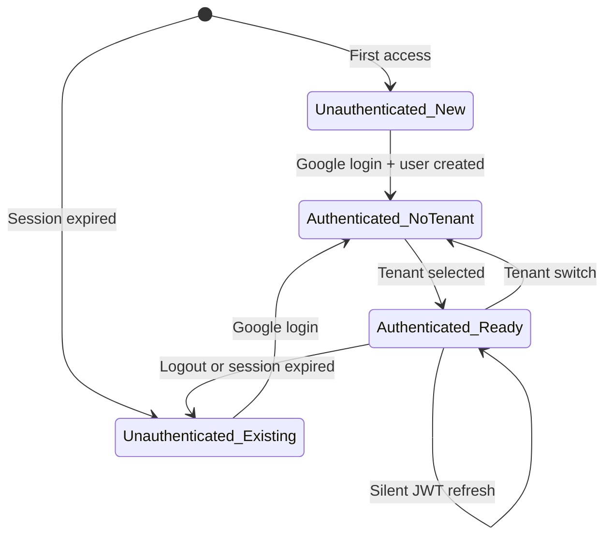

---

## Flow 1: Invite Link - First Login

Most important flow. User touches volta for the first time.

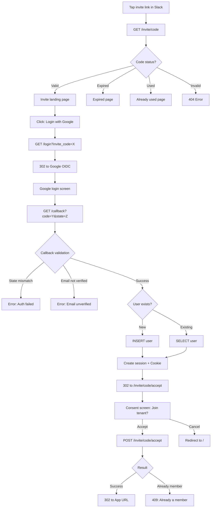

### Notes
- **Screens**: Minimum 4 (landing, Google, consent, App)
- **Back button**: Going back to /callback causes state mismatch error. Recovery: "Login again" button
- **Mobile**: All screens responsive. Google login works on mobile browsers

---

## Flow 2: Returning User - Session Valid

Most frequent flow. User sees nothing.

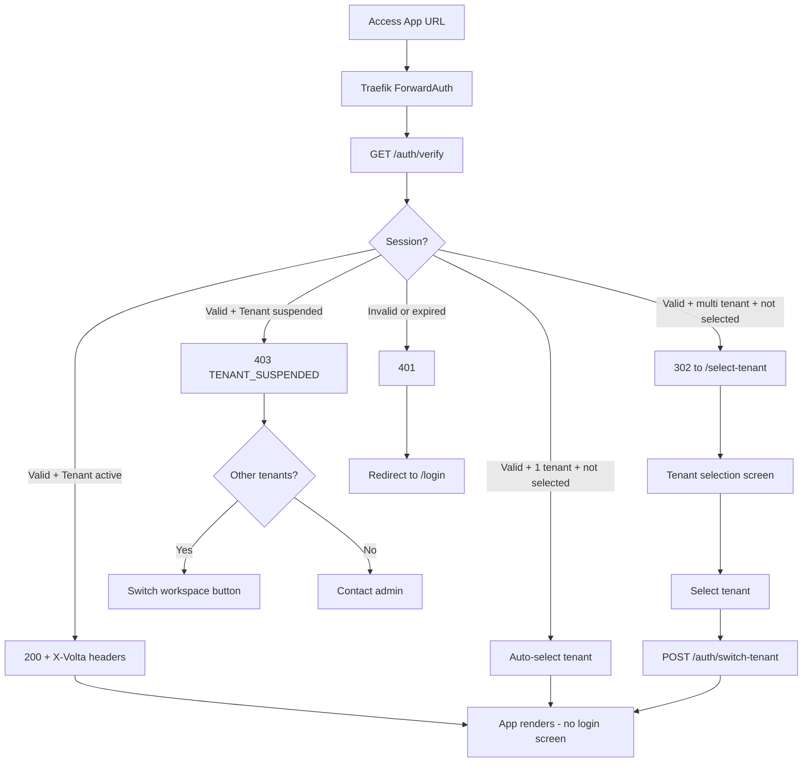

### Notes
- **Single tenant**: Selection screen skipped (zero clicks)
- **Tenant suspended**: Error page with switch option
- **90% of returning users**: Reach E directly. Never see login screen

---

## Flow 3: Tenant Selection

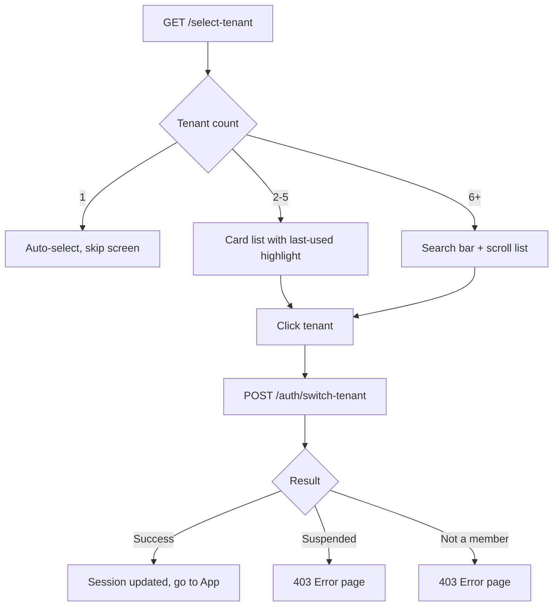

---

## Flow 4: Tenant Switch During Session

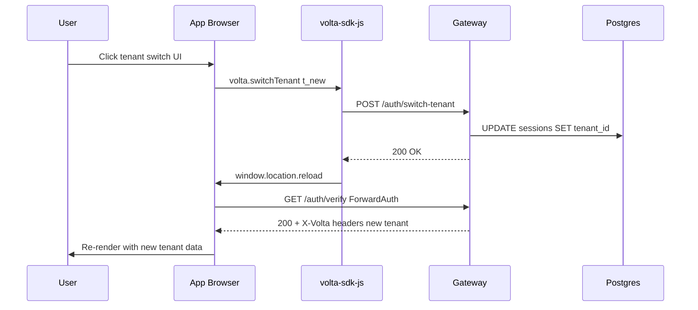

---

## Flow 5: Session Expired - Silent Refresh

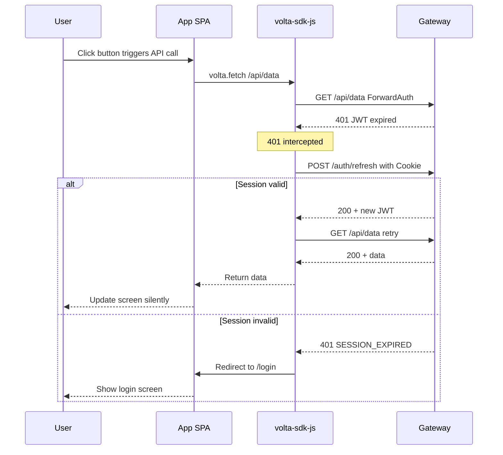

---

## Flow 6: Logout

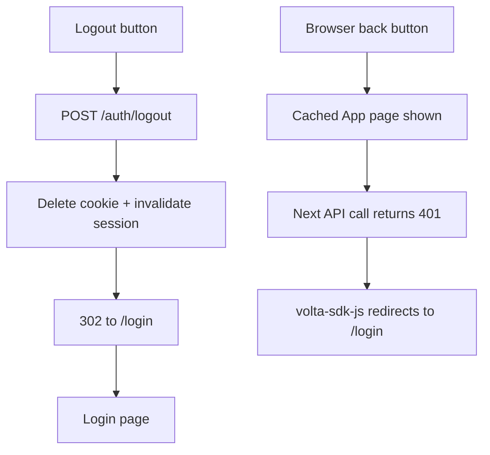

### Mitigation
- ForwardAuth returns `Cache-Control: no-store, private`
- SDK docs recommend `Cache-Control: no-store` for App pages

---

## Flow 7: Invitation Management - Admin

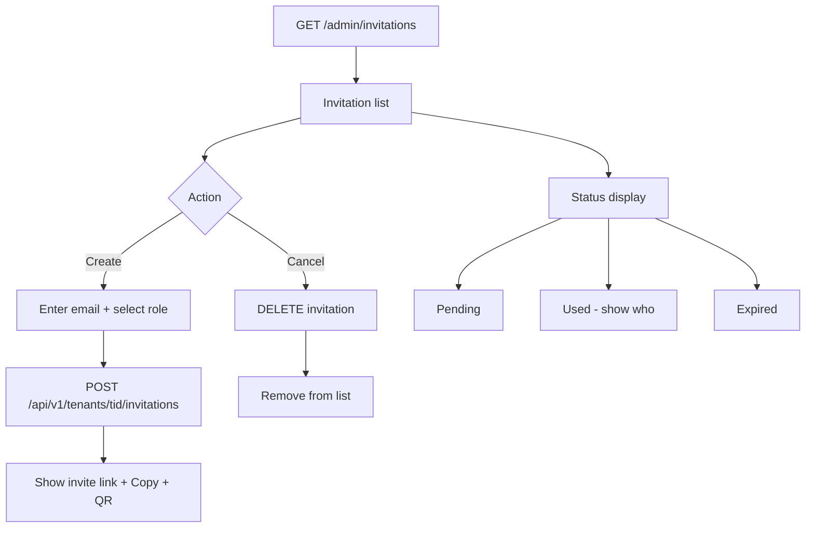

---

## Flow 8: Member Management - Admin

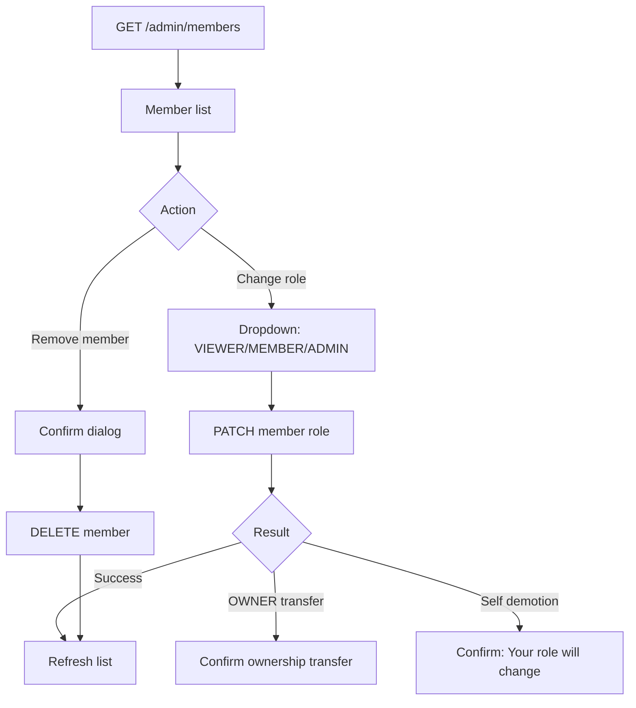

---

## Flow 9: Session Management - User

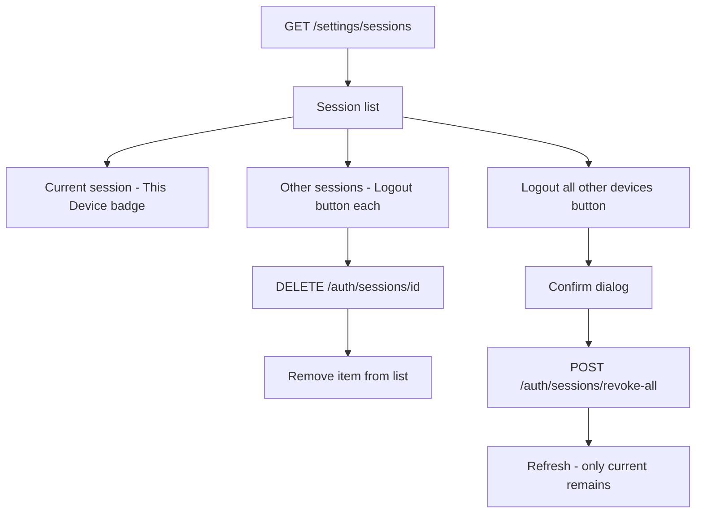

---

## Error Recovery Flow

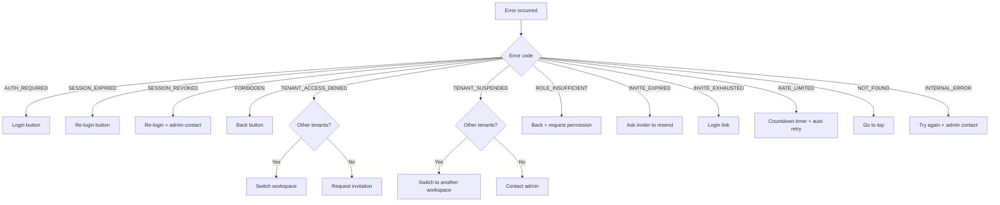

---

## Full Screen Transition Map

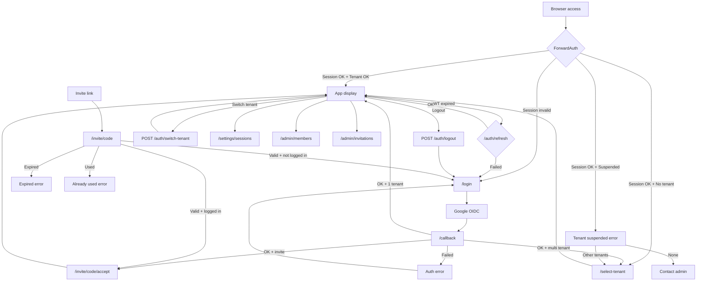

---

## Browser Back Button Behavior

| Current Screen | Back goes to | Behavior | Mitigation |
|---------------|-------------|----------|------------|
| /login | Previous page | OK | - |
| Google login | /login | OK | - |
| /callback | Google login | State mismatch error | "Login again" button |
| /invite/code/accept | /callback | State mismatch error | Same as above |
| /select-tenant | Previous page | OK | - |
| App after logout | Cached page | API call returns 401 | Cache-Control: no-store |
| Error page | Previous page | OK | - |

---

## Gap List

### Found by DGE

| # | Gap | Severity | Mitigation |
|---|-----|----------|------------|
| FL-1 | Back button on /callback causes state mismatch | High | "Login again" button. return_to saved in session |
| FL-2 | Tenant suspended in /auth/verify flow | High | 403 + switch option or admin contact |
| FL-3 | Tenant switch atomicity | Medium | reload after POST success, no reload on failure |
| FL-4 | Browser cache after logout | Medium | Cache-Control: no-store, private on ForwardAuth |
| FL-5 | Session expiry during form input | Medium | SDK docs: recommend form auto-save |

### Found by LLM Code Review (Implementation Bugs)

| # | Gap | Severity | Mitigation |
|---|-----|----------|------------|
| FL-6 | Invite flow membership race: /callback findMembership fails for new users | **Critical** | Skip membership check when invite_code present. Create membership in /invite/code/accept |
| FL-7 | All templates are scaffolds: login/tenant-select/invite-consent/sessions are empty | **Critical** | Replace with full implementations |
| FL-8 | /admin/members and /admin/invitations routes missing from Main.java | **Critical** | Add route handlers |
| FL-9 | volta.js is empty: no client-side SDK logic | **Critical** | Implement volta-sdk-js |
| FL-10 | No CSRF protection on POST endpoints | High | CSRF token in jte forms + before handler validation |
| FL-11 | Invitation list API lacks ADMIN/OWNER role check | High | Add role enforcement |
| FL-12 | No protection against demoting last OWNER | High | Check OWNER count in updateMemberRole |
| FL-13 | No tenant list API for /select-tenant screen | High | Add GET /api/v1/users/me/tenants |
| FL-14 | /callback missing Cache-Control: no-store | High | Add response header |
| FL-15 | Default redirect after login is /settings/sessions instead of App URL | High | Use default App URL from volta-config.yaml |
| FL-16 | No invitation cancel API DELETE | High | Add DELETE /api/v1/tenants/tid/invitations/iid |
| FL-17 | Old session not invalidated on tenant switch | Medium | Invalidate old session in switch-tenant |
| FL-18 | Google session persists after logout | Medium | Acceptable in Phase 1. prompt=select_account mitigates |
| FL-19 | 429 response missing Retry-After header | Medium | Add response header |
| FL-20 | No flash message after invitation acceptance | Medium | Store flash in session, display on next page |
