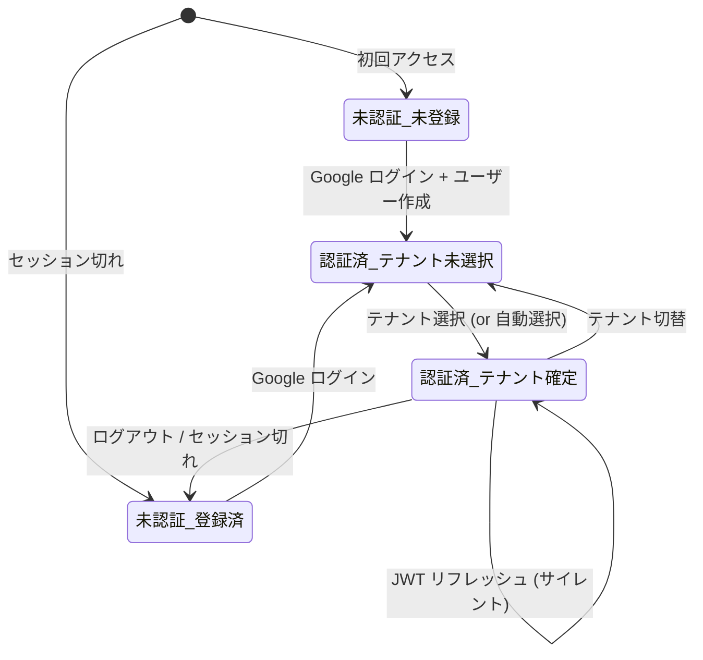
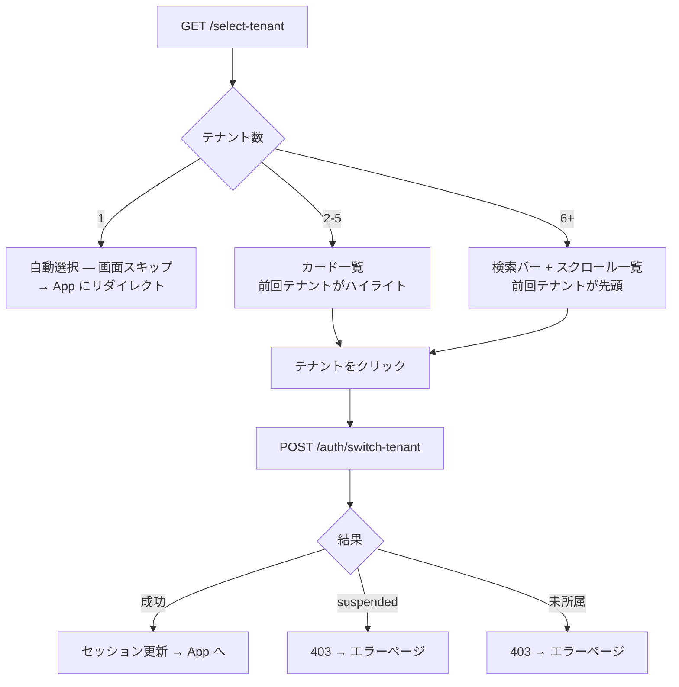
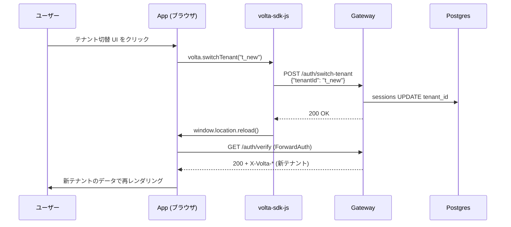
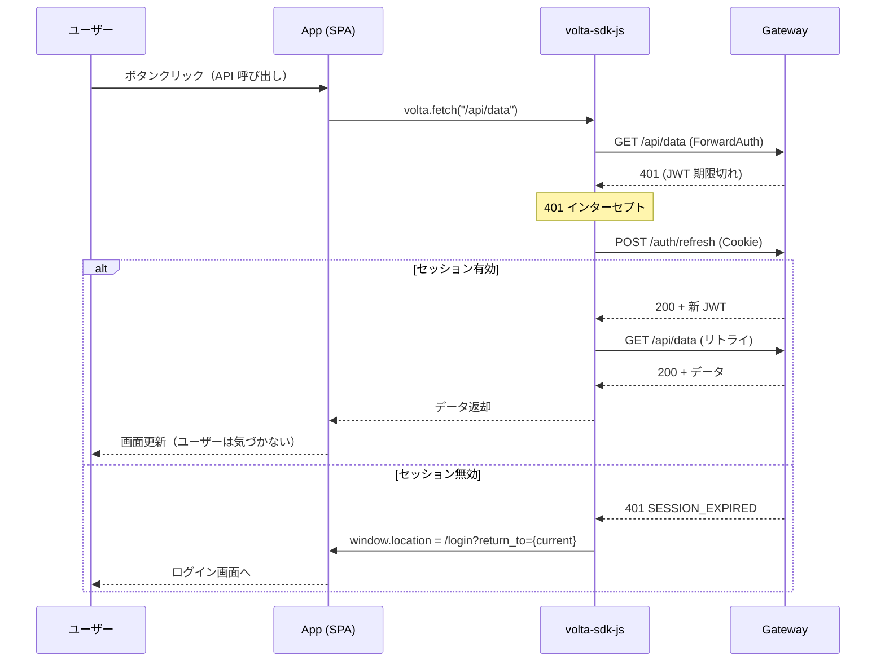
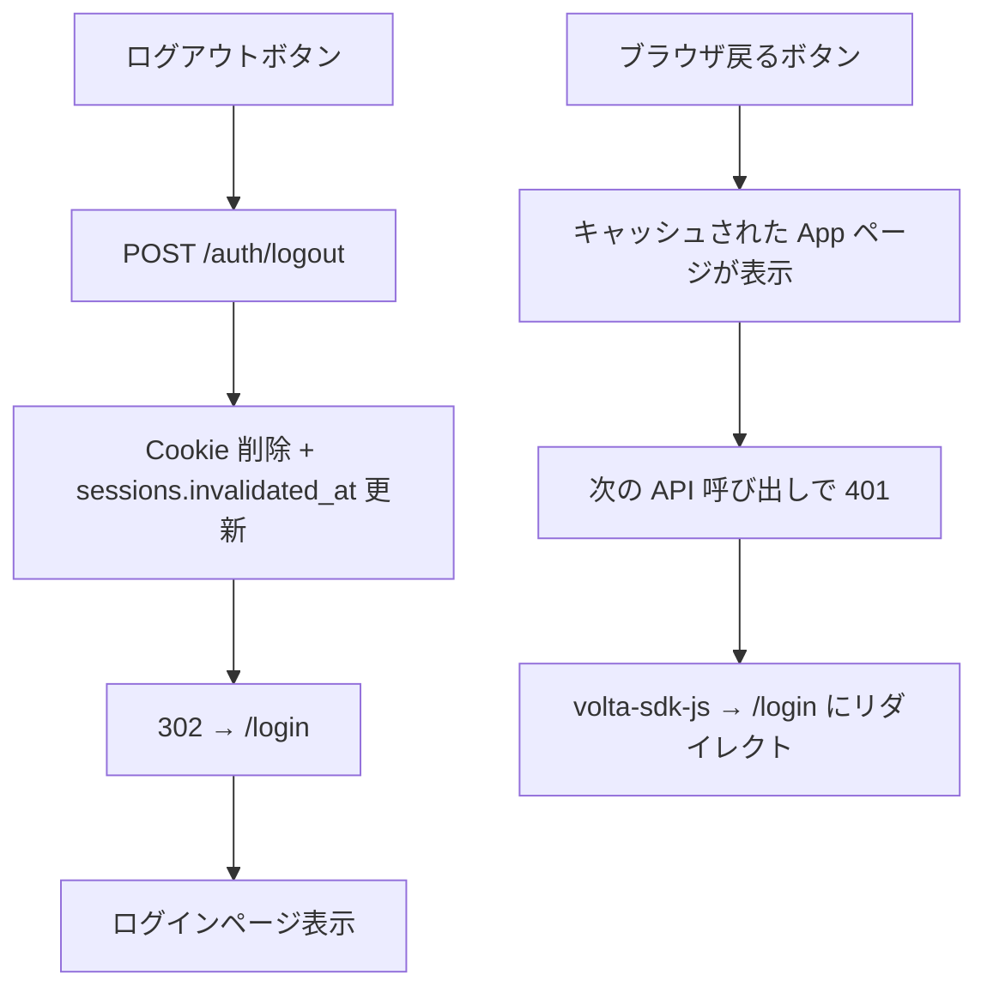
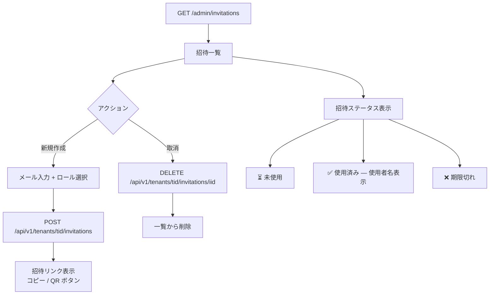
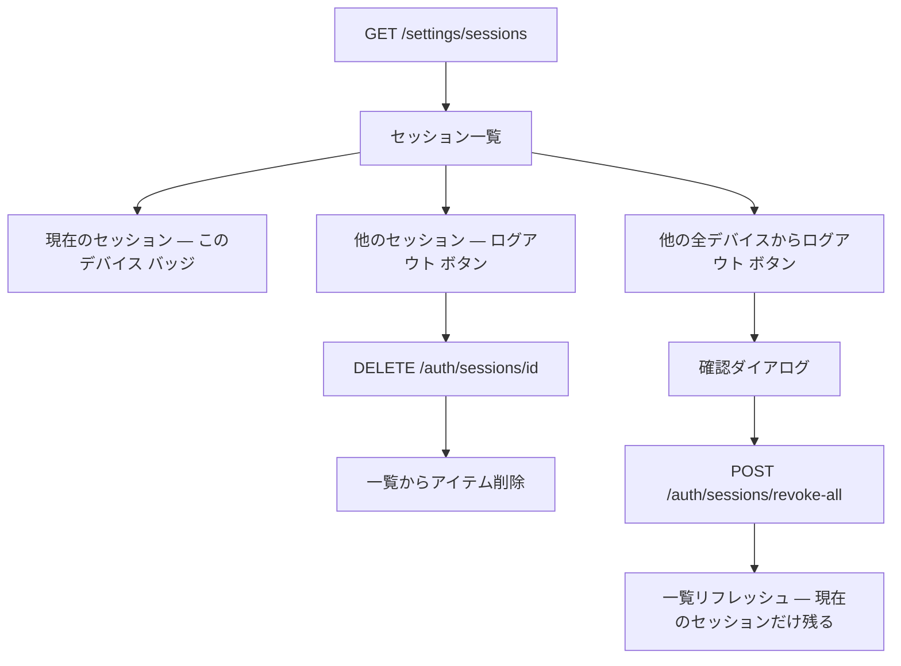
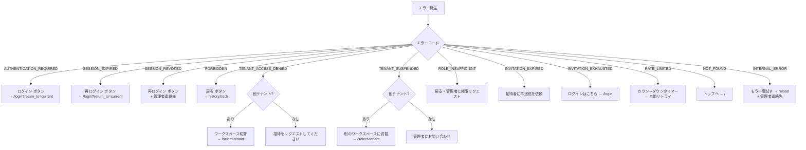

# volta-auth-proxy UI フロー定義書

> ⚠️ DGE 生成 — 人間レビュー必須
> status: draft
> source: DGE UI Flow Design Review, 2026-04-01

---

## ユーザー状態モデル



---

## フロー 1: 招待リンクからの初回ログイン

最も重要なフロー。ユーザーが volta に初めて触れる瞬間。

```mermaid
flowchart TD
    A[Slack で招待リンクをタップ] --> B[GET /invite/code]

    B --> C{code の状態}
    C -->|有効| D[招待着地ページ<br>テナント名・招待者・ロール]
    C -->|期限切れ| E[期限切れページ<br>招待者に連絡してください]
    C -->|使用済み| F[使用済みページ<br>ログインはこちら → /login]
    C -->|不正| G[404 エラー]

    D --> H[Google でログインして参加 ボタン]
    H --> I[GET /login?invite_code=X&return_to=/invite/X/accept]
    I --> J[302 → Google OIDC]
    J --> K[Google ログイン画面]
    K --> L[GET /callback?code=Y&state=Z]

    L --> M{callback 検証}
    M -->|state 不一致| N[エラー: 認証失敗<br>もう一度ログイン ボタン]
    M -->|email 未検証| O[エラー: メール未検証]
    M -->|成功| P{ユーザー存在?}

    P -->|新規| Q[users INSERT]
    P -->|既存| R[users SELECT]
    Q --> S[セッション作成 + Cookie]
    R --> S

    S --> T[302 → /invite/code/accept]
    T --> U[招待同意画面<br>ACME Corp に参加しますか?<br>参加する / キャンセル]

    U -->|参加する| V[POST /invite/code/accept]
    U -->|キャンセル| W[/ にリダイレクト]

    V --> X{結果}
    X -->|成功| Y[302 → App URL]
    X -->|既にメンバー| Z[409: すでにメンバーです<br>App を開く リンク]
```

### ポイント
- **画面数**: 最短 4 画面（着地 → Google → 同意 → App）
- **戻るボタン**: /callback に戻ると state 不一致 → 「もう一度ログイン」で復帰
- **モバイル**: 全画面レスポンシブ。Google ログインはモバイルブラウザ対応済み

---

## フロー 2: リピーター — セッション有効

最も頻繁なフロー。ユーザーは何も見ない。

```mermaid
flowchart TD
    A[App の URL にアクセス] --> B[Traefik → ForwardAuth]
    B --> C[GET /auth/verify]

    C --> D{セッション?}
    D -->|有効 + テナント active| E[200 + X-Volta-* ヘッダ]
    D -->|有効 + テナント 1つ + 未選択| F[自動選択 → 200]
    D -->|有効 + テナント複数 + 未選択| G[302 → /select-tenant]
    D -->|有効 + テナント suspended| H[403 TENANT_SUSPENDED]
    D -->|無効 / 期限切れ| I[401]

    E --> J[App 表示 — ログイン画面を見ない]
    F --> J

    G --> K[テナント選択画面]
    K --> L[テナント選択]
    L --> M[POST /auth/switch-tenant]
    M --> J

    H --> N{他テナントあり?}
    N -->|あり| O[ワークスペース切替ボタン → /select-tenant]
    N -->|なし| P[管理者にお問い合わせ]

    I --> Q[/login?return_to=App URL]
```

### ポイント
- **テナント 1 つ**: 選択画面スキップ（ゼロクリック）
- **テナント suspended**: エラーページで切替導線を出す
- **リピーターの 9 割**: 上の E に到達。ログイン画面を一切見ない

---

## フロー 3: テナント選択



### 表示内容
```
各テナントカード:
  [カラーアイコン] テナント名
                   ロール (ADMIN, MEMBER 等)
                   [前回] バッジ (最終アクセステナント)
```

---

## フロー 4: テナント切替（セッション中）



---

## フロー 5: セッション切れ → サイレントリフレッシュ



---

## フロー 6: ログアウト



### 対策
- ForwardAuth で `Cache-Control: no-store, private` ヘッダを返す
- App 側にも `Cache-Control: no-store` を SDK ドキュメントで推奨

---

## フロー 7: 招待管理（Admin）



---

## フロー 8: メンバー管理（Admin）

```mermaid
flowchart TD
    A[GET /admin/members] --> B[メンバー一覧]
    B --> C{アクション}

    C -->|ロール変更| D[ドロップダウン: VIEWER/MEMBER/ADMIN]
    D --> E[PATCH /api/v1/tenants/tid/members/uid]
    E --> F{結果}
    F -->|成功| G[一覧リフレッシュ]
    F -->|OWNER 変更| H[OWNER 譲渡確認画面<br>POST .../transfer-ownership]
    F -->|自分の降格| I[確認ダイアログ<br>権限が下がります。よろしいですか？]

    C -->|メンバー削除| J[確認ダイアログ]
    J --> K[DELETE /api/v1/tenants/tid/members/uid]
    K --> G
```



---

## フロー 9: セッション管理（User）



---

## エラーリカバリーフロー



---

## ブラウザ戻るボタンの挙動

| 現在の画面 | 戻るボタンで行く先 | 挙動 | 対策 |
|-----------|-------------------|------|------|
| /login | 前のページ | 問題なし | - |
| Google ログイン | /login | 問題なし | - |
| /callback | Google ログイン | state 不一致エラー | 「もう一度ログイン」で復帰 |
| /invite/{code}/accept | /callback | state 不一致エラー | 同上 |
| /select-tenant | 前のページ | 問題なし | - |
| App ページ (ログアウト後) | キャッシュ表示 | API 呼出で 401 | Cache-Control: no-store |
| エラーページ | 前のページ | 問題なし | - |

---

## 全画面遷移図（統合）

```mermaid
flowchart TD
    START[ブラウザアクセス] --> FA{ForwardAuth}

    FA -->|セッション有効 + テナント OK| APP[App 表示]
    FA -->|セッション有効 + テナント未選択| SEL[/select-tenant]
    FA -->|セッション有効 + テナント suspended| SUSP[テナント停止エラー]
    FA -->|セッション無効| LOGIN[/login]

    LOGIN --> GOOGLE[Google OIDC]
    GOOGLE --> CB[/callback]
    CB -->|成功 + 招待あり| ACCEPT[/invite/code/accept]
    CB -->|成功 + テナント1つ| APP
    CB -->|成功 + テナント複数| SEL
    CB -->|失敗| ERR_AUTH[認証エラー]

    SEL --> APP
    ACCEPT --> APP

    APP -->|JWT 期限切れ| REFRESH{/auth/refresh}
    REFRESH -->|成功| APP
    REFRESH -->|失敗| LOGIN

    APP -->|ログアウト| LOGOUT[POST /auth/logout]
    LOGOUT --> LOGIN

    APP -->|テナント切替| SWITCH[POST /auth/switch-tenant]
    SWITCH --> APP

    APP -->|セッション管理| SESSIONS[/settings/sessions]
    APP -->|メンバー管理| MEMBERS[/admin/members]
    APP -->|招待管理| INVITES[/admin/invitations]

    SUSP -->|他テナントあり| SEL
    SUSP -->|なし| CONTACT[管理者連絡先]

    ERR_AUTH --> LOGIN

    INVITE_LINK[招待リンク] --> INVITE[/invite/code]
    INVITE -->|有効 + 未認証| LOGIN
    INVITE -->|有効 + 認証済| ACCEPT
    INVITE -->|期限切れ| ERR_EXP[期限切れエラー]
    INVITE -->|使用済み| ERR_USED[使用済みエラー]
```

---

## Gap 一覧

### DGE で発見

| # | Gap | Severity | 対策 |
|---|-----|----------|------|
| FL-1 | /callback でブラウザ戻る → state 不一致 | 🟠 High | エラーページに「もう一度ログイン」ボタン。return_to はセッションに保存済み |
| FL-2 | テナント suspended 時の /auth/verify フロー | 🟠 High | 403 + 他テナント切替導線 or 管理者連絡先 |
| FL-3 | テナント切替の原子性 | 🟡 Medium | POST 成功後に即 reload。失敗ならリロードしない |
| FL-4 | ログアウト後のブラウザキャッシュ | 🟡 Medium | Cache-Control: no-store, private を ForwardAuth で返す |
| FL-5 | フォーム入力中のセッション切れ | 🟡 Medium | SDK ドキュメントで「フォーム自動保存推奨」と明記 |

### LLM コードレビューで発見（実装バグ）

| # | Gap | Severity | 対策 |
|---|-----|----------|------|
| FL-6 | 招待フローの membership 競合 — /callback で findMembership が初回ユーザーで必ず失敗 | 🔴 **致命的** | 招待コード付きの場合は /callback で membership チェックをスキップ。/invite/{code}/accept で membership 作成 |
| FL-7 | テンプレート全部スキャフォールド — login/tenant-select/invite-consent/sessions が空 | 🔴 **致命的** | 全テンプレートを本実装に差し替え |
| FL-8 | /admin/members, /admin/invitations のルートハンドラが Main.java にない | 🔴 **致命的** | ハンドラ追加 |
| FL-9 | volta.js が空 — SDK クライアント側ロジック全未実装 | 🔴 **致命的** | volta-sdk-js 実装 |
| FL-10 | CSRF 保護なし — POST エンドポイントに CSRF トークン検証なし | 🟠 High | jte テンプレートに CSRF token hidden field + before handler で検証 |
| FL-11 | 招待一覧 API に ADMIN/OWNER 権限チェックなし | 🟠 High | enforceTenantMatch に加えて role チェック追加 |
| FL-12 | 最後の OWNER 降格防御なし | 🟠 High | updateMemberRole で OWNER 数チェック |
| FL-13 | テナント一覧取得 API なし — /select-tenant で一覧表示できない | 🟠 High | GET /api/v1/users/me/tenants 追加 |
| FL-14 | /callback に Cache-Control: no-store 未設定 | 🟠 High | レスポンスヘッダ追加 |
| FL-15 | デフォルト遷移先が /settings/sessions — App URL であるべき | 🟠 High | volta-config.yaml のデフォルト App URL を使う |
| FL-16 | 招待取消 API (DELETE) なし | 🟠 High | DELETE /api/v1/tenants/{tid}/invitations/{iid} 追加 |
| FL-17 | セッション切替時に旧セッションが無効化されない（累積する） | 🟡 Medium | switch-tenant で旧セッションを invalidate |
| FL-18 | Google 側セッションが残存（ログアウト時） | 🟡 Medium | Phase 1 は許容。prompt=select_account で緩和 |
| FL-19 | 429 に Retry-After ヘッダ未設定 | 🟡 Medium | レスポンスヘッダ追加 |
| FL-20 | 招待承諾後のフラッシュメッセージなし | 🟡 Medium | セッションにフラッシュ値を保存して次画面で表示 |
