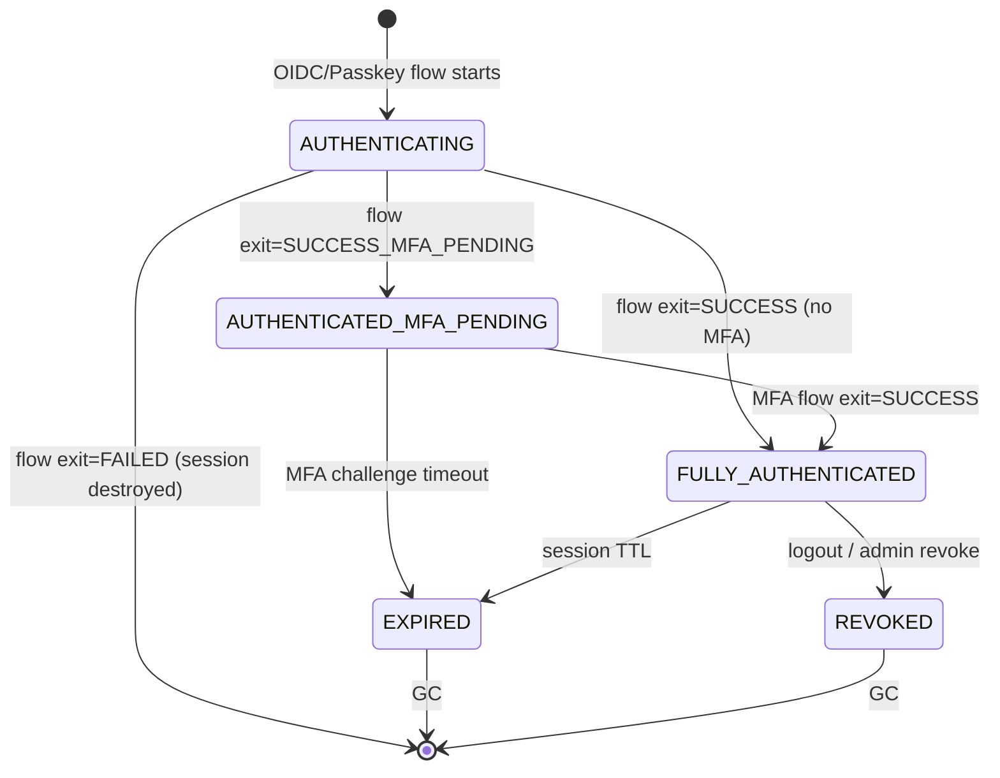
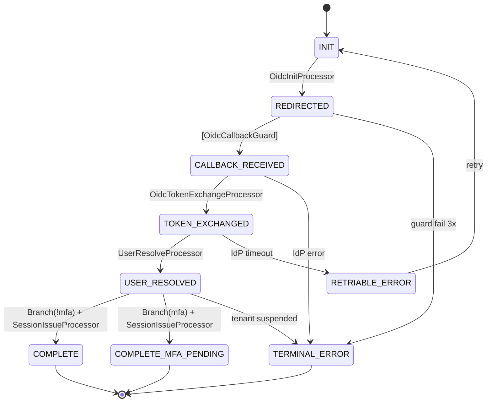
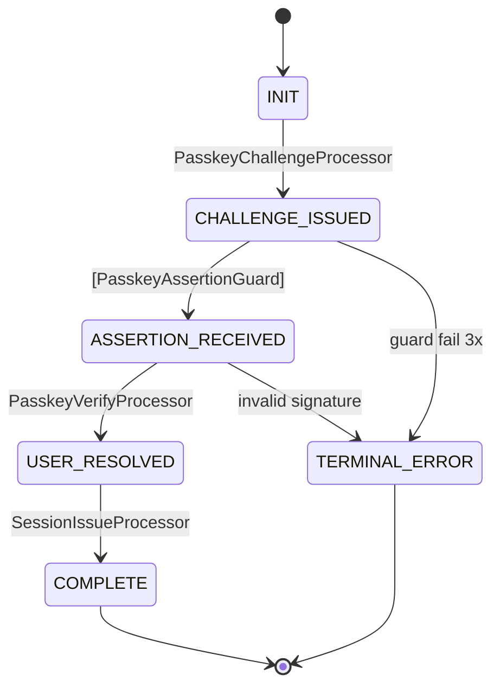
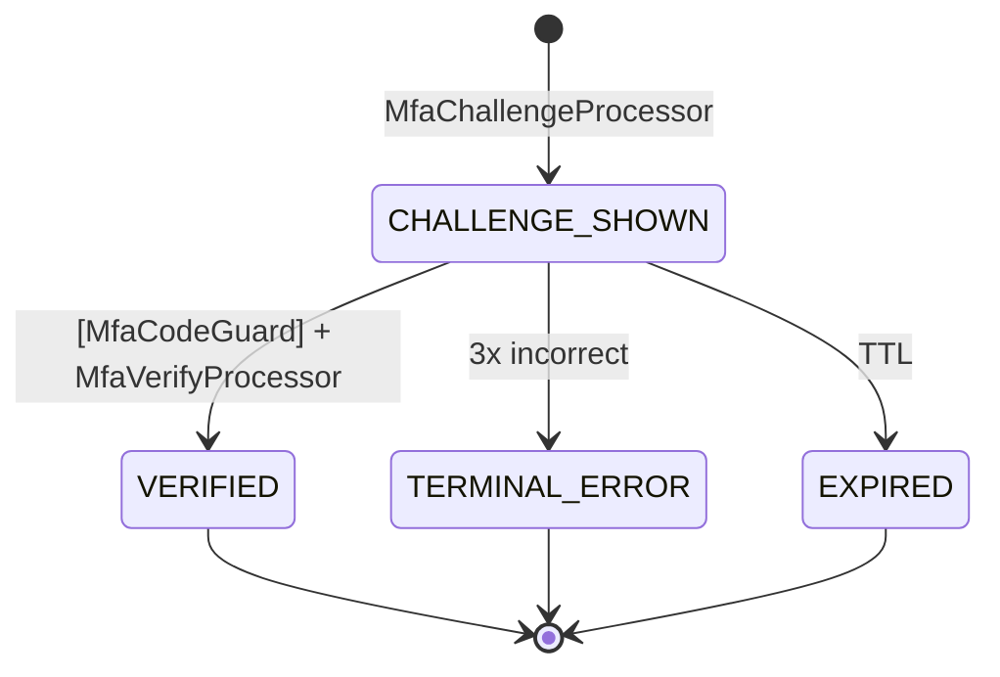
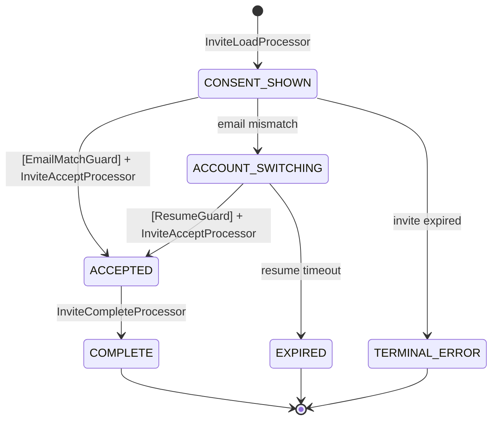

# Auth State Machine Architecture Spec

> Generated: 2026-04-06
> Source: DGE Session — 7 Rounds, 84 Gaps
> Repository: volta-auth-proxy (Java / Javalin)

## 1. Overview

volta-auth-proxy の認証フローを State Machine アーキテクチャで再設計する。
現在の Main.java（1800+ 行の手続き的コード）を、宣言的な遷移テーブル + Processor 分離モデルに段階的に移行する。

### Goals

1. **可視性**: State 遷移図がコードから自動生成され、CI で最新性が保証される
2. **安全性**: 不正な遷移が構造的に排除される（遷移テーブルにない遷移は発生しない）
3. **テスト容易性**: Processor 単体テスト + 遷移テスト自動生成
4. **拡張性**: 新フロー追加で Engine のコードを変更しない
5. **監査**: 全遷移が自動的にログに記録される

### Non-Goals

- 汎用 state machine ライブラリの開発（認証フロー専用）
- 外部 state machine ライブラリ（XState, Spring Statemachine）の採用
- 暗号化（Phase 1 は平文 JSONB、暗号化は後付け decorator）

---

## 2. Two-Layer Architecture

認証の state は 2 層に分離する。

### Layer 1: Session State Machine (upper — persistent)

ユーザーの認証ライフサイクルを管理。sessions テーブルの auth_state カラムで永続化。

```
States (4 + 2 terminal):
  AUTHENTICATING              — Flow 開始済み、認証未完了
  AUTHENTICATED_MFA_PENDING   — IdP 認証済み、MFA 未完了
  FULLY_AUTHENTICATED         — 全認証完了、アクティブ
  EXPIRED                     — TTL 超過 (terminal)
  REVOKED                     — 明示的無効化 (terminal)
```



**Step-up authentication** は state ではなく **session_scopes テーブル** で管理（時限 scope）。

### Layer 2: Flow State Machines (lower — ephemeral)

1 回の認証フローを管理。auth_flows テーブルで一時永続化。フロー完了で GC。

| Flow | States | TTL | Version-tagged |
|------|--------|-----|----------------|
| OIDC | INIT → REDIRECTED → CALLBACK_RECEIVED → TOKEN_EXCHANGED → USER_RESOLVED → COMPLETE | 5min | No |
| Passkey | INIT → CHALLENGE_ISSUED → ASSERTION_RECEIVED → USER_RESOLVED → COMPLETE | 5min | No |
| MFA | CHALLENGE_SHOWN → VERIFIED | 5min | No |
| Invite | CONSENT_SHOWN → ACCOUNT_SWITCHING? → ACCEPTED → COMPLETE | 7 days | Yes |

### Layer Connection

- Flow SM 完了 → Engine Routing Table → Session SM event → Session SM 遷移
- Session SM が Flow SM を起動するのではなく、HTTP Router が起動する
- Session がバトン — Flow 間の context 引き継ぎは session 経由

### Boundary Rule (何を state にするか)

| 分類 | 基準 | 例 |
|------|------|-----|
| **State** | ユーザーの操作を**ブロック**する | MFA pending → console アクセス不可 |
| **Scope** | 特定操作を一時的に**許可**する | step-up → 5 分間 MFA 設定変更可 |
| **Attribute** | state 遷移に影響しない**情報** | last_login_at, device_fingerprint |

---

## 3. Core Components

### 3.1 FlowEngine

全 Flow SM を駆動する汎用エンジン。~120 行。ビジネスロジックを一切持たない。

```
Public API:
  startFlow(initialData, ttl) → FlowInstance
  resumeAndExecute(flowId, httpRequest) → FlowInstance

Internal:
  executeAutoChain(flow)  — Auto/Branch 遷移を連鎖実行
  handleGuardRejection()  — Guard failure → retry or TERMINAL_ERROR
  handleConcurrentModification() — optimistic lock failure → reload + retry(1x)
```

**Auto chain**: External transition（Guard 通過）→ 到達可能な全 Auto/Branch を連続実行 → 次の External or terminal で停止。

**DAG 保証**: Auto/Branch 遷移に cycle がないことを起動時にトポロジカルソートで検証。Runtime safety: maxChainDepth=10。

### 3.2 Transition Types (3 種類)

| Type | Trigger | Example |
|------|---------|---------|
| **Auto** | 前の遷移完了で自動実行 | TOKEN_EXCHANGED → USER_RESOLVED |
| **External** | HTTP request + Guard 検証 | REDIRECTED → CALLBACK_RECEIVED |
| **Branch** | Processor がビジネス判断で遷移先を返す | USER_RESOLVED → COMPLETE or MFA_PENDING |

### 3.3 StateProcessor

```java
public interface StateProcessor {
    String name();
    Set<Class<?>> requires();   // 必要な FlowContext attributes
    Set<Class<?>> produces();   // 追加する FlowContext attributes
    void process(FlowContext ctx) throws FlowException;
}
```

- 1 遷移 = 1 Processor（原則）
- requires/produces は起動時に全 path を走査して検証
- produces 検証は runtime でも毎回実行

### 3.4 TransitionGuard

```java
public interface TransitionGuard {
    String name();
    Set<Class<?>> requires();
    Set<Class<?>> produces();
    int maxRetries();
    GuardOutput validate(FlowContext ctx, HttpServletRequest request);
}

sealed interface GuardOutput {
    record Accepted(Map<Class<?>, Object> data) implements GuardOutput {}
    record Rejected(String reason) implements GuardOutput {}
    record Expired() implements GuardOutput {}
}
```

- Guard は **pure function**（ctx を書き換えない）
- Accepted の data は Engine が ctx に put する
- Rejected → guard_failure_count++ → max で TERMINAL_ERROR

### 3.5 FlowContext (Accumulator Pattern)

```java
public class FlowContext {
    private final String flowId;
    private final Instant createdAt;
    private final Map<Class<?>, Object> attributes;

    <T> void put(Class<T> key, T value);
    <T> T get(Class<T> key);           // throws MissingContextException
    <T> Optional<T> find(Class<T> key);
}
```

- 各 processor は自分の produces を ctx.put()
- 後続 processor は requires を ctx.get()
- パススルー問題なし: 全データが ctx に累積

### 3.6 @FlowData (Serialization Alias)

```java
@Retention(RUNTIME) @Target(TYPE)
public @interface FlowData { String value(); }

@FlowData("oidc.redirect")
record OidcRedirect(
    @JsonProperty("state") String state,
    @JsonProperty("nonce") String nonce,
    @JsonProperty("redirect_url") String redirectUrl,
    @JsonProperty("expires_at") Instant expiresAt
) {}
```

- FQCN ではなく alias で serialize（class rename 耐性）
- alias の一意性は起動時に検証
- @JsonProperty でフィールド名を固定（rename 耐性）

### 3.7 @Sensitive (PII Redaction)

```java
@FlowData("oidc.user_resolved")
record ResolvedUserCtx(
    String flowId,
    @Sensitive String email,
    String provider,
    @Sensitive String idToken,
    boolean mfaRequired
) {}
```

- 遷移ログ (auth_flow_transitions.context_snapshot) は @Sensitive を mask して JSONB で保存
- CI テスト: String フィールドに @Sensitive/@NotSensitive のいずれかが必須

### 3.8 FlowDefinition Builder DSL

```java
FlowDefinition.builder("oidc", OidcFlowState.class)
    .ttl(Duration.ofMinutes(5))
    .maxGuardRetries(3)

    .from(INIT).auto(REDIRECTED).processor(OidcInitProcessor.class)
    .from(REDIRECTED).external(CALLBACK_RECEIVED).guard(OidcCallbackGuard.class)
    .from(CALLBACK_RECEIVED).auto(TOKEN_EXCHANGED).processor(OidcTokenExchangeProcessor.class)
    .from(TOKEN_EXCHANGED).auto(USER_RESOLVED).processor(UserResolveProcessor.class)
    .from(USER_RESOLVED).branch(MfaCheckBranch.class)
        .to(COMPLETE).on("no_mfa").processor(SessionIssueProcessor.class)
        .to(COMPLETE_MFA_PENDING).on("mfa_required").processor(SessionIssueProcessor.class)

    .errorHandler()
        .onAnyError(TERMINAL_ERROR)
        .retriable(RETRIABLE_ERROR).backTo(INIT)

    .build();  // 8-item validation
```

**build() 検証項目**:
1. 全 state が到達可能
2. initial → terminal の path 存在
3. Auto/Branch が DAG（cycle なし）
4. External は各 state に最大 1 つ
5. Branch の全分岐先が定義済み
6. 全 path の requires/produces chain 整合
7. @FlowData alias 重複なし
8. Terminal state からの遷移なし

### 3.9 MermaidGenerator

遷移テーブルから Mermaid stateDiagram-v2 を自動生成。

```
docs/diagrams/
  session-sm.mmd           ← Session SM (4 states)
  flow-oidc.mmd            ← OIDC Flow (8 states)
  flow-passkey.mmd         ← Passkey Flow (6 states)
  flow-mfa.mmd             ← MFA Flow (4 states)
  flow-invite.mmd          ← Invite Flow (7 states)
  routing-overview.mmd     ← Flow → Session 接続図
```

CI テスト: 生成結果と docs/diagrams/*.mmd を比較。不一致でテスト失敗。

---

## 4. DB Schema

### 4.1 sessions (既存テーブル変更)

```sql
ALTER TABLE sessions ADD COLUMN auth_state VARCHAR(30) NOT NULL DEFAULT 'FULLY_AUTHENTICATED';
ALTER TABLE sessions ADD COLUMN version INT NOT NULL DEFAULT 0;
ALTER TABLE sessions ADD COLUMN last_journey_id UUID;
```

### 4.2 auth_flows (新規)

```sql
CREATE TABLE auth_flows (
    id                  UUID PRIMARY KEY DEFAULT gen_random_uuid(),
    session_id          UUID REFERENCES sessions(id) ON DELETE SET NULL,
    flow_type           VARCHAR(20) NOT NULL,
    flow_version        VARCHAR(10) NOT NULL DEFAULT 'v1',
    current_state       VARCHAR(30) NOT NULL,
    context             JSONB NOT NULL,          -- Phase 1: 平文. Phase N: encrypted BYTEA
    guard_failure_count INT NOT NULL DEFAULT 0,
    version             INT NOT NULL DEFAULT 0,  -- optimistic locking
    journey_id          UUID,
    created_at          TIMESTAMPTZ NOT NULL DEFAULT now(),
    updated_at          TIMESTAMPTZ NOT NULL DEFAULT now(),
    expires_at          TIMESTAMPTZ NOT NULL,
    completed_at        TIMESTAMPTZ,
    exit_state          VARCHAR(20)
);

CREATE INDEX idx_auth_flows_session ON auth_flows(session_id) WHERE exit_state IS NULL;
CREATE INDEX idx_auth_flows_expires ON auth_flows(expires_at) WHERE exit_state IS NULL;
CREATE INDEX idx_auth_flows_journey ON auth_flows(journey_id);
```

### 4.3 auth_flow_transitions (新規)

```sql
CREATE TABLE auth_flow_transitions (
    id              BIGSERIAL PRIMARY KEY,
    flow_id         UUID NOT NULL REFERENCES auth_flows(id) ON DELETE CASCADE,
    from_state      VARCHAR(30),
    to_state        VARCHAR(30) NOT NULL,
    trigger         VARCHAR(50) NOT NULL,
    context_snapshot JSONB,           -- PII redacted
    error_detail    VARCHAR(500),
    created_at      TIMESTAMPTZ NOT NULL DEFAULT now()
);

CREATE INDEX idx_flow_transitions_flow ON auth_flow_transitions(flow_id, created_at);
```

### 4.4 session_scopes (新規)

```sql
CREATE TABLE session_scopes (
    id          UUID PRIMARY KEY DEFAULT gen_random_uuid(),
    session_id  UUID NOT NULL REFERENCES sessions(id) ON DELETE CASCADE,
    scope       VARCHAR(50) NOT NULL,
    granted_at  TIMESTAMPTZ NOT NULL DEFAULT now(),
    expires_at  TIMESTAMPTZ NOT NULL,
    granted_by  VARCHAR(20) NOT NULL
);

CREATE INDEX idx_session_scopes_lookup
    ON session_scopes(session_id, scope) WHERE expires_at > now();
```

### 4.5 step_up_log (新規)

```sql
CREATE TABLE step_up_log (
    id          BIGSERIAL PRIMARY KEY,
    session_id  UUID REFERENCES sessions(id) ON DELETE SET NULL,
    user_id     UUID NOT NULL,
    scope       VARCHAR(50) NOT NULL,
    method      VARCHAR(20) NOT NULL,
    success     BOOLEAN NOT NULL,
    client_ip   VARCHAR(45),
    created_at  TIMESTAMPTZ NOT NULL DEFAULT now()
);
```

---

## 5. Concurrency Control

### Optimistic Locking

auth_flows と sessions に version column。UPDATE ... WHERE version = ? で lost update を防止。

### SELECT FOR UPDATE

FlowStore.load() で `SELECT ... FOR UPDATE` を使用。同一 flow への並行リクエストは DB level でシリアライズ。

```sql
SET LOCAL lock_timeout = '5s';
SELECT * FROM auth_flows WHERE id = ? AND exit_state IS NULL FOR UPDATE;
```

### Per-Request Save

1 HTTP request 内の複数遷移はまとめて 1 回 DB save。途中で例外 → flow は前の state のまま（rollback ではなく "save しない"）。

### Session SM Transaction

SessionIssueProcessor 内で session create + flow complete を **同一 DB transaction** で実行。2 層の整合性を保証。

---

## 6. Security

### Rate Limiting

| Endpoint | Limit | Key |
|----------|-------|-----|
| /login?start=1 | 10 req/min | IP |
| /callback | 10 req/min | IP |
| /auth/mfa/verify | 5 req/min | session |
| /auth/passkey/finish | 5 req/min | session |
| /invite/*/accept | 3 req/min | session |

### HMAC Signing

OIDC state parameter と Invite flow_ref に HMAC 署名。AUTH_FLOW_HMAC_KEY（暗号化キーとは分離）。

### return_to Validation

全フローで ReturnToValidator を通す。外部 URL 拒否、path prefix ホワイトリスト。

```
Allowed prefixes: /console/, /invite/, /settings/, /mfa/, /step-up
```

### ForwardAuth auth_state Routing

```
FULLY_AUTHENTICATED → 200 + X-Volta-* headers
AUTHENTICATED_MFA_PENDING + /mfa/* → 200 (MFA 画面のみ許可)
AUTHENTICATED_MFA_PENDING + other → 302 /mfa/challenge
EXPIRED / REVOKED → 401
```

### Session Cache

ForwardAuth に Caffeine cache (TTL 5min)。DB SPOF 対策。revoke 時に即 invalidation。

---

## 7. Flow Details

### 7.1 OIDC Flow



**OIDC state parameter**: `HMAC(flow_id:csrf_nonce)` — callback で flow_id を復元。

**Session cookie**: FULLY_AUTHENTICATED になるまで発行しない。OIDC init 時は session なし (flow.session_id = NULL)。

### 7.2 Passkey Flow



Passkey = MFA equivalent → 常に FULLY_AUTHENTICATED（MFA スキップ）。

### 7.3 MFA Flow (Sequential, not call/return)



MFA は独立 Flow。OIDC 完了(MFA_PENDING) → Engine routing → MFA Flow 新規作成。call/return 不要。

### 7.4 Invite Flow



**Account switch**: session_id = NULL (orphan) → 再ログイン → flow_ref HMAC で復元 → session_id 再紐づけ。

---

## 8. Testing Strategy

### 3 Layers

| Layer | Target | Tooling | Coverage |
|-------|--------|---------|----------|
| Processor 単体 | input → output | JUnit + FlowContext mock | 100% |
| Flow SM 遷移 | 遷移列の valid/invalid | FlowTestHarness | 全 path |
| Integration | HTTP → Engine → DB | Javalin TestTools + DB | Happy path |

### FlowTestHarness DSL

```java
FlowTestHarness.forFlow(OidcFlow.DEFINITION)
    .startWith(OidcRequest.class, new OidcRequest("GOOGLE", "/", "1.2.3.4", "Chrome"))
    .expectState(REDIRECTED)
    .thenExternal(mockCallbackRequest("code123", "valid_state"))
    .expectAutoChainTo(TOKEN_EXCHANGED)
    .expectAutoChainTo(USER_RESOLVED)
    .expectBranch(COMPLETE)
    .assertFlowCompleted("SUCCESS");
```

### Invalid Transition Auto-Generation

遷移テーブルの complement（全 state × 全 state - 有効遷移）を自動生成し、全て rejected であることを検証。

```java
@ParameterizedTest
@MethodSource("invalidTransitions")
void allInvalidTransitions_areRejected(OidcFlowState from, OidcFlowState to) {
    FlowTestHarness.forFlow(OidcFlow.DEFINITION)
        .forceState(from)
        .assertTransitionRejected(to);
}
```

---

## 9. Migration Plan (Strangler Fig)

| Phase | Scope | Main.java 変更 | Risk |
|-------|-------|---------------|------|
| **1** | Enum + 遷移テーブル + MermaidGenerator + Test harness | なし | Zero |
| **2** | OIDC Flow → SM（processor は既存ロジックの薄ラッパー） | /login, /callback を Engine 経由に | Low |
| **3** | Processor にロジック移動、Main.java の該当メソッド削除 | 削減 | Medium |
| **4** | Passkey, MFA, Invite も同様に SM 化 | 削減 | Medium |
| **5** | Session SM 導入（auth_state カラム + ForwardAuth 更新） | 完全移行 | High |

### Phase 1 スコープ（初手）

振る舞い変更なし。テスト + 図の生成のみ。

1. SessionState enum (4 states) + 遷移テーブル
2. OidcFlowState enum (8 states) + 遷移テーブル
3. PasskeyFlowState enum (6 states) + 遷移テーブル
4. MfaFlowState enum (4 states) + 遷移テーブル
5. InviteFlowState enum (7 states) + 遷移テーブル（定義のみ）
6. MermaidGenerator → docs/diagrams/*.mmd + CI テスト
7. FlowContext + @FlowData + FlowDataRegistry（起動時 alias 検証）
8. StateProcessor / TransitionGuard / BranchProcessor interfaces
9. FlowEngine skeleton（startFlow, resumeAndExecute, auto chain, DAG 検証）
10. FlowStore（JSONB, FOR UPDATE locking）
11. requires/produces 起動時検証
12. FlowTestHarness + SessionTestHarness
13. Invalid transition 自動テスト

---

## 10. Monitoring

### Phase 1: SQL-based

```sql
-- Flow success rate (past hour)
SELECT flow_type,
       COUNT(*) FILTER (WHERE exit_state = 'SUCCESS') AS success,
       COUNT(*) FILTER (WHERE exit_state = 'FAILED') AS failed
FROM auth_flows
WHERE created_at > now() - interval '1 hour'
GROUP BY flow_type;

-- Guard failure trend (5-min buckets)
SELECT date_trunc('5 min', created_at), trigger, COUNT(*)
FROM auth_flow_transitions
WHERE error_detail IS NOT NULL AND created_at > now() - interval '1 hour'
GROUP BY 1, 2 ORDER BY 1;

-- Orphan flows
SELECT COUNT(*) FROM auth_flows
WHERE session_id IS NULL AND exit_state IS NULL AND expires_at > now();
```

### Phase 2+: Micrometer → Prometheus → Grafana

Key metrics: auth_flow_duration, auth_flow_guard_failures, auth_flow_active_count, session_state_distribution.

---

## 11. Data Retention & GC

| Table | Retention | GC Method |
|-------|-----------|-----------|
| auth_flows | completed_at + 7 days | Scheduled DELETE |
| auth_flow_transitions | created_at + 90 days | Scheduled DELETE |
| session_scopes | expires_at + 30 days | Scheduled DELETE |
| step_up_log | 90 days | Scheduled DELETE |
| Orphan flows (session_id=NULL, expired) | Immediate | Scheduled DELETE |

---

## 12. Open Decisions (deferred)

| # | Decision | When | Notes |
|---|----------|------|-------|
| D1 | FlowContext 暗号化 (AES-GCM) | Phase N | Decorator pattern で後付け |
| D2 | Key rotation strategy | After D1 | Dual-read + key_id prefix |
| D3 | Passkey MFA equivalent テナント設定 | Backlog | Branch 追加だけ |
| D4 | Prometheus metrics | After Phase 3 | SQL で十分な間は不要 |
| D5 | Admin UI runtime state visualization | Backlog | auth_flow_transitions で代替 |

---

## Appendix: DGE Session Files

```
dge/sessions/
  2026-04-06-auth-state-machine.md      Round 1: 2層構造の発見 (17 gaps)
  2026-04-06-auth-state-machine-r2.md   Round 2: Session SM + Flow SM 詳細 (14 gaps)
  2026-04-06-auth-state-machine-r3.md   Round 3: 実装パターン + 移行 (12 gaps)
  2026-04-06-auth-state-machine-r4.md   Round 4: DB + OIDC walkthrough (12 gaps)
  2026-04-06-auth-state-machine-r5.md   Round 5: MFA + Invite 継続 (9 gaps)
  2026-04-06-auth-state-machine-r6.md   Round 6: 並行性 + 監視 (8 gaps)
  2026-04-06-auth-state-machine-r7.md   Round 7: DX + テナント + 障害 (12 gaps)
```
