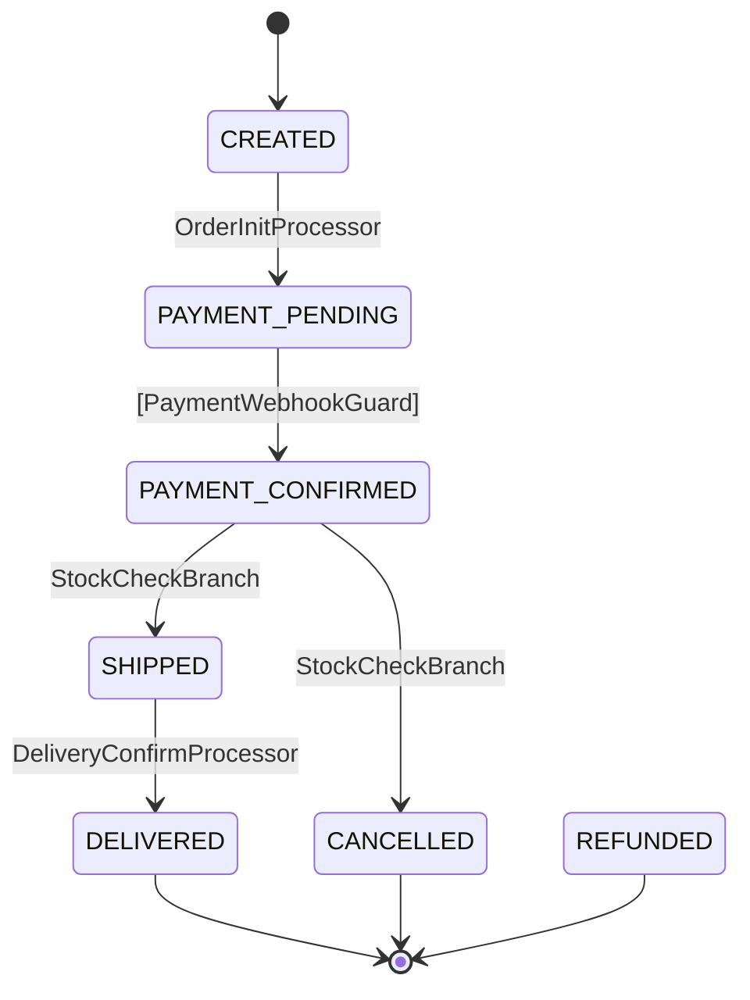

# Constrained Flow Pattern — State Machine で大きなプログラムを制御可能にする

> **対象**: Java 21+ / LLM (Claude, etc.) / 人間の開発者
> **用途**: 認証、決済、ワークフロー、注文処理 — 「状態遷移がある業務ロジック」全般
> **前提知識**: Java の enum, record, sealed interface がわかること

---

## なぜこのパターンが必要か

### 会話: 手続き的コードの限界

```
開発者: 認証フローのコード、1800行あるんだけど、callback 処理ってどこ？

LLM:    全部読ませてください…… 800行目あたりですね。でも途中で分岐が
        3つあって、その先で更に分岐があって、状態が暗黙的に変数に
        埋まっていて、正直全体像が掴みきれません。

開発者: だよね。僕も書いた本人なのに3ヶ月後に読み返すと迷子になる。

LLM:    根本的な問題は「何を知らなくていいか」が分からないことです。
        1箇所直すのに1800行全部が暗黙のコンテキストになっている。

開発者: じゃあどうする？

LLM:    状態遷移を宣言的に定義して、ビジネスロジックを1遷移=1クラスに
        分離しましょう。そうすれば「FlowDefinition を50行読む→対象の
        Processor を1個読む→終わり」になります。
```

### 原理: コンパイラに不正を弾かせる

```
手続き的コード:  実行してみないと何が起きるかわからない
                → LLM が hallucinate しても気づけない
                → 人間がレビューするにも全部読む必要がある

このパターン:    コンパイラ + build() 検証が不正を構造的に排除
                → LLM が間違えてもコンパイルで止まる
                → レビューは「Processor 1個の diff」で済む
```

---

## パターンの全体像

```
┌──────────────────────────────────────────┐
│  HTTP / Event Layer                      │
│  (Router が Flow を起動する)               │
├──────────────────────────────────────────┤
│  FlowEngine (汎用、ビジネスロジックなし)     │
│  ├── auto chain (Auto/Branch 連鎖実行)    │
│  ├── guard validation (External 遷移)     │
│  └── transition logging (監査)            │
├──────────────────────────────────────────┤
│  FlowDefinition (宣言的遷移テーブル)        │
│  「何が→何に→どう遷移するか」の全体地図      │
├──────────────────────────────────────────┤
│  Processor / Guard / BranchProcessor      │
│  (1遷移 = 1クラス、ビジネスロジックの居場所)  │
├──────────────────────────────────────────┤
│  FlowContext (Accumulator)                │
│  型安全なデータバケツ、requires/produces 契約 │
├──────────────────────────────────────────┤
│  FlowState enum (状態定義)                 │
│  コンパイラが網羅性を保証                    │
└──────────────────────────────────────────┘
```

---

## Step 1: 状態を enum で定義する

### 会話: なぜ enum か

```
開発者: 状態を String で管理するのはダメ？

LLM:    String だと "COMLETE" みたいな typo が実行時まで見つかりません。
        enum なら存在しない状態はコンパイルエラーです。
        さらに sealed + switch と組み合わせると、分岐の漏れもコンパイラが
        教えてくれます。

開発者: LLM にとっても楽？

LLM:    はい。enum の定義を見れば「この世界に存在する状態は6個」と
        確定できるので、ありえない状態を生成する余地がなくなります。
```

### コード

```java
// 状態の共通契約
public interface FlowState {
    String name();
    boolean isTerminal();  // この状態で終了（完了、エラー）
    boolean isInitial();   // この状態から開始
}

// 注文フローの例
public enum OrderFlowState implements FlowState {
    CREATED(false, true),           // 注文作成
    PAYMENT_PENDING(false, false),  // 決済待ち
    PAYMENT_CONFIRMED(false, false),// 決済確認済み
    SHIPPED(false, false),          // 発送済み
    DELIVERED(true, false),         // 配達完了
    CANCELLED(true, false),         // キャンセル
    REFUNDED(true, false);          // 返金済み

    private final boolean terminal;
    private final boolean initial;

    OrderFlowState(boolean terminal, boolean initial) {
        this.terminal = terminal;
        this.initial = initial;
    }

    @Override public boolean isTerminal() { return terminal; }
    @Override public boolean isInitial() { return initial; }
}
```

**ポイント**: `isTerminal()` と `isInitial()` を enum 自身に持たせる。状態の性質は定義と一体であるべき。

---

## Step 2: 遷移の種類を決める

### 会話: 3種類の遷移

```
開発者: 遷移って全部同じ扱いでいいの？

LLM:    いいえ。遷移には3種類あります:

        Auto     — 前の処理が終わったら自動で次へ進む
                   例: 決済確認 → 発送指示
        
        External — 外部イベント（HTTP リクエスト等）を待つ
                   例: ユーザーが「決済する」ボタンを押す
        
        Branch   — ビジネス判断で行き先が分かれる
                   例: 在庫あり → 発送 / 在庫なし → 取り寄せ

        この区別が重要な理由は、Engine が「次に何をすべきか」を
        機械的に判断できるからです:
        - Auto/Branch → 即座に連鎖実行
        - External → 停止して外部イベントを待つ

開発者: つまり Engine は「今の状態から Auto があれば実行し続けて、
        External にぶつかったら止まる」だけ？

LLM:    その通りです。Engine にビジネスロジックは一切ありません。
```

### コード

```java
public enum TransitionType {
    AUTO,       // 自動実行
    EXTERNAL,   // 外部イベント待ち
    BRANCH      // 条件分岐
}
```

---

## Step 3: Processor / Guard / BranchProcessor を定義する

### 会話: 1遷移 = 1クラスの原則

```
開発者: なんで1遷移に1クラス？ まとめた方が楽じゃない？

LLM:    「1クラスの変更が他に影響しない」が最大のメリットです。
        Processor A を直しても Processor B は無関係。テストも独立。
        
        LLM にとっても「この Processor だけ読めばいい」で
        コンテキストが閉じます。1800行の中から関連部分を探す必要がない。

開発者: requires / produces は何のため？

LLM:    契約です。
        - requires: 「この Processor を実行するには○○が必要」
        - produces: 「この Processor は○○を生成する」
        
        build() 時に全パスを走査して、requires が前段の produces で
        満たされているか自動検証します。実行時の「データがない」
        エラーが構造的に排除されます。
```

### コード

```java
// ビジネスロジックの実行者
public interface StateProcessor {
    String name();
    Set<Class<?>> requires();   // 必要な入力データの型
    Set<Class<?>> produces();   // 出力するデータの型
    void process(FlowContext ctx) throws FlowException;
}

// 外部イベントの検証者（pure function — ctx を書き換えない）
public interface TransitionGuard {
    String name();
    Set<Class<?>> requires();
    Set<Class<?>> produces();
    int maxRetries();
    GuardOutput validate(FlowContext ctx);

    sealed interface GuardOutput
            permits GuardOutput.Accepted, GuardOutput.Rejected, GuardOutput.Expired {
        record Accepted(Map<Class<?>, Object> data) implements GuardOutput {
            public Accepted() { this(Map.of()); }
        }
        record Rejected(String reason) implements GuardOutput {}
        record Expired() implements GuardOutput {}
    }
}

// 条件分岐の判断者
public interface BranchProcessor {
    String name();
    Set<Class<?>> requires();
    String decide(FlowContext ctx);  // 分岐ラベルを返す
}
```

### 具体例: 決済確認 Processor

```java
public class PaymentConfirmProcessor implements StateProcessor {
    private final PaymentGateway gateway;

    public PaymentConfirmProcessor(PaymentGateway gateway) {
        this.gateway = gateway;
    }

    @Override public String name() { return "PaymentConfirmProcessor"; }
    @Override public Set<Class<?>> requires() { return Set.of(PaymentIntent.class); }
    @Override public Set<Class<?>> produces() { return Set.of(PaymentResult.class); }

    @Override
    public void process(FlowContext ctx) {
        PaymentIntent intent = ctx.get(PaymentIntent.class);
        PaymentResult result = gateway.confirm(intent.transactionId());
        ctx.put(PaymentResult.class, result);
    }
}
```

---

## Step 4: FlowContext — 型安全なデータバケツ

### 会話: なぜ Map<String, Object> ではダメか

```
開発者: データの受け渡し、普通に Map<String, Object> でいいのでは？

LLM:    Map<String, Object> だと:
        - キー名の typo が実行時まで見つからない
        - 値の型が Object なのでキャストが必要
        - 「何が入っているか」がコードを全部読まないとわからない

        Class をキーにすれば:
        - ctx.get(PaymentResult.class) → 型安全、typo 不可能
        - requires/produces と連動して build() 時に検証可能
        - LLM が「この Processor の後には PaymentResult がある」と
          宣言から判断できる

開発者: パススルー問題は？

LLM:    ありません。全データが ctx に累積するので、Processor A が
        produces したデータは Processor C でも get できます。
        バケツリレーで中間の B に意味のないパラメータを通す必要がない。
```

### コード

```java
public final class FlowContext {
    private final String flowId;
    private final Instant createdAt;
    private final Map<Class<?>, Object> attributes;

    public FlowContext(String flowId) {
        this(flowId, Instant.now(), new LinkedHashMap<>());
    }

    @SuppressWarnings("unchecked")
    public <T> T get(Class<T> key) {
        Object value = attributes.get(key);
        if (value == null) {
            throw FlowException.missingContext(key);
        }
        return (T) value;
    }

    public <T> Optional<T> find(Class<T> key) {
        return Optional.ofNullable((T) attributes.get(key));
    }

    public <T> void put(Class<T> key, T value) {
        attributes.put(key, value);
    }

    public boolean has(Class<?> key) {
        return attributes.containsKey(key);
    }
}
```

### @FlowData — シリアライズ用エイリアス

```java
@Retention(RUNTIME) @Target(TYPE)
public @interface FlowData { String value(); }

// 使い方: クラス名を変えても alias は安定
@FlowData("order.payment_result")
public record PaymentResult(
    String transactionId,
    String status,
    Instant confirmedAt
) {}
```

---

## Step 5: FlowDefinition — 全体地図を宣言する

### 会話: なぜ Builder DSL か

```
開発者: 遷移テーブルって、2次元配列でもいいんじゃ？

LLM:    2次元配列だと「読めはするけど検証できない」。
        Builder DSL にすると build() 時に8項目の自動検証ができます:
        
        1. 全 state が到達可能か
        2. initial → terminal への path が存在するか
        3. Auto/Branch が DAG か（循環なし）
        4. External は各 state に最大1つか
        5. Branch の全分岐先が定義済みか
        6. requires/produces チェーンが整合するか
        7. @FlowData alias が重複しないか
        8. Terminal state から出る遷移がないか
        
        つまり「定義した時点で正しさが保証される」。
        LLM が遷移を1本間違えても build() が即座に教えてくれます。

開発者: これが「コンパイラに不正を弾かせる」ってやつか。

LLM:    そうです。LLM は hallucinate しますが、build() は嘘をつきません。
```

### コード: 注文フローの定義

```java
FlowDefinition<OrderFlowState> ORDER_FLOW =
    FlowDefinition.builder("order", OrderFlowState.class)
        .ttl(Duration.ofHours(24))
        .maxGuardRetries(3)

        // 注文作成 → 決済待ち（自動）
        .from(CREATED).auto(PAYMENT_PENDING,
            new OrderInitProcessor())

        // 決済待ち → 決済確認（外部イベント: Webhook）
        .from(PAYMENT_PENDING).external(PAYMENT_CONFIRMED,
            new PaymentWebhookGuard(),
            new PaymentConfirmProcessor(gateway))

        // 決済確認 → 分岐（在庫判定）
        .from(PAYMENT_CONFIRMED).branch(new StockCheckBranch())
            .to(SHIPPED, "in_stock", new ShipProcessor())
            .to(CANCELLED, "out_of_stock", new CancelProcessor())
            .endBranch()

        // エラー時は全てキャンセル
        .onAnyError(CANCELLED)

        .build();  // ← ここで8項目検証！
```

**読み方**: 上から下に読めばフロー全体がわかる。LLM にとっては「この50行がこのフローの全体地図」。

---

## Step 6: FlowEngine — ビジネスロジックゼロの駆動エンジン

### 会話: Engine は何をするのか

```
開発者: Engine のコードは何行くらい？

LLM:    約120行です。やることは3つだけ:
        
        1. startFlow() — 初期データをセットして auto chain 実行
        2. resumeAndExecute() — 外部イベントで Guard 検証 → auto chain
        3. executeAutoChain() — Auto/Branch を連鎖実行、External で停止
        
        ビジネスロジックは一切なし。Processor に委譲するだけ。
        だから Engine はフローが増えても変更不要です。

開発者: auto chain って何？

LLM:    External の Guard が通った後、到達可能な Auto/Branch 遷移を
        連続で実行する仕組みです。
        
        例: callback 受信(External)
            → token 交換(Auto)
            → ユーザー解決(Auto)
            → MFA チェック(Branch)
            → 完了 or MFA待ち
        
        1つの HTTP リクエストで4遷移が連鎖します。
        External にぶつかるか terminal に達したら停止。
```

### コード: Engine の核心部分

```java
public final class FlowEngine {
    private static final int MAX_CHAIN_DEPTH = 10;
    private final FlowStore store;

    // フロー開始
    public <S extends Enum<S> & FlowState> FlowInstance<S> startFlow(
            FlowDefinition<S> definition, String contextId,
            Map<Class<?>, Object> initialData) {

        FlowContext ctx = new FlowContext(UUID.randomUUID().toString());
        initialData.forEach((k, v) -> putRaw(ctx, k, v));

        var flow = new FlowInstance<>(ctx.flowId(), contextId, definition, ctx,
                definition.initialState(), Instant.now().plus(definition.ttl()));

        store.create(flow);
        executeAutoChain(flow);   // 初期状態から Auto を連鎖実行
        store.save(flow);
        return flow;
    }

    // 外部イベントで再開
    public <S extends Enum<S> & FlowState> FlowInstance<S> resumeAndExecute(
            String flowId, FlowDefinition<S> definition) {

        var flow = store.loadForUpdate(flowId, definition)
                .orElseThrow(() -> new FlowException("FLOW_NOT_FOUND", "..."));

        // TTL チェック
        if (Instant.now().isAfter(flow.expiresAt())) {
            flow.complete("EXPIRED");
            store.save(flow);
            return flow;
        }

        // External 遷移を実行
        var transition = definition.externalFrom(flow.currentState())
                .orElseThrow(() -> FlowException.invalidTransition(...));

        // Guard 検証
        var output = transition.guard().validate(flow.context());
        switch (output) {
            case Accepted a -> {
                a.data().forEach((k, v) -> putRaw(flow.context(), k, v));
                flow.transitionTo(transition.to());
                if (transition.processor() != null) {
                    transition.processor().process(flow.context());
                }
            }
            case Rejected r -> {
                flow.incrementGuardFailure();
                if (flow.guardFailureCount() >= definition.maxGuardRetries()) {
                    handleError(flow, ...);
                }
                store.save(flow);
                return flow;
            }
            case Expired e -> {
                flow.complete("EXPIRED");
                store.save(flow);
                return flow;
            }
        }

        executeAutoChain(flow);   // Guard 通過後に Auto を連鎖実行
        store.save(flow);
        return flow;
    }

    // Auto/Branch 連鎖実行（External か terminal で停止）
    private <S extends Enum<S> & FlowState> void executeAutoChain(FlowInstance<S> flow) {
        for (int depth = 0; depth < MAX_CHAIN_DEPTH; depth++) {
            S current = flow.currentState();
            if (current.isTerminal()) {
                flow.complete(current.name());
                return;
            }

            var next = flow.definition().transitionsFrom(current).stream()
                    .filter(t -> t.isAuto() || t.isBranch())
                    .findFirst()
                    .orElse(null);

            if (next == null) return;  // External 待ち

            if (next.isAuto()) {
                if (next.processor() != null) next.processor().process(flow.context());
                flow.transitionTo(next.to());
            } else {
                // Branch: ビジネス判断で行き先を決定
                String label = next.branch().decide(flow.context());
                S target = next.branchTargets().get(label);
                // ... processor 実行 + 遷移
            }
        }
    }
}
```

---

## Step 7: テスト戦略 — 3層 + 自動生成

### 会話: テストの書き方

```
開発者: テストはどう組む？

LLM:    3層です:

        Layer 1 — Processor 単体テスト
          入力(requires) → 処理 → 出力(produces) の検証
          FlowContext をモックして1クラスずつテスト

        Layer 2 — Flow 遷移テスト (FlowTestHarness)
          DSL で「start → expect → resume → expect → completed」
          遷移列が正しいことを宣言的に検証

        Layer 3 — Invalid transition 自動生成
          遷移テーブルの補集合を自動計算して全て rejected を確認
          手動で書く必要なし、漏れも不可能

開発者: Layer 3 が面白いな。どういうこと？

LLM:    例えば状態が6個あれば 6×6 = 36 の組み合わせがあります。
        そのうち有効な遷移が8個なら、残り28個が全て「遷移できない」
        ことを自動検証します。「やってはいけないこと」のテストを
        人間が書く必要がないんです。
```

### コード: FlowTestHarness DSL

```java
// Happy path テスト
@Test
void orderHappyPath() {
    FlowTestHarness.forFlow(ORDER_FLOW)
        .startWith(OrderRequest.class, new OrderRequest("item-1", 3))
        .expectState(PAYMENT_PENDING)         // auto chain で到達
        .thenResume()                         // 決済 Webhook 受信
        .assertFlowCompleted("SHIPPED");      // auto chain で完了
}

// Guard rejection テスト
@Test
void paymentRejected_3times_cancelledOrder() {
    var harness = FlowTestHarness.forFlow(orderFlowWithRejectingGuard())
        .start()
        .expectState(PAYMENT_PENDING);

    harness.thenResume();  // 1回目: rejected
    harness.thenResume();  // 2回目: rejected
    harness.thenResume();  // 3回目: → CANCELLED (maxRetries)
    harness.assertFlowCompleted("CANCELLED");
}
```

### コード: Invalid transition 自動生成

```java
@ParameterizedTest
@MethodSource("invalidTransitions")
void allInvalidTransitions_areRejected(OrderFlowState from, OrderFlowState to) {
    FlowTestHarness.forFlow(ORDER_FLOW)
        .forceState(from)
        .assertTransitionRejected(to);
}

// 有効遷移の補集合を自動計算
static Stream<Object[]> invalidTransitions() {
    Set<String> valid = /* 遷移テーブルから有効ペアを収集 */;
    return allPairs().filter(pair -> !valid.contains(pair));
}
```

---

## Step 8: Mermaid 図の自動生成

### 会話: なぜ自動生成か

```
開発者: ドキュメントの図は手動で描けばいいのでは？

LLM:    手動だとコードと図が乖離します。必ず。
        FlowDefinition から自動生成すれば「図 = コード」が保証されます。
        CI テストで生成結果と既存ファイルを比較すれば、
        遷移を変えたのに図を更新し忘れた、も検出できます。

開発者: LLM にとっても？

LLM:    はい。Mermaid テキストを読めばフローの全体像が即座にわかります。
        コードを読むよりもパース負荷が低い。
```

### 自動生成される Mermaid の例



---

## なぜ LLM にとって楽なのか — まとめ

### 会話: コンテキスト窓の経済学

```
開発者: 結局、LLM にとって何が一番嬉しいの？

LLM:    「何を知らなくていいか」が明確なことです。

        手続き的 1800行:
          タスク: callback 処理を直して
          → 1800行全部読む（何がどこに影響するかわからない）
          → コンテキスト窓が溶ける
          → 精度が落ちる

        SM パターン:
          タスク: callback 処理を直して
          → FlowDefinition 50行読む（全体地図）
          → OidcCallbackGuard.java 1ファイル読む（対象）
          → 合計100行で完了
          → コンテキスト窓に余裕がある
          → 精度が高い

開発者: 人間にとっても同じだね。

LLM:    全く同じです。人間の短期記憶もコンテキスト窓も有限リソースです。
        「1ファイルの変更が他に影響しない」設計は、その有限リソースを
        最も効率的に使う方法です。
```

### 対比表

| 観点 | 手続き的コード | SM パターン |
|------|--------------|------------|
| 1タスクに必要な読量 | 数百〜数千行 | 50〜100行 |
| 変更の影響範囲 | 不明（全体が暗黙結合） | 1 Processor（明示的に閉じる） |
| 間違いの検出 | 実行時 or レビュー | コンパイル時 + build() 時 |
| テストの独立性 | 依存が複雑 | Processor 単体で完結 |
| 全体像の把握 | コード全部読む | FlowDefinition or Mermaid 図 |
| LLM の hallucination 耐性 | 低い | 高い（型 + 検証が止める） |

---

## 応用: このパターンが使える領域

```
認証フロー     — OIDC, Passkey, MFA, Invite
決済フロー     — 注文 → 決済 → 発送 → 配達
承認ワークフロー — 申請 → 上長承認 → 経理承認 → 実行
CI/CD パイプライン — ビルド → テスト → デプロイ → 検証
オンボーディング — 登録 → メール確認 → プロフィール → 完了
サポートチケット  — 起票 → 割当 → 対応中 → 解決 → クローズ
```

**共通点**: 「状態がある」「遷移条件がある」「途中で外部イベントを待つ」

---

## LLM 向け: このパターンで実装するときの手順

1. **状態を列挙する** — enum で全状態を定義（isTerminal, isInitial）
2. **遷移を決める** — どの状態からどの状態へ、Auto/External/Branch のどれか
3. **FlowDefinition を書く** — Builder DSL で宣言、build() で検証
4. **Processor を1個ずつ書く** — requires/produces を宣言、process() を実装
5. **テストを書く** — FlowTestHarness で happy path、自動生成で invalid path
6. **Mermaid を生成** — MermaidGenerator.generate(definition) で図を出力

**重要**: Step 3 の build() が通らないうちは Step 4 に進まない。定義が正しいことを先に保証する。

### LLM がやりがちなミスと、このパターンが防ぐ方法

| ミス | 防止メカニズム |
|------|-------------|
| 存在しない状態への遷移 | enum → コンパイルエラー |
| データの受け渡し忘れ | requires/produces → build() エラー |
| 到達不能な状態の作成 | reachability check → build() エラー |
| 循環する自動遷移 | DAG 検証 → build() エラー |
| 分岐先の定義忘れ | branch completeness → build() エラー |
| 終了状態からの遷移 | terminal check → build() エラー |
| Guard の sealed match 漏れ | sealed interface → コンパイルエラー |

**つまり: LLM は間違えてもいい。コンパイラと build() が止めてくれる。**

---

## 最小テンプレート: コピーして使う

新しいフローを作るとき、以下をコピーして状態名と Processor を差し替える:

```java
// 1. 状態定義
public enum MyFlowState implements FlowState {
    INIT(false, true),
    STEP_A(false, false),
    STEP_B(false, false),
    COMPLETE(true, false),
    ERROR(true, false);
    // ... constructor 省略（上の例と同じ）
}

// 2. フロー定義
FlowDefinition<MyFlowState> MY_FLOW =
    FlowDefinition.builder("my-flow", MyFlowState.class)
        .ttl(Duration.ofMinutes(10))
        .maxGuardRetries(3)
        .from(INIT).auto(STEP_A, new StepAProcessor())
        .from(STEP_A).external(STEP_B, new StepBGuard())
        .from(STEP_B).auto(COMPLETE, new CompleteProcessor())
        .onAnyError(ERROR)
        .build();

// 3. テスト
@Test void happyPath() {
    FlowTestHarness.forFlow(MY_FLOW)
        .start()
        .expectState(STEP_A)
        .thenResume()
        .assertFlowCompleted("COMPLETE");
}
```

---

## 設計判断メモ

| 判断 | 理由 |
|------|------|
| 外部 SM ライブラリを使わない | 設定地獄を避ける。120行で書ける Engine に依存ライブラリは不要 |
| 1遷移 = 1 Processor | 変更の影響範囲を構造的に閉じる |
| Class をキーにした FlowContext | 型安全 + typo 不可能 + requires/produces と連動 |
| build() で8項目検証 | 「間違った定義が存在できない」を保証 |
| Terminal state の reachability は Engine 委譲 | TTL expiry 等は Engine レベルの関心事 |
| Per-request save | 1 HTTP req = 1 DB save。途中で例外 → save しない = 安全 |
| Strangler Fig 移行 | Big bang rewrite 禁止。1フローずつ段階的に移行 |
