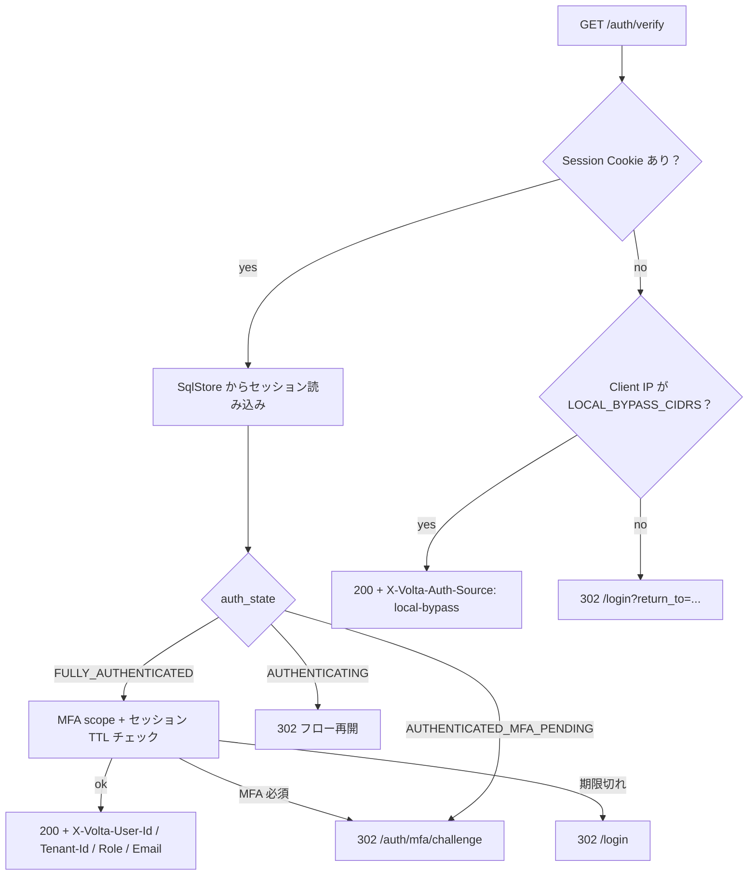
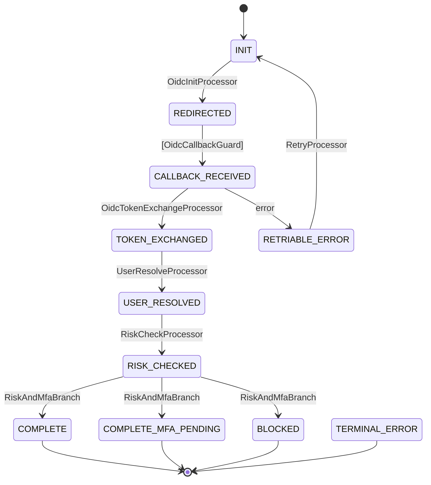
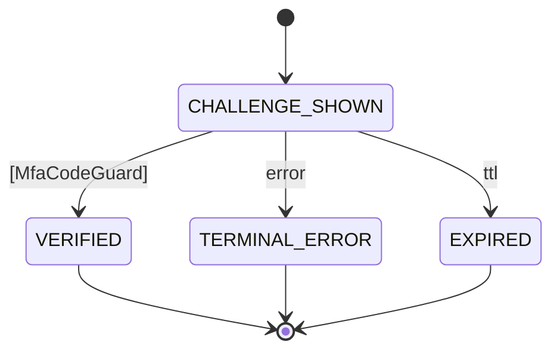
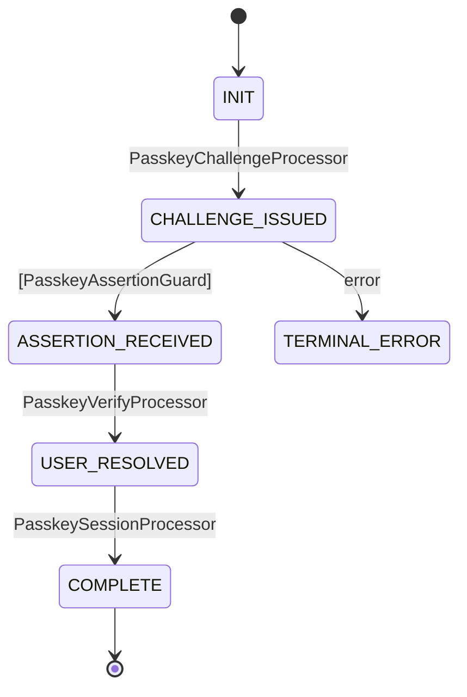
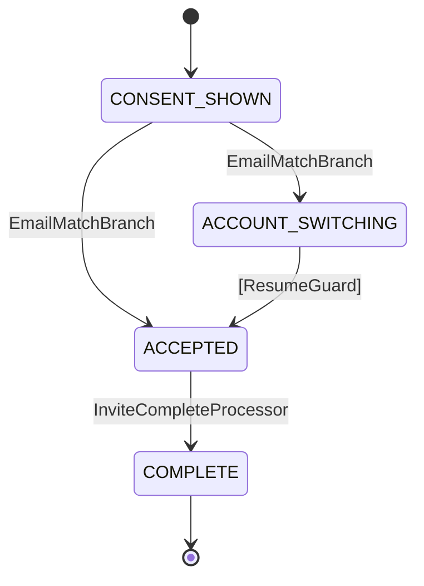

# アーキテクチャ

[English](architecture.md)

> volta-auth-proxy は **ForwardAuth + SAML + MFA + Passkey** の Identity Gateway。
> 認証フローは [tramli](https://github.com/opaopa6969/tramli)（制約付きフローエンジン）
> の FlowDefinition として宣言され、**不正な遷移が構造的に存在できない** ——
> コンパイラと tramli の 8 項目検証がビルド時に保証する。

---

## 目次

- [一段落サマリ](#一段落サマリ)
- [レイヤード・アーキテクチャ](#レイヤードアーキテクチャ)
- [ForwardAuth 判定フロー](#forwardauth-判定フロー)
- [二層セッションモデル](#二層セッションモデル)
- [Flow ステートマシン](#flow-ステートマシン下層)
  - [OIDC](#oidc-flow)
  - [SAML](#saml-flow)
  - [MFA](#mfa-flow-tramli)
  - [Passkey](#passkey-flow)
  - [Invite](#invite-flow)
- [SAML アサーション処理パイプライン](#saml-アサーション処理パイプライン)
- [dxe / dge / dve の責務](#dxe--dge--dve-の責務)
- [永続化レイアウト](#永続化レイアウト)
- [セキュリティ特性](#セキュリティ特性)

---

## 一段落サマリ

全ての HTTP リクエストは [Traefik ForwardAuth](glossary/forwardauth.ja.md)
（または同梱の [volta-gateway](https://github.com/opaopa6969/volta-gateway) Rust
リバースプロキシ）経由で volta に届く。volta は Cookie を見て **二層ステートマシン**
（Session SM の下に Flow SM 群）上の現在状態を決定し、該当する Flow を **tramli**
で駆動、最終的に `200 OK` + `X-Volta-*` ヘッダを返すか `302 /login` にリダイレクトする。
下流アプリはパスワードや SAML アサーションや MFA シークレットを一切見ない —— ヘッダだけ読む。

---

## レイヤード・アーキテクチャ

```
┌────────────────────────────────────────────────────────────────────┐
│ Browser                                                             │
└───────────────┬────────────────────────────────────────────────────┘
                │ HTTPS
┌───────────────▼────────────────────────────────────────────────────┐
│ Traefik / volta-gateway                                             │
│   - Routes                                                          │
│   - ForwardAuth ミドルウェア ─┐                                       │
└───────────────────────────────┼────────────────────────────────────┘
                                │ GET /auth/verify
┌───────────────────────────────▼────────────────────────────────────┐
│ volta-auth-proxy (Javalin + tramli)                                 │
│                                                                     │
│   ┌──────────────────────────────────────────────────────────────┐ │
│   │ AuthRouter / AuthFlowHandler (HTTP 境界)                      │ │
│   └───────────────┬──────────────────────────────────────────────┘ │
│                   │                                                 │
│   ┌───────────────▼──────────────────────────────────────────────┐ │
│   │ Session SM (上層) — sessions.auth_state                       │ │
│   │   AUTHENTICATING / …MFA_PENDING / FULLY_AUTHENTICATED / …    │ │
│   └───────────────┬──────────────────────────────────────────────┘ │
│                   │ 起動 / 再開                                      │
│   ┌───────────────▼──────────────────────────────────────────────┐ │
│   │ Flow SMs (下層 — 一時, TTL 5-10分)                             │ │
│   │   OIDC · SAML · MFA · Passkey · Invite                       │ │
│   │   tramli FlowDefinition として宣言的に定義                     │ │
│   └───────────────┬──────────────────────────────────────────────┘ │
│                   │                                                 │
│   ┌───────────────▼──────────────────────────────────────────────┐ │
│   │ Services (OidcService / SamlService / MfaService /           │ │
│   │           PasskeyService / SessionService / PolicyEngine)    │ │
│   └───────────────┬──────────────────────────────────────────────┘ │
│                   │                                                 │
│   ┌───────────────▼──────────────────────────────────────────────┐ │
│   │ SqlStore / SqlFlowStore (Postgres + Flyway)                  │ │
│   └──────────────────────────────────────────────────────────────┘ │
└─────────────────────────────────────────────────────────────────────┘
```

---

## ForwardAuth 判定フロー

`GET /auth/verify` は Traefik が下流アプリへプロキシする前に呼ぶ唯一の入口。
判定木は `AuthFlowHandler` と `AuthRouter` に実装されている。



不変条件:

- **セッションなし + LAN IP**: ADR-003 の bypass が発火（`X-Volta-Auth-Source: local-bypass` タグ付き）
- **セッションあり + LAN IP**: 通常認証ルート —— LAN からでも MFA は要求される
  （MFA ループ修正, `4006ee7`）
- **テナント切替**: 新セッションは `mfaVerifiedAt = null` で再発行（ADR-004）

---

## 二層セッションモデル

### 上層 — Session SM（永続, `sessions.auth_state`）

| State | 意味 | Terminal? |
|-------|------|-----------|
| `AUTHENTICATING` | フロー開始、未完了 | — |
| `AUTHENTICATED_MFA_PENDING` | IdP 認証済み、MFA 未 | — |
| `FULLY_AUTHENTICATED` | 下流アプリへ通せる | — |
| `EXPIRED` | TTL 超過 | terminal |
| `REVOKED` | 明示ログアウト / 管理者失効 | terminal |

Step-up 認証は state ではなく `session_scopes` の時限エントリとしてモデル化する。

### 下層 — Flow SMs（一時, `auth_flows` テーブル）

各フローは個別の tramli `FlowDefinition` を持ち、TTL は 5 分（OIDC / SAML / MFA
/ Passkey）または 7 日（Invite）。

---

## Flow ステートマシン（下層）

### OIDC flow



### SAML flow

SAML も同じ tramli の骨格を再利用するが、ブラウザは IdP-POST エンドポイントで待機する（リダイレクトではない）。

```
INIT → AUTHN_REQUEST_ISSUED → [SamlAssertionGuard]
     → ASSERTION_RECEIVED → IDENTITY_RESOLVED → SESSION_CREATED → COMPLETE
```

`SamlAssertionGuard` / `SamlService` のパイプラインは
[SAML アサーション処理パイプライン](#saml-アサーション処理パイプライン) の XSW/XXE 対策を実施する。

### MFA flow (tramli)



フラット enum (`MfaFlowState`) —— 4 状態、1 初期、3 終端。意図的にミニマル:
実際の step-up / ratchet ロジックは上層 Session SM + `session_scopes` 側で扱う。

### Passkey flow



### Invite flow



---

## SAML アサーション処理パイプライン

`SamlService.parseIdentity(...)` は OWASP / NIST 800-63 が推奨する SP 側処理を実装する:

| ステップ | 防御 | 実装 |
|---------|------|------|
| XML パース | **XXE** —— DTD/エンティティ展開を禁止 | `disallow-doctype-decl=true`, `external-*-entities=false`, `ACCESS_EXTERNAL_DTD=""`, `ACCESS_EXTERNAL_SCHEMA=""`, `FEATURE_SECURE_PROCESSING=true` |
| 署名検証 | **XSW** —— secure validation を強制 | `DOMValidateContext.setProperty("org.jcp.xml.dsig.secureValidation", true)` + 単一の `<Signature>` 要素のみ取り扱う |
| Issuer | 不一致 → 401 | `idp.issuer()` と比較 |
| Audience | 不一致 → 401 | `idp.audience()`（デフォルト `volta-sp-audience`）と比較 |
| NotOnOrAfter | クロックスキュー上限（≤ 5 分） | `SubjectConfirmationData/@NotOnOrAfter` を `Instant.parse` |
| RequestId | リプレイ抑止 | `expectedRequestId` をフローコンテキスト経由で束縛 |
| ACS URL | バインディング混乱攻撃対策 | `expectedAcsUrl` と比較 |
| RelayState | CSRF + return_to | HMAC 署名付き JSON（`encodeRelayState` / `decodeRelayState`） |

**開発モードのエスケープハッチ** (`MOCK:alice@example.com`) は `DEV_MODE=true`
*かつ* 非本番 `BASE_URL` の二条件で初めて有効化される —— 本番環境では誤って
有効化できないよう多重ガード済み。

テストカバー一覧は [auth-flows.md](auth-flows.md#saml-xswxxe-テストカバー状況) を参照。

---

## dxe / dge / dve の責務

volta-auth-proxy は tramli ワークスペース規約に沿って、3 つのエンジニア役割面を分離する:

| Surface | フルネーム | 担当 | 本リポでの場所 |
|---------|-----------|------|---------------|
| **dxe** | Developer Experience Engineer | ツールチェイン, CI, ビルド, 観測, `tramli-viz`, リリースタグ (`dxe-v4.1.x`) | `tools/`, `infra/`, `start-dev.sh`, `docker-compose.yml`, `.github/` |
| **dge** | Design Generation Engineer | スペック生成, ADR 起案, tribunal レビュー, ステートマシン設計セッション | `dge/sessions/`, `docs/decisions/`, `docs/AUTH-STATE-MACHINE-SPEC.md`, `docs/AUTHENTICATION-SEQUENCES.md` |
| **dve** | Development/Verification Engineer | 本番コード + テスト —— サービス, ルータ, プロセッサ, ガード, マイグレーション | `src/main/java/org/unlaxer/infra/volta/**`, `src/test/**`, Flyway マイグレーション |

境界は面をまたいで **read-only**: dge の提案は ADR が `Accepted` になった時点で
dve へ流れ込み、dxe のツールは dve 成果物を変更せず消費する。

---

## 永続化レイアウト

| テーブル | 所有者 | 目的 |
|---------|--------|------|
| `sessions` | 上層 SM | `auth_state`, `mfa_verified_at`, `tenant_id`, `user_id`, TTL |
| `session_scopes` | Step-up | 時限権限付与（state ではない） |
| `auth_flows` | 下層 SM (tramli) | `flow_id`, `flow_type`, `state`, `context_json`, `version` |
| `users`, `memberships`, `tenants`, `roles` | Identity | マルチテナント Identity モデル |
| `idp_configs` | IdP 管理 | テナント別 OIDC / SAML 設定 |
| `passkeys` | WebAuthn | クレデンシャル ID + 公開鍵 |
| `audit_log`, `outbox` | 観測性 | 追記専用監査ログ + Webhook outbox |

マイグレーションは `src/main/resources/db/migration/` 配下にあり Flyway で起動時適用。
テーブル欠落時は fail-fast（`cdbac54`）。

---

## セキュリティ特性

- **CSRF**: Origin ベース検証（`2458535`）+ SameSite Cookie。MFA/callback の
  例外は ADR ノートに明記。
- **Open redirect**: `ReturnToValidator` が許可ドメインリスト（ワイルドカードサブドメイン対応, `ac6bb8c`）を強制。
- **Cookie scheme**: `Secure` フラグは可変な `X-Forwarded-Proto` ではなく `BASE_URL`
  から推定 —— TLS 終端プロキシに Secure を剥がされない（`8e58800`, `7a8c8dd`）。
- **Local bypass**（ADR-003）: *セッションなし* かつ `LOCAL_BYPASS_CIDRS` に合致
  した場合のみ発火、`X-Volta-Auth-Source: local-bypass` ヘッダで下流監査可能。
- **テナント境界**（ADR-004）: MFA state は `switch-tenant` で持ち越さない。
  各テナントは独立したセキュリティゾーン。
- **Flow コンテキスト**: 機密フィールドは `Sensitive` + `SensitiveRedactor` で
  ログや `tramli-viz` へ流れる前にリダクトされる。
