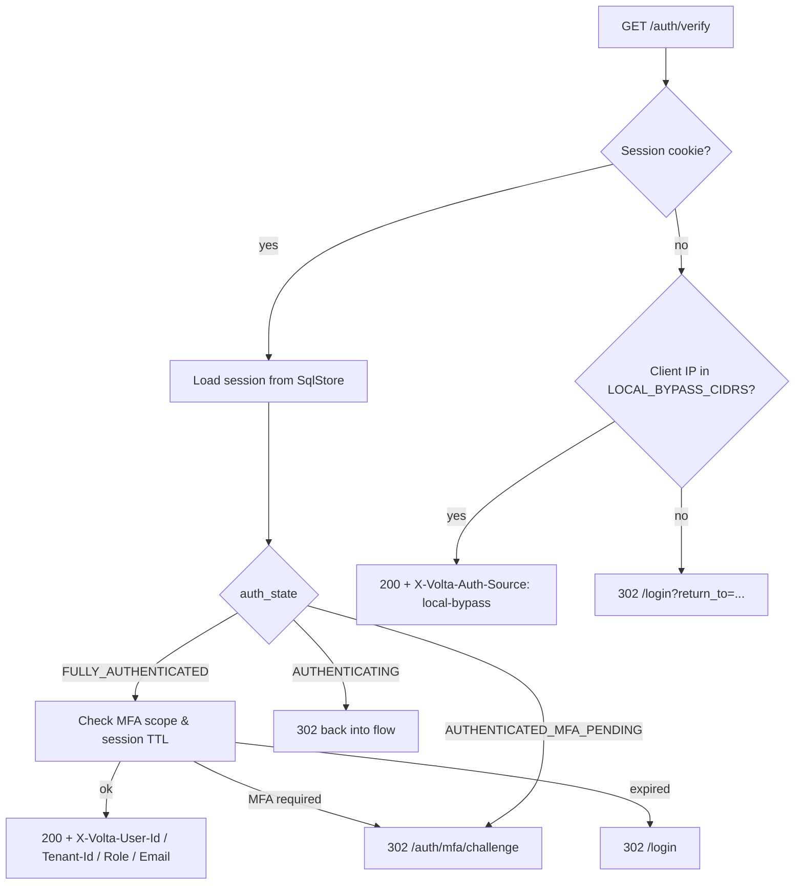
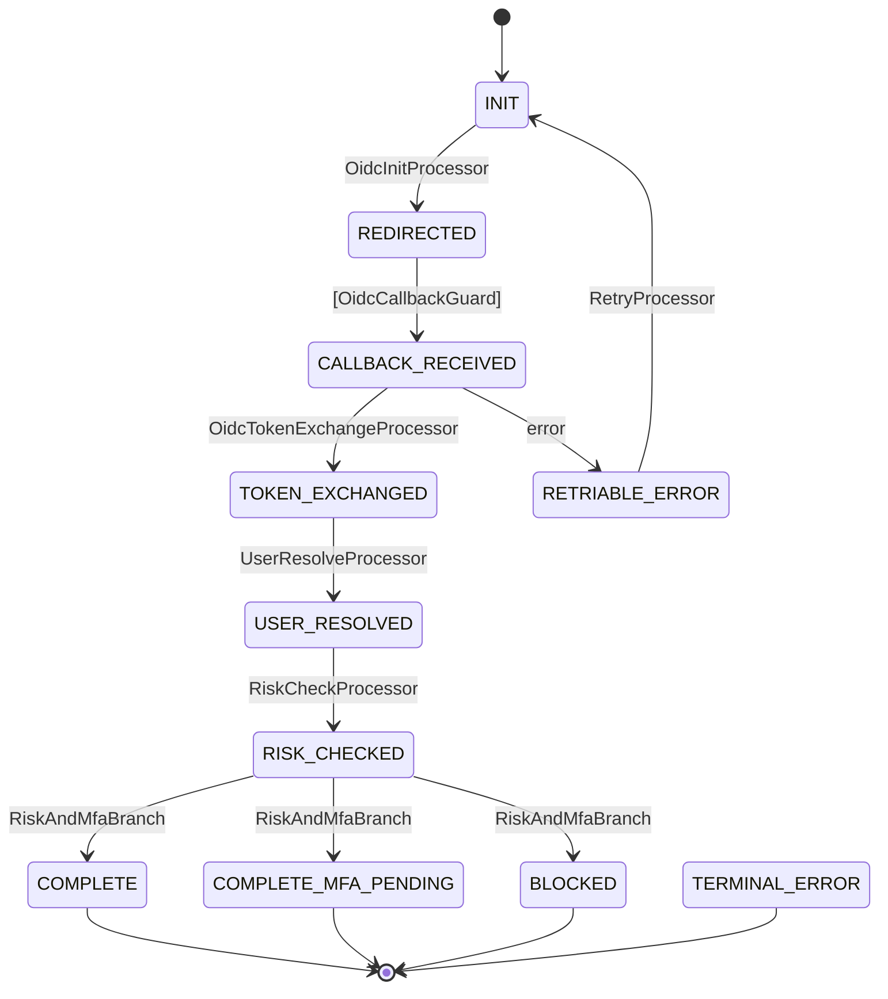
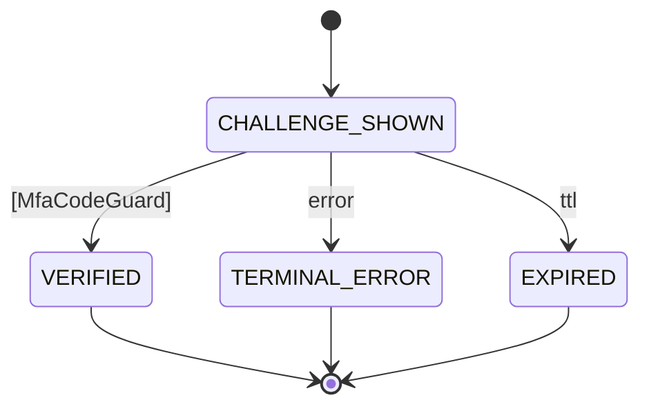
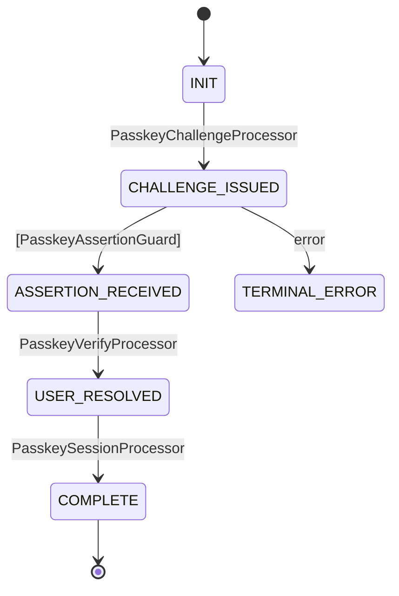
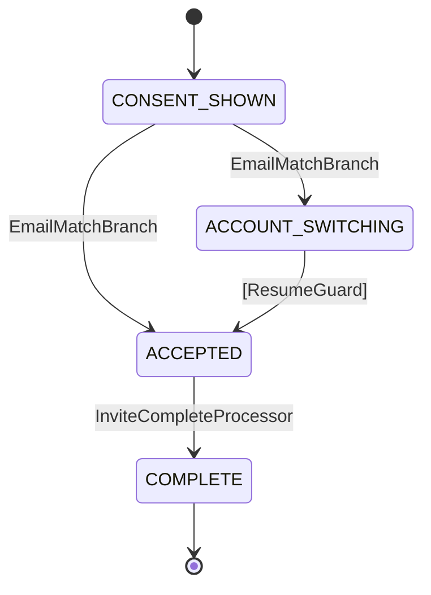

# Architecture

[日本語版 / Japanese](architecture-ja.md)

> volta-auth-proxy is a **ForwardAuth + SAML + MFA + Passkey** identity gateway
> built on [tramli](https://github.com/opaopa6969/tramli) (constrained flow engine).
> Auth flows are declared as state machines whose *invalid transitions cannot exist*
> — the compiler and tramli's 8-item validation enforce this at build time.

---

## Table of Contents

- [One-paragraph summary](#one-paragraph-summary)
- [Layered architecture](#layered-architecture)
- [ForwardAuth decision flow](#forwardauth-decision-flow)
- [Two-layer session model](#two-layer-session-model)
- [Flow state machines](#flow-state-machines-lower-layer)
  - [OIDC](#oidc-flow)
  - [SAML](#saml-flow)
  - [MFA](#mfa-flow-tramli)
  - [Passkey](#passkey-flow)
  - [Invite](#invite-flow)
- [SAML assertion pipeline](#saml-assertion-pipeline)
- [dxe / dge / dve responsibilities](#dxe--dge--dve-responsibilities)
- [Persistence layout](#persistence-layout)
- [Security properties](#security-properties)

---

## One-paragraph summary

Every HTTP request reaches volta via [Traefik ForwardAuth](glossary/forwardauth.md)
(or the bundled [volta-gateway](https://github.com/opaopa6969/volta-gateway) Rust
reverse proxy). volta looks at the request cookie, decides the user's state on a
**two-layer state machine** (session SM over flow SMs), runs the relevant flow
through **tramli**, and either returns `200 OK` with `X-Volta-*` identity headers
or a `302 /login` redirect. Downstream apps never see a password, a SAML assertion,
or an MFA secret — they only read headers.

---

## Layered architecture

```
┌────────────────────────────────────────────────────────────────────┐
│ Browser                                                             │
└───────────────┬────────────────────────────────────────────────────┘
                │ HTTPS
┌───────────────▼────────────────────────────────────────────────────┐
│ Traefik / volta-gateway                                             │
│   - Routes                                                          │
│   - ForwardAuth middleware ─┐                                        │
└────────────────────────────┼───────────────────────────────────────┘
                             │ GET /auth/verify
┌────────────────────────────▼───────────────────────────────────────┐
│ volta-auth-proxy (Javalin + tramli)                                 │
│                                                                     │
│   ┌──────────────────────────────────────────────────────────────┐ │
│   │ AuthRouter / AuthFlowHandler (HTTP boundary)                 │ │
│   └───────────────┬──────────────────────────────────────────────┘ │
│                   │                                                 │
│   ┌───────────────▼──────────────────────────────────────────────┐ │
│   │ Session SM (upper) — sessions.auth_state                     │ │
│   │   AUTHENTICATING / …MFA_PENDING / FULLY_AUTHENTICATED / …    │ │
│   └───────────────┬──────────────────────────────────────────────┘ │
│                   │ starts / resumes                                │
│   ┌───────────────▼──────────────────────────────────────────────┐ │
│   │ Flow SMs (lower — ephemeral, TTL 5-10 min)                   │ │
│   │   OIDC · SAML · MFA · Passkey · Invite                       │ │
│   │   Defined declaratively as tramli FlowDefinitions.           │ │
│   └───────────────┬──────────────────────────────────────────────┘ │
│                   │                                                 │
│   ┌───────────────▼──────────────────────────────────────────────┐ │
│   │ Services (OidcService / SamlService / MfaService /           │ │
│   │           PasskeyService / SessionService / PolicyEngine)    │ │
│   └───────────────┬──────────────────────────────────────────────┘ │
│                   │                                                 │
│   ┌───────────────▼──────────────────────────────────────────────┐ │
│   │ SqlStore / SqlFlowStore (Postgres + Flyway)                  │ │
│   └──────────────────────────────────────────────────────────────┘ │
└─────────────────────────────────────────────────────────────────────┘
```

---

## ForwardAuth decision flow

`GET /auth/verify` is the single entry point Traefik calls before proxying to a
downstream app. The decision tree below is implemented in `AuthFlowHandler` and
`AuthRouter`.



Key invariants:

- **No session + LAN IP**: ADR-003 bypass fires (tagged with `X-Volta-Auth-Source: local-bypass`)
- **Session + LAN IP**: normal auth path — LAN users still go through MFA
  (fixes MFA loop, `4006ee7`)
- **Tenant switch**: re-issues a fresh session with `mfaVerifiedAt = null`
  (ADR-004)

---

## Two-layer session model

### Upper layer — Session SM (persistent, `sessions.auth_state`)

| State | Meaning | Terminal? |
|-------|---------|-----------|
| `AUTHENTICATING` | Flow started, not yet complete | — |
| `AUTHENTICATED_MFA_PENDING` | IdP verified, MFA outstanding | — |
| `FULLY_AUTHENTICATED` | Ready for downstream apps | — |
| `EXPIRED` | Session TTL exceeded | terminal |
| `REVOKED` | Explicit logout / admin revoke | terminal |

Step-up authentication is **not** a state — it is modelled as time-scoped entries
in `session_scopes`.

### Lower layer — Flow SMs (ephemeral, `auth_flows` table)

Each flow has a dedicated tramli `FlowDefinition` with a `ttl` of 5 minutes
(OIDC / SAML / MFA / Passkey) or 7 days (Invite).

---

## Flow state machines (lower layer)

### OIDC flow



### SAML flow

SAML reuses the same tramli scaffold but parks the browser at the IdP-POST endpoint
instead of a redirect URL.

```
INIT → AUTHN_REQUEST_ISSUED → [SamlAssertionGuard]
     → ASSERTION_RECEIVED → IDENTITY_RESOLVED → SESSION_CREATED → COMPLETE
```

The `SamlAssertionGuard` / `SamlService` pipeline performs the XSW/XXE defences
listed under [SAML assertion pipeline](#saml-assertion-pipeline).

### MFA flow (tramli)



Flat enum (`MfaFlowState`) — 4 states, 1 initial, 3 terminal. Intentionally minimal:
the actual step-up / ratchet logic lives in the upper session SM plus `session_scopes`.

### Passkey flow



### Invite flow



---

## SAML assertion pipeline

`SamlService.parseIdentity(...)` implements the OWASP / NIST 800-63 recommendations
for SAML SP-side processing:

| Step | Defence | Implementation |
|------|---------|----------------|
| XML parse | **XXE** — disable DTD/entity expansion | `disallow-doctype-decl=true`, `external-*-entities=false`, `ACCESS_EXTERNAL_DTD=""`, `ACCESS_EXTERNAL_SCHEMA=""`, `FEATURE_SECURE_PROCESSING=true` |
| Signature | **XSW** — enforce secure validation | `DOMValidateContext.setProperty("org.jcp.xml.dsig.secureValidation", true)` and wrap a single `<Signature>` element |
| Issuer | Mismatch → 401 | Compared to `idp.issuer()` |
| Audience | Mismatch → 401 | Compared to `idp.audience()` (`volta-sp-audience` by default) |
| NotOnOrAfter | Clock skew bound (≤ 5 min) | `Instant.parse` on `SubjectConfirmationData/@NotOnOrAfter` |
| RequestId | Replay binding | `expectedRequestId` threaded through flow context |
| ACS URL | Binding confusion | `expectedAcsUrl` comparison |
| RelayState | CSRF + return_to | HMAC-signed JSON (`encodeRelayState` / `decodeRelayState`) |

**Dev-mode escape hatch** (`MOCK:alice@example.com`) is gated by both
`DEV_MODE=true` *and* a non-production `BASE_URL` — production deploys cannot
accidentally enable it.

See [auth-flows.md](auth-flows.md) for the matching test-coverage table.

---

## dxe / dge / dve responsibilities

volta-auth-proxy follows the tramli workspace convention of three engineer surfaces:

| Surface | Full name | Owns | In this repo |
|---------|-----------|------|--------------|
| **dxe** | Developer Experience Engineer | Toolchain, CI, build, observability, `tramli-viz`, release tagging (`dxe-v4.1.x`) | `tools/`, `infra/`, `start-dev.sh`, `docker-compose.yml`, `.github/` |
| **dge** | Design Generation Engineer | Spec generation, ADR drafting, tribunal reviews, state-machine design sessions | `dge/sessions/`, `docs/decisions/`, `docs/AUTH-STATE-MACHINE-SPEC.md`, `docs/AUTHENTICATION-SEQUENCES.md` |
| **dve** | Development/Verification Engineer | Production code + tests — services, routers, processors, guards, migrations | `src/main/java/org/unlaxer/infra/volta/**`, `src/test/**`, Flyway migrations |

Boundaries are **read-only** across surfaces: dge proposals enter dve via ADR
`Accepted` status; dxe tooling consumes dve artifacts without modifying them.

---

## Persistence layout

| Table | Owner | Purpose |
|-------|-------|---------|
| `sessions` | Upper SM | `auth_state`, `mfa_verified_at`, `tenant_id`, `user_id`, TTL |
| `session_scopes` | Step-up | Time-scoped privilege grants (not state) |
| `auth_flows` | Lower SM (tramli) | `flow_id`, `flow_type`, `state`, `context_json`, `version` |
| `users`, `memberships`, `tenants`, `roles` | Identity | Multi-tenant identity model |
| `idp_configs` | IdP admin | Per-tenant OIDC / SAML configuration |
| `passkeys` | WebAuthn | User credential IDs + public keys |
| `audit_log`, `outbox` | Observability | Append-only audit + webhook outbox |

Migrations live in `src/main/resources/db/migration/` and run through Flyway at
startup. Fail-fast behaviour guards against missing tables (`cdbac54`).

---

## Security properties

- **CSRF**: Origin-based validation (`2458535`) + SameSite cookies, with explicit
  exemptions for the MFA/callback endpoints documented in ADR notes.
- **Open redirect**: `ReturnToValidator` enforces domain allow-lists with wildcard
  subdomain support (`ac6bb8c`).
- **Cookie scheme**: `Secure` flag is inferred from `BASE_URL`, not the mutable
  `X-Forwarded-Proto`, so TLS-terminating proxies cannot strip it (`8e58800`,
  `7a8c8dd`).
- **Local bypass** (ADR-003): only fires when *no* session exists and the client
  IP matches `LOCAL_BYPASS_CIDRS` — tagged with `X-Volta-Auth-Source: local-bypass`
  for downstream auditability.
- **Tenant boundary** (ADR-004): MFA state does not carry across `switch-tenant`;
  each tenant is an independent security zone.
- **Flow context**: sensitive fields are redacted via `Sensitive` + `SensitiveRedactor`
  before reaching logs or `tramli-viz`.
