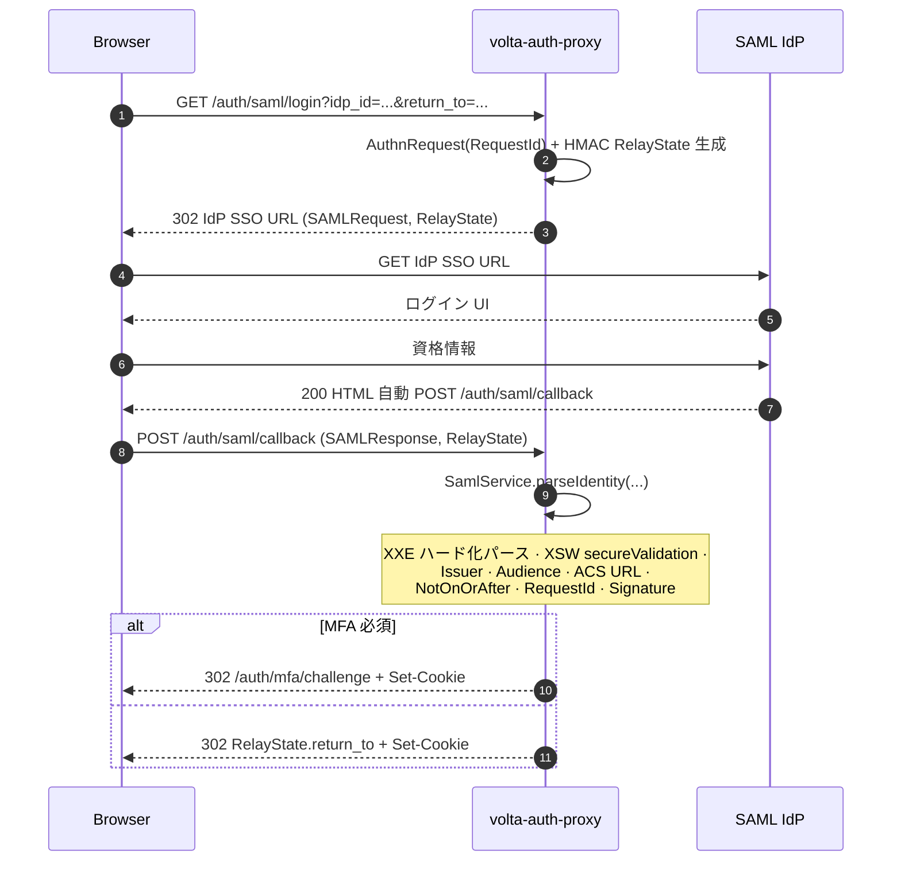
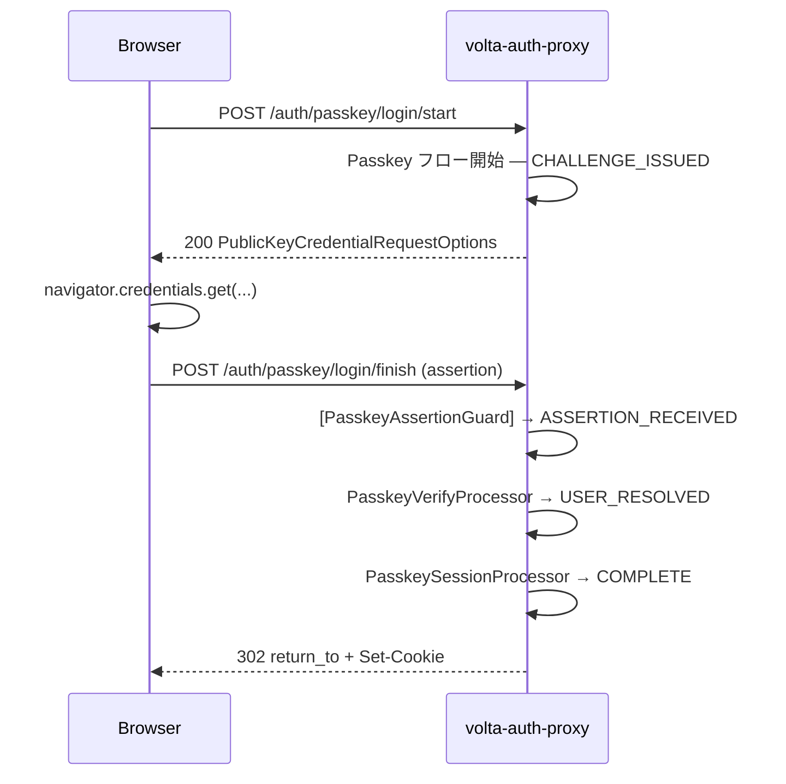
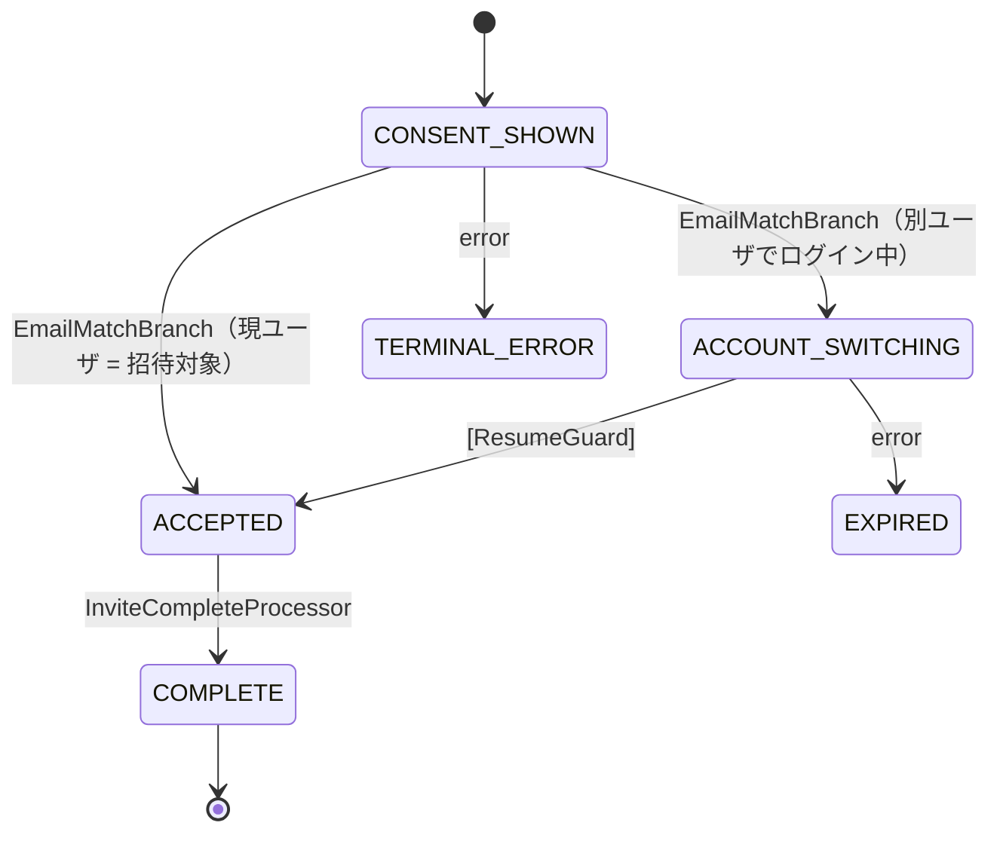

# 認証フロー

[English](auth-flows.md)

volta-auth-proxy が駆動する 4 つの主要フロー —— それぞれ tramli `FlowDefinition`
として定義され、状態・Processor・Guard はビルド時に検証される。

> ForwardAuth 入口の判定木は
> [architecture-ja.md § ForwardAuth 判定フロー](architecture-ja.md#forwardauth-判定フロー) を参照。

---

## 目次

- [OIDC](#oidc-google--microsoft--github-等)
- [SAML](#saml-エンタープライズ-sso)
- [MFA (TOTP)](#mfa-totp)
- [Passkey (WebAuthn)](#passkey-webauthn)
- [招待フロー](#招待フロー)
- [SAML XSW/XXE テストカバー状況](#saml-xswxxe-テストカバー状況)
- [ADR 相互参照](#adr-相互参照)

---

## OIDC (Google / Microsoft / GitHub 等)

### シーケンス

```mermaid
sequenceDiagram
    autonumber
    participant B as Browser
    participant T as Traefik
    participant V as volta-auth-proxy
    participant I as IdP (Google 等)

    B->>T: GET /app
    T->>V: ForwardAuth /auth/verify
    V-->>T: 302 /login?return_to=...
    T-->>B: 302
    B->>V: GET /login?start=1&provider=GOOGLE
    V->>V: OIDC フロー開始 (tramli) — state=REDIRECTED
    V-->>B: 302 IdP authorize URL (state, nonce, PKCE)
    B->>I: 認証
    I-->>B: 302 /auth/callback?code=...&state=...
    B->>V: GET /auth/callback
    V->>V: [OidcCallbackGuard] → TOKEN_EXCHANGED
    V->>I: code → トークン交換 (PKCE)
    I-->>V: id_token, access_token
    V->>V: UserResolve → RiskCheck → MfaBranch
    alt MFA 必須
      V->>V: issueSession(mfaVerifiedAt=null) ; auth_state=AUTHENTICATED_MFA_PENDING
      V-->>B: 302 /auth/mfa/challenge + Set-Cookie
    else MFA 不要
      V->>V: issueSession(mfaVerifiedAt=now) ; auth_state=FULLY_AUTHENTICATED
      V-->>B: 302 return_to + Set-Cookie
    end
```

### 状態図

[`docs/diagrams/flow-oidc.mmd`](diagrams/flow-oidc.mmd) 参照。

### 主要 Processor

| Processor | Requires | Produces |
|-----------|----------|----------|
| `OidcInitProcessor` | `OidcRequest` | `OidcRedirect` |
| `OidcCallbackGuard` | クエリパラメータ | `CALLBACK_RECEIVED` へのゲート |
| `OidcTokenExchangeProcessor` | `OidcCallback` | `OidcTokens` |
| `UserResolveProcessor` | `OidcTokens` | `ResolvedUser` |
| `RiskCheckProcessor` | `ResolvedUser` | `RiskResult` |
| `RiskAndMfaBranch` | `ResolvedUser`, `RiskResult` | → COMPLETE / COMPLETE_MFA_PENDING / BLOCKED |

---

## SAML (エンタープライズ SSO)

### シーケンス（SP-initiated, HTTP-POST バインディング）



### 期待される AuthnResponse 形状

```xml
<samlp:Response xmlns:samlp="urn:oasis:names:tc:SAML:2.0:protocol"
                xmlns:saml="urn:oasis:names:tc:SAML:2.0:assertion">
  <saml:Issuer>https://idp.example.com/issuer</saml:Issuer>
  <ds:Signature>...</ds:Signature>
  <saml:Assertion>
    <saml:Issuer>https://idp.example.com/issuer</saml:Issuer>
    <saml:Subject>
      <saml:NameID>user@example.com</saml:NameID>
      <saml:SubjectConfirmation>
        <saml:SubjectConfirmationData NotOnOrAfter="2026-04-19T13:00:00Z"
                                      Recipient="https://auth.example.com/auth/saml/callback"
                                      InResponseTo="{expectedRequestId}"/>
      </saml:SubjectConfirmation>
    </saml:Subject>
    <saml:Conditions>
      <saml:AudienceRestriction>
        <saml:Audience>volta-sp-audience</saml:Audience>
      </saml:AudienceRestriction>
    </saml:Conditions>
  </saml:Assertion>
</samlp:Response>
```

---

## MFA (TOTP)

### シーケンス

```mermaid
sequenceDiagram
    autonumber
    participant B as Browser
    participant V as volta-auth-proxy
    participant A as Authenticator app

    B->>V: GET /auth/mfa/challenge
    V->>V: MFA フロー開始 (tramli) — CHALLENGE_SHOWN
    V-->>B: 200 HTML コード入力
    A->>B: 6 桁コード（オフライン）
    B->>V: POST /auth/mfa/verify (code)
    V->>V: [MfaCodeGuard] → VERIFIED
    V->>V: session.mfaVerifiedAt = now ; auth_state=FULLY_AUTHENTICATED
    V-->>B: 302 return_to + Set-Cookie
```

### 状態図

[`docs/diagrams/flow-mfa.mmd`](diagrams/flow-mfa.mmd) 参照（4 状態）。

### 再検証ポイント（ADR-004）

| イベント | MFA 再検証必須？ |
|---------|----------------|
| セッション失効 → 再ログイン | はい |
| `/auth/switch-tenant` | **はい**（ADR-004） |
| 管理スコープへの step-up | はい（5 分スコープ） |
| 通常のページ遷移 | いいえ |

---

## Passkey (WebAuthn)

### 登録

```mermaid
sequenceDiagram
    autonumber
    participant B as Browser
    participant V as volta-auth-proxy

    B->>V: POST /auth/passkey/register/start
    V-->>B: 200 PublicKeyCredentialCreationOptions (challenge, rp, user, ...)
    B->>B: navigator.credentials.create(...)
    B->>V: POST /auth/passkey/register/finish (attestation)
    V->>V: Attestation 検証 (Yubico webauthn-server) ; クレデンシャル保存
    V-->>B: 200 { ok: true }
```

オーセンティケータ種別は登録時に選択可能（`0d17ce6`）。

### 認証



### 状態図

[`docs/diagrams/flow-passkey.mmd`](diagrams/flow-passkey.mmd) 参照。

---

## 招待フロー



TTL 7 日。version タグ付きでスキーマ変更後の期限切れトークンリプレイを防ぐ。

---

## SAML XSW/XXE テストカバー状況

`SamlService` は SAML 古典 2 大攻撃 —— **XML Signature Wrapping (XSW)** と
**XML External Entity (XXE)** —— に対して防御を実装する。現行テストスイートは
[`src/test/java/org/unlaxer/infra/volta/SamlServiceTest.java`](../src/test/java/org/unlaxer/infra/volta/SamlServiceTest.java)。

### カバレッジマトリクス

| 攻撃 / 観点 | `SamlService` の防御 | ユニットテスト | 状態 |
|-----------|-----------------------|---------------|-----|
| **XXE** — DOCTYPE インジェクション | `disallow-doctype-decl=true`, `FEATURE_SECURE_PROCESSING=true` | —（パーサで弾く） | **暗黙**（DOCTYPE はパーサ時点で拒絶されアサート経路なし） |
| **XXE** — 外部一般エンティティ | `external-general-entities=false` | — | **暗黙** |
| **XXE** — 外部パラメータエンティティ | `external-parameter-entities=false` | — | **暗黙** |
| **XXE** — 外部 DTD ロード | `ACCESS_EXTERNAL_DTD=""` | — | **暗黙** |
| **XXE** — 外部スキーマロード | `ACCESS_EXTERNAL_SCHEMA=""` | — | **暗黙** |
| **XSW** — 署名ラッピング | `secureValidation=true` + 単一 `<Signature>` のみ | — | **部分的**（プロパティは設定済み、明示的 XSW ペイロードテストなし） |
| **Signature 存在** | `skipSignature=true` 以外は必須 | `requiresSignatureWhenSkipDisabled` | カバー済み |
| **Signature 正当性** | `XMLSignature.validate(...)` | — | 欠落 —— 正/負の署名テスト追加推奨 |
| **Issuer 不一致** | `idp.issuer()` と比較 | `rejectsIssuerMismatch` | カバー済み |
| **Audience 不一致** | `idp.audience()` と比較 | — | 欠落 |
| **NotOnOrAfter 期限切れ** | `Instant.parse` + skew 窓 | — | 欠落 |
| **RequestId リプレイ** | `expectedRequestId` 強制 | — | 欠落 |
| **ACS URL 不一致** | `expectedAcsUrl` 比較 | — | 欠落 |
| **RelayState 往復** | HMAC JSON encode/decode | `encodesAndDecodesRelayState` | カバー済み |
| **MOCK 開発バイパス** | `DEV_MODE=true` + 非本番 `BASE_URL` | `parsesMockIdentityInDevMode` | カバー済み |
| **Happy path** | フルパース | `parsesSamlXmlIdentity` | カバー済み |

**サマリ**: 17 観点中 5 観点がユニットテストで覆われている。XXE はパーサ設定
レベルで**構造的に**無効化されている（DOCTYPE 付き XML はパーサ到達前に拒絶される
のでアサート可能なコード経路がない）。XSW は `secureValidation` が有効化済みだが、
ラップされた assertion を明示的に流し込むペイロードテストは未整備。audience /
NotOnOrAfter / RequestId / ACS URL の各チェックは本体コードには実装されているが、
テストでのアサートはまだ不足。

### バックログ

追補予定のギャップ:

- XSW ラップドアサーションペイロードテスト（署名範囲外に assertion を挿入する攻撃者パターン）
- Audience 不一致 負系テスト
- `NotOnOrAfter` クロックスキュー境界テスト（許容内 / 外）
- `InResponseTo` 不一致 負系テスト（`expectedRequestId`）
- ACS URL 不一致 負系テスト
- 実鍵ペアを用いた署名正系テスト

---

## ADR 相互参照

| フローの観点 | ADR |
|-------------|-----|
| LAN バイパス | [ADR-002](decisions/002-reject-trusted-network-bypass.md) → [ADR-003](decisions/003-accept-local-network-bypass.md) |
| テナント切替時 MFA | [ADR-004](decisions/004-accept-tenant-scoped-mfa.md) |
| フォーム状態復元 | [ADR-001](decisions/001-reject-form-state-restoration.md)（却下） |

あわせて [`docs/AUTH-STATE-MACHINE-SPEC.md`](AUTH-STATE-MACHINE-SPEC.md)（上層
Session SM 設計）と [`docs/AUTHENTICATION-SEQUENCES.md`](AUTHENTICATION-SEQUENCES.md)
（認証に初めて触れる読者向けの物語型ウォークスルー）も参照。
