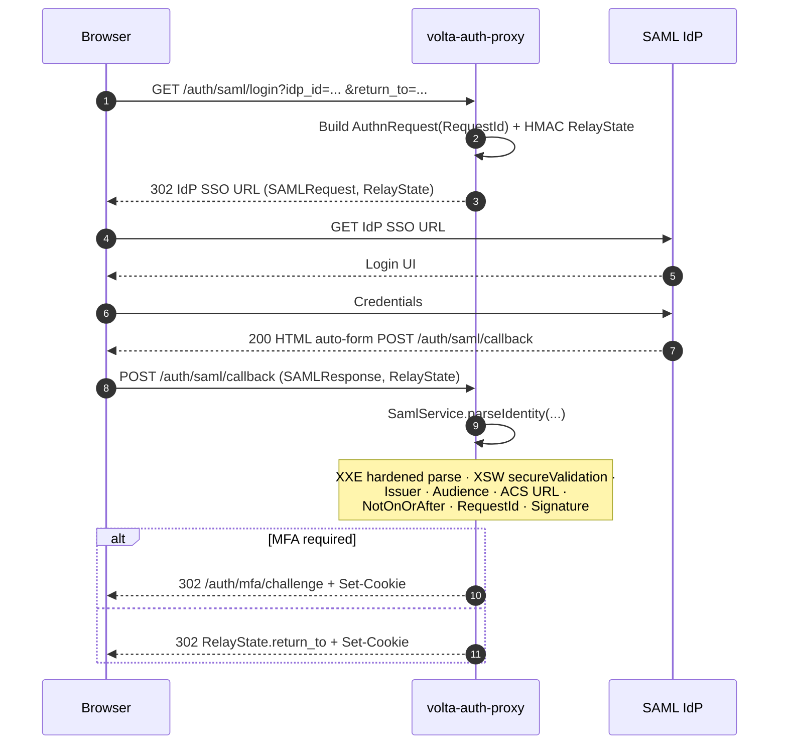
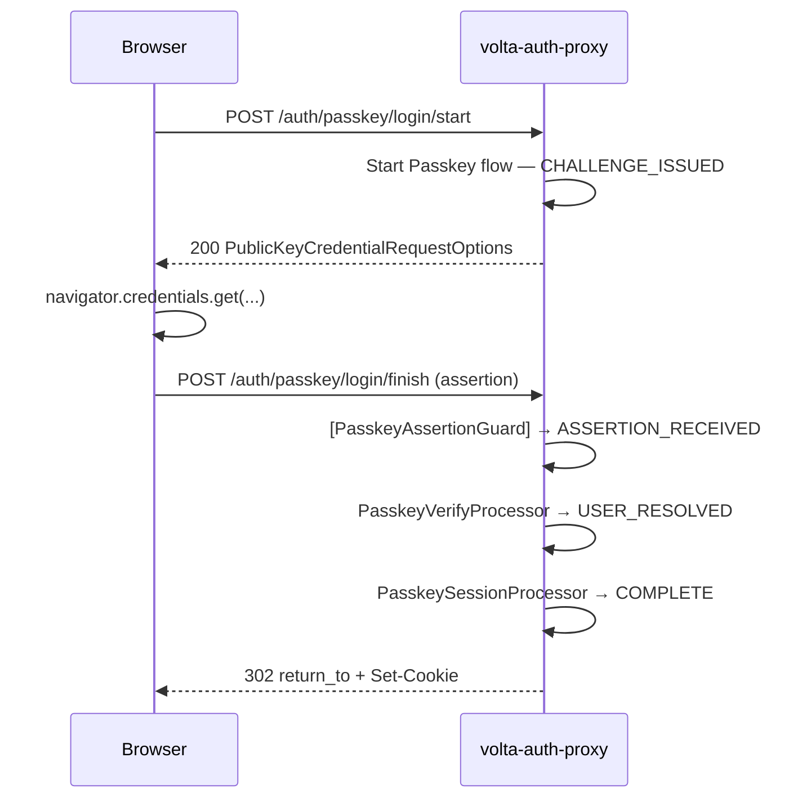
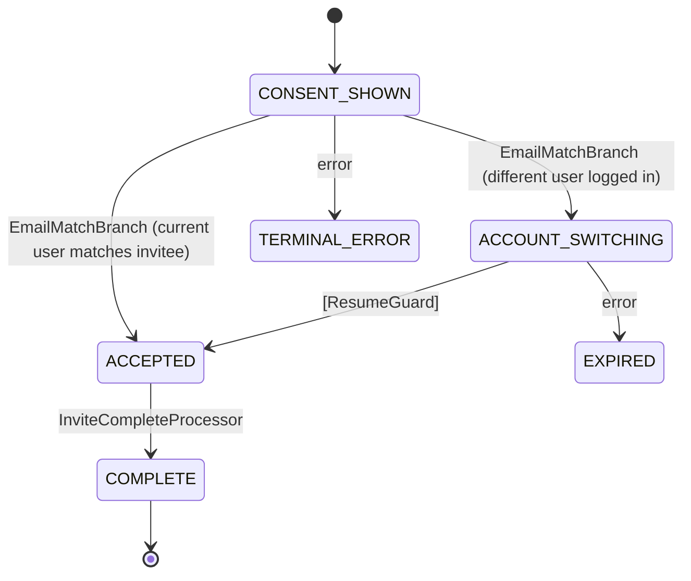

# Auth Flows

[日本語版 / Japanese](auth-flows-ja.md)

The four flows volta-auth-proxy drives — each backed by a tramli `FlowDefinition`
whose states, processors, and guards are verified at build time.

> For the higher-level decision tree (ForwardAuth entry point), see
> [architecture.md § ForwardAuth decision flow](architecture.md#forwardauth-decision-flow).

---

## Table of Contents

- [OIDC](#oidc-google--microsoft--github--etc)
- [SAML](#saml-enterprise-sso)
- [MFA (TOTP)](#mfa-totp)
- [Passkey (WebAuthn)](#passkey-webauthn)
- [Invitation flow](#invitation-flow)
- [SAML XSW/XXE test coverage](#saml-xswxxe-test-coverage)
- [ADR cross-reference](#adr-cross-reference)

---

## OIDC (Google / Microsoft / GitHub / etc)

### Sequence

```mermaid
sequenceDiagram
    autonumber
    participant B as Browser
    participant T as Traefik
    participant V as volta-auth-proxy
    participant I as IdP (Google etc)

    B->>T: GET /app
    T->>V: ForwardAuth /auth/verify
    V-->>T: 302 /login?return_to=...
    T-->>B: 302
    B->>V: GET /login?start=1&provider=GOOGLE
    V->>V: Start OIDC flow (tramli) — state=REDIRECTED
    V-->>B: 302 IdP authorize URL (state, nonce, PKCE)
    B->>I: Authenticate
    I-->>B: 302 /auth/callback?code=...&state=...
    B->>V: GET /auth/callback
    V->>V: [OidcCallbackGuard] → TOKEN_EXCHANGED
    V->>I: Exchange code → tokens (PKCE)
    I-->>V: id_token, access_token
    V->>V: UserResolve → RiskCheck → MfaBranch
    alt MFA required
      V->>V: issueSession(mfaVerifiedAt=null) ; auth_state=AUTHENTICATED_MFA_PENDING
      V-->>B: 302 /auth/mfa/challenge + Set-Cookie
    else no MFA
      V->>V: issueSession(mfaVerifiedAt=now) ; auth_state=FULLY_AUTHENTICATED
      V-->>B: 302 return_to + Set-Cookie
    end
```

### State diagram

See [`docs/diagrams/flow-oidc.mmd`](diagrams/flow-oidc.mmd).

### Key processors

| Processor | Requires | Produces |
|-----------|----------|----------|
| `OidcInitProcessor` | `OidcRequest` | `OidcRedirect` |
| `OidcCallbackGuard` | query params | gate to `CALLBACK_RECEIVED` |
| `OidcTokenExchangeProcessor` | `OidcCallback` | `OidcTokens` |
| `UserResolveProcessor` | `OidcTokens` | `ResolvedUser` |
| `RiskCheckProcessor` | `ResolvedUser` | `RiskResult` |
| `RiskAndMfaBranch` | `ResolvedUser`, `RiskResult` | → COMPLETE / COMPLETE_MFA_PENDING / BLOCKED |

---

## SAML (Enterprise SSO)

### Sequence (SP-initiated, HTTP-POST binding)



### Expected AuthnResponse shape

```xml
<samlp:Response xmlns:samlp="urn:oasis:names:tc:SAML:2.0:protocol"
                xmlns:saml="urn:oasis:names:tc:SAML:2.0:assertion">
  <saml:Issuer>https://idp.example.com/issuer</saml:Issuer>
  <ds:Signature>...</ds:Signature>
  <saml:Assertion>
    <saml:Issuer>https://idp.example.com/issuer</saml:Issuer>
    <saml:Subject>
      <saml:NameID>user@example.com</saml:NameID>
      <saml:SubjectConfirmation>
        <saml:SubjectConfirmationData NotOnOrAfter="2026-04-19T13:00:00Z"
                                      Recipient="https://auth.example.com/auth/saml/callback"
                                      InResponseTo="{expectedRequestId}"/>
      </saml:SubjectConfirmation>
    </saml:Subject>
    <saml:Conditions>
      <saml:AudienceRestriction>
        <saml:Audience>volta-sp-audience</saml:Audience>
      </saml:AudienceRestriction>
    </saml:Conditions>
  </saml:Assertion>
</samlp:Response>
```

---

## MFA (TOTP)

### Sequence

```mermaid
sequenceDiagram
    autonumber
    participant B as Browser
    participant V as volta-auth-proxy
    participant A as Authenticator app

    B->>V: GET /auth/mfa/challenge
    V->>V: Start MFA flow (tramli) — CHALLENGE_SHOWN
    V-->>B: 200 HTML code input
    A->>B: 6-digit code (offline)
    B->>V: POST /auth/mfa/verify (code)
    V->>V: [MfaCodeGuard] → VERIFIED
    V->>V: session.mfaVerifiedAt = now ; auth_state=FULLY_AUTHENTICATED
    V-->>B: 302 return_to + Set-Cookie
```

### State diagram

See [`docs/diagrams/flow-mfa.mmd`](diagrams/flow-mfa.mmd) (4 states).

### Re-verification points (ADR-004)

| Event | Requires fresh MFA? |
|-------|---------------------|
| Session expiry → re-login | yes |
| `/auth/switch-tenant` | **yes** (ADR-004) |
| Step-up to admin scope | yes (5-minute scope) |
| Regular page navigation | no |

---

## Passkey (WebAuthn)

### Registration

```mermaid
sequenceDiagram
    autonumber
    participant B as Browser
    participant V as volta-auth-proxy

    B->>V: POST /auth/passkey/register/start
    V-->>B: 200 PublicKeyCredentialCreationOptions (challenge, rp, user, ...)
    B->>B: navigator.credentials.create(...)
    B->>V: POST /auth/passkey/register/finish (attestation)
    V->>V: Verify attestation (Yubico webauthn-server) ; store credential
    V-->>B: 200 { ok: true }
```

Authenticator type is selectable at registration time (`0d17ce6`).

### Authentication



### State diagram

See [`docs/diagrams/flow-passkey.mmd`](diagrams/flow-passkey.mmd).

---

## Invitation flow



7-day TTL. Version-tagged so expired tokens cannot be replayed after schema changes.

---

## SAML XSW/XXE test coverage

`SamlService` hardens every assertion against the two classic SAML attack families:
**XML Signature Wrapping (XSW)** and **XML External Entity (XXE)**. The current test
suite lives at
[`src/test/java/org/unlaxer/infra/volta/SamlServiceTest.java`](../src/test/java/org/unlaxer/infra/volta/SamlServiceTest.java).

### Coverage matrix

| Attack / Concern | Defence in `SamlService` | Unit test | Status |
|------------------|--------------------------|-----------|--------|
| **XXE** — DOCTYPE injection | `disallow-doctype-decl=true`, `FEATURE_SECURE_PROCESSING=true` | — (disabled at parser) | **implicit** (parser rejects DOCTYPE, no code path) |
| **XXE** — external general entities | `external-general-entities=false` | — | **implicit** |
| **XXE** — external parameter entities | `external-parameter-entities=false` | — | **implicit** |
| **XXE** — external DTD load | `ACCESS_EXTERNAL_DTD=""` | — | **implicit** |
| **XXE** — external schema load | `ACCESS_EXTERNAL_SCHEMA=""` | — | **implicit** |
| **XSW** — signature wrapping | `secureValidation=true` + single `<Signature>` | — | **partial** (property set; no explicit XSW payload) |
| **Signature present** | Required unless `skipSignature=true` | `requiresSignatureWhenSkipDisabled` | covered |
| **Signature valid** | `XMLSignature.validate(...)` | — | gap — add positive/negative signature tests |
| **Issuer mismatch** | Compared to `idp.issuer()` | `rejectsIssuerMismatch` | covered |
| **Audience mismatch** | Compared to `idp.audience()` | — | gap — add test |
| **NotOnOrAfter expiry** | `Instant.parse` + skew window | — | gap |
| **RequestId replay** | `expectedRequestId` enforced | — | gap |
| **ACS URL mismatch** | `expectedAcsUrl` comparison | — | gap |
| **RelayState round-trip** | HMAC JSON encode/decode | `encodesAndDecodesRelayState` | covered |
| **MOCK dev bypass** | `DEV_MODE=true` + non-prod `BASE_URL` | `parsesMockIdentityInDevMode` | covered |
| **Happy path** | Full parse | `parsesSamlXmlIdentity` | covered |

**Summary**: 5 of 17 concerns are covered by unit tests today. XXE is neutralised
*structurally* at parser configuration (a positive test would require DTD-bearing
XML, which the parser rejects before reaching assertable code). XSW has
`secureValidation` enabled but lacks an explicit wrapped-assertion payload test;
the surrounding audience / NotOnOrAfter / RequestId / ACS binding checks are
implemented in code but not yet asserted by tests.

### Backlog

Tracked gaps for follow-up:

- XSW wrapped-assertion payload test (attacker injects assertion outside signed scope)
- Audience mismatch negative test
- `NotOnOrAfter` clock-skew boundary tests (within / beyond tolerance)
- `InResponseTo` mismatch negative test (`expectedRequestId`)
- ACS URL mismatch negative test
- Positive signature validation with a real fixture keypair

---

## ADR cross-reference

| Flow concern | ADR |
|--------------|-----|
| LAN bypass | [ADR-002](decisions/002-reject-trusted-network-bypass.md) → [ADR-003](decisions/003-accept-local-network-bypass.md) |
| MFA on tenant switch | [ADR-004](decisions/004-accept-tenant-scoped-mfa.md) |
| Form state restoration | [ADR-001](decisions/001-reject-form-state-restoration.md) (rejected) |

See also [`docs/AUTH-STATE-MACHINE-SPEC.md`](AUTH-STATE-MACHINE-SPEC.md) for the
upper-layer Session SM design and
[`docs/AUTHENTICATION-SEQUENCES.md`](AUTHENTICATION-SEQUENCES.md) for the full
narrative walkthrough aimed at readers new to authentication.
