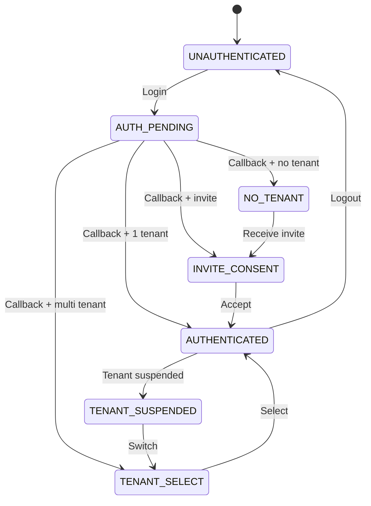

# volta-auth-proxy DSL 概要

[English](dsl-overview.md) | [日本語](dsl-overview.ja.md)

> volta [DSL](glossary/dsl.md) は認証動作の **唯一の真実の源 ([single source of truth](glossary/single-source-of-truth.md))**。
> 実装はドライバー。[DSL](glossary/dsl.ja.md) が仕様。

***

## volta DSL とは？

volta-auth-proxy は全ての認証動作を 4 つの [YAML](glossary/yaml.ja.md) ファイルで定義します。ロジックをコード・設定・ドキュメントに散らばらせません。

```
DSL（仕様）  →  Java コード（実装）
             →  テスト（DSL から自動生成）
             →  Mermaid 図（ドキュメント）
             →  ポリシーエンジンドライバー（Phase 4）
```

[DSL](glossary/dsl.md) は [DGE](../dge/sessions/) セッション（106 Gap 発見・解決）で設計され、3 回の tribunal review を経て最終スコア 10/10 を獲得しました。

### DSL と実装の関係

[DSL](glossary/dsl.md) は [Java](glossary/java.md) コードを置き換えるものではありません。並走します:

```
現状:
  DSL (YAML) = 仕様（何が起きるべきか）
  Java コード = 実装（何が起きているか）
  人間 / AI  = 両方を読んで整合性を確認

目標ではないもの（少なくとも今は）:
  DSL → Java コード自動生成
  DSL → ランタイムで直接実行
```

**なぜ自動生成や直接実行をしないのか？**

1. **[Java](glossary/java.md) コードは動いている。** Phase 1-4 実装済み、テスト通過。壊す理由がない
2. **[DSL](glossary/dsl.md) [ランタイム](glossary/runtime.ja.md)がまだ存在しない。** 作ること自体が 1 プロジェクト
3. **[DSL](glossary/dsl.md) の目的は仕様であり実行ではない。** tribunal review で確定: 3 つの目的は AI 仕様伝達・テスト生成・ドキュメント生成。[ランタイム](glossary/runtime.ja.md)実行ではない
4. **「制御しやすいは正義」** [DSL](glossary/dsl.md) [ランタイム](glossary/runtime.ja.md)層を挟むと[デバッグ](glossary/debugging.ja.md)が 2 箇所に。今は [Java](glossary/java.md) だけ見ればいい

**今の [DSL](glossary/dsl.md) の価値:**

- AI（Codex, Claude）が読んで正確なコードを生成するための仕様
- 全認証状態・遷移・ガード・エラーの唯一の定義場所
- テストケースの自動生成基盤（将来: 全状態遷移をカバー）
- ドキュメントの自動生成（[mermaid](glossary/mermaid.md) 図、エラーテーブル）
- Phase 4 ポリシーエンジンドライバー生成の基盤（[jCasbin](glossary/jcasbin.ja.md) model.conf）

### ロードマップ: DSL の活用段階

```
今:       DSL = 仕様。Java = 手書き。人間/AI が整合性を確認。
Phase 2:  DSL validator が CI で Java ↔ DSL 整合性チェック。
Phase 3:  DSL からテストケース自動生成（全状態遷移カバー）。
Phase 4:  DSL からポリシーエンジンドライバー生成（jCasbin model.conf）。
将来:     DSL ランタイム（必要になったら。YAGNI）。
```

***

## DSL ファイル

| ファイル | 目的 | バージョン |
|---------|------|-----------|
| [`dsl/auth-machine.yaml`](../dsl/auth-machine.yaml) | 状態マシン — 8 状態、全遷移、ガード、アクション、エラー | v3.2 |
| [`dsl/protocol.yaml`](../dsl/protocol.yaml) | App との契約 — [ForwardAuth](glossary/forwardauth.ja.md) ヘッダ、[JWT](glossary/jwt.ja.md) 仕様、[API](glossary/api.ja.md) [エンドポイント](glossary/endpoint.ja.md)、データモデル | v2 |
| [`dsl/policy.yaml`](../dsl/policy.yaml) | 認可 — [ロール](glossary/role.ja.md)階層、権限、制約、[テナント](glossary/tenant.ja.md)分離、[レート制限](glossary/rate-limiting.ja.md)、[CSRF](glossary/csrf.ja.md)、監査 | v1 |
| [`dsl/errors.yaml`](../dsl/errors.yaml) | エラーレジストリ — 全エラーコード、メッセージ（en/ja）、リカバリーアクション | v2 |

### Phase 2-4 拡張

| ファイル | 目的 |
|---------|------|
| [`dsl/auth-machine-phase2-4.yaml`](../dsl/auth-machine-phase2-4.yaml) | 追加状態: [MFA](glossary/mfa.ja.md), [SAML](glossary/sso.ja.md), [M2M](glossary/m2m.md), [Webhook](glossary/webhook.md) |
| [`dsl/volta-config.schema.yaml`](../dsl/volta-config.schema.yaml) | volta-config.[yaml](glossary/yaml.md) の [JSON](glossary/json.ja.md) [Schema](glossary/schema.md) バリデーション |

***

## 状態マシン (auth-machine.yaml)

8 つの状態がユーザーのあらゆる状態を定義:



### ガード式（CEL ライク構文）

```yaml
guard: "session.valid && tenant.active && membership.role in ['ADMIN', 'OWNER']"
```

演算子: `&&`, `||`, `!`, `==`, `!=`, `>`, `<`, `>=`, `<=`, `in`
[テンプレート](glossary/template.ja.md)式: `"{request.return_to || config.default_app_url}"`（`||` = coalesce）

### 遷移の優先順位

同一トリガーの遷移は `priority`（小さい番号が先）で評価:

```yaml
callback_error:            { priority: 1 }  # エラーを先にチェック
callback_state_invalid:    { priority: 2 }
callback_nonce_invalid:    { priority: 3 }
callback_email_unverified: { priority: 4 }
callback_success:          { priority: 5 }  # 成功は最後
```

### グローバル遷移

[ログアウト](glossary/logout.ja.md)とセッション切れは全認証済み状態に適用:

```yaml
global_transitions:
  logout:
    from_except: [UNAUTHENTICATED, AUTH_PENDING]
    next: UNAUTHENTICATED
  session_timeout:
    from_except: [UNAUTHENTICATED]
    next: UNAUTHENTICATED
```

### 不変条件

[DSL](glossary/dsl.md) が保証する形式的性質:

```yaml
invariants:
  - no_deadlock: "全非終端状態に到達可能な出口遷移がある"
  - reachable_auth: "任意の状態から AUTHENTICATED or UNAUTHENTICATED へのパスが存在"
  - logout_always_possible: "全認証済み状態からログアウトが到達可能"
  - no_undefined_refs: "全ての next 値が定義済み状態を参照"
  - error_codes_defined: "使用される全エラーコードが errors.yaml に存在"
```

***

## プロトコル (protocol.yaml)

volta-auth-proxy と[下流 App](glossary/downstream-app.ja.md) の契約を定義:

### ForwardAuth ヘッダ

```
X-Volta-User-Id:      uuid
X-Volta-Email:        email
X-Volta-Tenant-Id:    uuid
X-Volta-Tenant-Slug:  string
X-Volta-Roles:        カンマ区切り
X-Volta-Display-Name: string（オプション）
X-Volta-JWT:          署名付き RS256 JWT
X-Volta-App-Id:       string（オプション）
```

### JWT Claims

```json
{
  "iss": "volta-auth",
  "aud": ["volta-apps"],
  "sub": "user-uuid",
  "volta_v": 1,
  "volta_tid": "tenant-uuid",
  "volta_tname": "ACME Corp",
  "volta_tslug": "acme",
  "volta_roles": ["ADMIN"]
}
```

### Internal API

App 委譲用の 17 [エンドポイント](glossary/endpoint.ja.md)。全仕様は [protocol.yaml](../dsl/protocol.yaml) を参照。

***

## ポリシー (policy.yaml)

### ロール階層

```
OWNER > ADMIN > MEMBER > VIEWER
```

### 制約

```yaml
constraints:
  - last_owner: "テナントには最低 1 人の OWNER が必要"
  - promote_limit: "自分より上のロールには昇格不可"
  - max_tenants: ユーザーあたり 10
  - max_members: テナントあたり 50
  - concurrent_sessions: ユーザーあたり 5
```

### テナント分離

```yaml
tenant_isolation:
  - path_jwt_match: "API パスの tenantId と JWT の volta_tid が一致必須"
  - session_tenant_bound: "セッションは 1 テナントに紐付く"
  - member_visibility: "自分のテナントのメンバーのみ閲覧可"
```

***

## ポリシーエンジン ドライバー戦略

volta [DSL](glossary/dsl.md) は常に**マスター**。評価エンジンは**ドライバー** — [Interface](glossary/interface-extension-point.ja.md) で差し替え可能:

```java
interface PolicyEvaluator {
    boolean evaluate(PolicyRequest request);
}
```

| Phase | ドライバー | 種別 | 依存 |
|-------|-----------|------|------|
| **Phase 1-3** | `JavaPolicyEvaluator` | Pure [Java](glossary/java.md) 直接評価 | なし |
| **Phase 4 案 A** | `CasbinPolicyEvaluator` | [jCasbin](https://github.com/casbin/jcasbin) | Pure [Java](glossary/java.ja.md), [Maven](glossary/maven.md) Central |
| **Phase 4 案 B** | `CedarPolicyEvaluator` | [Cedar Java](https://github.com/cedar-policy/cedar-java) | JNI (Rust ネイティブ) |
| **Phase 4 案 C** | `OpaPolicyEvaluator` | [OPA](https://www.openpolicyagent.org/) サイドカー | 別[プロセス](glossary/process.ja.md) (Go) |

### DSL → ドライバー変換

```
volta policy.yaml
    ↓
    ├── Phase 1-3: Java コード（AuthService.java の if/switch）
    ├── Phase 4A:  → model.conf + policy.csv → jCasbin
    ├── Phase 4B:  → Cedar ポリシー言語 → cedar-java (JNI)
    └── Phase 4C:  → Rego → OPA サーバー (HTTP)
```

### ドライバー比較

| | [jCasbin](glossary/jcasbin.ja.md) | Cedar [Java](glossary/java.md) | [OPA](glossary/opa.md) サイドカー |
|---|---|---|---|
| **Pure [Java](glossary/java.ja.md)** | はい | いいえ (JNI) | いいえ ([HTTP](glossary/http.ja.md)) |
| **追加インフラ** | なし | なし | [OPA](glossary/opa.ja.md) [プロセス](glossary/process.ja.md) |
| **性能** | マイクロ秒 | マイクロ秒 | 1-5ms (HTTP) |
| **[RBAC](glossary/rbac.ja.md)** | はい | はい | はい |
| **[ABAC](glossary/abac.ja.md)** | はい | はい | はい |
| **Deny ルール** | はい | はい（第一級） | はい |
| **volta 哲学との適合** | 最高 | 良い | 低い |
| **成熟度** | CNCF Incubating | AWS 本番 | CNCF Graduated |

**Phase 4 推奨: [jCasbin](glossary/jcasbin.ja.md)** — Pure [Java](glossary/java.md)、追加インフラなし、「密結合上等」哲学に合致。

***

## DSL バリデーター

[バリデーター仕様書](dsl-validator-spec.md)で 60+ のチェックを 5 カテゴリで定義:

1. **構造** — ファイルごとの[スキーマ](glossary/schema.ja.md)[検証](glossary/verification.ja.md)
2. **ファイル間参照** — errors.[yaml](glossary/yaml.md) が唯一の定義場所
3. **状態マシン不変条件** — 到達可能性、デッドロック、優先順位
4. **ガード式** — [変数](glossary/variable.ja.md)解決、構文[検証](glossary/verification.ja.md)
5. **完全性** — 監査イベント、コンテキスト使用、エラーコード網羅

***

## フロー図

全状態遷移は [ui-flow.md](../dge/specs/ui-flow.md) で [mermaid](glossary/mermaid.md) により可視化:

- [ユーザー状態モデル](../dge/specs/ui-flow.md#user-state-model)
- [招待 → 初回ログイン](../dge/specs/ui-flow.md#flow-1-invite-link---first-login)
- [ForwardAuth フロー](../dge/specs/ui-flow.md#flow-2-returning-user---session-valid)
- [全画面遷移図](../dge/specs/ui-flow.md#full-screen-transition-map)
- [エラーリカバリー](../dge/specs/ui-flow.md#error-recovery-flow)
