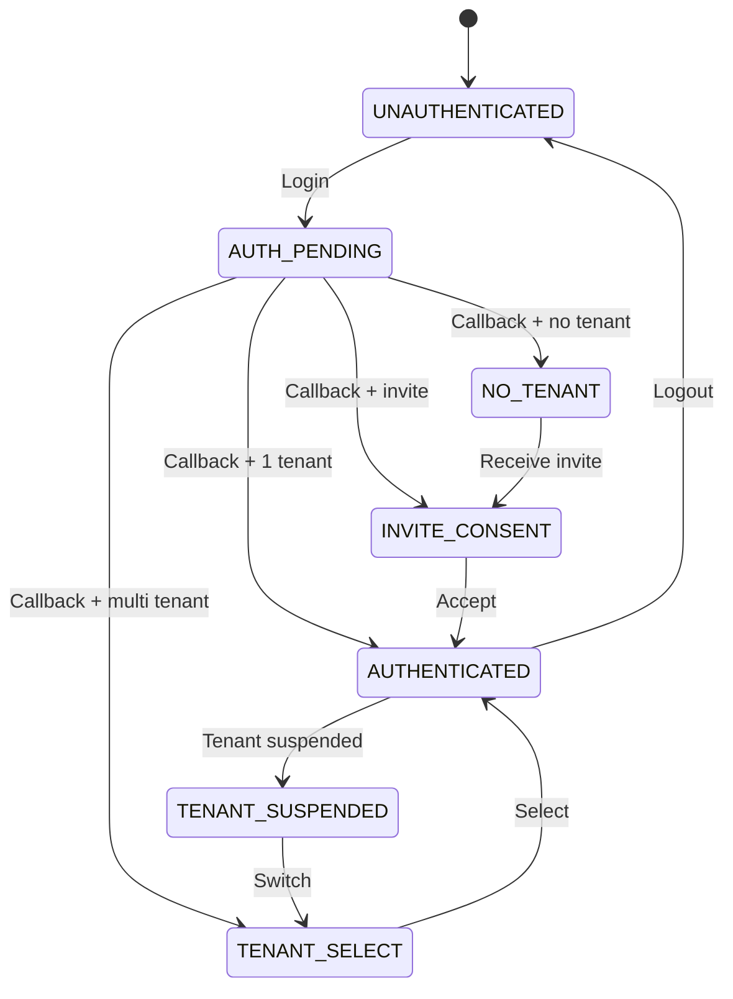

# volta-auth-proxy DSL Overview

[English](dsl-overview.md) | [日本語](dsl-overview.ja.md)

> volta [DSL](glossary/dsl.md) is the **[single source of truth](glossary/single-source-of-truth.md)** for auth behavior.
> Implementation is a driver. DSL is the specification.

***

## What is the volta DSL?

volta-auth-proxy defines all authentication behavior in 4 YAML files instead of scattering logic across code, config, and documentation.

```
DSL (specification)  →  Java code (implementation)
                     →  Tests (auto-generated from DSL)
                     →  Mermaid diagrams (documentation)
                     →  Policy engine driver (Phase 4)
```

The [DSL](glossary/dsl.md) was designed through [DGE](../dge/sessions/) [session](glossary/session.md)s (106 gaps found and resolved) and refined through 3 rounds of tribunal reviews (final score: 10/10).

### DSL and Implementation: the relationship

The [DSL](glossary/dsl.md) does NOT replace [Java](glossary/java.md) code. They run in parallel:

```
Current:
  DSL (YAML) = specification (what SHOULD happen)
  Java code  = implementation (what DOES happen)
  Humans/AI  = read both and verify they match

NOT the goal (at least not now):
  DSL → auto-generates Java code
  DSL → runtime engine executes directly
```

**Why not auto-generate or execute directly?**

1. **The [Java](glossary/java.md) code works.** Phase 1-4 implemented, tests pass. No reason to break it.
2. **[DSL](glossary/dsl.md) [runtime](glossary/runtime.md) doesn't exist yet.** [Build](glossary/build.md)ing one is a project in itself.
3. **[DSL](glossary/dsl.md)'s purpose is specification, not execution.** Confirmed by tribunal review: the 3 goals are AI specification, test generation, and documentation — not [runtime](glossary/runtime.md) execution.
4. **"Control is king."** Adding a [DSL](glossary/dsl.md) [runtime](glossary/runtime.md) layer means [debugging](glossary/debugging.md) in 2 places (DSL + [Java](glossary/java.md)). Right now you debug Java only. Simpler.

**What the [DSL](glossary/dsl.md) IS good for right now:**

- Specification that AI (Codex, Claude) can read to generate correct code
- Source of truth for all auth [state](glossary/state.md)s, [transition](glossary/transition.md)s, [guard](glossary/guard.md)s, errors
- Auto-generation of test cases (future: all [state](glossary/state.md) [transition](glossary/transition.md)s as test scenarios)
- Auto-generation of documentation ([mermaid](glossary/mermaid.md) diagrams, error tables)
- Foundation for Phase 4 [policy engine](glossary/policy-engine.md) driver generation (jCasbin model.conf)

### Roadmap: DSL usage over time

```
Now:       DSL = spec. Java = hand-written. Human/AI verifies match.
Phase 2:   DSL validator checks Java ↔ DSL consistency in CI.
Phase 3:   DSL generates test cases (all state transitions covered).
Phase 4:   DSL generates policy engine driver (jCasbin model.conf).
Future:    DSL runtime (if ever needed — YAGNI until then).
```

***

## DSL Files

| File | Purpose | Version |
|------|---------|---------|
| [`dsl/auth-machine.yaml`](../dsl/auth-machine.yaml) | [State machine](glossary/state-machine.md) — 8 [state](glossary/state.md)s, all [transition](glossary/transition.md)s, [guard](glossary/guard.md)s, actions, errors | v3.2 |
| [`dsl/protocol.yaml`](../dsl/protocol.yaml) | App contract — [ForwardAuth](glossary/forwardauth.md) [header](glossary/header.md)s, [JWT](glossary/jwt.md) spec, [API](glossary/api.md) [endpoint](glossary/endpoint.md)s, data models | v2 |
| [`dsl/policy.yaml`](../dsl/policy.yaml) | Authorization — [role](glossary/role.md) [hierarchy](glossary/hierarchy.md), permissions, constraints, [tenant](glossary/tenant.md) isolation, [rate limiting](glossary/rate-limiting.md), [CSRF](glossary/csrf.md), audit | v1 |
| [`dsl/errors.yaml`](../dsl/errors.yaml) | Error registry — all error codes, messages (en/ja), recovery actions. [Single source of truth](glossary/single-source-of-truth.md) | v2 |

### Phase 2-4 extensions

| File | Purpose |
|------|---------|
| [`dsl/auth-machine-phase2-4.yaml`](../dsl/auth-machine-phase2-4.yaml) | Additional [state](glossary/state.md)s: [MFA](glossary/mfa.md), [SAML](glossary/sso.md), [M2M](glossary/m2m.md), [Webhook](glossary/webhook.md)s |
| [`dsl/volta-config.schema.yaml`](../dsl/volta-config.schema.yaml) | JSON [Schema](glossary/schema.md) for volta-config.[yaml](glossary/yaml.md) validation |

***

## State Machine (auth-machine.yaml)

8 [state](glossary/state.md)s define every possible user condition:



### Guard expressions (CEL-like syntax)

```yaml
guard: "session.valid && tenant.active && membership.role in ['ADMIN', 'OWNER']"
```

Operators: `&&`, `||`, `!`, `==`, `!=`, `>`, `<`, `>=`, `<=`, `in`
[Template](glossary/template.md) expressions: `"{request.return_to || config.default_app_url}"` (`||` = coalesce)

### Transition priority

Same-trigger [transition](glossary/transition.md)s are evaluated by `priority` (lowest number first):

```yaml
callback_error:          { priority: 1 }  # Check errors first
callback_state_invalid:  { priority: 2 }
callback_nonce_invalid:  { priority: 3 }
callback_email_unverified: { priority: 4 }
callback_success:        { priority: 5 }  # Success last
```

### Global transitions

[Logout](glossary/logout.md) and [session](glossary/session.md) timeout apply to all authenticated [state](glossary/state.md)s:

```yaml
global_transitions:
  logout:
    from_except: [UNAUTHENTICATED, AUTH_PENDING]
    next: UNAUTHENTICATED
  session_timeout:
    from_except: [UNAUTHENTICATED]
    next: UNAUTHENTICATED
```

### Invariants

Formal properties guaranteed by the [DSL](glossary/dsl.md):

```yaml
invariants:
  - no_deadlock: "Every non-terminal state has at least one reachable outgoing transition"
  - reachable_auth: "From any state, there exists a path to AUTHENTICATED or UNAUTHENTICATED"
  - logout_always_possible: "From any authenticated state, logout is reachable"
  - no_undefined_refs: "Every 'next' value references a defined state"
  - error_codes_defined: "Every error code used exists in errors.yaml"
```

***

## Protocol (protocol.yaml)

Defines the contract between volta-auth-proxy and downstream [Apps](glossary/downstream-app.md):

### ForwardAuth headers

```
X-Volta-User-Id:      uuid
X-Volta-Email:        email
X-Volta-Tenant-Id:    uuid
X-Volta-Tenant-Slug:  string
X-Volta-Roles:        comma-separated
X-Volta-Display-Name: string (optional)
X-Volta-JWT:          signed RS256 JWT
X-Volta-App-Id:       string (optional)
```

### JWT claims

```json
{
  "iss": "volta-auth",
  "aud": ["volta-apps"],
  "sub": "user-uuid",
  "volta_v": 1,
  "volta_tid": "tenant-uuid",
  "volta_tname": "ACME Corp",
  "volta_tslug": "acme",
  "volta_roles": ["ADMIN"]
}
```

### Internal API

17 [endpoint](glossary/endpoint.md)s for app [delegation](glossary/delegation.md). See [protocol.yaml](../dsl/protocol.yaml) for full spec.

***

## Policy (policy.yaml)

### Role hierarchy

```
OWNER > ADMIN > MEMBER > VIEWER
```

### Constraints

```yaml
constraints:
  - last_owner: "A tenant MUST have at least one OWNER"
  - promote_limit: "Cannot promote above own role"
  - max_tenants: 10 per user
  - max_members: 50 per tenant
  - concurrent_sessions: 5 per user
```

### Tenant isolation

```yaml
tenant_isolation:
  - path_jwt_match: "API path {tenantId} MUST equal JWT volta_tid"
  - session_tenant_bound: "Session bound to exactly one tenant"
  - member_visibility: "Can only see members of own tenants"
```

***

## Policy Engine Driver Strategy

volta [DSL](glossary/dsl.md) is always the **master**. The evaluation engine is a **driver** — swappable via [Interface](glossary/interface-extension-point.md):

```java
interface PolicyEvaluator {
    boolean evaluate(PolicyRequest request);
}
```

| Phase | Driver | Type | [Dependencies](glossary/dependencies.md) |
|-------|--------|------|-------------|
| **Phase 1-3** | `JavaPolicyEvaluator` | Pure [Java](glossary/java.md), direct evaluation | None |
| **Phase 4 Option A** | `CasbinPolicyEvaluator` | [jCasbin](https://github.com/casbin/jcasbin) | Pure Java, [Maven](glossary/maven.md) Central |
| **Phase 4 Option B** | `CedarPolicyEvaluator` | [Cedar Java](https://github.com/cedar-policy/cedar-java) | JNI (Rust native) |
| **Phase 4 Option C** | `OpaPolicyEvaluator` | [OPA](https://www.openpolicyagent.org/) sidecar | Separate [process](glossary/process.md) (Go) |

### DSL → Driver conversion

```
volta policy.yaml
    ↓
    ├── Phase 1-3: Java code (if/switch in AuthService.java)
    ├── Phase 4A:  → model.conf + policy.csv → jCasbin
    ├── Phase 4B:  → Cedar policy language → cedar-java (JNI)
    └── Phase 4C:  → Rego → OPA server (HTTP)
```

### Driver comparison

| | jCasbin | Cedar [Java](glossary/java.md) | [OPA](glossary/opa.md) Sidecar |
|---|---|---|---|
| **Pure Java** | Yes | No (JNI) | No (HTTP) |
| **Extra infra** | None | None | OPA [process](glossary/process.md) |
| **Performance** | Microseconds | Microseconds | 1-5ms (HTTP) |
| **RBAC** | Yes | Yes | Yes |
| **ABAC** | Yes | Yes | Yes |
| **Deny rules** | Yes | Yes (first-class) | Yes |
| **Dynamic reload** | Yes (DB adapter) | No | Yes (bundle) |
| **volta philosophy match** | Best | Good | Least |
| **Maturity** | CNCF Incubating | AWS [production](glossary/production.md) | CNCF Graduated |

**Recommended for Phase 4: jCasbin** — Pure [Java](glossary/java.md), no extra infrastructure, aligns with "tight coupling" philosophy.

***

## DSL Validator

A [validator specification](dsl-validator-spec.md) defines 60+ checks across 5 categories:

1. **Structural** — per-file [schema](glossary/schema.md) validation
2. **Cross-file references** — errors.[yaml](glossary/yaml.md) as [single source of truth](glossary/single-source-of-truth.md)
3. **[State machine](glossary/state-machine.md) [invariant](glossary/invariant.md)s** — reachability, deadlock, priority
4. **[Guard](glossary/guard.md) expressions** — [variable](glossary/variable.md) resolution, syntax validation
5. **Completeness** — audit events, context usage, error code coverage

***

## Full flow diagrams

All [state](glossary/state.md) [transition](glossary/transition.md)s are visualized with [mermaid](glossary/mermaid.md) in [ui-flow.md](../dge/specs/ui-flow.md):

- [User state model](../dge/specs/ui-flow.md#user-state-model)
- [Invite → first login](../dge/specs/ui-flow.md#flow-1-invite-link---first-login)
- [ForwardAuth flow](../dge/specs/ui-flow.md#flow-2-returning-user---session-valid)
- [Full screen transition map](../dge/specs/ui-flow.md#full-screen-transition-map)
- [Error recovery](../dge/specs/ui-flow.md#error-recovery-flow)
