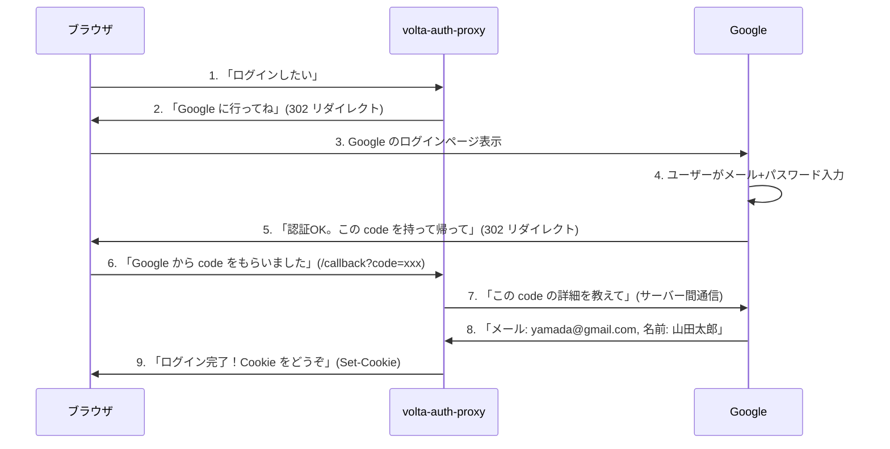
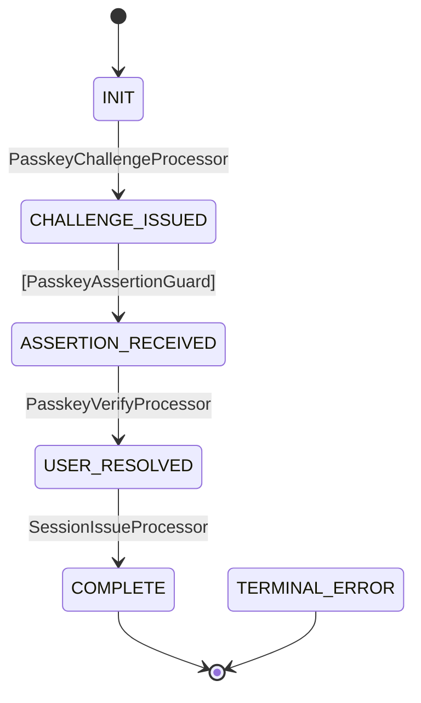
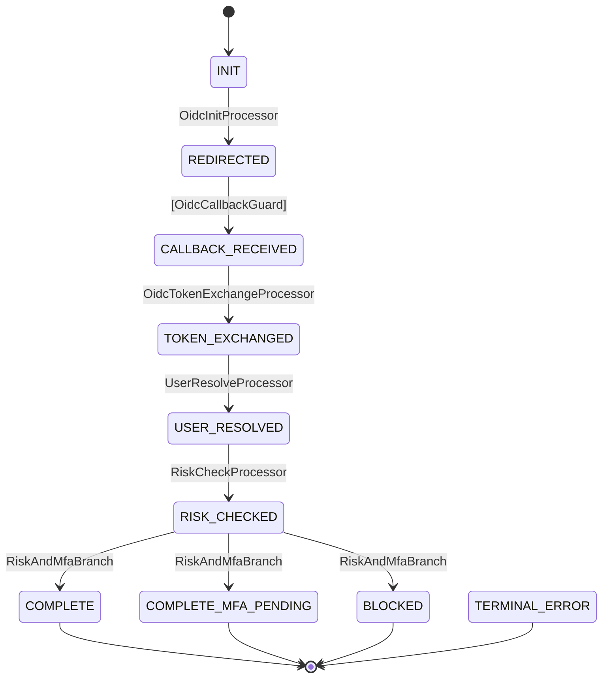

# 認証と認可の教科書 — パスワードから ForwardAuth まで

> **対象**: HTTP を知らない中学生から、認証基盤を設計するエンジニアまで
> **形式**: 会話劇 + 図解 + 実コード
> **教材元**: volta-auth-proxy（本番稼働中の認証基盤）の設計・障害・修正から

---

## 目次

- [第1章: 認証って何？](#第1章-認証って何)
- [第2章: パスワードの歴史と限界](#第2章-パスワードの歴史と限界)
- [第3章: Cookie とセッション — 「半券」の仕組み](#第3章-cookie-とセッション--半券の仕組み)
- [第4章: OAuth と OIDC — 他人に身分証明を任せる](#第4章-oauth-と-oidc--他人に身分証明を任せる)
- [第5章: JWT — 自己完結型の身分証明書](#第5章-jwt--自己完結型の身分証明書)
- [第6章: MFA — 鍵を2つ持つ](#第6章-mfa--鍵を2つ持つ)
- [第7章: Passkey — パスワードのない世界](#第7章-passkey--パスワードのない世界)
- [第8章: SAML — 企業の世界の合言葉](#第8章-saml--企業の世界の合言葉)
- [第9章: ForwardAuth — 門番パターン](#第9章-forwardauth--門番パターン)
- [第10章: マルチテナント — 1つの建物に複数の会社](#第10章-マルチテナント--1つの建物に複数の会社)
- [第11章: ステートマシン — 認証フローを「地図」にする](#第11章-ステートマシン--認証フローを地図にする)
- [第12章: セキュリティの落とし穴 — 本番で起きた21の事件](#第12章-セキュリティの落とし穴--本番で起きた21の事件)
- [第13章: 認証基盤の選び方 — Keycloak vs Auth0 vs 自前](#第13章-認証基盤の選び方--keycloak-vs-auth0-vs-自前)
- [第14章: Auth as Code — 認証をコードで管理する](#第14章-auth-as-code--認証をコードで管理する)

---

## 第1章: 認証って何？

### 🐣 と 🧑‍💻 の会話

🐣 「先輩、"認証" って何ですか？ログインのこと？」

🧑‍💻 「近いけど、もう少し広い概念だよ。**認証 (Authentication)** は "あなたは誰？" を確かめること。**認可 (Authorization)** は "あなたは何ができる？" を決めること。」

🐣 「違いがよく分からない…」

🧑‍💻 「映画館で例えよう。」

```
🎬 映画館の例え

認証 (Authentication):
  「チケットを見せてください」 → 「はい、山田太郎さんですね」
  → あなたが誰か を確認する

認可 (Authorization):
  「山田さんのチケットはスクリーン3です。VIPラウンジは入れません」
  → あなたが何をできるか を決める
```

🐣 「なるほど。認証 = 身元確認、認可 = 権限チェック。」

🧑‍💻 「その通り。Web の世界では:」

```
認証: ログインフォームでメールとパスワードを入力
      → サーバーが「この人は山田太郎だ」と確認

認可: 山田太郎は「一般ユーザー」ロール
      → 管理画面にはアクセスできない
      → 自分のプロフィールは編集できる
```

### 現実世界と Web の対比

| 現実世界 | Web の世界 | 種類 |
|---------|-----------|------|
| 運転免許証を見せる | パスワードでログイン | 認証 |
| パスポートで入国 | OAuth で Google ログイン | 認証 |
| 指紋で iPhone を開く | Passkey でログイン | 認証 |
| 「VIP ラウンジへどうぞ」 | 管理画面へのアクセス許可 | 認可 |
| 「この棚は社員のみ」 | API エンドポイントのロールチェック | 認可 |

---

## 第2章: パスワードの歴史と限界

### 最も古い認証: 合言葉

🐣 「パスワードって昔からあるんですか？」

🧑‍💻 「"合言葉" は紀元前からある。ローマ軍が夜間の歩哨で使ってた。でも Web のパスワードには問題がたくさんある。」

### パスワードの保存方法の進化

```
1️⃣ 平文保存（最悪）
   DB: password = "mypassword123"
   → DB が漏れたら全員のパスワードが丸見え

2️⃣ ハッシュ化
   DB: password_hash = SHA256("mypassword123") = "ef92..."
   → 元に戻せない（一方向関数）
   → でもレインボーテーブル攻撃で破られる

3️⃣ ソルト + ハッシュ
   DB: salt = "random123", hash = SHA256("random123" + "mypassword123")
   → ユーザーごとに異なるソルト → レインボーテーブルが使えない

4️⃣ bcrypt / Argon2（現在の標準）
   DB: hash = "$2b$12$LJ3m4y..." (bcrypt)
   → 意図的に遅いハッシュ → ブルートフォースが非実用的
   → ソルトが内蔵されている
```

🐣 「なんで "意図的に遅い" のがいいんですか？」

🧑‍💻 「攻撃者が1秒に100億回試せたら、8文字のパスワードは数時間で破られる。bcrypt は1回のハッシュに100ms かかるように設計されてる。100億回 × 100ms = 31年。」

### パスワードの根本的な問題

```
問題1: 人間は弱いパスワードを作る
  → "password123", "qwerty", 誕生日

問題2: パスワードの使い回し
  → サイトAが漏洩 → 同じパスワードのサイトB,C,Dも突破される

問題3: フィッシング
  → 偽のログインページでパスワードを入力させる
  → 見た目が本物そっくりなら気づけない

問題4: 管理コスト
  → 「パスワードを忘れました」対応
  → パスワードリセットメール
  → パスワードポリシー（8文字以上、大文字小文字...）
```

🐣 「じゃあパスワードはダメなんですか？」

🧑‍💻 「完璧ではないけど、今でも最も普及してる。だから **多要素認証 (MFA)** や **パスキー** が生まれた。それは後の章で。」

---

## 第3章: Cookie とセッション — 「半券」の仕組み

### なぜ「ログイン状態」を保持する必要があるか

🐣 「ログインしたら、次のページでもログイン済みって分かるのはなぜですか？」

🧑‍💻 「いい質問。実は HTTP は **ステートレス** — 毎回のリクエストが独立してる。前のリクエストを覚えてない。」

```
❌ HTTP はステートレス

リクエスト1: GET /login → 200 OK（ログイン成功）
リクエスト2: GET /dashboard → 「あなた誰？」（前のログインを覚えてない）
```

🐣 「じゃあ毎回パスワードを送るの？」

🧑‍💻 「それだと大変だよね。だから **Cookie** が発明された。」

### Cookie の仕組み

```
🍪 Cookie = サーバーがブラウザに渡す小さなメモ

ステップ1: ログイン成功
  サーバー → ブラウザ: 「このメモを持っておいて」
  HTTP レスポンスヘッダ:
    Set-Cookie: session_id=abc123; HttpOnly; Secure; SameSite=Lax

ステップ2: 次のリクエスト
  ブラウザ → サーバー: 「はい、メモ持ってます」
  HTTP リクエストヘッダ:
    Cookie: session_id=abc123

ステップ3: サーバーが確認
  サーバー: 「abc123 は山田太郎さんのセッションだ。ログイン済み。」
```

### Cookie のセキュリティフラグ

🐣 「`HttpOnly; Secure; SameSite=Lax` って何ですか？」

🧑‍💻 「Cookie を守るための鎧だよ。」

| フラグ | 意味 | 例え |
|-------|------|------|
| `HttpOnly` | JavaScript からアクセスできない | 「この半券は窓口でしか使えません（自動販売機では使えない）」 |
| `Secure` | HTTPS でのみ送信 | 「この手紙は書留でしか送れません（普通郵便は不可）」 |
| `SameSite=Lax` | 同じサイトからのリクエストでのみ送信 | 「この半券は映画館の中でしか使えません（外から持ち込み不可）」 |

### セッション = サーバー側の記録

```
┌─────────────┐                    ┌─────────────────────────┐
│   ブラウザ    │                    │    サーバー（Redis）      │
│             │                    │                         │
│  Cookie:    │ ──リクエスト──→     │  sessions テーブル:       │
│  session_id │                    │  abc123 → {              │
│  = abc123   │                    │    userId: "yamada",     │
│             │                    │    tenantId: "company1", │
│             │ ←──レスポンス──    │    expiresAt: "..."      │
│             │                    │  }                      │
└─────────────┘                    └─────────────────────────┘
```

🐣 「Cookie はメモ（鍵）、セッションは記録（金庫の中身）なんですね。」

🧑‍💻 「完璧な理解。Cookie を盗まれたらセッションが乗っ取られる。だから HttpOnly + Secure + SameSite が重要。」

### 本番で起きた Cookie 事件

> **実話**: volta-auth-proxy で Cookie に `Secure` フラグが付かない障害が発生。原因は Cloudflare Tunnel → Traefik → volta の経路で `ctx.req().isSecure()` が false を返したから。HTTPS なのに内部は HTTP — Cookie が平文で送られる状態になった。
>
> **教訓**: Cookie の Secure フラグは「リクエストが HTTPS か」ではなく「サイトが HTTPS で公開されているか」で判断すべき。環境変数 `FORCE_SECURE_COOKIE=true` か、`BASE_URL` のスキームから判定する。

---

## 第4章: OAuth と OIDC — 他人に身分証明を任せる

### 「Google でログイン」の仕組み

🐣 「"Google でログイン" ってどうやって動いてるんですか？」

🧑‍💻 「**OAuth 2.0** と **OpenID Connect (OIDC)** という仕組みだよ。簡単に言うと、"Google に身分証明を任せる"。」

```
🏢 会社の受付の例え

従来のログイン:
  あなた → 受付: 「山田です。社員証を見せます」
  受付: 「確認OK。入ってください」

OAuth/OIDC ログイン:
  あなた → 受付: 「山田です」
  受付: 「当社では Google に身元確認を委託しています。Google に行ってください」
  あなた → Google: 「山田です。パスワードは...」
  Google → あなた: 「確認OK。この証明書を受付に見せてください」
  あなた → 受付: 「Google からの証明書です」
  受付: 「Google が保証してるなら OK。入ってください」
```

### OIDC フローの詳細



🐣 「なんでこんなに複雑なんですか？直接パスワードをもらえばいいのに。」

🧑‍💻 「3つの理由:」

```
1. パスワードを知らなくていい
   → volta はユーザーのパスワードを一切保存しない
   → パスワードが漏洩するリスクがゼロ

2. Google のセキュリティを利用できる
   → 2段階認証、不正アクセス検出、全部 Google が守ってくれる

3. ユーザーが楽
   → 新しいパスワードを作らなくていい
   → 「Google でログイン」ボタン1つ
```

### code と token の違い

🐣 「code って何ですか？なんで直接ユーザー情報をくれないの？」

🧑‍💻 「セキュリティのため。」

```
❌ 危険なパターン（code なし）:
  Google → ブラウザ: 「メール: yamada@gmail.com」
  → ブラウザ（JavaScript）がユーザー情報を見れる
  → 悪意あるブラウザ拡張機能がユーザー情報を盗める

✅ 安全なパターン（code あり）:
  Google → ブラウザ: 「code: abc123」（意味のない文字列）
  ブラウザ → volta サーバー: 「code: abc123」
  volta サーバー → Google サーバー: 「abc123 の詳細を教えて」（サーバー間通信）
  Google サーバー → volta サーバー: 「メール: yamada@gmail.com」
  → ブラウザはユーザー情報を直接見ない
  → サーバー間通信は HTTPS で暗号化
```

### PKCE — さらに安全にする仕組み

```
PKCE (Proof Key for Code Exchange) — 「鍵付き封筒」

1. volta が秘密の鍵（code_verifier）を生成
2. 鍵のハッシュ（code_challenge）を Google に送る
3. Google が code を発行
4. volta が code + 元の鍵（code_verifier）を Google に送る
5. Google が「鍵のハッシュが一致する → 本人だ」と確認

→ code を盗んでも、元の鍵がないと使えない
```

> **実話**: volta-auth-proxy では PKCE の code_verifier を平文で DB に保存していた（issue #4）。DB が漏洩すると code_verifier も漏れる。修正: `KeyCipher` で暗号化してから保存。

---

## 第5章: JWT — 自己完結型の身分証明書

### JWT とは

🐣 「JWT って何ですか？」

🧑‍💻 「**JSON Web Token** — "自己完結型の身分証明書" だよ。」

```
🪪 身分証明書の例え

従来のセッション:
  半券（session_id）を見せる → サーバーが金庫（DB）を開けて確認

JWT:
  身分証明書そのものを見せる → 証明書に全部書いてある
  → サーバーは金庫を開ける必要がない
  → 証明書の「署名」を確認するだけ
```

### JWT の構造

```
eyJhbGciOiJSUzI1NiJ9.eyJzdWIiOiJ5YW1hZGEiLCJlbWFpbCI6InlhbWFkYUBleGFtcGxlLmNvbSJ9.signature

  ↓ Base64 デコード ↓

ヘッダー: {"alg": "RS256"}           ← 「署名のアルゴリズムは RS256」
ペイロード: {                         ← 「身分証明書の中身」
  "sub": "yamada",
  "email": "yamada@example.com",
  "tenant_id": "company1",
  "roles": ["MEMBER"],
  "exp": 1712345678                  ← 「有効期限」
}
署名: RSA(ヘッダー + ペイロード, 秘密鍵) ← 「偽造防止の印鑑」
```

### JWT vs セッション

| 特性 | セッション | JWT |
|------|-----------|-----|
| 情報の場所 | サーバー（DB/Redis） | トークンの中 |
| 検証方法 | DB に問い合わせ | 署名を検証 |
| 無効化 | DB から削除すれば即座 | 有効期限まで無効化できない |
| スケール | DB がボトルネック | DB 不要で高速 |
| サイズ | Cookie: 数十バイト | JWT: 数百バイト |

🐣 「JWT のほうが良いですか？」

🧑‍💻 「ケースバイケース。volta-auth-proxy では **両方使ってる**。」

```
volta-auth-proxy の使い分け:

Cookie + セッション（Redis）:
  → ブラウザのログイン状態
  → ログアウトで即座に無効化できる
  → SameSite + HttpOnly で安全

JWT（X-Volta-JWT ヘッダ）:
  → ForwardAuth でダウンストリームに渡す
  → ダウンストリームは Redis に問い合わせなくていい
  → 短い有効期限（5分）で安全性を確保
```

---

## 第6章: MFA — 鍵を2つ持つ

### なぜパスワードだけでは足りないか

🐣 「パスワードがあるのに、なんでもう1つ必要なんですか？」

🧑‍💻 「パスワードは "あなたが知っていること"。でも知識は盗める。だから "あなたが持っているもの" を追加する。」

```
認証の3要素:

1. 知識（Something you KNOW）: パスワード、PIN、秘密の質問
2. 所有（Something you HAVE）: スマホ、セキュリティキー、カード
3. 生体（Something you ARE）: 指紋、顔、虹彩

MFA = これらを2つ以上組み合わせる
```

### TOTP の仕組み

```
TOTP (Time-based One-Time Password)

1. 初回セットアップ:
   サーバーが秘密の種（secret）を生成 → QR コードで表示
   ユーザーが Google Authenticator でスキャン
   → サーバーとスマホが同じ secret を共有

2. ログイン時:
   スマホ: HMAC(secret, 現在時刻/30秒) → 6桁の数字「728967」
   サーバー: HMAC(secret, 現在時刻/30秒) → 6桁の数字「728967」
   → 一致 → 本人確認OK

   30秒ごとに数字が変わる → 古い数字は使えない
```

🐣 「サーバーとスマホが同じ計算をして、答えが合えば OK ってこと？」

🧑‍💻 「その通り。ネットワーク通信なしで検証できるのが TOTP の美しさ。」

### 本番で起きた MFA 事件

> **実話**: volta-auth-proxy で MFA 認証後にテナント切り替えをすると、新しいセッションの `mfa_verified_at` が null にリセットされ、MFA 認証を再度求められるループが発生した（issue #12）。
>
> **原因**: テナント切り替え時に新しいセッションを作る際、古いセッションの MFA 検証状態を引き継がなかった。
>
> **教訓**: セッションを再作成する操作（テナント切替、アカウント切替）では、重要な属性の引き継ぎを確認すること。

---

## 第7章: Passkey — パスワードのない世界

### Passkey とは

🐣 「Passkey って最近よく聞くんですが…」

🧑‍💻 「**パスワードをなくす** ための仕組み。iPhone の Face ID や指紋でログインできる。」

```
従来のログイン:
  ユーザー → 「パスワードは abc123 です」
  → パスワードがネットワークを流れる（暗号化されてるけど）
  → サーバーがパスワードを検証

Passkey ログイン:
  ユーザー → 「指紋で認証します」（デバイス上で完結）
  デバイス → 秘密鍵で署名を生成
  サーバー → 公開鍵で署名を検証
  → パスワードがネットワークを流れない
  → サーバーに秘密は保存されない（公開鍵だけ）
```

### 公開鍵暗号の直感的な説明

```
🔑 南京錠の例え

公開鍵 = 開いた南京錠（誰でも持てる）
秘密鍵 = 南京錠の鍵（本人だけが持つ）

登録時:
  ユーザー → サーバー: 「この南京錠を預けます」（公開鍵を登録）

ログイン時:
  サーバー → ユーザー: 「この箱を南京錠で閉めてください」（チャレンジ送信）
  ユーザー: 秘密鍵で箱を閉める（署名生成）
  ユーザー → サーバー: 「閉めました」（署名送信）
  サーバー: 預かった南京錠で「ちゃんと閉まってる」と確認（署名検証）
  → 秘密鍵を持ってる人しか閉められない → 本人確認OK
```

### Passkey のフロー（volta-auth-proxy の実装）



🐣 「Passkey は MFA が不要なんですか？」

🧑‍💻 「Passkey は "持っているもの"（デバイス）+ "生体"（指紋/顔）の2要素を兼ねてる。だから Passkey でログインしたら MFA 済みとして扱う。」

---

## 第8章: SAML — 企業の世界の合言葉

### SAML とは

🐣 「SAML って OAuth と何が違うんですか？」

🧑‍💻 「**SAML** は企業向けの古い規格。XML ベースで、OAuth/OIDC の先輩にあたる。」

```
OAuth/OIDC: JSON + HTTP リダイレクト（2012年〜）
SAML:       XML + HTTP POST（2005年〜）

OAuth/OIDC: 消費者向けアプリ（Google, GitHub ログイン）
SAML:       企業向け SSO（Active Directory, Okta）
```

### なぜまだ SAML が必要か

```
エンタープライズの現実:

  「うちの会社は Active Directory で全社員を管理してます。
   新しい SaaS を使うとき、AD と連携してほしい。
   AD が対応してるプロトコルは SAML です。」

  → 大企業は AD/LDAP + SAML が標準
  → OIDC 対応が進んでるけど、まだ SAML only の企業がある
  → BtoB SaaS は SAML をサポートしないと大口顧客を逃す
```

> **volta-auth-proxy の方針**: OIDC を主軸にしつつ、SAML もサポート。ただし SAML の XML パースは XXE (XML External Entity) 攻撃のリスクがあるため、パーサーのセキュリティ設定が重要（issue #19 で修正）。

---

## 第9章: ForwardAuth — 門番パターン

### ForwardAuth とは

🐣 「ForwardAuth って何ですか？」

🧑‍💻 「**全リクエストを1つの門番に通す** パターン。」

```
従来のパターン: 各アプリが自分で認証

  ブラウザ → アプリA（認証コード入り）
  ブラウザ → アプリB（認証コード入り）
  ブラウザ → アプリC（認証コード入り）
  → 各アプリが OIDC ライブラリを持つ
  → 各アプリにパスワードや Cookie の処理がある
  → 1つのアプリにバグがあると全体のセキュリティに影響

ForwardAuth パターン: 門番が全部チェック

  ブラウザ → Traefik（リバースプロキシ）
               ↓
             volta（門番に確認）
               ↓ OK なら
             アプリA/B/C（ヘッダだけ読む）
  
  → 認証コードはアプリに一切ない
  → アプリは HTTP ヘッダを読むだけ
  → セキュリティの責任は門番（volta）に集中
```

### ForwardAuth の仕組み

```
┌─────────┐     ┌──────────┐     ┌──────────────┐     ┌─────┐
│ ブラウザ  │────▶│ Traefik  │────▶│ volta (門番)  │────▶│ App │
└─────────┘     └──────────┘     └──────────────┘     └─────┘

Step 1: ブラウザが console.unlaxer.org にアクセス
Step 2: Traefik が volta に「この人、入っていい？」と聞く (GET /auth/verify)
Step 3: volta が Cookie を確認
  ├── Cookie あり → セッション確認 → 200 OK + ヘッダ注入
  │   X-Volta-User-Id: yamada-123
  │   X-Volta-Tenant-Id: company-456
  │   X-Volta-Role: MEMBER
  │
  └── Cookie なし → 302 → /login にリダイレクト

Step 4: Traefik が volta の返答を見る
  ├── 200 → リクエストを App に転送（ヘッダ付き）
  └── 302 → ブラウザにリダイレクトを返す
```

### アプリ側のコード

```python
# Python (Flask) の例 — 認証コードゼロ
@app.route('/dashboard')
def dashboard():
    user_id = request.headers.get('X-Volta-User-Id')
    tenant_id = request.headers.get('X-Volta-Tenant-Id')
    role = request.headers.get('X-Volta-Role')
    
    # これだけ。認証ライブラリ不要。
    return render_template('dashboard.html', user=user_id)
```

🐣 「アプリはヘッダを読むだけ… 本当にこれだけ？」

🧑‍💻 「これだけ。Go のアプリも、Python のアプリも、Node のアプリも、全部同じヘッダを読むだけ。認証コードは1行もいらない。」

### ForwardAuth の注意点

```
⚠ ForwardAuth の信頼境界

問題: ヘッダは誰でも偽装できる
  → 攻撃者が X-Volta-User-Id: admin を直接送ったら？

対策:
  1. Traefik がヘッダを上書きする（volta の返答で置換）
  2. アプリは Traefik 経由でしかアクセスできない（ネットワーク分離）
  3. Docker ネットワークや firewall でアプリを保護

  ブラウザ → [Traefik] → [volta] → [App]
             ↑ ここだけが外部公開
                        ↑ 内部ネットワーク（直接アクセス不可）
```

> **実話**: volta-auth-proxy の本番障害で、ForwardAuth のリダイレクトループが発生した。原因は SET LOCAL + SELECT の複合 SQL 文が JDBC で正しく処理されなかったこと。9つのバグが連鎖して発見された。詳細は [トラブルシューティング記録](../troubleshooting/auth-redirect-loop-2026-04-08.md) を参照。

---

## 第10章: マルチテナント — 1つの建物に複数の会社

### マルチテナントとは

🐣 「マルチテナントって何ですか？」

🧑‍💻 「1つのシステムで複数の組織（テナント）を管理すること。」

```
🏢 オフィスビルの例え

シングルテナント:
  1つのビル = 1つの会社
  → 自由だけど、コストが高い

マルチテナント:
  1つのビル = 複数の会社（テナント）
  → コスト共有、でもセキュリティ分離が必要
  → A社の社員がB社のフロアに入れてはいけない
```

### volta-auth-proxy のマルチテナントモデル

```
User (1) ─── (*) Membership (*) ─── (1) Tenant
                    │
                  role: OWNER | ADMIN | MEMBER

例:
  山田太郎 ── OWNER ── 株式会社A
  山田太郎 ── MEMBER ── 株式会社B（副業先）
  田中花子 ── ADMIN ── 株式会社A
```

🐣 「1人が複数のテナントに所属できるんですか？」

🧑‍💻 「そう。だからログイン後にテナント選択画面が出る。1つしかなければスキップ。」

### テナント分離

```
❌ 危険: テナントA のユーザーがテナントB のデータにアクセス

対策:
1. ヘッダ注入: X-Volta-Tenant-Id で強制
   → アプリは「自分のテナント」のデータしか返さない

2. DB レベル: membership テーブルで FK 制約
   → テナントAのユーザーIDでテナントBのデータは SELECT できない

3. API レベル: 全 API で tenantId チェック
   → /api/v1/tenants/{tenantId}/members は自分のテナントのみ
```

---

## 第11章: ステートマシン — 認証フローを「地図」にする

### なぜ認証にステートマシンが必要か

🐣 「認証フローに "ステートマシン" って大げさじゃないですか？」

🧑‍💻 「OIDC ログインの手続きを考えてみて。」

```
OIDC ログインの "暗黙の" 状態遷移:

1. ユーザーがログインボタンを押す
2. Google にリダイレクト
3. Google でメール+パスワード入力
4. Google から callback で戻ってくる
5. code を token に交換
6. ユーザー情報を取得
7. テナントを解決
8. MFA が必要か判定
9a. MFA 不要 → セッション作成 → 完了
9b. MFA 必要 → MFA チャレンジ → コード入力 → 検証 → セッション作成 → 完了

→ 9ステップ、分岐あり、エラー遷移あり
→ 「手続き型」で書くと1800行の Main.java になる
→ どこで何が起きてるか把握できなくなる
```

### tramli — ステートマシンエンジン

```java
// 50行で OIDC フロー全体を定義
var oidcFlow = Tramli.define("oidc", OidcFlowState.class)
    .ttl(Duration.ofMinutes(5))
    .initiallyAvailable(OidcRequest.class)
    .externallyProvided(OidcCallback.class)

    .from(INIT).auto(REDIRECTED, oidcInitProcessor)
    .from(REDIRECTED).external(CALLBACK_RECEIVED, callbackGuard)
    .from(CALLBACK_RECEIVED).auto(TOKEN_EXCHANGED, tokenExchangeProcessor)
    .from(TOKEN_EXCHANGED).auto(USER_RESOLVED, userResolveProcessor)
    .from(USER_RESOLVED).auto(RISK_CHECKED, riskCheckProcessor)
    .from(RISK_CHECKED).branch(mfaBranch)
        .to(COMPLETE, "no_mfa", sessionProcessor)
        .to(COMPLETE_MFA_PENDING, "mfa_required", sessionProcessor)
        .to(BLOCKED, "blocked")
        .endBranch()
    .onAnyError(TERMINAL_ERROR)
    .build();  // ← ここで8項目の検証が走る
```

🐣 「これが... 地図？」

🧑‍💻 「そう。この定義から Mermaid 図が自動生成される。コードが地図で、地図がコード。」



### build() — 壊れたフローはデプロイできない

```
build() が検証する8項目:

1. 全状態が初期状態から到達可能か？ → 使えない状態がないか
2. 終端状態への経路があるか？     → 永遠に終わらないフローがないか
3. Auto/Branch がDAG を形成するか？ → 無限ループがないか
4. 各状態に External は1つだけか？  → 「どのイベントを待つか」が曖昧でないか
5. Branch のターゲットが存在するか？ → 行き先のない分岐がないか
6. requires/produces が整合するか？ → データの受け渡しに漏れがないか
7. 終端状態からの遷移がないか？    → 終わったフローが動き出さないか
8. 初期状態が存在するか？         → フローの始点があるか
```

🐣 「壊れた地図は使えないようにするんですね。」

🧑‍💻 「**ビルド時に検証して、壊れたフローはデプロイ不可能にする。** これが tramli の核心。」

---

## 第12章: セキュリティの落とし穴 — 本番で起きた21の事件

### volta-auth-proxy で発見・修正された21のセキュリティ issue

> 以下は全て実際に発見され、修正されたセキュリティ問題です。

#### カテゴリ 1: 入力検証の不備

| # | 問題 | 影響 | 修正 |
|---|------|------|------|
| 1 | Webhook URL の SSRF | 内部ネットワークへのリクエスト | URL バリデーション（HTTPS のみ、プライベート IP ブロック） |
| 13 | ワイルドカードドメインマッチ | `evil-unlaxer.org` が通る | URI ホスト抽出 + suffix マッチ |
| 14 | メールの Unicode 正規化 | ホモグリフ文字でバイパス | NFC 正規化 |
| 19 | XXE 保護不完全 | XML 外部エンティティ攻撃 | パーサー設定強化 |

#### カテゴリ 2: 認証・セッション管理

| # | 問題 | 影響 | 修正 |
|---|------|------|------|
| 2 | OIDC nonce null チェック漏れ | リプレイ攻撃 | null チェック追加 |
| 3 | OIDC state リプレイ | state パラメータ再利用 | 原子的な削除 |
| 4 | PKCE verifier 平文保存 | DB 漏洩で PKCE バイパス | 暗号化して保存 |
| 11 | セッション Cookie 削除時のフラグ不足 | Cookie 残留 | Secure/SameSite/HttpOnly 付与 |
| 12 | テナント切替で MFA リセット | MFA ループ | mfaVerifiedAt 引き継ぎ |

#### カテゴリ 3: 暗号・認証強度

| # | 問題 | 影響 | 修正 |
|---|------|------|------|
| 15 | KeyCipher が SHA-256 直接使用 | 弱い鍵導出 | PBKDF2（10万回反復） |
| 16 | 暗号化なしの平文フォールバック | 暗号化が無効に | 警告ログ出力 |
| 21 | 定数時間比較の長さリーク | タイミング攻撃 | MessageDigest.isEqual() |

#### カテゴリ 4: アクセス制御

| # | 問題 | 影響 | 修正 |
|---|------|------|------|
| 7 | /auth/ パスの rate limiting 除外 | ブルートフォース | エンドポイント別制限追加 |
| 8 | SAML devMode で署名スキップ | SAML 偽造 | localhost 限定 |
| 9 | 管理 API の OAuth スコープ未チェック | 権限昇格 | スコープ検証追加 |
| 10 | 招待コードの rate limiting なし | 列挙攻撃 | 20回/分/IP |
| 20 | Rate limiter の off-by-one | limit+1 回許可 | `<=` → `<` |

#### カテゴリ 5: Passkey / WebAuthn

| # | 問題 | 影響 | 修正 |
|---|------|------|------|
| 5 | credential ID の一意制約なし | クロスユーザー攻撃 | DB UNIQUE 制約（既存） |
| 6 | origin 検証がコンフィグ依存 | origin 偽装 | WebAuthn4j が clientDataJSON で検証（既存） |
| 17 | sign counter の非原子更新 | クローンキー検出バイパス | `UPDATE WHERE counter < ?` |

#### カテゴリ 6: データ保護

| # | 問題 | 影響 | 修正 |
|---|------|------|------|
| 18 | GDPR 削除の漏れ | PII 残留 | outbox_events + flow_transitions も削除 |

🐣 「21個もあったんですか…」

🧑‍💻 「セキュリティは "やったつもり" が一番危険。1つずつ地道に潰すしかない。」

---

## 第13章: 認証基盤の選び方 — Keycloak vs Auth0 vs 自前

### 選択肢の比較

```
┌─────────────────────────────────────────────────────────────────┐
│                 認証基盤の選択マトリクス                          │
├─────────────┬──────────┬──────────┬──────────┬────────────────┤
│             │ Auth0    │ Keycloak │ Authelia │ volta          │
│             │ (SaaS)   │ (OSS)    │ (OSS)   │ (Auth as Code) │
├─────────────┼──────────┼──────────┼──────────┼────────────────┤
│ 初期コスト   │ ゼロ     │ 高い      │ 低い    │ 中程度          │
│ 月額コスト   │ MAU課金  │ 運用費    │ 運用費  │ 運用費          │
│ カスタマイズ │ 設定画面  │ SPI/XML  │ YAML   │ コード          │
│ マルチテナント│ ○       │ △→○     │ ✗      │ ○             │
│ SAML        │ ○       │ ○       │ ✗      │ ○             │
│ ForwardAuth │ ✗       │ ✗       │ ○      │ ○             │
│ 学習曲線    │ 低い     │ 高い      │ 低い    │ 中程度          │
│ ソースコード │ ✗       │ ○       │ ○      │ ○             │
└─────────────┴──────────┴──────────┴──────────┴────────────────┘
```

### どれを選ぶべきか

```
Auth0 を選ぶべき人:
  → 「認証に1行もコードを書きたくない」
  → 「運用を全部任せたい」
  → 「MAU 課金を許容できる」

Keycloak を選ぶべき人:
  → 「SAML + LDAP + SCIM が全部必要」
  → 「Active Directory と連携する」
  → 「管理画面が欲しい」
  → 「運用チームが2人以上いる」

Authelia を選ぶべき人:
  → 「ForwardAuth だけでいい」
  → 「マルチテナント不要」
  → 「30MB のコンテナで動かしたい」

volta を選ぶべき人:
  → 「ForwardAuth + マルチテナント + カスタムフロー」
  → 「認証フローをコードで制御したい」
  → 「ステートマシンで安全性を保証したい」
  → 「全てのコードを理解したい」
```

> volta は Keycloak に対して SQLite が PostgreSQL に対するのと同じ — 軽量で組み込み型。フル機能の代替ではない。

---

## 第14章: Auth as Code — 認証をコードで管理する

### Infrastructure as Code → Auth as Code

🐣 「"Auth as Code" って何ですか？」

🧑‍💻 「Terraform が "Infrastructure as Code" で インフラをコードで管理するように、volta は認証フローをコードで管理する。」

```
Infrastructure as Code (Terraform):
  → サーバー構成がコード（.tf ファイル）
  → git でバージョン管理
  → PR でレビュー
  → CI/CD でデプロイ
  → 「terraform apply」で反映

Auth as Code (volta):
  → 認証フローがコード（FlowDefinition）
  → git でバージョン管理
  → PR でレビュー
  → CI/CD でデプロイ
  → 「build()」で検証、デプロイで反映
```

### 比較表

| | Keycloak | Authentik | Auth0 | **volta** |
|---|---|---|---|---|
| フロー定義 | 管理 UI | ビジュアルエディタ | Rules/Actions | **コード** (tramli) |
| 変更プロセス | UI でクリック | ドラッグ&ドロップ | ダッシュボード | **PR → レビュー → デプロイ** |
| 検証 | 実行時 | 実行時 | 実行時 | **定義時** (`build()`) |
| ロールバック | 手動 | 手動 | 手動 | **`git revert`** |
| 差分確認 | スクリーンショット | なし | なし | **`git diff`** |

🐣 「コードで管理するメリットは？」

🧑‍💻 「3つ:」

```
1. レビュー可能
   → 「この認証フローの変更、本当に安全？」を PR で議論できる
   → Keycloak の Admin UI でクリックした変更は誰もレビューしない

2. テスト可能
   → build() で構造検証、ユニットテストで Processor 検証
   → 「MFA の分岐、ちゃんと動く？」をテストで保証

3. 再現可能
   → 「先月の認証フローに戻して」→ git revert
   → 「本番と同じフローを staging で動かして」→ 同じコード
```

### tramli の require/produces — データフロー保証

```java
// 各 Processor が「何を必要とし、何を生産するか」を宣言
class TokenExchangeProcessor implements StateProcessor {
    Set<Class<?>> requires() { return Set.of(OidcCallback.class); }
    Set<Class<?>> produces() { return Set.of(OidcTokens.class, ResolvedUser.class); }
    
    void process(FlowContext ctx) {
        var callback = ctx.get(OidcCallback.class);  // 型安全
        // ... token exchange ...
        ctx.put(OidcTokens.class, tokens);
        ctx.put(ResolvedUser.class, user);
    }
}

// build() が全パスで requires/produces の整合性を検証
// → 「TokenExchangeProcessor が OidcCallback を必要としてるけど、
//     このパスでは OidcCallback を生産する Processor がない」
// → コンパイル時（定義時）にエラー
```

🐣 「コンパイラみたいですね。」

🧑‍💻 「まさにその通り。tramli は FlowDefinition を "プログラム"、build() を "コンパイラ" として扱う。壊れたプログラムはコンパイルが通らない。壊れたフロー定義は build() が通らない。」

---

## まとめ

```
第1章:  認証 = 「あなたは誰？」、認可 = 「あなたは何ができる？」
第2章:  パスワードは弱い。bcrypt で守り、MFA で補強する
第3章:  Cookie = ブラウザの半券。HttpOnly + Secure + SameSite で守る
第4章:  OAuth/OIDC = 他人（Google）に身分証明を任せる
第5章:  JWT = 自己完結型の身分証明書。セッションと使い分ける
第6章:  MFA = 知識 + 所有 + 生体の2つ以上を組み合わせる
第7章:  Passkey = パスワード不要。公開鍵暗号で安全
第8章:  SAML = 企業向けの古い（でも現役の）SSO プロトコル
第9章:  ForwardAuth = 門番パターン。アプリから認証コードを排除
第10章: マルチテナント = 1システムで複数組織を分離管理
第11章: ステートマシン = 認証フローを「地図」にして壊れなくする
第12章: セキュリティ = 21の落とし穴を1つずつ潰す
第13章: 選択 = Auth0/Keycloak/Authelia/volta、用途で選ぶ
第14章: Auth as Code = 認証をコードで管理し、git revert できる世界
```

---

## 参考文献

1. OAuth 2.0 (RFC 6749) — https://datatracker.ietf.org/doc/html/rfc6749
2. OpenID Connect Core — https://openid.net/specs/openid-connect-core-1_0.html
3. FIDO2 / WebAuthn — https://www.w3.org/TR/webauthn-2/
4. SAML 2.0 — https://docs.oasis-open.org/security/saml/v2.0/
5. OAuth 2.0 Security BCP (RFC 9700) — https://datatracker.ietf.org/doc/html/rfc9700
6. TOTP (RFC 6238) — https://datatracker.ietf.org/doc/html/rfc6238
7. JWT (RFC 7519) — https://datatracker.ietf.org/doc/html/rfc7519
8. Traefik ForwardAuth — https://doc.traefik.io/traefik/middlewares/http/forwardauth/
9. tramli — https://github.com/opaopa6969/tramli
10. volta-auth-proxy — https://github.com/opaopa6969/volta-auth-proxy
