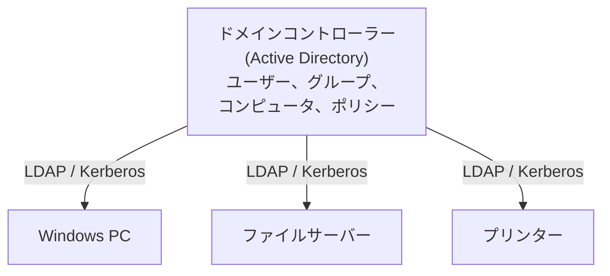
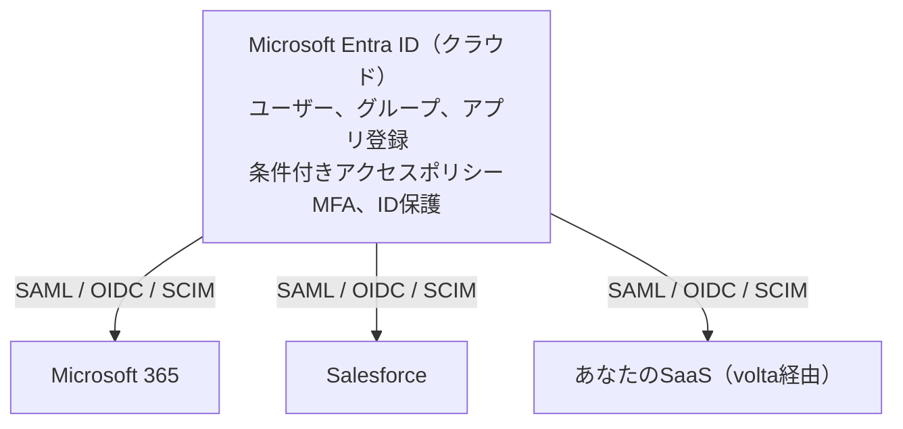
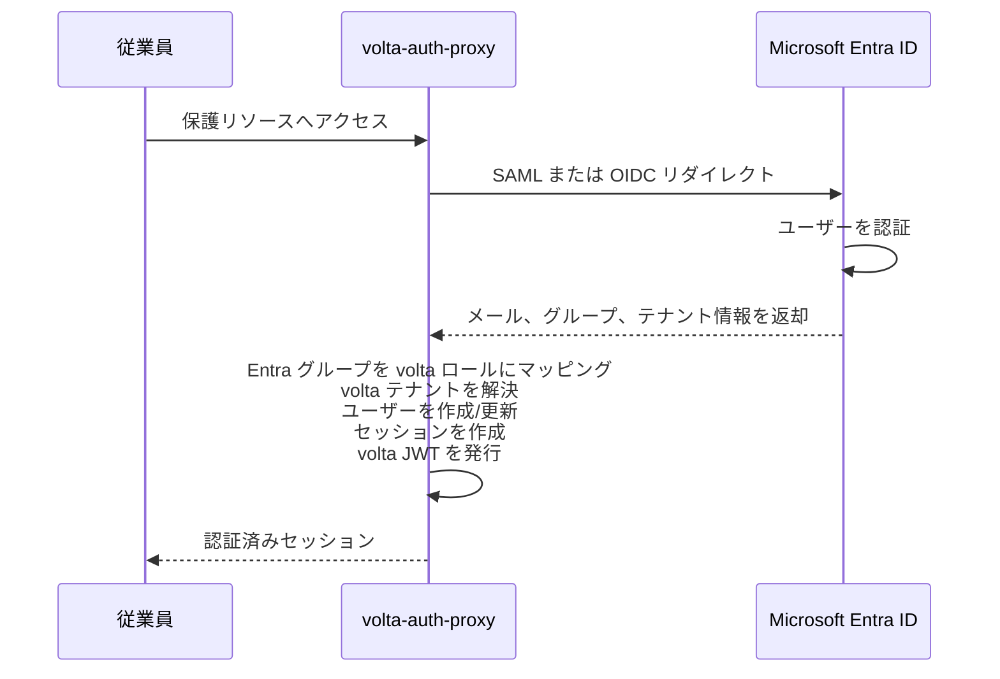

# Active Directory

[English version](active-directory.md)

---

## これは何？

Active Directory（AD）は、ネットワーク内のユーザー、コンピュータ、リソースを管理するMicrosoftのディレクトリサービスです。2000年にオンプレミスのWindowsネットワーク用に構築され、2つの異なる製品に進化しました：オンプレミス用の**Active Directory Domain Services（AD DS）**と、クラウド用の**Microsoft Entra ID**（旧Azure Active Directory / Azure AD）です。

Active Directoryは、巨大な従業員電話帳とセキュリティシステムが合体したようなものです。誰が会社で働いているか、どの部署にいるか、どのコンピュータにログインできるか、どのファイルにアクセスできるか、どのプリンターを使えるかを知っています。職場でWindows PCにログインして、自分の名前、デスクトップ設定、ネットワークドライブが表示される -- それはActive Directoryのおかげです。

モダンなクラウドの世界では、Microsoft Entra IDがこのコンセプトをSaaSアプリケーションに拡張します。オンプレミスのファイル共有へのアクセス管理だけでなく、Salesforce、Slack、そして[OIDC](oidc.md)や[SAML](sso.md)を通じてvolta-auth-proxyで保護されたあなたのSaaSアプリケーションへのアクセスも管理します。

---

## なぜ重要なのか？

Active Directoryは世界で最も広く導入されているエンタープライズIDシステムです。Fortune 1000企業の90%以上が使用しています。エンタープライズ顧客向けのSaaS製品を構築する場合、必然的に「Active Directoryと連携できますか？」という質問に直面します。

volta-auth-proxyにとってこれが重要な理由：

1. **エンタープライズ採用**：企業がSaaSを評価する際、IT部門は既存のAD/Entra ID認証情報でログインできるか確認する
2. **SAML/SCIM統合**：Entra IDはSSO[とユーザープロビジョニングのエンタープライズ標準である](sso.md)[SAML](sso.md)と[SCIM](okta.md)をサポート
3. **コンプライアンス**：多くの規制産業では、監査とポリシー適用のためにすべての認証をAD/Entra IDを通すことを要求

---

## どう動くのか？

### オンプレミスAD（AD DS）

主要プロトコル：

| プロトコル | 目的 |
|----------|------|
| **LDAP** | ディレクトリのクエリ（ユーザー、グループ、属性の検索） |
| **Kerberos** | 認証（チケットベース、ネットワーク上にパスワードを流さない） |
| **NTLM** | レガシー認証（弱い、段階的廃止中） |
| **Group Policy** | コンピュータとユーザーへの設定の適用 |

### クラウド：Microsoft Entra ID（Azure AD）

### ハイブリッド：AD Connect

ほとんどの企業はオンプレミスADとクラウドEntra IDの両方を**AD Connect**で同期して運用しています。

### 他のIdPとの比較

| 機能 | AD DS（オンプレミス） | Entra ID（クラウド） | [Okta](okta.md) | [Google Workspace](google-workspace.md) |
|------|---------------------|---------------------|------|-----------------|
| LDAP | ネイティブ | プロキシ経由 | アダプター経由 | LDAPサービス経由 |
| SAML | ADFS経由 | 組み込み | 組み込み | 組み込み |
| OIDC | ADFS経由 | 組み込み | 組み込み | 組み込み |
| SCIM | 手動 | 組み込み | 組み込み | 組み込み |
| Kerberos | ネイティブ | N/A | N/A | N/A |
| 条件付きアクセス | Group Policy | 組み込み（強力） | Adaptive MFA | Context-Aware Access |

---

## volta-auth-proxy ではどう使われている？

volta-auth-proxyは**Phase 3**で、SAMLおよび/またはOIDCを使用してMicrosoft Entra IDを上流IdPとしてサポートする計画です。これにより、Microsoftを通じて認証する企業の従業員が、別途ログインなしでvolta保護のアプリケーションを使用できます。

### 統合アーキテクチャ（Phase 3）

### SCIM統合（Phase 3+）

SSOの先、SCIM統合によりEntra IDがvoltaユーザーを自動的にプロビジョニング/デプロビジョニングできます：

| Entra IDイベント | SCIM操作 | voltaアクション |
|----------------|---------|--------------|
| ユーザーがアプリに割り当て | POST /Users | テナントにvoltaユーザーを作成 |
| ユーザー更新（名前、ロール） | PATCH /Users/{id} | voltaユーザーを更新 |
| ユーザーがアプリから削除 | DELETE /Users/{id} | voltaユーザーを無効化 |
| グループメンバーシップ変更 | PATCH /Groups/{id} | voltaロールマッピングを更新 |

### なぜEntra IDをすべてに直接使わないのか？

Entra IDは優秀なIdPですが、voltaはその上に価値を追加します：

1. **マルチテナント**：Entra IDはあなたのSaaSテナントを知りません。voltaがEntra IDをテナントにマッピング。
2. **クロスIdPサポート**：あるテナントはEntra ID、別はGoogle、別は[Okta](okta.md)。voltaがすべてを正規化。
3. **セルフホスト制御**：voltaのセッション管理、レート制限、認可ロジックはあなたのサーバーで実行。
4. **ユーザーごとのクラウド料金なし**：Entra IDはプレミアム機能にユーザーごとの課金。voltaは無料。

---

## よくある間違いと攻撃

### 間違い1：AD DSとEntra IDを混同する

別の製品です。AD DSはオンプレミス（LDAP/Kerberos）。Entra IDはクラウド（SAML/OIDC）。多くの開発者がEntra IDのことを「Active Directory」と言います。「オンプレミスADとの統合ですか、クラウドEntra IDとの統合ですか？」と確認してください。

### 間違い2：グループをロールにマッピングしない

Entra IDはSAMLアサーションやOIDCトークンにグループメンバーシップを含めます。グループを無視して「認証済みか」だけチェックすると、すべてのEntraユーザーがロールに関係なく同じアクセスを得ます。

### 間違い3：ネストされたグループを処理しない

ADでは、グループが他のグループを含むことができます。ユーザーAがグループXに所属し、グループXがグループYに所属。アプリケーションが直接のグループメンバーシップのみチェックすると、ユーザーAはグループYに所属していないように見えます。再帰を処理してください。

### 間違い4：検証なしでメールクレームを信頼する

Entra IDはカスタムドメインを許可しています。テナントを侵害した攻撃者が自分の管理するドメインを設定し、あなたのドメインのメールアドレスでユーザーを作成できます。メールだけでなく、常に`tid`（テナントID）クレームを検証してください。

### 攻撃：テナント間のトークンリプレイ

任意のテナントからのEntra IDトークンを受け入れる場合（マルチテナントアプリ登録）、自身のEntraテナントの攻撃者が有効なトークンを取得してアプリケーションへのアクセスを試みることができます。OIDC設定で受け入れるテナントIDを制限してください。

---

## さらに学ぶ

- [Microsoft Entra IDドキュメント](https://learn.microsoft.com/ja-jp/entra/identity/) -- 公式リファレンス。
- [Entra IDでのSAML SSO](https://learn.microsoft.com/ja-jp/entra/identity/enterprise-apps/what-is-single-sign-on) -- SSOセットアップガイド。
- [Entra IDでのSCIMプロビジョニング](https://learn.microsoft.com/ja-jp/entra/identity/app-provisioning/use-scim-to-provision-users-and-groups) -- 自動ユーザープロビジョニング。
- [okta.md](okta.md) -- 競合するエンタープライズIdP。
- [google-workspace.md](google-workspace.md) -- GoogleのエンタープライズIdP。
- [sso.md](sso.md) -- シングルサインオンの概念。
- [oidc.md](oidc.md) -- クラウド統合に使われるプロトコル。
