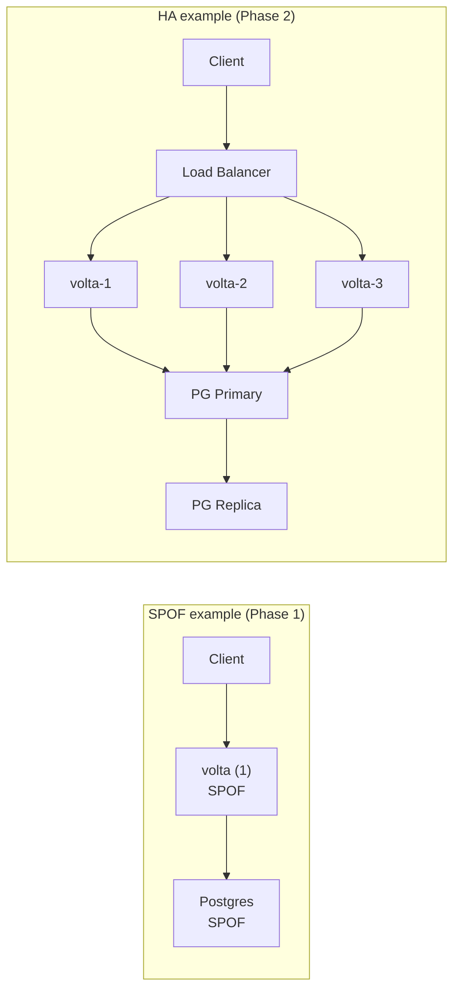
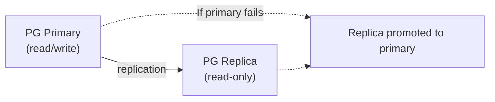

# High Availability

[日本語版はこちら](high-availability.ja.md)

---

## What is it?

High availability (HA) means designing a system so that it stays running even when individual components fail. Instead of hoping nothing breaks, you plan for failures and make sure the system keeps serving users through them.

Think of it like a hospital with backup generators. The main power grid can fail, but the hospital keeps running because there is a backup. And the backup has a backup. Patients never notice the power switch because the system was designed to handle failure gracefully. High availability is the same concept for software: your website stays up even when a server dies, a database hiccups, or a network cable gets unplugged.

High availability is measured in "nines" -- the percentage of time a system is operational:

```text
Nines        Uptime %          Downtime / year

Two 9s       99%               3.65 days
Three 9s     99.9%             8.76 hours
Four 9s      99.99%            52.6 minutes
Five 9s      99.999%           5.26 minutes
```

---

## Why does it matter?

- **Authentication is critical infrastructure.** If volta-auth-proxy goes down, every app behind it becomes inaccessible. No login, no access, no business.
- **Users expect always-on services.** Modern SaaS users expect 99.9%+ uptime. Downtime loses customers and trust.
- **Outages have cascading effects.** If auth is down, not just login is affected -- every API call that requires authentication fails.
- **Cost of downtime is real.** For a SaaS business, an hour of downtime can mean lost revenue, SLA violations, and customer churn.
- **Compliance may require it.** Enterprise customers often contractually require specific uptime guarantees.

---

## How does it work?

### The three pillars of high availability

```text
          High Availability

Redundancy       Failover         Monitoring

Multiple        Automatic        Detect
copies of       switch to       failures
everything      backup when     before users
                primary         notice
                fails
```

### Single points of failure

A single point of failure (SPOF) is any component that, if it fails, takes down the entire system:



In the Phase 1 SPOF setup, if volta or Postgres dies, everything stops. In the Phase 2 HA setup, any single instance can die and the system keeps running.

### Health checks

The load balancer needs to know which instances are healthy:

```text
Load Balancer sends health checks:

GET /health -> volta-1 -> 200 OK   (Keep sending traffic)
GET /health -> volta-2 -> 200 OK   (Keep sending traffic)
GET /health -> volta-3 -> timeout  (Stop sending traffic; removed from pool)
```

### Database high availability

PostgreSQL HA typically uses primary-replica replication:



---

## How does volta-auth-proxy use it?

### Phase 1: No HA (current, acceptable)

In Phase 1, volta is a [single process](single-process.md). If it goes down, auth is down. This is acceptable for early-stage products where simplicity outweighs uptime guarantees.

### Phase 2: HA architecture (planned)

```text
               HA Architecture

    Traefik (Load Balancer)
    Health checks every 10s

volta-1    volta-2    volta-3    ← min 2
                                   for HA

         Redis Sentinel
  (auto-failover for Redis)

  PostgreSQL Primary/Replica
  (streaming replication)
```

### What HA means for volta users

With HA in place:
- A volta instance crash does not affect users (load balancer routes around it)
- A Redis failure falls back to PostgreSQL (slower but functional)
- A PostgreSQL primary failure promotes the replica automatically
- Deployments happen via rolling update (zero downtime)

---

## Common mistakes and attacks

### Mistake 1: HA only at the application layer

Running 3 volta instances but only 1 PostgreSQL server is not HA. The database becomes the single point of failure. HA must be implemented at every layer.

### Mistake 2: No health checks or bad health checks

A health check that always returns 200 OK (even when the database is unreachable) defeats the purpose. Health checks should verify actual dependencies.

### Mistake 3: Correlated failures

Running all instances on the same physical server means a hardware failure takes down everything. Spread instances across different hosts or availability zones.

### Mistake 4: Not testing failure scenarios

"We have HA" means nothing if you have never actually killed an instance in staging and verified the system stays up. Practice chaos engineering.

### Mistake 5: Overcomplicating HA too early

HA adds significant operational complexity. For a new product with 10 users, a single instance with good backups and fast recovery is often sufficient. Implement HA when the business requires it.

---

## Further reading

- [horizontal-scaling.md](horizontal-scaling.md) -- Multiple instances are the foundation of HA.
- [load-balancer.md](load-balancer.md) -- Distributes traffic and detects failures.
- [redis.md](redis.md) -- Shared state store for HA deployments.
- [single-process.md](single-process.md) -- volta's current non-HA architecture.
- [what-is-scalability.md](what-is-scalability.md) -- Scaling and HA are related but different.
