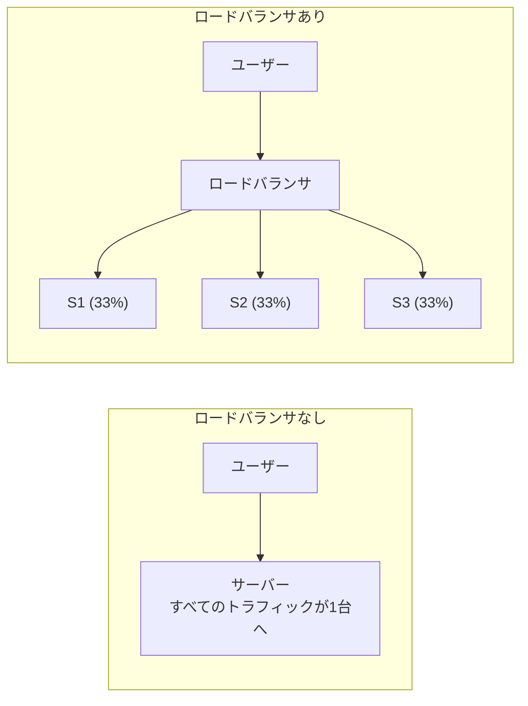
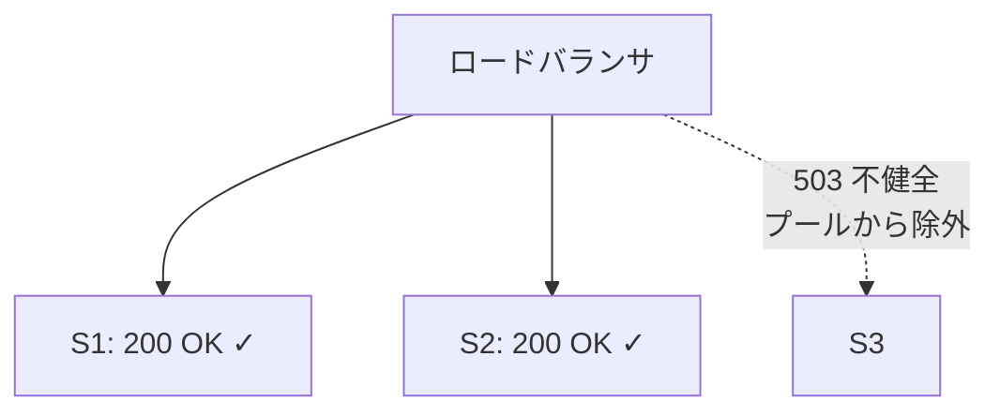
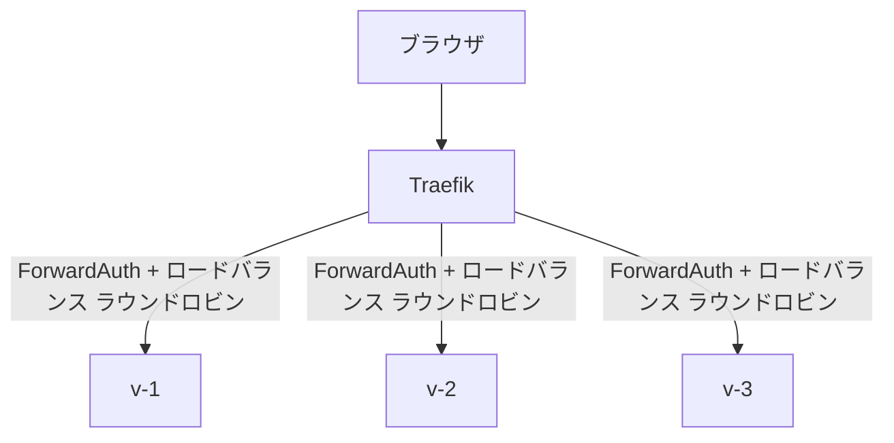

# ロードバランサ

[English version](load-balancer.md)

---

## これは何？

ロードバランサは、ユーザーとアプリケーションインスタンスの間に位置し、受信トラフィックをアプリケーションの複数コピーに分配するサーバーです。すべてのリクエストが1台のサーバーに集中する代わりに、ロードバランサがそれらを均等に分散し、1台のサーバーが過負荷にならないようにします。

混雑したレストランのホストで考えてみましょう。お客様（リクエスト）がドアから入ってきて、ホスト（ロードバランサ）がどのテーブルセクション（サーバーインスタンス）に案内するかを決めます。良いホストは食事客をセクション間で均等に分散し、1人のウェイターが圧倒される一方で他が暇にならないようにします。ホストがいないと、すべてのお客様が最初に見えたテーブルに殺到します。

ロードバランサは3つの重要なことをします：トラフィックを分配し、故障したサーバーを検出（ヘルスチェック）し、不健全なサーバーを復旧するまでプールから除外します。

---

## なぜ重要なのか？

- **水平スケーリングを可能にする。** ロードバランサなしでは、複数のvoltaインスタンスにトラフィックを分割する方法がない。
- **障害耐性を提供する。** 1台のサーバーがクラッシュしても、ロードバランサがトラフィックの送信を停止する。ユーザーは中断を経験しない。
- **過負荷を防ぐ。** トラフィックの均等分配が、特定のインスタンスがボトルネックになることを防ぐ。
- **ゼロダウンタイムデプロイを可能にする。** インスタンスを1つずつ更新 -- ロードバランサが更新中のインスタンスを回避。
- **単一エントリポイント。** ユーザーは1つのURLに接続。ロードバランサが適切なインスタンスへのルーティングの複雑さを処理。

---

## どう動くのか？

### 基本的なロードバランシング



### ロードバランシングアルゴリズム

| アルゴリズム | 仕組み | 適している場面 |
|------------|--------|--------------|
| **ラウンドロビン** | 各サーバーに順番に送信: 1, 2, 3, 1, 2, 3... | 同等能力のサーバー |
| **最少接続数** | アクティブ接続が最も少ないサーバーに送信 | リクエスト処理時間が様々 |
| **重み付きラウンドロビン** | サーバーが重みに比例してトラフィックを受ける | 異なるサイズのサーバー |
| **IPハッシュ** | 同じクライアントIPが常に同じサーバーへ | セッションアフィニティ |
| **ランダム** | ランダムなサーバー選択 | シンプル、驚くほど効果的 |

### ヘルスチェック

ロードバランサは定期的に各サーバーの生存を確認します：



- 10秒ごとに、ロードバランサが各サーバーをプローブする。
- S3が503を返すと、プールから除外される（S1とS2が50%ずつ受ける）。
- S3が復旧すれば（健全なプローブ）、ロードバランサが再追加する。

### L4 vs L7 ロードバランシング

| OSI レイヤー | プロトコル | 検査可能 | 例 |
|------------|-----------|---------|-----|
| レイヤー7（アプリケーション） | HTTP, HTTPS | URLパス、ヘッダー、Cookie、リクエストボディ | `/api/*` をサーバーAへ、`/auth/*` をサーバーBへ |
| レイヤー4（トランスポート） | TCP, UDP | IPアドレス、ポート（URL/ヘッダー/コンテンツは不可視） | ポート443をサーバーAへ |

TraefikはL7ロードバランサ -- HTTPヘッダーとパスに基づいてルーティング判断が可能。

---

## volta-auth-proxy ではどう使われている？

### voltaのロードバランサとしてのTraefik

voltaは[Traefik](reverse-proxy.ja.md)を使用し、リバースプロキシとロードバランサの二重の役割を果たします。Phase 1ではTraefikは単一のvoltaインスタンスにルーティングします。Phase 2では複数インスタンスに分配します。

### Phase 1設定（シングルインスタンス）


ロードバランシング不要（バックエンドが1つだけ）。

### Phase 2設定（複数インスタンス）

```yaml
# voltaのロードバランシング用Traefik設定
http:
  services:
    volta-auth:
      loadBalancer:
        servers:
          - url: "http://volta-1:8080"
          - url: "http://volta-2:8080"
          - url: "http://volta-3:8080"
        healthCheck:
          path: "/health"
          interval: "10s"
          timeout: "3s"
```



### ロードバランシングを伴うForwardAuth

Traefikが[ForwardAuth](forwardauth.ja.md)リクエストを送ると、ロードバランサがどのvoltaインスタンスが認証チェックを処理するか選択します：

```
  1. ブラウザが app.example.com/dashboard をリクエスト
  2. Traefik ForwardAuth → ロードバランサがvolta-2を選択
  3. volta-2がRedisでセッションを確認 → 有効
  4. volta-2が200 + X-Volta-*ヘッダーを返す
  5. Traefikが元のリクエストをアプリにルーティング
```

ブラウザのセッションCookieはどのvoltaインスタンスとでも動きます。セッションがインスタンスのローカルメモリではなく[Redis](redis.ja.md)に格納されているからです。

---

## よくある間違いと攻撃

### 間違い1：セッションアフィニティ（スティッキーセッション）への依存

ロードバランサに同じユーザーを常に同じインスタンスにルーティングさせる（スティッキーセッション）のは簡単に見えますが、目的を損なわせます。そのインスタンスが死ぬと、ユーザーはセッションを失います。代わりに共有状態（[Redis](redis.ja.md)）を使いましょう。

### 間違い2：ヘルスチェックなし

ヘルスチェックなしでは、ロードバランサが死んだインスタンスにトラフィックを送ります。ユーザーがデバッグ困難なランダムな502エラーを受けます。

### 間違い3：ロードバランサ自体が単一障害点

ロードバランサが1台で死ぬと、すべてがダウンします。真の[高可用性](high-availability.ja.md)には、フェイルオーバー付きの冗長ロードバランサを使いましょう。

### 間違い4：コネクションプール制限を考慮しない

ロードバランサの後ろに3つのvoltaインスタンスがあると、データベース[接続数](connection-pool.ja.md)が3倍になります。PostgreSQLの`max_connections`が適切に設定されていることを確認しましょう。

### 間違い5：1インスタンスでテストし多数でデプロイ

リクエストがインスタンス間で交互になるときだけ現れるバグ（例：共有状態のレースコンディション）は、シングルインスタンステストでは表面化しません。

---

## さらに学ぶ

- [horizontal-scaling.ja.md](horizontal-scaling.ja.md) -- ロードバランシングが複数インスタンスを可能にする。
- [high-availability.ja.md](high-availability.ja.md) -- ロードバランサが障害を検出し回避する。
- [reverse-proxy.ja.md](reverse-proxy.ja.md) -- Traefikがリバースプロキシとロードバランサを兼ねる。
- [forwardauth.ja.md](forwardauth.ja.md) -- voltaがTraefikのForwardAuthとどう統合するか。
- [redis.ja.md](redis.ja.md) -- ロードバランスされたセッションを機能させる共有状態。
