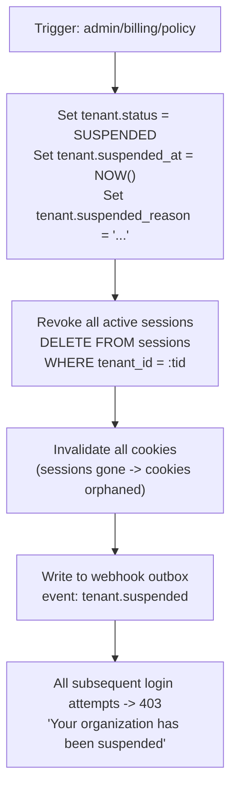
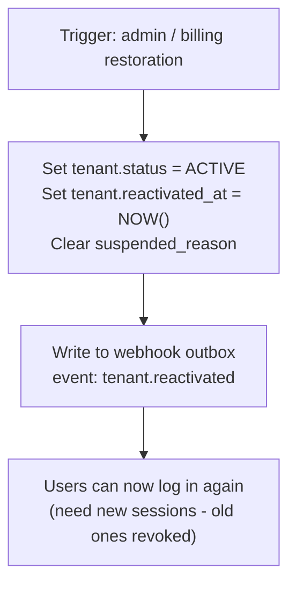
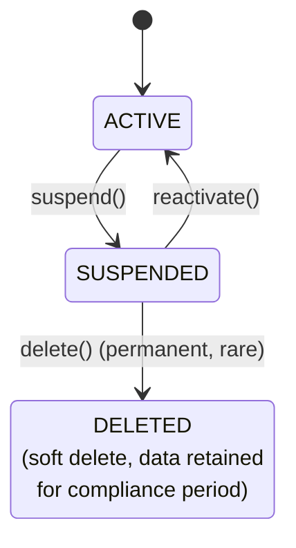
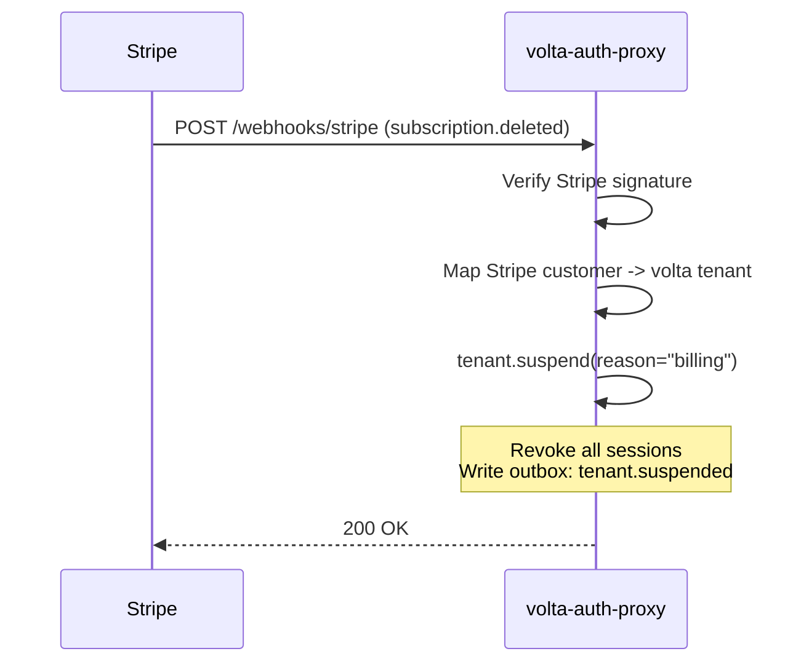

# Suspension

[日本語版はこちら](suspension.ja.md)

---

## What is it?

Suspension is the act of temporarily disabling a [tenant](tenant.md) or user account so that all associated access is blocked. Unlike deletion (which is permanent), suspension is reversible -- the account and its data remain intact, but nobody can log in or use the service until the suspension is lifted.

Think of it like freezing a library card. The card is not destroyed -- your borrowing history, your reservations, your reading lists all remain. But you cannot check out any books until the freeze is lifted. A suspended tenant in volta works the same way: all data is preserved, but all members are locked out.

Suspension can be triggered by an admin action, a billing failure (via [Stripe webhook ingestion](ingestion.md)), a security incident, or automated policy enforcement.

---

## Why does it matter?

Suspension is a critical operations tool for multi-tenant SaaS:

**Scenario 1: Billing failure**
- Stripe: "Acme's payment failed"
- -> volta suspends Acme tenant
- -> All 50 Acme employees locked out
- -> Acme updates payment method
- -> volta reactivates tenant
- -> All 50 employees can login again

**Scenario 2: Security incident**
- Suspicious activity detected
- -> Admin suspends tenant
- -> All sessions immediately revoked
- -> Investigation proceeds
- -> Issue resolved, tenant reactivated

**Scenario 3: Terms of service violation**
- Tenant violates ToS
- -> Admin suspends tenant
- -> Data preserved for legal holds
- -> Tenant contacts support
- -> Issue resolved or data exported

Without suspension, your only options are "active" or "deleted" -- there is no middle ground for temporary situations.

---

## How does it work?

### Suspension mechanics



All within one database transaction.

### What gets blocked during suspension

| Action | Blocked? | Reason |
|--------|----------|--------|
| Login (new session) | **Yes** | No new access allowed |
| Existing session use | **Yes** | Sessions are revoked |
| API calls with JWT | **Yes** | volta checks tenant status |
| [M2M](m2m.md) calls for tenant | **Yes** | M2M tokens scoped to tenant |
| [SCIM](scim.md) provisioning | **Yes** | Cannot add users to suspended tenant |
| [Invitation](invitation-code.md) acceptance | **Yes** | Cannot join suspended tenant |
| Admin reactivation | **No** | Must be able to lift suspension |
| Data export | **No** | Data remains accessible to platform admins |
| [Webhook](webhook.md) delivery | **No** | Events still delivered (suspension event itself) |

### Reactivation



### Tenant status state machine



---

## How does volta-auth-proxy use it?

### Suspension via admin API

```
  POST /api/v1/tenants/{tid}/suspend
  Authorization: Bearer <platform-admin-token>
  {
    "reason": "Terms of service violation"
  }

  Response:
  {
    "tenant_id": "acme-uuid",
    "status": "SUSPENDED",
    "suspended_at": "2026-04-01T12:00:00Z",
    "reason": "Terms of service violation",
    "sessions_revoked": 47
  }
```

### Suspension via Stripe billing

When volta [ingests](ingestion.md) a `customer.subscription.deleted` event from Stripe:



### Checking suspension status in the auth flow

Every request through volta checks tenant status:

```java
// In ForwardAuthHandler
AuthPrincipal principal = authenticate(request);
Tenant tenant = tenantService.get(principal.tenantId());

if (tenant.isSuspended()) {
    ctx.status(403).json(Map.of(
        "error", "tenant_suspended",
        "message", "Your organization has been suspended",
        "reason", tenant.suspendedReason()
    ));
    return;
}

// Tenant is active → forward to upstream
```

### Suspension + [ABAC](abac.md) integration

ABAC policies can reference suspension status:

```json
{
  "condition": {
    "subject.tenant_status": {"eq": "ACTIVE"}
  },
  "effect": "ALLOW"
}
```

---

## Common mistakes and attacks

### Mistake 1: Not revoking sessions on suspension

Setting the tenant status to SUSPENDED but leaving sessions active means users can continue using the service until their sessions naturally expire. Always revoke sessions immediately.

### Mistake 2: No grace period for billing

Suspending immediately on the first payment failure is aggressive. Consider a grace period (e.g., 3 days) with notifications before suspending.

### Mistake 3: Hard delete instead of suspension

Deleting a tenant's data when they just missed a payment is catastrophic. Suspension preserves data while restricting access.

### Mistake 4: No notification to tenant admins

Users should know WHY they are locked out and HOW to resolve it. Always include the suspension reason in the error response and notify tenant admins.

### Attack: Forced suspension via billing manipulation

An attacker with access to the billing system could cancel a tenant's subscription to trigger suspension. Defense: billing changes require strong authentication, and unexpected subscription cancellations trigger alerts.

### Attack: Suspension bypass via cached tokens

If a [JWT](jwt.md) was issued before suspension and has not yet expired, the user might bypass the suspension check. Defense: volta checks tenant status on every request, not just at token issuance.

---

## Further reading

- [tenant.md](tenant.md) -- The entity that gets suspended.
- [session.md](session.md) -- Sessions revoked during suspension.
- [billing.md](billing.md) -- Billing failures that trigger suspension.
- [ingestion.md](ingestion.md) -- How Stripe webhooks trigger suspension.
- [webhook.md](webhook.md) -- The `tenant.suspended` event.
- [abac.md](abac.md) -- ABAC policies that check suspension status.
