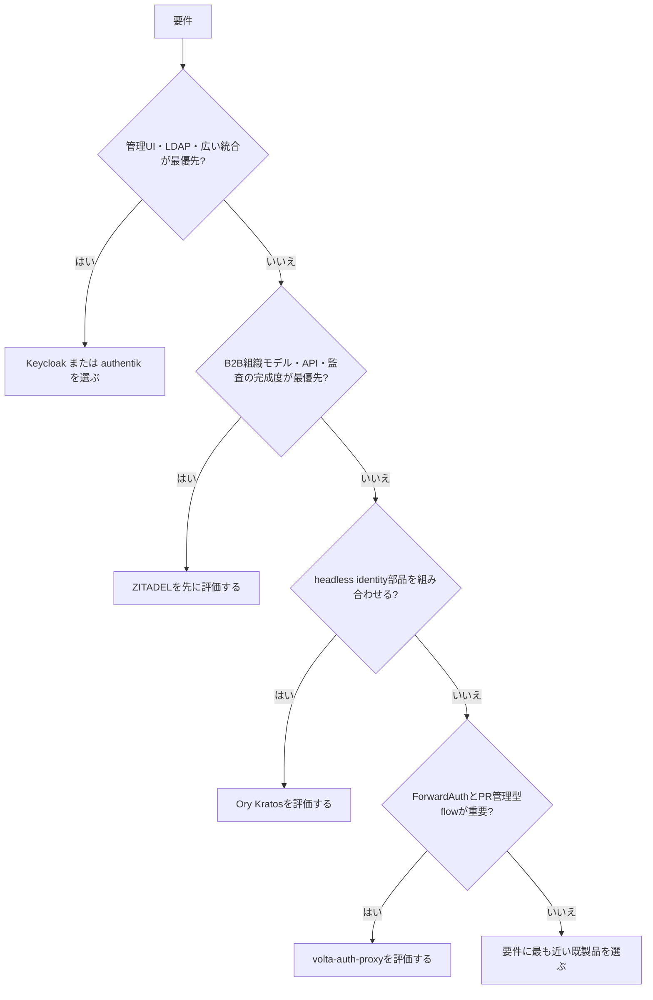

# 市場調査: volta-auth-proxy

## 0. 要約

立ち位置: SaaSの下流アプリをHTTPヘッダだけでマルチテナント認証できる、コード管理型の自己ホスト認証ゲートウェイ。

最大の弱点: 大手OSSに比べて採用実績・運用実績・周辺エコシステムが見えず、本番で任せられる証拠が不足している。

次の一手: 機能追加より、再現可能なデプロイ、脅威モデル、外部公開の検証結果を一つの導入パッケージとして示す。

## 1. このrepoは何か

volta-auth-proxy は、Traefik ForwardAuth または Nginx `auth_request` の前段に置く、Java 21/Javalin 製の自己ホスト型認証ゲートウェイである。リクエストごとにセッションを検証し、ユーザー・テナント・ロールを `X-Volta-*` ヘッダで下流アプリへ渡す。下流アプリはパスワード、SAML assertion、MFA secret を扱わない。

したがって比較単位は Java の認証ライブラリではなく、「SaaS向けの認証・テナント管理・下流連携をまとめて置き換える基盤」である。価値は本repo単体だけでなく、Traefik/Nginx（または volta-gateway）と下流アプリを組み合わせて発生する。

実装上は OIDC、SAML、TOTP MFA、Passkey、招待、SCIM、M2M OAuth、Webhook outbox、監査 sink、GDPR データ操作、ロール/ポリシー制御を含む。認証フローは tramli の state machine として Java コードで定義され、ビルド時検証・Mermaid図生成・テストを組み合わせている。

確認できた客観指標は、Java本体104ファイル・16,872行、テスト42ファイル・2,938行、JTEテンプレート21、Maven dependency宣言22件、`mvn -q test` 成功、調査時点の HEAD `7e63734` である。公開サイトの稼働状況、利用社数、SLA、本番トラフィックは確認できない。

## 1.5 調査の型

`hybrid` とした。ソースコードとテストを読める一方、利用者が選ぶのはライブラリAPIではなく、認証サーバーの機能・運用責任・プロキシ連携を含むデプロイ可能な基盤だからである。比較軸は、B2Bマルチテナント適合性、認証プロトコル、下流連携、管理性、セキュリティ検証、導入・運用負荷、ライセンスと採用シグナルに置いた。

## 2. 比較対象と選定理由

| 製品 | 何ができるか | 採用状況 | ライセンス | うちとの決定的な違い | なぜ選んだか |
|---|---|---|---|---|---|
| Keycloak | OIDC/OAuth/SAML、IdP broker、WebAuthn、MFA、LDAP/AD、管理コンソール、Organizations、SCIM（現行 docs では preview） | ★35.9k / 最新リリース 26.6.3（2026-06-04） | Apache-2.0 | 機能・エコシステム・運用実績が大きい。設定と管理UI中心 | 自己ホストIAMの標準的な代替候補で、Java製でもある |
| authentik | SAML、OAuth2/OIDC、LDAP、RADIUS、proxy provider、SCIMなどをUI/flowで構成 | ★21.7k / 最新リリース 2026.5.0（2026-05-22） | 本調査で正確なライセンス識別子を確定できず | UI/flow中心で、ForwardAuthに近いプロキシ統合と広いprovider群を持つ | self-hosted SSO と認証プロキシの実利用比較に適する |
| ZITADEL | OIDC/OAuth/SAML、MFA/Passkeys、SCIM、監査イベント、Organizations/Projects、API/SDK | ★14.6k / 最新リリース情報は参照ページで確定できず | AGPL-3.0（特定ディレクトリに例外あり） | B2Bマルチテナントを中心に設計し、イベント駆動・API-first | 本repoと同じくB2B SaaSを正面から扱うOSS |
| Ory Kratos | headlessなidentity管理、Passkeys、social login、OIDC、magic link、MFA、TOTP、SAML | ★13.8k / 最新リリース 26.2.0（2026-03-20） | Apache-2.0 | 認証・identityに特化した部品で、Ory Networkや他のOry製品との組み合わせが前提 | 「自作認証をやめる」場合のAPI-firstな部品候補 |

この地図は、単一の勝者がいる市場ではなく、巨大な統合型（Keycloak）、UI/プロキシ寄り（authentik）、B2B SaaS寄り（ZITADEL）、headless部品型（Ory）に分かれている。volta の差は機能数ではなく、下流アプリをヘッダ契約へ縮約し、認証フロー変更をPRでレビューする点にある。ただし star 数は採用そのものではなく、voltaの本番採用を裏付ける数字はまだ分からない。

## 4. 機能比較

| 機能 | 重み | volta-auth-proxy | Keycloak | authentik | ZITADEL | Ory Kratos |
|---|---|---:|---:|---:|---:|---:|
| OIDC/OAuthログイン | ◎ | ○ | ○ | ○ | ○ | ○ |
| SAML IdP/SP連携 | ◎ | ○ | ○ | ○ | ○ | △ |
| TOTP MFA / Passkey | ◎ | ○ | ○ | ○ | ○ | ○ |
| SaaSテナント・メンバー・招待 | ◎ | ○ | △ | △ | ○ | △ |
| 下流アプリへのForwardAuth/identity header | ◎ | ○ | △ | ○ | △ | △ |
| SCIM provisioning | ○ | ○ | △（preview） | ○ | ○ | △ |
| M2M client credentials | ○ | ○ | ○ | ○ | ○ | △ |
| 監査ログと外部sink | ○ | ○ | ○ | △ | ○ | △ |
| Auth flowをPRでレビュー・git revert | ◎ | ○ | × | × | △ | △ |
| 定義時のstate machine検証と図生成 | ○ | ○ | × | × | × | × |
| GDPR export/erasureの組み込み | ○ | ○ | △ | △ | △ | △ |
| 管理UI・広いproviderエコシステム | △ | △ | ○ | ○ | ○ | △ |

voltaの痛い×は、管理UIやproviderエコシステムではなく、認証基盤としての採用証拠と運用部品が不足していることだ。表の○のうち OIDC、SAML、MFA、Passkey、SCIM はすでに市場標準であり、単独の差別化にはならない。一方、ForwardAuthで下流アプリをヘッダ契約にできることと、フローをコード・テスト・レビューに載せることは、この比較単位で効く◎である。

## 4.5 コード・実装の比較

| 観点 | volta-auth-proxy | Keycloak | authentik | ZITADEL | Ory Kratos | 出典 |
|---|---:|---:|---:|---:|---:|---|
| 実装形態 | Java/Javalin単一アプリ、tramli flow | Java中心の大規模サーバー | Python/Go/Rust/TypeScript等の複合構成 | Goの大規模サーバー | Goのheadlessサーバー | 各公開リポジトリの構成 |
| 自repoのJava本体 | 104 files / 16,872 LOC | — | — | — | — | `find src/main/java ... | wc`, `wc -l` |
| 自repoのテスト | 42 files / 2,938 LOC、`mvn -q test`成功 | — | — | — | — | 調査時実行結果 |
| Maven依存宣言 | 22 | — | — | — | — | `pom.xml` |
| ライセンス | MIT | Apache-2.0 | 不明 | AGPL-3.0 | Apache-2.0 | 各 LICENSE / GitHub repository |
| 公開API数・配布サイズ | 本調査では数えない | 本調査では比較不能 | 本調査では比較不能 | 本調査では比較不能 | 本調査では比較不能 | サーバー製品のためライブラリAPI比較は不適切 |

競合4製品は「組み込みライブラリ」として配布APIを数える対象ではなく、サーバー製品または複数サービスの組み合わせであるため、公開API数・配布サイズを同じ定義で比較できなかった。公開コードのディレクトリ構成とREADMEは確認したが、各製品をローカルビルド・実行まではしていない。そのためこの行については断定しない。volta側はコードを読み、テストを実行したので、実装面の確信度は自repoに限って高い。

## 5.5 調査者の見立て

本当の勝負所は、機能数ではなく「認証の変更をコードレビュー可能な差分にしつつ、下流アプリをヘッダ契約に固定できるか」だと読める。これは Keycloak/Authentik の管理UIを置き換える話ではなく、SaaSチームの変更管理とアプリ実装を一体で軽くする話である。

数字に出ていない懸念は、認証は失敗時の責任が重く、star 数の小さい新しい基盤を選ぶには脅威モデル、第三者評価、アップグレード手順、障害時の復旧実績が必要なことだ。READMEとテストは厚いが、本番採用・SLA・外部監査は本調査では分からない。

私なら、次の四半期は新しい認証方式を増やさず、ForwardAuth契約を固定したリファレンス構成、負荷・障害・鍵ローテーションの検証、脅威モデルを公開し、「軽いから選ぶ」を「証拠があるから選ぶ」に変える。

この見立てが外れるのは、対象顧客が実は独自フローではなく、管理UI・LDAP・多数の既製統合を最優先する場合、または Keycloak/Authentik がコード管理型の同等体験を提供し始める場合である。その場合、voltaの差は薄まり、既製品を使う方が合理的になる。

## 6. 提案（優先順）

| 順 | 提案 | 分類 | 根拠 | 最小の一手 | 効きそうな指標 |
|---:|---|---|---|---|---|
| 1 | 本番導入パッケージを作る（Docker/Compose、鍵ローテーション、バックアップ・復旧、upgrade/rollback、health check） | 伸ばす | 機能差より採用リスクが最大の弱点 | 新規導入を1本の検証可能な手順にし、失敗系をCIで実行 | 初回導入時間、復旧時間、upgrade成功率 |
| 2 | ForwardAuthのヘッダ契約と信頼境界を正式仕様化する | 伸ばす | 下流アプリを簡単にする価値が中心 | `X-Volta-*` の署名/上書き防止、proxy trust、401/302契約を仕様書と統合テストにする | 下流アプリ側の認証コード行数、誤設定テスト数 |
| 3 | 独立したセキュリティ証拠を増やす | 埋める | SAML防御テストは強みだが、採用判断に必要な外部検証・脅威モデルは未確認 | STRIDE相当の脅威モデル、鍵・cookie・tenant境界の公開テストマトリクスを追加 | 未解決高リスク数、境界テスト網羅率 |
| 4 | tenant-awareの運用機能を一貫させる | 埋める | ZITADEL等はテナント管理・監査・APIを市場の主軸にしている | tenant単位の監査検索、IdP設定、quota/disable、exportを同じAPI/権限モデルへ寄せる | tenant onboarding時間、管理操作のAPI化率 |
| 5 | 管理UIでKeycloak/Authentikを全面追随する | やらない | 既製品のエコシステムとUIの再発明で、コード管理型という差別化を薄める | UI追加前に「コードで管理できないと困る要件」があるかを確認する | 対応しないUI機能の件数ではなく、導入失敗理由 |

## 7. 選択の分岐

この分岐では、voltaを選ばない条件を明示した。既製の管理面・統合数・運用実績が優先なら、voltaの機能実装量だけで逆転する理由はない。voltaは、下流アプリを認証から切り離し、フロー変更をコードレビューとテストに置きたいチームに限定して評価するのが妥当である。

## 8. 出典

| URL | 参照日 | 何の根拠に使ったか |
|---|---|---|
| [volta-auth-proxy README](https://github.com/opaopa6969/volta-auth-proxy/blob/7e6373473879aad813767a102ab908a2671d51df/README.md) | 2026-07-31 | repoの価値、ForwardAuth、対応機能、Auth as Code、tramli |
| [volta architecture](https://github.com/opaopa6969/volta-auth-proxy/blob/7e6373473879aad813767a102ab908a2671d51df/docs/architecture.md) | 2026-07-31 | 実装構成、2層state machine、SAML防御、下流連携 |
| [volta pom.xml](https://github.com/opaopa6969/volta-auth-proxy/blob/7e6373473879aad813767a102ab908a2671d51df/pom.xml) | 2026-07-31 | Java 21、依存宣言、tramli/Javalin等 |
| [volta GitHub repository](https://github.com/opaopa6969/volta-auth-proxy) | 2026-07-31 | 公開リポジトリの存在。本repoのstar数は取得できず、図示しなかった |
| [Keycloak GitHub](https://github.com/keycloak/keycloak) | 2026-07-31 | star 35.9k、Apache-2.0、Java中心の構成、公開コード規模のシグナル |
| [Keycloak Server Administration Guide](https://www.keycloak.org/docs/latest/server_admin/) | 2026-07-31 | OIDC/SAML/WebAuthn/MFA、Organizations、SCIM preview、管理UI |
| [authentik GitHub](https://github.com/goauthentik/authentik) | 2026-07-31 | star 21.7k、SSO/provider、self-host方式、複合コード構成 |
| [authentik providers](https://docs.goauthentik.io/providers/) | 2026-07-31 | OIDC/OAuth、LDAP、SAML、proxy、SCIM provider |
| [authentik OAuth2 provider](https://docs.goauthentik.io/add-secure-apps/providers/oauth2/) | 2026-07-31 | OAuth2/OIDC flow、PKCE、client credentials等 |
| [ZITADEL GitHub](https://github.com/zitadel/zitadel) | 2026-07-31 | star 14.6k、AGPL-3.0、Go構成、公開コード規模のシグナル |
| [ZITADEL Organizations](https://zitadel.com/docs/guides/manage/console/organizations-overview) | 2026-07-31 | B2B multi-tenancy、組織分離・委譲 |
| [ZITADEL API reference](https://zitadel.com/docs/apis/introduction) | 2026-07-31 | API-first、OIDC/OAuth/SAML、SDK、Actions |
| [Ory Kratos GitHub](https://github.com/ory/kratos) | 2026-07-31 | star 13.8k、Apache-2.0、headless Go構成 |
| [Ory Kratos releases](https://github.com/ory/kratos/releases) | 2026-07-31 | 最新リリースとSAML/Passkey/MFA等の更新内容 |
| [Ory Kratos product page](https://www.ory.com/kratos) | 2026-07-31 | self-hosted/OSS/Enterprise/managedの提供形態 |

競合の star とリリース日は各GitHubページで 2026-07-31 に確認した値である。authentikのライセンス識別子とZITADELの最新リリース日は本調査では確定できなかったため、front matter と本文で不明と明記した。公開コードをローカルでビルド・実行したのは自repoのみである。
