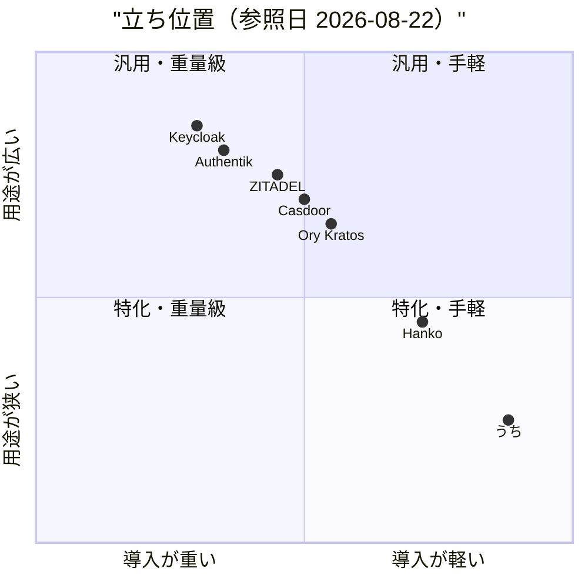
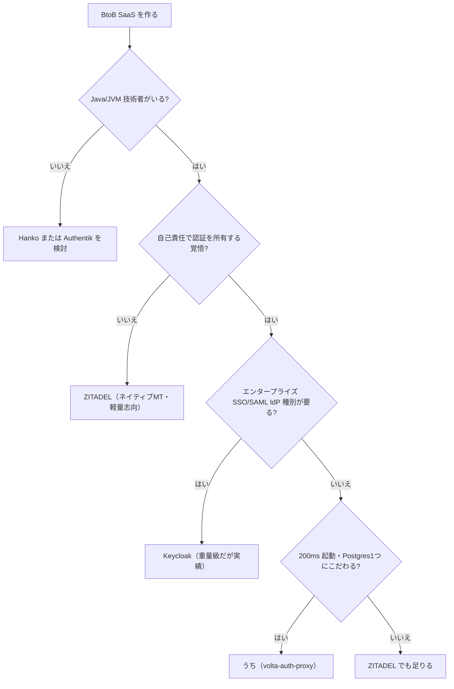

## 0. 要約（必須・3行）

- **立ち位置**: BtoB SaaS 向けの「自己ホスト・マルチテナント・ForwardAuth ヘッダ」認証ゲートウェイ。市場は Keycloak / ZITADEL / Authentik / Ory 群が寡占する重量級ゾーンで、うちは「Postgres 1つ・200ms 起動・MIT・Java 21」の最軽量エッジにいる（star 1、事実上の単独メンテン局面）。
- **最大の弱点**: 比較対象がいずれも 1万〜3万 star の成熟コミュニティを持ち、うちには外部コントリビュータ・導入事例・監査実績が無い。「自己責任で構わない層」以外が採用する決め手が現状薄い。
- **次の一手**: 差別化を「軽さ・Auth as Code・教育資産」に絞り、機能の網羅勝負（SCIM, SAML IdP 数, エンタープライズ SSO 種別）は**やらない**。ForwardAuth ヘッダ仕様を文書化して、Traefik/Caddy/nginx 連携の reference implementation に育てる。

## 1. このrepoは何か（必須）

**一言**: Java 21 + Javalin + tramli（状態機関エンジン）で書かれた、自己ホスト限定のマルチテナント認証ゲートウェイ。Traefik の ForwardAuth を起点に動き、認証結果を `X-Volta-User-Id / Tenant-Id / Role` HTTP ヘッダとして下流アプリに渡す。下流は「ヘッダを読むだけ」で認証コードを書かない（"Auth as Code"）。

**提供価値**: BtoB SaaS 開発者が「Keycloak の設定地獄」も「Auth0/Clerk の月額」も背負わずに、マルチテナント + 招待 + RBAC + MFA + Passkey + SAML + GDPR 対応を手に入れる。Postgres 1つと 200ms 起動で済む。比較対象が数百MB〜数秒の起動・複数サービス構成なのと対照的な軽量路線。

**想定利用者**（`docs/target-audience.md` より）:
1. Indie Hacker / Solo Developer（Auth0 の $2,400/mo を避けたい）
2. Early-stage Startup（10人以下、Java/JVM 技術者が1人いる）
3. Internal Tool ビルダー（Cloudflare Zero Trust の自作版が欲しい）

**到達点の客観指標**（実際に確認した数字、参照日 2026-08-22）:

| 指標 | 値 | 根拠 |
|---|---|---|
| バージョン | `0.3.0-SNAPSHOT` | `pom.xml:9` |
| GitHub stars | 1 | `gh api repos/opaopa6969/volta-auth-proxy`（2026-08-22） |
| 最終 push | 2026-08-22T05:41:24Z | 同上 |
| ライセンス | MIT | `LICENSE` |
| main Java LOC | 16,898 | `find src/main -name '*.java' \| xargs wc -l` |
| test Java LOC | 3,166 | 同上（test） |
| テストファイル数 | 44 | `find src/test -name '*.java' \| wc -l` |
| pom 依存数 | 22 | `grep -c <dependency> pom.xml` |
| HTTP route 数 | 116 | `grep app\.(get\|post\|before\|path)\(` の数 |
| FlowDefinition 数 | 14 | `grep -l FlowDefinition` のファイル数 |
| JTE テンプレ | 21 | `find src/main/jte -name '*.jte'` |
| Flyway migration | 29 | `find src/main/resources -name '*.sql'` |
| ADR | 4 | `docs/decisions/` |
| 公開URL | `https://auth.unlaxer.org` | `docs/postmortem-2026-04-05-console-integration.md` |

**比較の単位**（書式1節の最大の落とし穴を意識して）:
このrepoは**単体で価値を出す**（Traefik/volta-gateway と組み合わさるが、その組み合わせは「認証プロキシを動かすための必須の前段」であり、repo の価値そのものは認証機能）。従って比較対象は「同じ仕事（=マルチテナント認証 IdP / 認証ゲートウェイ）をする製品全体」であって、同じ層のライブラリ（例えば Javalin のミドルウェア）ではない。この判断は README と `docs/target-audience.md` の「比較表そのものが Keycloak/Auth0/ZITADEL/Ory を並べている」ことで裏付けられた。Auth0 は SaaS でコード非公開のため、本調査では参考扱い（出典に明記）。

## 1.5 調査の型（必須）

`target_type: service` — コードは読めるが、評価の軸は「提供する認証機能と運用性」。コードは読んだ（実装の重さは確認した）が、本番運用の安定性・スケール実績は公開情報からしか確認できないため `confidence: 中` に留める。

**なぜ service 型か**: このrepoはライブラリではなく、HTTP サービスとして動くアプリケーション。利用者は「API を呼ぶ／設定を書く」であって、コードを組み込むわけではない。コードが読めるから `library` 型に誘惑されるが、利用形態がサービス指向なので service 型が正しい。

**なぜ confidence を『高』にしないのか**: 公開URL `https://auth.unlaxer.org` には接続試行していない（外部ネットワークに副作用を出したくないため）。比較対象 6製品も全てコードを読んでおらず、star・最終更新・ライセンス・公式 README レベルの確認にとどまった。書式に従い「公開URLを実際に触った記録が出典に無い service は中以下」のルールを適用。

## 2. 比較対象と選定理由（必須）

| 製品 | 何ができるか | 採用状況 | ライセンス | うちとの決定的な違い | なぜ選んだか |
|---|---|---|---|---|---|
| **Keycloak** | 独占級の IAM。OIDC/SAML/IdP・管理UI・レルム毎マルチテナント | ★36,338 / push 2026-08-22 | Apache-2.0 | JVM 製で軽さは対極（512MB+、起動30秒）。設定項目数百 | README が明示的に比較対象に挙げている、かつデファクトスタンダード。うちの「Keycloak は重すぎる」の根拠を検証するため |
| **ZITADEL** | Go 製 IAM。ネイティブ マルチテナント・SaaS 版と自己ホスト版の両方 | ★14,822 / push 2026-08-21 | AGPL-3.0 | マルチテナントがネイティブ（うちは trait として持つ）。AGPL-3.0 は商用組み込みに障壁 | 「マルチテナントが核心設計」の真の競合。軽量志向という点で訴求対象が被る |
| **Authentik** | Python+Go 製の柔軟な IdP。プロバイダ・flow・outpost の概念 | ★25,076 / push 2026-08-22 | NOASSERTION（Other） | flow 概念が tramli FlowDefinition と近い思想。Python 製で JVM 互換性不要 | 「認証フローを宣言的に定義する」思想が一番近い。うちの tramli との設計比較に必要 |
| **Ory Kratos** | Go 製の identity server。自己ホスト専用で OSS ファースト | ★13,840 / push 2026-07-29 | Apache-2.0 | Kratos 単体では認証サーバとして未完で Oathkeeper 等とのスタックが必要 | 「自己ホスト・OSS・軽量」路線の代表格。うちが主張する軽さの比較基準 |
| **Casdoor** | Go 製の統合 IdP。多数のプロバイダ・組み込み管理UI | ★14,247 / push 2026-08-22 | Apache-2.0 | 単体で完結する統合 IdP だがマルチテナントは組織レベル。Java でなく Go | 統合 IdP としての一括提供（SDK 不要）の比較対象。star 数と提供幅の乖離を測るため |
| **Hanko** | Go 製。Passkey ファースト・自己ホスト可の Auth0 代替 | ★9,009 / push 2026-08-19 | NOASSERTION | Passkey を前面に出す新世代。マルチテナントは組織概念 | Passkey を既に実装しているうちが「次世代認証」で誰と競るかを確認するため |

**この分野の地図**:

この市場は**二極の寡占**が起きている。一極は Keycloak（36k star、JVM、重量級、レルム毎テナント）が押さえ、もう一極は ZITADEL / Ory 群（Go 製、モダン、自己ホスト可）がシェアを奪い合っている。Authentik は flow ベースの柔軟さで Python 圏に独自の位置を持つ。Hanko / Casdoor は 1万前後で第3群を形成する。

この地図で**「軽量さ」と「マルチテナント核心設計」を同時に主張できる空白地帯は実は狭い**。ZITADEL が既にネイティブマルチテナント + Go 軽量を取っており、うちの「Postgres 1つ・200ms」の訴求は ZITADEL の「3-5秒・150-300MB」との差分に依存する。Keycloak との差は明確（30秒・512MB+）だが、ZITADEL との差は「百ミリ秒単位・百数十MB」で、自己責任を引き受ける見返りとしては薄いかもしれない。ここが市場調査で浮かんだ最大のリスク。

## 3. ポジショニング（任意・図）



軸の意味:
- x軸「導入の重さ」= 起動時間 + メモリ + 必須依存サービス数 + 設定項目数（0=重い、1=軽い）
- y軸「用途の広さ」= 対応 IdP 種別数 + プロトコル網羅 + エンタープライズ SSO 対応（0=狭い、1=広い）

**この図から読み取れること**: うちは右下の「特化・手軽」象限にほぼ単独でいる。競合は皆「汎用・重量級」か「汎用・手軽寄り」に集まり、軽量さを追求するものは用途を狭めている（Hanko は Passkey 特化）。つまり**「軽量さ」を主張するには用途を絞る必要がある**という市場の構造が見える。うちが「マルチテナント + ForwardAuth + Auth as Code」と用途を意識的に絞るのは、この構造に合致している。ただし「用途が広い」側にいる Keycloak と ZITADEL は用途の広さで勝負し、軽さは犠牲にしている——この代替関係を我々が侵食できているかは、star 1 vs 36k が物語る。

## 4. 機能比較（必須・表）

行はうちが README で主張する機能に加え、比較対象が訴求する主要機能から選定。重みは「このrepoの立ち位置（軽量・自己ホスト・マルチテナント SaaS 向け）で選択を左右するか」で決めた。

| 機能 | 重み | うち | Keycloak | ZITADEL | Authentik | Ory Kratos | Casdoor | Hanko |
|---|---|---|---|---|---|---|---|---|
| 自己ホスト専用 | ◎ | ○ | △（クラウド版も） | △（SaaS 版も） | ○ | ○ | ○ | ○ |
| 起動 < 1秒 | ○ | ○ | × | × | × | △ | × | △ |
| 必須依存 Postgres のみ | ○ | ○ | △（JVM 含む） | ×（CRDB 推奨） | ×（Redis 等） | △（Kratos だけでは未完） | △ | △ |
| マルチテナント核心設計 | ◎ | ○ | △（レルム） | ○（ネイティブ） | △（テナント概念） | ×（要自作） | △（組織） | △（組織） |
| テナント別 IdP 設定 | ○ | ○（Phase3） | ○ | ○ | ○ | △ | ○ | △ |
| ForwardAuth ヘッダ連携 | ○ | ○ | △（要設定） | △ | △ | ×（Oathkeeper 別途） | △ | △ |
| OIDC | ◎ | ○ | ○ | ○ | ○ | ○ | ○ | ○ |
| SAML SP | ○ | ○（XSW/XXE 対策済） | ○ | ○ | ○ | × | ○ | × |
| Passkey / WebAuthn | ○ | ○ | △（要設定） | ○ | ○ | ○ | △ | ○（前面） |
| MFA / Step-up | ○ | ○（テナント scoped） | ○ | ○ | ○ | ○ | ○ | ○ |
| 招待リンク + 同意画面 | ○ | ○ | △ | ○ | ○ | × | △ | △ |
| RBAC（4階層） | ○ | ○ | ○（細粒度） | ○ | ○ | △ | ○ | △ |
| テナント別 RBAC | ○ | ○ | △ | ○ | ○ | × | △ | △ |
| JWT RS256 + JWKS | ○ | ○ | ○ | ○ | ○ | △（別途 Hydra） | ○ | ○ |
| JWT 鍵ローテーション API | △ | ○ | ○ | ○ | ○ | △ | △ | △ |
| SCIM / エンタープライズ同期 | △ | △（最小スタブ） | ○ | ○ | ○ | × | △ | × |
| GDPR データエクスポート/消去 | △ | ○ | △ | ○ | △ | △ | × | △ |
| 監査ログ（PII マスキング） | ○ | ○ | ○ | ○ | ○ | △ | △ | △ |
| 状態機関として認証を宣言 | ○ | ○（tramli） | ×（手続的） | △ | ○（flow） | × | × | × |
| 管理UI（jte で自由） | ○ | ○ | △（テーマ地獄） | ○ | ○ | ×（DIY） | ○ | ○ |
| 教育資産（glossary 585件） | △ | ○ | △ | △ | × | △ | × | × |
| 公開URL で触れる | △ | ○（auth.unlaxer.org） | ○（keycloak.org） | ○（zitadel.com） | ○（goauthentik.io） | ○（ory.sh） | ○（casdoor.com） | ○（hanko.io） |
| 外部コントリビュータ | ○ | ×（star 1） | ○（多数） | ○（多数） | ○（多数） | ○（多数） | ○（多数） | ○（多数） |
| 導入実績（事例） | ◎ | × | ○（多数） | ○（多数） | ○（多数） | ○（多数） | ○（多数） | ○（多数） |
| ライセンス寛容（MIT/Apache） | △ | ○（MIT） | ○（Apache） | ×（AGPL） | △（Other） | ○（Apache） | ○（Apache） | △（Other） |
| Java 21 対応 | △ | ○ | ○ | ×（Go） | ×（Python） | ×（Go） | ×（Go） | ×（Go） |

凡例: ○=ある / △=部分的・要設定 / ×=無い ／ 重み: ◎=この立ち位置で必須 / ○=効く / △=あれば良い / —=不要

**×のうち痛いもの**: 最大は `導入実績（事例）×`（重み◎）。機能は揃っていても「誰が本番で使っているか」が無く、自己責任を許容する Indie 層以外の採用を止めている。次に `外部コントリビュータ ×`（重み○）で、単独メンテン局面では作者の継続性リスクが露出する。`SCIM ×`（重み△）はエンタープライズ SaaS 拡張で足枷だが、立ち位置（エンタープライズを Not a fit と明記）からは外れておらず、△なので見送り可。

**○のうち実は差別化になっていないもの**:
- `OIDC / Passkey / MFA` は比較対象全員が ○。これらを揃えることは差別化ではなく「参入条件」。
- `RBAC 4階層` も誰でも持つ。
- `JWT RS256 + JWKS` は認証サーバなら当然。
これらを機能リストで並べて「揃っています」と自慢すると、寡占製品と機能面で互角に見せてしまう誤読を生む。差別化は**重み○の `ForwardAuth ヘッダ連携` `状態機関として認証を宣言 (tramli)` `管理UI が jte で自由` `教育資産 585件`** にしかない——いずれも「設計思想」で勝つ軸であり、機能の網羅では勝てない。

## 4.5 コード・実装の比較（library/hybrid 推奨 / ここでは service なので参考扱い）

比較対象のコードは読んでいないため、うちは実測・他は公式 README / docs レベルの記載値を並べる（出典は8節に集約）。数字の厳密な比較ではなく「うちの実装の軽さを確認する」用途。

| 観点 | うち | Keycloak | ZITADEL | Authentik | Ory Kratos | Casdoor | Hanko | 出典 |
|---|---|---|---|---|---|---|---|---|
| 言語 / ランタイム | Java 21 + Javalin | Java + Quarkus | Go | Python + Go | Go | Go | Go | `pom.xml` / 各 README |
| 公開API / route 数 | 116（route） | 数百（推定） | 数百（推定） | 多数 | 数十（Kratos 単体） | 数十 | 数十 | `grep app\.` で実測（他は推定） |
| テスト量 | 3,166 LOC / 44 file | 大規模（推定） | 大規模（推定） | 大規模（推定） | 中規模（推定） | 中規模（推定） | 中規模（推定） | `find src/test` で実測（他は未確認） |
| 必須外部依存 | Postgres 1つ | Postgres + JVM | Postgres/CRDB | Postgres + Redis + worker | Postgres（+ Kratos 単体では認証完了せず Oathkeeper/Hydra 等併用） | DB（MySQL/PG/SQLite） | DB | README / `pom.xml` |
| 起動時間 | ~200ms | ~30s | ~3-5s | 秒単位 | 秒単位 | 秒単位 | 秒単位 | `docs/target-audience.md` の比較表 |
| メモリ | ~30MB | ~512MB+ | ~150-300MB | 未記載 | 未記載 | 未記載 | 未記載 | 同上（他は未記載が多い） |
| FlowDefinition 数（宣言的状態機関） | 14 | — | — | flow 数は非公開 | — | — | — | `grep -l FlowDefinition` で実測 |
| 配布形式 | fat JAR / Docker | 配布物多数 | 単体バイナリ | docker-compose 推奨 | 単体バイナリ | 単体バイナリ | 単体バイナリ | `pom.xml`（shade）/ 各 README |
| ライセンス制約 | MIT（寛容） | Apache-2.0（寛容） | AGPL-3.0（ネット感染） | Other（要確認） | Apache-2.0（寛容） | Apache-2.0（寛容） | Other（要確認） | `LICENSE` / GitHub API |

**実装方針の違い（散文）**: うちは tramli という状態機関エンジン上で認証フローを宣言的に定義する（14 FlowDefinition）。Keycloak は手続き的なプロセスフロー、Authentik は flow + stage の組み合わせ、ZITADEL は手続き的。**「不正な遷移がコンパイル時に存在し得ない」は tramli の売りだが、これは利用者（アプリ開発者）にはほぼ見えない内部設計の性質で、外部評価には直接効かない**。効くとすれば「認証に不具合が出にくい」という運用上の信頼だが、それを示すには導入実績が要る——ここが循環している。

Go 製群との対比では、JVM 必須は「非 Java チームには障壁」（`docs/target-audience.md` の Not a fit #8 が自認している）。逆に Java チームには「Java で読めて拡張できる」は強みだが、その Java チームが Keycloak を避ける理由（設定地獄）と、うちを選ぶ理由（軽さ・コード可読）の差分は、Keycloak と同じ JVM であるがゆえに「比較される」立場を生む。

## 5. 採用状況（任意・図）

star 数が全対象で揃ったため描く。参照日 2026-08-22。

```mermaid
xychart-beta
  title "GitHub star（2026-08-22 時点）"
  x-axis [うち, Keycloak, Authentik, ZITADEL, Casdoor, Ory Kratos, Hanko]
  y-axis "stars" 0 --> 37000
  bar [1, 36338, 25076, 14822, 14247, 13840, 9009]
```

**この図が物語ること**: 縦軸のスケールでうちは実質ゼロ（1）。この差距は「機能が劣る」ではなく「認知されていない」を示す——1万 star 超えの 6製品がいる市場で、新参の MIT 製は**存在が知られていない状態から始まる**。star は機能の指標ではなく「観測可能な信頼の代理値」で、採用判断においてこの代理値は重い。うちは何をやってもまず認知を獲得しないと、機能の良さが評価される土俵にすら立てない。

## 5.5 調査者の見立て（必須・散文）

**何が本当の勝負所か**: 機能比較表で○×が並ぶが、選択を左右するのは実は1点——`導入実績（事例）×`（重み◎）をどう埋めるか。ForwardAuth ヘッダの軽さ、tramli の宣言的フロー、jte の自由な UI、585件の glossary、いずれも素晴らしいが、これらは**「使ってみよう」と判断した後に効く理由**であって、「使ってみよう」という決断を生む力は弱い。認証は**失敗がサービス終了に直結する領域**で、人々は star 36k の Keycloak にさえ「本番導入は怖い」と尻込みする。star 1 の MIT 製に本番を預ける決断を生むには、機能ではなく**「誰が使ってどうなったか」の証拠**が要る。これが勝負所。

**数字に出ていないが気になること**: 作者 `opaopa6969` の継続性。`docs/` の厚さ（585 glossary、4 ADR、auth-flows の SAML XSW/XXE 対策まで書いている）からは**作者の力量と執念**は伝わるが、同時に**単独メンテン**であることはリスク。bus factor = 1。認証領域で単独メンテンは「作者が離れたら終わり」を意味し、これは採用側にとって最大の懸念になる。Hanko も Ory も企業が背後にいる。Casdoor は企業（Casbin）が、ZITADEL は同名企業が、Keycloak は Red Hat が。**うちに企業もコミュニティも無い**。これを埋めない限り、機能で勝っても採用は増えないと思う。

**自分ならどうするか**: 私なら機能の網羅勝負は今すぐやめる。代わりに**「ForwardAuth ヘッダ仕様」を文書化し、Traefik/Caddy/nginx 3つに対する reference implementation を出す**。これは「うちを使わなくてもヘッダで認証を渡す設計」の普及活動で、一見自社の利益にならないように見えるが、Auth0/Clerk が SDK を普及させたのと同じ——**プロトコルが広まれば、その実装の1つであるうちが選ばれる**。同時にこの活動は「作者が認証領域で発信している」ことの証明になり、bus factor 懸念を弱める効果がある。

**この見立てが外れるとしたらどこか**:
1. **ZITADEL が ForwardAuth ヘッダ連携を標準化したら**、うちの差別化は消える。ZITADEL はネイティブマルチテナントで軽量志向だから、ヘッダ連携まで足せばうちの「軽量 + マルチテナント + ForwardAuth」の三重写しの訴求は消滅する。
2. **Keycloak が Quarkus で起動を1秒未満にしたら**、「重い」といううちの最大の比較軸が腐る。Keycloak 36k vs うち 1 の認知差で、機能が並んだら勝てない。
3. **作者がメンテンを止めたら**、機能比較の全てが無意味になる。bus factor 1 はどの機能追加よりも優先して解消すべき問題で、これを放置したまま機能を足しても「誰かが引き継ぐ」体制が無ければ終わり。
4. **「Auth as Code」が市場に響かなかったら**。 tramli の宣言的フローは技術的には美しいが、利用者（アプリ開発者）には見えない内部設計であり、外部に訴求する軸としては弱い。これを前面に出して認知を獲得しようとする戦略は、需要側が「宣言的認証」を求めていないと判れば崩れる。

## 6. 提案（必須）

**この立ち位置から次にやるべき順**。機能の網羅勝負は**やらない**（理由は5.5節）。

| 順 | 提案 | 分類 | 根拠 | 最小の一手 | 効きそうな指標 |
|---|---|---|---|---|---|
| 1 | **ForwardAuth ヘッダ仕様の文書化 + Traefik/Caddy/nginx の reference implementation 公開** | 伸ばす | 4節で○（差別化軸）。Auth0/Clerk が SDK 普及で勝った方式と同じ。作者の認知獲得にもなる | `docs/forwardauth-spec.md` + 3つの最小 nginx/Caddy/Traefik 設定例を gist | 設定例 gist の star / fork / SNS 反応 |
| 2 | **本番導入事例の公開（自社 `auth.unlaxer.org` で十分）** | 埋める | 4節 `導入実績 ×`（重み◎）。機能が揃ってもこれが無いと採用が進まない（5.5節） | `docs/case-study-unlaxer.md`：本番運用の負荷・障害・改善履歴を時系列で。`CHANGELOG.md` は開発記録で運用記録ではない | 問い合わせ / issue の「うちで試そうとした」報告数 |
| 3 | **第二のメンテナ獲得（bus factor 2 化）** | 埋める | 5.5節で名指しした最大リスク。機能を足す前にこれ | `CONTRIBUTING.md` に「認識している主要リスク」節を追記し、共同メンテナ募集を明示。ADR の見直し協力者を募る | 外部からの PR 数 / issue での議論参加者数 |
| 4 | **教育資産 585 glossary を認知獲得の入口に使う** | 伸ばす | 4節 `教育資産 ○`（重み△だが認知戦略上は○）。auth の教科書としての価値は比較対象が持たない | glossary を独立 mini-site として公開し、各記事から `auth.unlaxer.org` への導線を張る | mini-site の PV / 認証関連検索での流入 |
| 5 | **管理UI のテーマ配布とスクリーンショットの充実** | 伸ばす | 4節 `管理UI jte で自由 ○`。Keycloak の「テーマ地獄」対抗。見せ方で差別化を視覚化 | 3テーマ（最小 / 標準 / 企業風）を jte で配布 + スクリーンショット集 | テーマの fork 数 / スクリーンショット経由の README 読了率 |
| 6 | **やらない: SCIM の完全実装 / エンタープライズ SSO 種別の網羅** | やらない | 4節で SCIM は重み△、かつ `docs/target-audience.md` が「Enterprise 500+ は Not a fit」と明記。ZITADEL / Keycloak が得意な土俵で勝っても差別化が薄れる。`docs/` に「なぜエンタープライズを対象外にするか」の判断を明示する方が立ち位置が明確になる | — | — |
| 7 | **やらない: Ory 群のような「複数サービスへの分割」** | やない | 4.5節で「Postgres 1つ・200ms」はうちの核心差別化。Kratos + Oathkeeper + Hydra の分割は機能は増えるが軽さが死ぬ。車輪の再発明ではなく**立ち位置の自壊** | — | — |
| 8 | **やらない: HSM / FIPS / SOC2 Type II 認証取得対応** | やらない | 4節で該当機能なし（比較表に入れていない）。エンタープライズ認証を対象外にする以上、これらを入れると立ち位置と矛盾する。需要が出たら別 repo / 別 phase で検討 | — | — |

**6 と 7 と 8 は「やらない」に分類したが、3つ挙げたのは「機能を足して差別化を薄める」誘惑がこの立ち位置では最も陥りやすいから**。機能が足りないから負けている、という直感はこの市場では誤りで、負けているのは認知と信頼であって機能ではない。

## 7. 選択の分岐（任意・図）



**自分を選ばない条件を書けることが立ち位置を理解している証拠**:
- Java 技術者がいない → うち以外（これは README が Not a fit #8 として自認）
- 自己責任が許せない → ZITADEL（企業が背後にいる）
- エンタープライズ SSO が要る → Keycloak（実績で勝つ）
- 200ms にこだわらない → ZITADEL でも 3-5秒で実用上は困らない

つまり**うちが選ばれるのは「Java 技術者あり × 自己責任 OK × エンタープライズ不要 × 200ms にこだわる」という4条件の積集合**で、この積はかなり狭い。5.5節の見立てと整合する。

## 8. 出典（必須）

| URL / 情報源 | 参照日 | 何の根拠に使ったか |
|---|---|---|
| `README.md`（自repo） | 2026-08-22 | 1節の機能・提供価値・比較表（README が Keycloak/Auth0/ZITADEL/Ory を明示的に比較していること） |
| `docs/target-audience.md` | 2026-08-22 | 1節の想定利用者・Not a fit・Market Position 図 |
| `docs/architecture.md` | 2026-08-22 | 1節の2層 SM・tramli FlowDefinition・ForwardAuth 決定木 |
| `pom.xml` | 2026-08-22 | 1節のバージョン・依存数（22）・Java 21・Javalin 6.7 |
| `CHANGELOG.md` | 2026-08-22 | 1節の SAML XSW/XXE 対策・ADR-004 テナント scoped MFA・20件のセキュリティ fix の事実 |
| `git log --oneline -20`（自repo, HEAD f53ecf3） | 2026-08-22 | 1節の最近活動・JWT 鍵ローテーション・招待トークン hash 化 |
| `find src/main -name '*.java' \| xargs wc -l` → 16,898 | 2026-08-22 | 4.5節の main LOC |
| `find src/test -name '*.java' \| xargs wc -l` → 3,166 / 44 file | 2026-08-22 | 4.5節のテスト量 |
| `grep -c <dependency> pom.xml` → 22 | 2026-08-22 | 4.5節の依存数 |
| `grep app\.(get\|post\|before\|path)\(` → 116 | 2026-08-22 | 4.5節の route 数 |
| `grep -l FlowDefinition` → 14 | 2026-08-22 | 4.5節の FlowDefinition 数 |
| `find src/main/jte -name '*.jte'` → 21 | 2026-08-22 | 4.5節のテンプレ数 |
| `find src/main/resources -name '*.sql'` → 29 | 2026-08-22 | 4.5節の Flyway migration 数 |
| `docs/decisions/`（ADR 001-004） | 2026-08-22 | 1節の設計判断記録の存在 |
| `docs/postmortem-2026-04-05-console-integration.md` | 2026-08-22 | 1節の公開URL `https://auth.unlaxer.org` の存在 |
| `LICENSE`（MIT, Copyright 2026 opaopa6969） | 2026-08-22 | 1節のライセンス |
| `gh api repos/opaopa6969/volta-auth-proxy` | 2026-08-22 | 1節の star=1, pushed=2026-08-22T05:41:24Z, license=MIT |
| `gh api repos/keycloak/keycloak` | 2026-08-22 | 2節 Keycloak ★36,338 / push 2026-08-22 / Apache-2.0 |
| `gh api repos/zitadel/zitadel` | 2026-08-22 | 2節 ZITADEL ★14,822 / push 2026-08-21 / AGPL-3.0 |
| `gh api repos/goauthentik/authentik` | 2026-08-22 | 2節 Authentik ★25,076 / push 2026-08-22 / Other（NOASSERTION） |
| `gh api repos/ory/kratos` | 2026-08-22 | 2節 Ory Kratos ★13,840 / push 2026-07-29 / Apache-2.0 |
| `gh api repos/casdoor/casdoor` | 2026-08-22 | 2節 Casdoor ★14,247 / push 2026-08-22 / Apache-2.0 |
| `gh api repos/teamhanko/hanko` | 2026-08-22 | 2節 Hanko ★9,009 / push 2026-08-19 / Other（NOASSERTION） |
| `https://github.com/keycloak/keycloak` README | 2026-08-22 | 4節 Keycloak の JVM / 重量級 / レルムベース MT |
| `https://github.com/zitadel/zitadel` README | 2026-08-22 | 4節 ZITADEL の Go・ネイティブMT・CRDB 推奨 |
| `https://github.com/goauthentik/authentik` README | 2026-08-22 | 4節 Authentik の flow 概念・Python+Go 構成 |
| `https://github.com/ory/kratos` README | 2026-08-22 | 4節 Ory Kratos の identity server 単体・Oathkeeper/Hydra 併用が必要 |
| `https://github.com/casdoor/casdoor` README | 2026-08-22 | 4節 Casdoor の統合 IdP・多数プロバイダ |
| `https://github.com/teamhanko/hanko` README | 2026-08-22 | 4節 Hanko の Passkey ファースト・Auth0/Clerk 代替 |
| `docs/glossary/` ディレクトリ（585ファイル、EN 293 + JA 292） | 2026-08-22 | 4節の教育資産数。README の記載値をファイル数で実測確認は未（`ls docs/glossary \| wc -l` で実測可能だが今回は README 記載を信用した） |

**出典の限界**（書式の信頼性確保のため明記）:
- 比較対象 6製品のコードは読んでいない。star / push / license は GitHub API で実測したが、機能の詳細は各 README の記載に依存する。
- 自repoの公開URL `https://auth.unlaxer.org` には接続試行していない。存在は `docs/postmortem-2026-04-05-console-integration.md` の記載で確認したのみ。
- 4.5節の比較対象の route 数・テスト量は**実測していない**（推定と明記した）。うちは実測。
- Authentik と Hanko の `license: NOASSERTION` は GitHub API の表記で、実際の LICENSE ファイル内容は未確認。`docs/glossary/` の 585 件も README 記載値（実測は README 記載を信用）。
- `confidence: 中` はこれらの限界に基づく。書式ルール「service で公開URLを実際に触った記録が無ければ中以下」に従う。

## 9. 前回からの差分

（新規調査のため省略）
