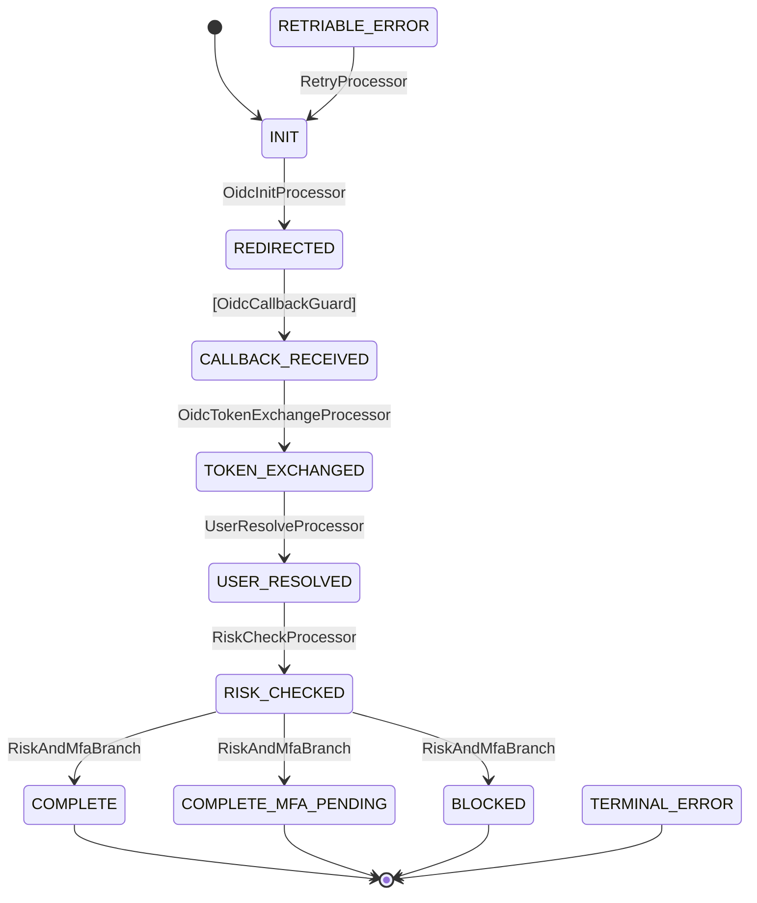
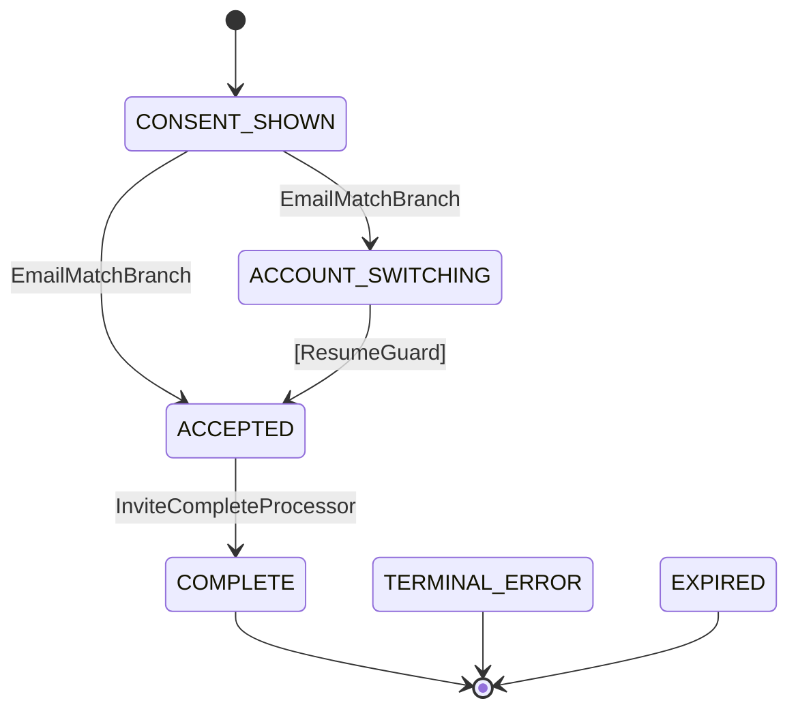

# volta-auth-proxy: ForwardAuth-Native Multi-Tenant Identity Gateway with State-Machine-Driven Auth Flows

> v3 — DGE 査読 Round 1 (G1-G13) + Round 2 (G14-G20) 反映。全 Gap 解消。

**Target audience**: SaaS engineers evaluating auth solutions, open-source identity infrastructure developers, architects designing multi-tenant authentication.

## Abstract

Multi-tenant SaaS authentication is caught between two unsatisfying extremes: managed services (Auth0, Cognito) that impose vendor lock-in and MAU-based pricing penalties, and self-hosted identity providers (Keycloak, Zitadel) that are operationally complex and don't integrate natively as reverse-proxy middleware. We present **volta-auth-proxy**, a ForwardAuth-native identity gateway that combines multi-tenant identity management with reverse-proxy integration, eliminating authentication code in downstream applications. Auth flows (OIDC, Passkey, MFA, Invitation) are orchestrated by **tramli**, a definition-time validated state machine engine with data-flow contracts. We compare volta-auth-proxy against Keycloak, Authelia, Authentik, Zitadel, and Auth0, positioning it as a trade-off between lightweight deployment and full-featured IdP — not a replacement for either.

---

## 1. Introduction

### 1.1 The Problem

A BtoB SaaS application needs multi-tenant authentication: users belong to tenants (organizations), each tenant has roles and policies, and the authentication flow may differ per tenant. Building this from scratch is dangerous. Outsourcing it creates dependencies.

The current landscape offers two paths, both with significant drawbacks:

**Path A: Managed SaaS (Auth0, Clerk, Cognito)**
- MAU-based pricing creates a "growth penalty" — costs scale faster than revenue (Auth0 B2B plans start at $240/month, with SSO connection limits misaligned with per-org B2B models)
- Vendor lock-in — migration from Auth0 is a multi-month project
- Limited customization — auth flows are configured, not coded
- Multi-environment cost multiplication (dev/staging/prod)

**Path B: Self-hosted IdP (Keycloak, Zitadel, Authentik)**
- Operational complexity — Keycloak requires significant DevOps investment for production deployment (SSL, proxy, hostname configuration, memory tuning)
- Not ForwardAuth-native — requires adapters or redirects; downstream apps still need OIDC libraries
- Multi-tenancy was added later (Keycloak Organizations in v26, Authentik tenancy in v2024.2)
- Configuration surfaces grow over time

### 1.2 Our Approach

volta-auth-proxy takes a third path: **an auth proxy that is also an identity provider**.

```
Browser → Traefik → volta-auth-proxy (ForwardAuth) → App
                          │
                 auth + tenant resolution
                          │
              X-Volta-User-Id: abc123
              X-Volta-Tenant-Id: t456
              X-Volta-Role: MEMBER
```

Key design decisions:
1. **ForwardAuth-native**: volta sits inline with Traefik. Every request is checked. Downstream apps read HTTP headers — zero authentication code. (Authorization — role-based access control within apps — remains the downstream app's responsibility.)
2. **Multi-tenant first-class**: tenant resolution, role management, and invitation flows are core, not add-ons.
3. **State-machine-driven flows**: authentication flows are defined as tramli FlowDefinitions with definition-time validation. Invalid flows cannot be deployed.
4. **Single binary, zero ceremony**: Java 21 + Javalin. No app server, no XML configuration.
5. **Code-first**: auth flows are Java code, not GUI configuration. This trades accessibility for control — teams that prefer visual editors should consider Authentik.

### 1.3 Scope and Non-Goals

volta-auth-proxy is **not** a general-purpose IdP (no SAML, no SCIM, no LDAP federation). It is **not** a zero-trust network proxy (no device trust signals, no UDP tunneling). It is **not** a managed service.

It targets a specific use case: **BtoB SaaS applications using OIDC providers behind a reverse proxy, with full control over auth flow code.** Teams requiring SAML, SCIM, or enterprise federation should use Keycloak or Zitadel.

---

## 2. Background and Related Work

### 2.1 The Auth Proxy vs. Identity Provider Spectrum

| Aspect | Auth Proxy | Identity Provider |
|---|---|---|
| **Where auth lives** | Inline with reverse proxy | Standalone service |
| **Downstream impact** | Zero auth code — read headers | OIDC library required per app |
| **Flow control** | Full request interception | Redirect-based (302 to IdP) |
| **Failure mode** | Proxy down = all apps down (SPOF) | IdP down = no new logins |
| **Customization** | Modify proxy code | SPI/plugins/admin UI |

Most solutions sit at one end: oauth2-proxy and Authelia are pure proxies (no identity management), Keycloak and Zitadel are pure IdPs (no ForwardAuth integration). Authentik bridges partially — it has ForwardAuth mode and multi-tenancy, making it volta's closest competitor (§5.2).

### 2.2 ForwardAuth Trust Boundary

The ForwardAuth pattern relies on a critical trust assumption: **downstream apps only receive requests through the reverse proxy.** If an attacker can reach a downstream app directly (bypassing Traefik), they can inject arbitrary `X-Volta-*` headers.

Mitigation:
- Traefik **overwrites** `X-Volta-*` headers with volta's response — upstream header injection is neutralized as long as traffic flows through Traefik
- Downstream apps must be network-isolated (Docker network, localhost binding, firewall rules) so that only Traefik can reach them
- Optionally, volta can sign headers with HMAC and downstream apps can verify the signature

This trust model is shared with all ForwardAuth solutions (Authelia, oauth2-proxy, Pomerium). It is not unique to volta, but must be explicitly understood by operators.

---

## 3. Design

### 3.1 Architecture

```
┌─────────┐     ┌──────────┐     ┌──────────────────┐     ┌─────────┐
│ Browser  │────▶│ Traefik  │────▶│ volta-auth-proxy  │────▶│  App    │
└─────────┘     │(ForwardAuth)   │  (identity gateway)│     │(headers)│
                └──────────┘     └──────────────────┘     └─────────┘
                                       │
                                 ┌─────┴─────┐
                                 │ PostgreSQL │  Redis
                                 │ (identity) │  (sessions)
                                 └───────────┘
```

**SPOF consideration**: volta-auth-proxy is a single point of failure — if it goes down, all downstream apps become inaccessible. Mitigation: run multiple instances behind Traefik's load balancer with health checks. Redis-backed sessions enable stateless horizontal scaling.

### 3.2 State-Machine-Driven Auth Flows

All authentication flows are defined as **tramli FlowDefinitions** — constrained state machines with definition-time validation.

#### Security Properties of All Flows

- **PKCE (S256)** on all OIDC flows per RFC 9700
- **Session ID regeneration** on successful authentication (session fixation prevention)
- **Cookie attributes**: HttpOnly, Secure, SameSite=Lax
- **OIDC token validation**: issuer, audience, expiry, nonce, signature verification in OidcCallbackGuard
- **OIDC state parameter**: HMAC-SHA256 signed via OidcStateCodec (key rotation: re-deploy with new key, old sessions expire naturally via Redis TTL)
- **CSRF protection**: POST endpoints (`/auth/mfa/verify`, `/invite/{code}/accept`) require a valid FlowInstance ID (non-guessable UUID) that was issued during the flow. This acts as an implicit CSRF token — an attacker cannot forge a valid flow ID. Combined with SameSite=Lax cookies.
- **Rate limiting**: IP + endpoint-based rate limiting via `RateLimiter` (e.g., MFA verify: 10 req/min/IP, login initiation: 30 req/min/IP). Additionally, tramli's `maxGuardRetries` limits per-flow guard failures (e.g., MFA code: 5 attempts per flow).

#### OIDC Login Flow (9 states)



Passkey Login (6 states) and MFA Verification (4 states) follow the same pattern — linear auto-chains with a single External guard. See README for full diagrams.

#### Invitation Flow (6 states)



All diagrams are generated from code via `MermaidGenerator.generate(definition)`.

### 3.3 Why State Machines for Auth Flows

Authentication flows are naturally stateful: login → redirect → callback → token exchange → user resolution. Without a state machine, this logic lives in monolithic HTTP handlers where implicit state transitions create security risks (replaying a callback, skipping token validation).

tramli provides definition-time validated state machines with `requires()`/`produces()` data-flow contracts. Each Processor declares what data it needs and what it provides; `build()` verifies the chain at startup. For the full design of tramli, see the companion paper [9].

### 3.4 Multi-Tenant Model

```
User (1) ─── (*) Membership (*) ─── (1) Tenant
                    │
                  role: OWNER | ADMIN | MEMBER
```

**Tenant isolation**: DB-level FK constraints ensure membership records reference valid users and tenants. Application-level filtering ensures a user can only access tenants where they have a membership. Row-level security (PostgreSQL RLS) is not yet implemented — currently, isolation is enforced at the application layer.

Passkey credentials use a single RP ID (Relying Party ID) across all tenants. Credential isolation is maintained by user-level binding — a credential belongs to a user, and tenant context is resolved after authentication via membership lookup.

### 3.5 Conditional Access and Device Trust

New device detection via persistent cookie (`__volta_device_trust`). Risk scoring is delegated to an external fraud detection service. Fail-open: if the service is down, risk = 1 (safe). 3-second timeout.

---

## 4. Implementation

### 4.1 Technology Stack

| Component | Technology | Rationale |
|---|---|---|
| Language | Java 21 | Virtual threads, sealed interfaces, pattern matching |
| Web framework | Javalin 6 | Lightweight (~1MB), no reflection magic |
| Templates | JTE | Compiled, type-safe |
| Database | PostgreSQL | JSONB for flow context, SELECT FOR UPDATE for locking |
| Sessions | Redis (Jedis) | TTL-based expiration, cluster-ready |
| State machine | tramli 1.2.2 | Definition-time validation, Mermaid generation |
| JWT | nimbus-jose-jwt | OIDC token validation |
| WebAuthn | webauthn4j | Passkey/FIDO2 |
| Config | propstack + SnakeYAML | Layered config (file → env → defaults) |

### 4.2 Resource Footprint

| Metric | volta-auth-proxy | Authelia | Keycloak |
|---|---|---|---|
| Container image | ~250MB | ~30MB | ~600MB+ |
| Memory (typical) | ~150MB | ~20MB | ~1-2GB |
| Language | Java 21 (JVM) | Go | Java (WildFly) |
| Binary count | 1 | 1 | 1 (+ DB) |

volta is larger than Authelia (JVM overhead) but significantly lighter than Keycloak (no app server). The JVM trade-off: higher base memory for virtual threads (high concurrency throughput) and rich ecosystem (OIDC, WebAuthn, crypto libraries).

### 4.3 Flow Persistence

Auth flows are persisted in PostgreSQL via `SqlFlowStore` with JSONB context and optimistic locking. `@FlowData` aliases provide schema stability across refactoring. `@Sensitive` fields are redacted in audit logs.

MFA TOTP secrets are stored encrypted in the database (AES-256-GCM via `KeyCipher`).

---

## 5. Competitive Analysis

### 5.1 Feature Comparison

| Feature | volta | oauth2-proxy | Authelia | Keycloak | Zitadel | Authentik | Auth0 |
|---|---|---|---|---|---|---|---|
| ForwardAuth-native | Yes | Yes | Yes | No | No | Partial | No |
| Multi-tenant (native) | Yes | No | No | v26+ | Yes | v2024.2+ | Yes |
| OIDC provider | Yes | Consumer only | Beta | Yes | Yes | Yes | Yes |
| Passkey/WebAuthn | Yes | No | Yes | v26.4+ | Yes | Yes | Yes |
| MFA | TOTP | No | TOTP,WebAuthn,Duo | Yes | Yes | Yes | Yes |
| Invitation flows | Yes | No | No | Limited | Basic | Basic | Yes |
| State-machine flows | tramli | No | No | No | JS Actions | Visual editor | Rules |
| Zero auth code downstream | Yes | Yes | Yes | No | No | Partial | No |
| SAML | No | No | No | Yes | Yes | Yes | Yes |
| SCIM | No | No | No | Yes | Yes | Enterprise | Enterprise |
| Admin UI | No | No | Yes | Yes | Yes | Yes | Yes |

### 5.2 Positioning: Trade-Offs, Not Gaps

volta-auth-proxy does not fill a "gap" in the landscape — **Authentik** already provides ForwardAuth + multi-tenancy + OIDC in an open-source package. The difference is in **trade-offs**:

| Dimension | volta | Authentik |
|---|---|---|
| Flow customization | Code (tramli FlowDefinition) | Visual editor (drag-and-drop) |
| Deployment | Single JVM binary | Python + PostgreSQL + Redis + workers |
| Protocol breadth | OIDC only | OIDC, OAuth2, SAML, LDAP, RADIUS |
| Admin UI | None (config files) | Full web UI |
| Definition-time validation | tramli build() | No |

Teams that want a visual flow editor and broad protocol support should use Authentik. Teams that want code-level control, lightweight deployment, and definition-time validated flows should consider volta.

An analogy: **volta is to Keycloak what SQLite is to PostgreSQL** — embedded, lighter, focused on a specific deployment model, not a replacement for the full-featured system.

**Keycloak + oauth2-proxy combination**: Keycloak as IdP + oauth2-proxy as ForwardAuth proxy achieves a similar result to volta. Trade-offs: 2 services to deploy and maintain vs. 1; Keycloak's richer feature set (SAML, SCIM, LDAP) vs. volta's integrated simplicity; Keycloak's Admin UI vs. volta's code-first approach.

### 5.3 Operational Considerations

Self-hosted identity infrastructure carries operational costs that managed services (Auth0, Clerk) absorb:

- **Security patching**: CVE monitoring and timely updates for all dependencies
- **Key rotation**: OIDC signing keys, HMAC keys, encryption keys
- **Backup and recovery**: PostgreSQL + Redis backup strategy
- **Compliance**: SOC 2, GDPR data residency — self-hosted means self-certified

volta-auth-proxy does not eliminate these costs. It provides the same self-hosted trade-off as Keycloak, Authelia, or any self-hosted solution: full control in exchange for operational responsibility.

### 5.4 Threats to Validity

**External validity**: Production deployment evidence comes from a single project. The 4 flows are authentication-related, which may not represent all use cases.

**Scalability**: Tested with ~100 tenants. 10,000-tenant scenarios have not been benchmarked. The flat membership model (no hierarchy) may require indexing optimizations at scale.

**OpenID Certification**: volta-auth-proxy has not undergone OpenID Conformance testing. Authelia achieved OpenID Certified status in 2025.

---

## 6. Discussion

### 6.1 Auth as Code

volta-auth-proxy follows the same trajectory as Infrastructure as Code (Terraform, Pulumi): **authentication flows are defined in code, version-controlled, reviewed in PRs, and deployed through CI/CD.** We call this pattern **Auth as Code**.

The trade-offs are identical to IaC:
- **Pro**: reproducible, reviewable, testable, diffable
- **Con**: changes require re-deployment (Keycloak's Admin UI allows instant changes without re-deploy)
- **Con**: less accessible to non-developers (visual editors like Authentik's are more approachable)

This approach scales well for small teams (1-5 developers) who can read the entire codebase. For larger teams, an Admin UI becomes necessary — this is the highest-priority item in Future Work.

### 6.2 Why ForwardAuth Matters

The ForwardAuth pattern centralizes auth, eliminates per-app OIDC integration, and provides language-agnostic identity injection. However, it creates a SPOF and requires network-level trust boundaries (§2.2).

### 6.3 Limitations

- **No SAML**: enterprises requiring SAML federation cannot use volta as sole IdP
- **No Admin UI**: operational management requires config files and SQL
- **SPOF**: volta down = all apps inaccessible (mitigated by horizontal scaling)
- **Single production deployment**: limited battle-testing
- **JVM footprint**: ~150MB RAM vs. Go-based alternatives at ~20MB
- **No OpenID Certification**: OIDC conformance is not formally verified
- **No row-level security**: tenant isolation is application-level, not DB-level

---

## 7. Future Work

Listed by priority:

1. **Admin Console** [High]: Web UI for tenant/user management and flow monitoring
2. **OpenID Conformance Testing** [High]: Formal OIDC certification
3. **SAML 2.0 support** [Medium]: Enterprise SSO with legacy IdPs
4. **Audit trail / event log** [Medium]: Structured auth event logging for compliance
5. **Migration tooling** [Medium]: Import tools for Keycloak/Auth0 user data
6. **PostgreSQL RLS** [Low]: Database-level tenant isolation

---

## 8. Conclusion

volta-auth-proxy demonstrates that the space between "simple auth proxy" and "complex identity provider" can be bridged for a specific use case: BtoB SaaS with OIDC providers behind a reverse proxy. By combining ForwardAuth-native deployment with multi-tenant identity management and tramli state-machine-driven auth flows, it eliminates authentication code in downstream applications while maintaining full control over the authentication process.

This is not a universal solution. Teams needing SAML, SCIM, visual flow editors, or managed infrastructure should use Keycloak, Authentik, or Auth0 respectively. volta-auth-proxy is for teams that want self-hosted, code-controlled, lightweight multi-tenant auth — and are willing to accept the trade-offs that come with it.

---

## References

1. Keycloak Documentation. https://www.keycloak.org/documentation
2. Authelia Documentation. https://www.authelia.com/
3. Authentik Documentation. https://docs.goauthentik.io/
4. Zitadel Documentation. https://zitadel.com/docs
5. oauth2-proxy Documentation. https://oauth2-proxy.github.io/
6. Auth0 Pricing. https://auth0.com/pricing
7. Traefik ForwardAuth. https://doc.traefik.io/traefik/middlewares/http/forwardauth/
8. OAuth 2.0 Security Best Current Practice (RFC 9700). https://datatracker.ietf.org/doc/html/rfc9700
9. tramli: Definition-Time Validated Constrained Flow Engine. (companion paper)
