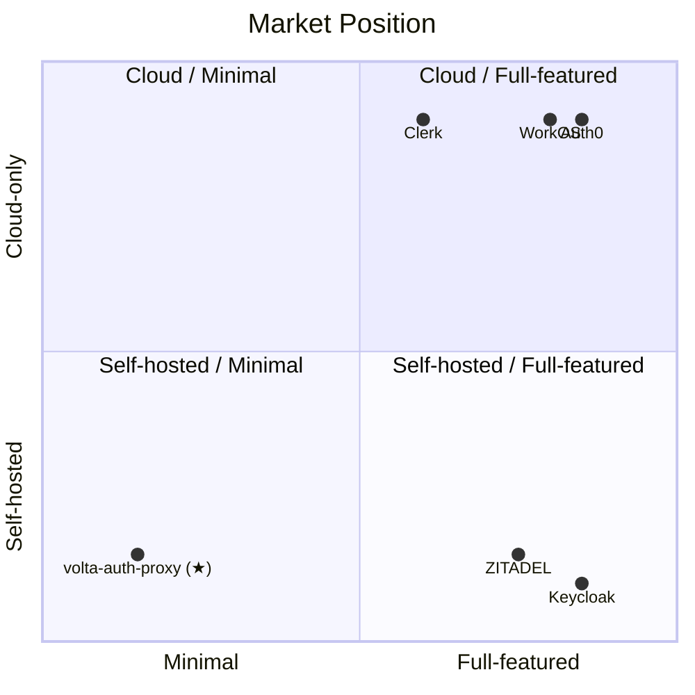
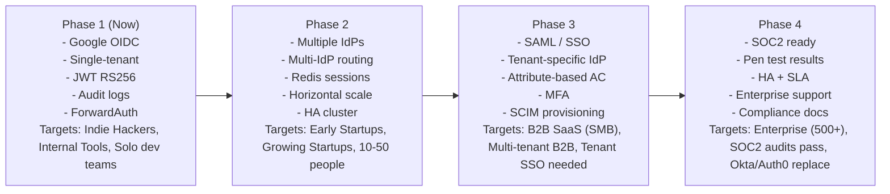

# volta-auth-proxy — Target Audience & Market Position

[English](target-audience.md) | [日本語](target-audience.ja.md)

***

## Who is volta-auth-proxy for?

### Primary (use it today)

**1. Indie Hackers / Solo Developers**

[Build](glossary/build.md)ing a [SaaS](../docs/glossary/saas.md) with 1-3 people. [Auth0](../docs/glossary/auth0.md)'s $2,400/month at scale hurts. [Keycloak](../docs/glossary/keycloak.md)'s [config hell](../docs/glossary/config-hell.md) is a nightmare. You want to understand everything in your stack. volta is for you.

**2. Early-stage [Startup](glossary/startup.md)s (~10 people)**

Ship the [MVP](glossary/mvp.md) fast. Don't waste time on auth. But don't get locked into a vendor either. A [Java](../docs/glossary/java.md)/[JVM](../docs/glossary/jvm.md) engineer on the team is all you need. Add an app = 4 lines in [YAML](../docs/glossary/yaml.md).

**3. Internal Tool [Build](glossary/build.md)ers**

[Build](glossary/build.md)ing internal [SaaS](../docs/glossary/saas.md) (wiki, chat, admin consoles) for your company. [Google Workspace](glossary/google-workspace.md) / Gmail [domain](glossary/domain.md) auth is enough. Looking for a [Cloudflare Zero Trust](../docs/glossary/zero-trust.md) replacement you actually control.

### Secondary (with conditions)

**4. Growing [Startup](glossary/startup.md)s (10-50 people)**

Conditions: [Java](glossary/java.md) engineers on the team, willing to own [security responsibility](../docs/glossary/security-responsibility.md), [Auth0](glossary/auth0.md)/Clerk monthly bill is getting painful. Phase 2-3 ([multiple IdPs](../docs/glossary/idp.md), [MFA](../docs/glossary/mfa.md), [SAML](../docs/glossary/sso.md)) covers this.

**5. B2B SaaS (SMB)**

Conditions: [Multi-tenancy](../docs/glossary/multi-tenant.md) is a core requirement. [Tenant](glossary/tenant.md)-specific [SSO](../docs/glossary/sso.md) (SAML) is needed. But [Keycloak](glossary/keycloak.md) is too heavy. Phase 3 SAML + [tenant](glossary/tenant.md)-specific [IdP](../docs/glossary/idp.md) config addresses this.

**6. Engineering Education / Bootcamps**

Not as a product, but as a **learning platform**. 585 [glossary](../docs/glossary/) files (EN 293 + JA 292) from expert to grandma level. [DSL](dsl-overview.md) that visualizes the entire auth [state machine](glossary/state-machine.md). "Pretending you understand is the most dangerous thing" philosophy.

### Not a fit (today)

**7. Enterprise (500+ employees)**

SOC2/ISO27001 audits won't accept "self-built auth" without track record. Security auditors will say "use [Keycloak](glossary/keycloak.md)/[Okta](glossary/okta.md)." No [SLA](glossary/sla.md) guarantee. No community support. Yet.

**8. Non-[Java](glossary/java.md) Teams**

Python/Node/Go teams don't want to maintain a [Java](glossary/java.md) proxy. [ForwardAuth](../docs/glossary/forwardauth.md) makes it language-agnostic for apps, but the proxy itself requires Java knowledge.

**9. "Just configure it" Teams**

[Auth0](glossary/auth0.md)/Clerk is a GUI [dashboard](glossary/dashboard.md). volta requires understanding [Java](../docs/glossary/java.md) code. If you don't resonate with "control is king," this isn't for you.

***

## Market Position



volta sits at **self-hosted × minimal**. The lightest, most controllable option. The [trade-off](../docs/glossary/tradeoff.md): you own the security.

### Competitive sweet spot

```
Auth0 too expensive    → volta ($0 at any MAU)
Keycloak too heavy     → volta (30MB, 200ms startup)
Self-built too scary   → volta (DSL + 585 glossary files + DGE design)
ZITADEL but need Java  → volta (Javalin, not Go)
```

***

## Revenue Opportunities

### 1. Open Source + Support Model

```
Free:  volta-auth-proxy (MIT license)
Paid:  Priority support, security advisory, custom integration
       $500-2,000/month for startups
       $5,000-10,000/month for growth companies
```

### 2. Managed Hosting

```
"volta Cloud" — we run it for you.
Like ZITADEL Cloud or SuperTokens managed.
$29/month base + usage.
Eliminates the "ops responsibility" objection.
```

### 3. Enterprise Add-ons

```
volta Enterprise:
  - SOC2 compliance documentation
  - Penetration test results
  - SLA guarantee (99.9%)
  - Dedicated support engineer
  - Custom IdP integration
  $1,000-5,000/month
```

### 4. Education / Certification

```
"volta Auth Academy"
  - Glossary as structured course (585 glossary files, 3 levels)
  - DSL as curriculum (state machine → protocol → policy)
  - DGE as design methodology certification
  - DDE as documentation methodology certification
  $199/person for certification
```

### 5. DGE + DDE Toolkit Licensing

```
@unlaxer/dge-toolkit — free (MIT)
@unlaxer/dde-toolkit — free (MIT)
Enterprise features:
  - Custom character packs for DGE
  - Industry-specific glossary templates for DDE
  - CI/CD integration support
  $99-499/month
```

***

## Path to Enterprise

Today's volta can't do enterprise. Here's what's needed:

| Requirement | Status | Path |
|------------|--------|------|
| Security audit trail | Phase 1 audit\_logs | Needs pen test + CVE track record |
| [High availability](glossary/high-availability.md) | Single instance | Phase 2: [Redis](glossary/redis.md) [session](glossary/session.md)s + horizontal scale |
| [Compliance](glossary/compliance.md) docs | None | SOC2, GDPR documentation |
| Community | None | OSS community [build](glossary/build.md)ing |
| Non-[Java](glossary/java.md) support | Java only | [Docker](glossary/docker.md) image (hide Java) or Go rewrite |
| [SLA](glossary/sla.md) | None | Managed hosting option |

**Phase Roadmap to Enterprise**



### The Design + AI Advantage

```
Traditional path to enterprise auth:
  Hire 5 security engineers → 2 years → maybe

volta path:
  1 designer (human: architecture, DSL, philosophy)
  + AI (implementation, tests, documentation, glossary)
  = Ship faster, iterate faster, document better

The 585-file glossary alone is more documentation
than most enterprise auth products have.

Design strength (human) + Implementation speed (AI)
= Enterprise-grade quality at indie-hacker speed.
```

This isn't overconfidence. It's a new model.
