# volta-auth-proxy — Technical Specification

**Version:** 0.3.0-SNAPSHOT
**Date:** 2026-04-19
**Source aggregated from:** `docs/architecture.md`, `docs/auth-flows.md`, `docs/decisions/001-004`, `docs/AUTH-STATE-MACHINE-SPEC.md`, `docs/AUTHENTICATION-SEQUENCES.md`, `docs/TENANT-SPEC.md`, source inspection

---

## Table of Contents

1. [概要](#1-概要)
2. [機能仕様](#2-機能仕様)
3. [データ永続化層](#3-データ永続化層)
4. [ステートマシン](#4-ステートマシン)
5. [ビジネスロジック](#5-ビジネスロジック)
6. [API / 外部境界](#6-api--外部境界)
7. [UI](#7-ui)
8. [設定](#8-設定)
9. [依存関係](#9-依存関係)
10. [非機能要件 — SAML セキュリティ](#10-非機能要件--saml-セキュリティ)
11. [テスト戦略](#11-テスト戦略)
12. [デプロイ / 運用](#12-デプロイ--運用)

---

## 1. 概要

### 一文サマリー

volta-auth-proxy は **Traefik ForwardAuth** プロトコルを実装した identity gateway で、Java 21 + Javalin 6.7.0 + tramli 3.7.1 の組み合わせで OIDC / SAML / MFA / Passkey / Invite / Magic Link の全認証フローを宣言的ステートマシンとして実行する。

### 設計思想

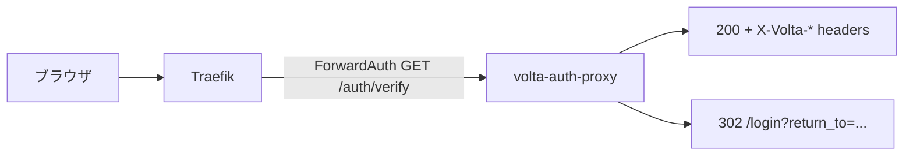
```mermaid
flowchart LR
    Browser["ブラウザ"]
    Traefik["Traefik"]
    VAP["volta-auth-proxy"]
    R200["200 + X-Volta-* headers"]
    R302["302 /login?return_to=..."]

    Browser --> Traefik
    Traefik -->|"ForwardAuth GET /auth/verify"| VAP
    VAP --> R200
    VAP --> R302
```

downstream アプリはパスワードも SAML アサーションも MFA シークレットも一切見ない。
認証判断の結果だけが `X-Volta-User-Id`, `X-Volta-Email`, `X-Volta-Tenant-Id`, `X-Volta-Roles`, `X-Volta-JWT` として転送される。

### 設計原則

1. **認証に集中する** — フォーム状態復元 (ADR-001 Rejected)、VPN バイパス (ADR-002 Rejected) など、認証基盤の責務を越える機能は意識的に排除。
2. **宣言的遷移** — 認証フローはコードではなく FlowDefinition として宣言。不正な遷移は構造的に存在できない。
3. **downstream は ID ヘッダーしか見ない** — パスワード・SAML アサーション・MFA シークレットはすべて volta 内部に閉じる。
4. **テナントはセキュリティ境界** — `mfaVerifiedAt` はテナント間でコピーしない (ADR-004)。
5. **LAN バイパスは最小権限** — セッションが存在する場合は通常認証優先。セッションなし + LAN IP のみ匿名通過 (ADR-003)。

### アーキテクチャ全体図

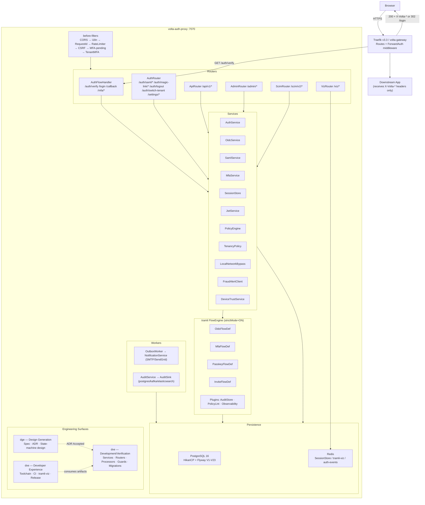
```mermaid
graph TB
    Browser["Browser"]
    Traefik["Traefik v3.3 / volta-gateway<br/>Routes + ForwardAuth middleware"]

    subgraph volta["volta-auth-proxy :7070"]
        Filters["before-filters<br/>CORS → i18n → RequestId → RateLimiter → CSRF → MFA-pending → TenantMFA"]

        subgraph Routers["Routers"]
            AFH["AuthFlowHandler<br/>/auth/verify /login /callback /mfa/*"]
            AR["AuthRouter<br/>/auth/saml/* /auth/magic-link/* /auth/logout /auth/switch-tenant /settings/*"]
            APIR["ApiRouter /api/v1/*"]
            ADMR["AdminRouter /admin/*"]
            SCIMR["ScimRouter /scim/v2/*"]
            VIZR["VizRouter /viz/*"]
        end

        subgraph Services["Services"]
            AS["AuthService"]
            OS["OidcService"]
            SS["SamlService"]
            MS["MfaService"]
            SESS["SessionStore"]
            JWT["JwtService"]
            PE["PolicyEngine"]
            TP["TenancyPolicy"]
            LNB["LocalNetworkBypass"]
            FAC["FraudAlertClient"]
            DTS["DeviceTrustService"]
        end

        subgraph FlowEngine["tramli FlowEngine (strictMode=ON)"]
            OIDCF["OidcFlowDef"]
            MFAF["MfaFlowDef"]
            PKF["PasskeyFlowDef"]
            INF["InviteFlowDef"]
            PLUGINS["Plugins: AuditStore · PolicyLint · Observability"]
        end

        subgraph Persistence["Persistence"]
            PG["PostgreSQL 16<br/>HikariCP + Flyway V1-V23"]
            REDIS["Redis<br/>SessionStore / tramli-viz / auth-events"]
        end

        subgraph Workers["Workers"]
            OW["OutboxWorker → NotificationService (SMTP/SendGrid)"]
            AU["AuditService → AuditSink (postgres/kafka/elasticsearch)"]
        end

        subgraph Engineers["Engineering Surfaces"]
            DXE["dxe — Developer Experience<br/>Toolchain · CI · tramli-viz · Release"]
            DGE["dge — Design Generation<br/>Spec · ADR · State-machine design"]
            DVE["dve — Development/Verification<br/>Services · Routers · Processors · Guards · Migrations"]
        end
    end

    DownstreamApp["Downstream App<br/>(receives X-Volta-* headers only)"]

    Browser -->|HTTPS| Traefik
    Traefik -->|GET /auth/verify| AFH
    Traefik -->|"200 + X-Volta-* or 302 /login"| Browser
    Traefik --> DownstreamApp

    Filters --> Routers
    AFH --> Services
    AR --> Services
    APIR --> Services
    ADMR --> Services
    SCIMR --> Services
    VIZR --> REDIS

    Services --> FlowEngine
    FlowEngine --> Persistence
    Services --> Persistence
    Workers --> Persistence

    DGE -.->|ADR Accepted| DVE
    DXE -.->|consumes artifacts| DVE
```

### スタック

| 層 | 採択技術 | 理由 |
|---|---|---|
| HTTP サーバー | Javalin 6.7.0 (Jetty 内蔵) | 低ボイラープレート、型安全ルーティング |
| ステートマシン | tramli 3.7.1 | 不正遷移をコンパイル時排除 |
| テンプレート | jte 3.2.1 | JVM ネイティブ、型安全 HTML |
| DB | PostgreSQL 16 + Flyway 11 | |
| 接続プール | HikariCP 6.3.0 | |
| JWT | nimbus-jose-jwt 10.5 | |
| WebAuthn | webauthn4j-core 0.28.4 | |
| TOTP | googleauth 1.5.0 | |
| Redis | Jedis 5.2.0 | セッションストア、tramli-viz telemetry |
| JSON | Jackson 2.18.4 | |
| 設定 | SnakeYAML 2.4 + PropStack 0.4.0 | |

### バージョニング

- `volta-auth-proxy`: `0.3.0-SNAPSHOT`
- `tramli`: `3.7.1`
- `tramli-plugins`: `3.6.1`
- Java: 21 (records, sealed, virtual threads)

### セキュリティモデルの概要

volta が提供するセキュリティ保証:

| 保証 | 実現方法 |
|---|---|
| 認証情報の分離 | downstream app は X-Volta-* ヘッダーのみ受け取る |
| セッション改ざん防止 | セッション ID は UUID (128bit entropy)、DB で検証 |
| CSRF 防止 | Origin 検証 + フォーム送信時 CSRF トークン |
| XSS 対策 | jte テンプレートのコンテキスト aware エスケープ |
| Open redirect 防止 | ReturnToValidator でドメイン許可リスト検証 |
| SAML XSW/XXE | DocumentBuilderFactory + secureValidation 設定 |
| JWT 鍵管理 | RSA-256, signing_keys テーブル, AES-256 暗号化秘密鍵 |
| パスワードレス優先 | Passkey / Magic Link / OIDC — パスワードは持たない |
| レート制限 | 200 req/IP/path/min |
| テナント境界 | MFA 状態、セッション、データがテナント単位で分離 |

---

## 2. 機能仕様

### 2.1 OIDC (OpenID Connect)

**対応 IdP:** Google, GitHub, Microsoft, Apple, LinkedIn, および volta-config.yaml で追加した任意の OIDC 準拠 IdP

**フロー:**

1. ブラウザが保護対象アプリにアクセス
2. Traefik が `GET /auth/verify` を呼び出す
3. セッションなし → volta が `/login?return_to=...` にリダイレクト
4. ユーザーが IdP を選択 → `OidcInitProcessor` が PKCE + state + nonce を生成し IdP authorize URL へリダイレクト
5. IdP から `GET /callback?code=...&state=...` 到着
6. `OidcTokenExchangeProcessor` でトークン交換 (PKCE 検証)
7. `UserResolveProcessor` → `RiskCheckProcessor` → `RiskAndMfaBranch`
8. MFA 要否に応じてセッション発行

**セッション発行後:**
- MFA なし: `auth_state = FULLY_AUTHENTICATED`, `mfaVerifiedAt = now` → `return_to` にリダイレクト
- MFA あり: `auth_state = AUTHENTICATED_MFA_PENDING`, `mfaVerifiedAt = null` → `/mfa/challenge`

**PKCE:** S256 必須。`code_verifier` は AES-256 (KeyCipher) で暗号化してフローコンテキストに保存。

**OIDC 認証シーケンス (詳細):**

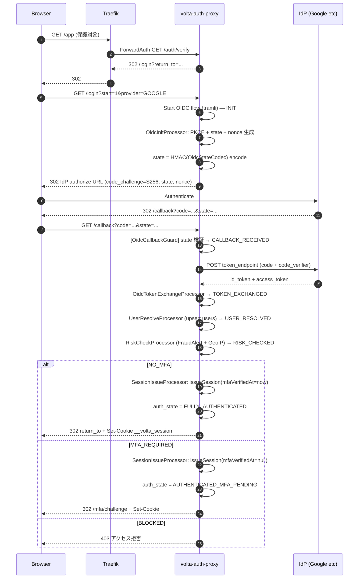
```mermaid
sequenceDiagram
    autonumber
    participant B as Browser
    participant T as Traefik
    participant V as volta-auth-proxy
    participant I as IdP (Google etc)

    B->>T: GET /app (保護対象)
    T->>V: ForwardAuth GET /auth/verify
    V-->>T: 302 /login?return_to=...
    T-->>B: 302
    B->>V: GET /login?start=1&provider=GOOGLE
    V->>V: Start OIDC flow (tramli) — INIT
    V->>V: OidcInitProcessor: PKCE + state + nonce 生成
    V->>V: state = HMAC(OidcStateCodec) encode
    V-->>B: 302 IdP authorize URL (code_challenge=S256, state, nonce)
    B->>I: Authenticate
    I-->>B: 302 /callback?code=...&state=...
    B->>V: GET /callback?code=...&state=...
    V->>V: [OidcCallbackGuard] state 検証 → CALLBACK_RECEIVED
    V->>I: POST token_endpoint (code + code_verifier)
    I-->>V: id_token + access_token
    V->>V: OidcTokenExchangeProcessor → TOKEN_EXCHANGED
    V->>V: UserResolveProcessor (upsert users) → USER_RESOLVED
    V->>V: RiskCheckProcessor (FraudAlert + GeoIP) → RISK_CHECKED
    alt NO_MFA
      V->>V: SessionIssueProcessor: issueSession(mfaVerifiedAt=now)
      V->>V: auth_state = FULLY_AUTHENTICATED
      V-->>B: 302 return_to + Set-Cookie __volta_session
    else MFA_REQUIRED
      V->>V: SessionIssueProcessor: issueSession(mfaVerifiedAt=null)
      V->>V: auth_state = AUTHENTICATED_MFA_PENDING
      V-->>B: 302 /mfa/challenge + Set-Cookie
    else BLOCKED
      V-->>B: 403 アクセス拒否
    end
```

### 2.2 SAML 2.0 (Enterprise SSO)

**バインディング:** SP-initiated, HTTP-POST (ACS)
**エンドポイント:** `GET /auth/saml/login`, `POST /auth/saml/callback`

**フロー (手続き型 — tramli 外):**

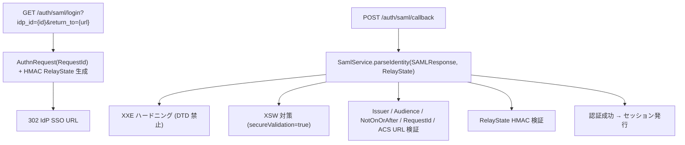
```mermaid
flowchart TD
    SAML_LOGIN["GET /auth/saml/login?idp_id={id}&return_to={url}"]
    AUTHN["AuthnRequest(RequestId) + HMAC RelayState 生成"]
    REDIRECT["302 IdP SSO URL"]

    SAML_CB["POST /auth/saml/callback"]
    PARSE["SamlService.parseIdentity(SAMLResponse, RelayState)"]
    XXE["XXE ハードニング (DTD 禁止)"]
    XSW["XSW 対策 (secureValidation=true)"]
    VALID["Issuer / Audience / NotOnOrAfter / RequestId / ACS URL 検証"]
    RELAY["RelayState HMAC 検証"]
    SESSION["認証成功 → セッション発行"]

    SAML_LOGIN --> AUTHN --> REDIRECT
    SAML_CB --> PARSE
    PARSE --> XXE
    PARSE --> XSW
    PARSE --> VALID
    PARSE --> RELAY
    PARSE --> SESSION
```

**per-tenant SAML:** `idp_configs` テーブルに `provider_type = 'SAML'` エントリを持つテナントは独自 IdP を使用。`idp_x509_cert` (V11) で SP 側 x.509 証明書を保持。

**Dev モード escape hatch:** `MOCK:alice@example.com` 形式。`DEV_MODE=true` かつ非本番 `BASE_URL` の場合のみ有効。

**SAML 認証シーケンス:**

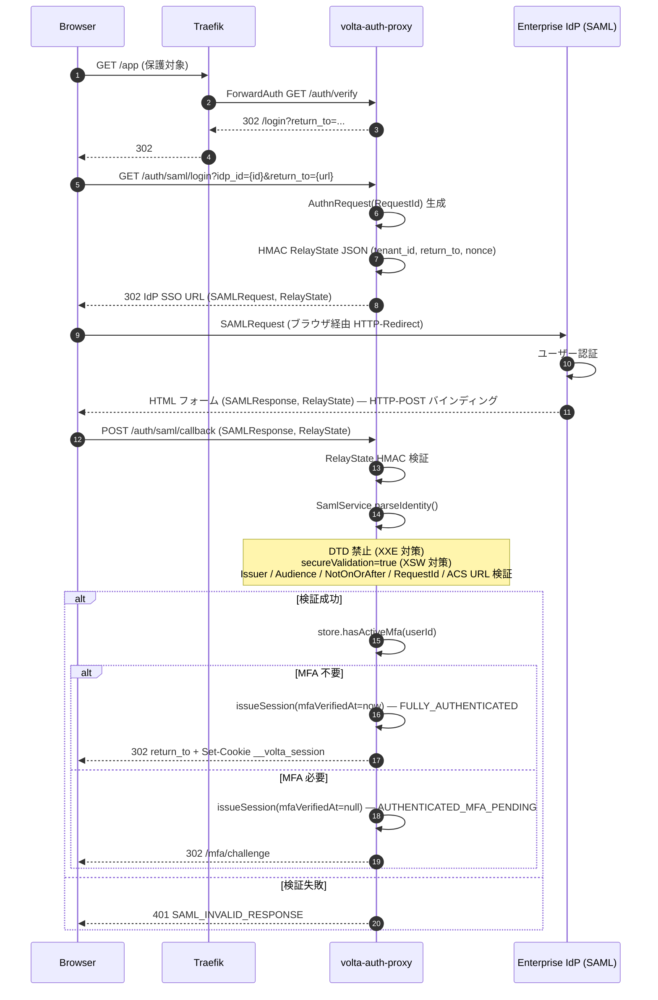
```mermaid
sequenceDiagram
    autonumber
    participant B as Browser
    participant T as Traefik
    participant V as volta-auth-proxy
    participant I as Enterprise IdP (SAML)

    B->>T: GET /app (保護対象)
    T->>V: ForwardAuth GET /auth/verify
    V-->>T: 302 /login?return_to=...
    T-->>B: 302
    B->>V: GET /auth/saml/login?idp_id={id}&return_to={url}
    V->>V: AuthnRequest(RequestId) 生成
    V->>V: HMAC RelayState JSON (tenant_id, return_to, nonce)
    V-->>B: 302 IdP SSO URL (SAMLRequest, RelayState)
    B->>I: SAMLRequest (ブラウザ経由 HTTP-Redirect)
    I->>I: ユーザー認証
    I-->>B: HTML フォーム (SAMLResponse, RelayState) — HTTP-POST バインディング
    B->>V: POST /auth/saml/callback (SAMLResponse, RelayState)
    V->>V: RelayState HMAC 検証
    V->>V: SamlService.parseIdentity()
    Note over V: DTD 禁止 (XXE 対策)<br/>secureValidation=true (XSW 対策)<br/>Issuer / Audience / NotOnOrAfter / RequestId / ACS URL 検証
    alt 検証成功
      V->>V: store.hasActiveMfa(userId)
      alt MFA 不要
        V->>V: issueSession(mfaVerifiedAt=now) — FULLY_AUTHENTICATED
        V-->>B: 302 return_to + Set-Cookie __volta_session
      else MFA 必要
        V->>V: issueSession(mfaVerifiedAt=null) — AUTHENTICATED_MFA_PENDING
        V-->>B: 302 /mfa/challenge
      end
    else 検証失敗
      V-->>B: 401 SAML_INVALID_RESPONSE
    end
```

### 2.3 MFA (TOTP)

**アルゴリズム:** TOTP (RFC 6238), SHA-1, 30 秒間隔, 6 桁
**ライブラリ:** `wstrange/googleauth 1.5.0`

**フロー (tramli FlowDefinition):**

```
CHALLENGE_SHOWN → [MfaCodeGuard] → VERIFIED
CHALLENGE_SHOWN → EXPIRED (TTL 5 分)
```

MFA 検証成功後:
- `session.mfaVerifiedAt = now()`
- `session.auth_state = FULLY_AUTHENTICATED`
- `return_to` にリダイレクト

**MFA 認証シーケンス:**

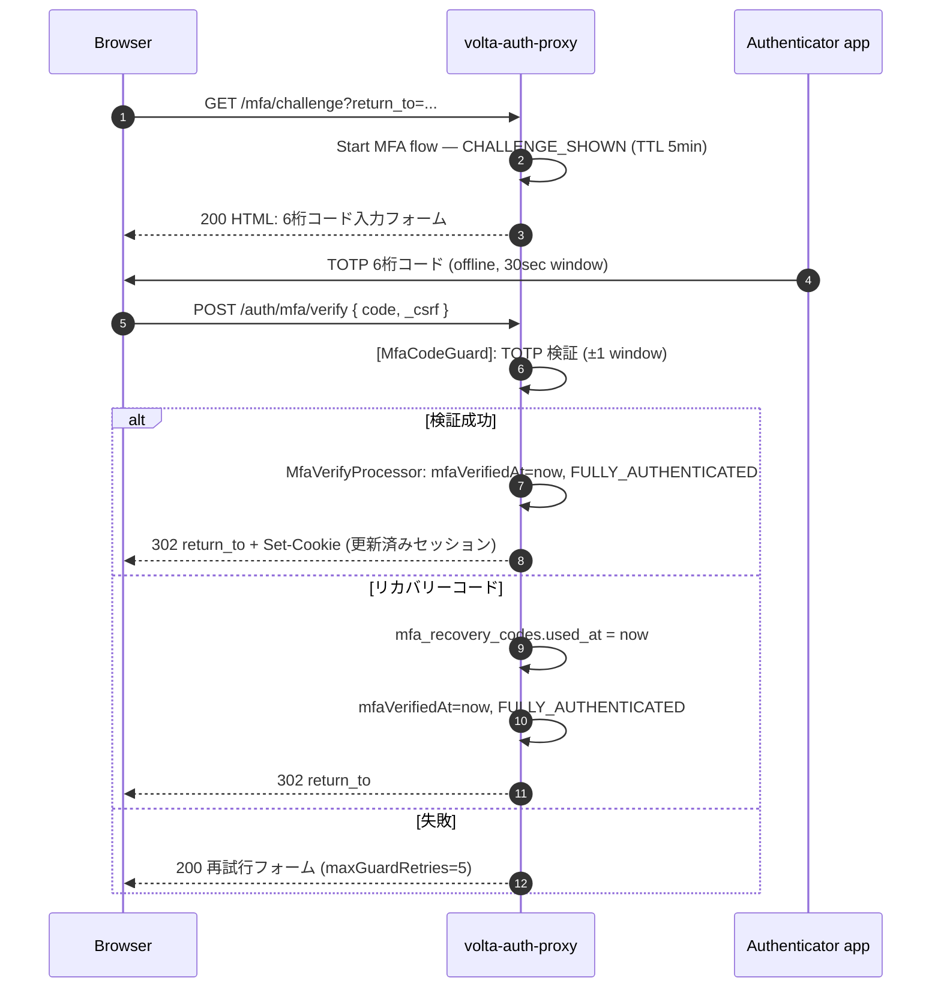
```mermaid
sequenceDiagram
    autonumber
    participant B as Browser
    participant V as volta-auth-proxy
    participant A as Authenticator app

    B->>V: GET /mfa/challenge?return_to=...
    V->>V: Start MFA flow — CHALLENGE_SHOWN (TTL 5min)
    V-->>B: 200 HTML: 6桁コード入力フォーム
    A->>B: TOTP 6桁コード (offline, 30sec window)
    B->>V: POST /auth/mfa/verify { code, _csrf }
    V->>V: [MfaCodeGuard]: TOTP 検証 (±1 window)
    alt 検証成功
      V->>V: MfaVerifyProcessor: mfaVerifiedAt=now, FULLY_AUTHENTICATED
      V-->>B: 302 return_to + Set-Cookie (更新済みセッション)
    else リカバリーコード
      V->>V: mfa_recovery_codes.used_at = now
      V->>V: mfaVerifiedAt=now, FULLY_AUTHENTICATED
      V-->>B: 302 return_to
    else 失敗
      V-->>B: 200 再試行フォーム (maxGuardRetries=5)
    end
```

**リカバリーコード:** `mfa_recovery_codes` テーブル。初回設定時に 8 コード生成。使用済みフラグ付き。

**テナント強制 MFA:** `tenants.mfa_required = true` の場合、MFA 未設定ユーザーは `/settings/security?setup_required=true` にリダイレクト。猶予期間 `mfa_grace_until` でソフト強制。

**テナント切り替え時:** `mfaVerifiedAt` は新セッションにコピーされない (ADR-004)。

### 2.4 Passkey (WebAuthn)

**ライブラリ:** `webauthn4j-core 0.28.4.RELEASE`
**設定:** `WEBAUTHN_RP_ID`, `WEBAUTHN_RP_NAME`, `WEBAUTHN_RP_ORIGIN`

**登録フロー:**

```
POST /auth/passkey/register/start
  → PublicKeyCredentialCreationOptions (challenge, rp, user, pubKeyCredParams)
POST /auth/passkey/register/finish (attestation)
  → Yubico webauthn4j で attestation 検証
  → user_passkeys テーブルに credential_id + public_key 保存
```

認証器タイプは登録時に選択可能 (roaming / platform)。

**認証フロー (tramli FlowDefinition):**

```
INIT → CHALLENGE_ISSUED → [PasskeyAssertionGuard] → ASSERTION_RECEIVED
     → PasskeyVerifyProcessor (sign_count チェック)
     → USER_RESOLVED → PasskeySessionProcessor → COMPLETE
```

**Passkey 認証シーケンス:**

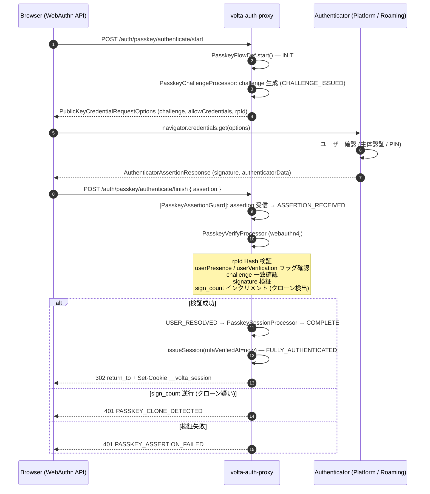
```mermaid
sequenceDiagram
    autonumber
    participant B as Browser (WebAuthn API)
    participant V as volta-auth-proxy
    participant A as Authenticator (Platform / Roaming)

    B->>V: POST /auth/passkey/authenticate/start
    V->>V: PasskeyFlowDef.start() — INIT
    V->>V: PasskeyChallengeProcessor: challenge 生成 (CHALLENGE_ISSUED)
    V-->>B: PublicKeyCredentialRequestOptions (challenge, allowCredentials, rpId)
    B->>A: navigator.credentials.get(options)
    A->>A: ユーザー確認 (生体認証 / PIN)
    A-->>B: AuthenticatorAssertionResponse (signature, authenticatorData)
    B->>V: POST /auth/passkey/authenticate/finish { assertion }
    V->>V: [PasskeyAssertionGuard]: assertion 受信 → ASSERTION_RECEIVED
    V->>V: PasskeyVerifyProcessor (webauthn4j)
    Note over V: rpId Hash 検証<br/>userPresence / userVerification フラグ確認<br/>challenge 一致確認<br/>signature 検証<br/>sign_count インクリメント (クローン検出)
    alt 検証成功
      V->>V: USER_RESOLVED → PasskeySessionProcessor → COMPLETE
      V->>V: issueSession(mfaVerifiedAt=now) — FULLY_AUTHENTICATED
      V-->>B: 302 return_to + Set-Cookie __volta_session
    else sign_count 逆行 (クローン疑い)
      V-->>B: 401 PASSKEY_CLONE_DETECTED
    else 検証失敗
      V-->>B: 401 PASSKEY_ASSERTION_FAILED
    end
```

### 2.5 Invite (招待フロー)

**TTL:** 7 日間 (他フローの 5 分と異なる)
**バージョニング:** 招待トークンにスキーマバージョンタグ。期限切れ後のリプレイ防止。

**フロー (tramli FlowDefinition):**

```
CONSENT_SHOWN
  → [EmailMatchBranch] (現在ログイン中のメールと招待先が一致)
      ├─ ACCEPTED (一致)
      └─ ACCOUNT_SWITCHING (不一致 — 別アカウントで再ログイン要)
ACCOUNT_SWITCHING → [ResumeGuard] → ACCEPTED
ACCEPTED → InviteCompleteProcessor → COMPLETE
```

`InviteCompleteProcessor` はメンバーシップ作成 + 招待使用済みフラグ設定 + Outbox イベント発行を原子的に行う。

**Invite フローシーケンス:**

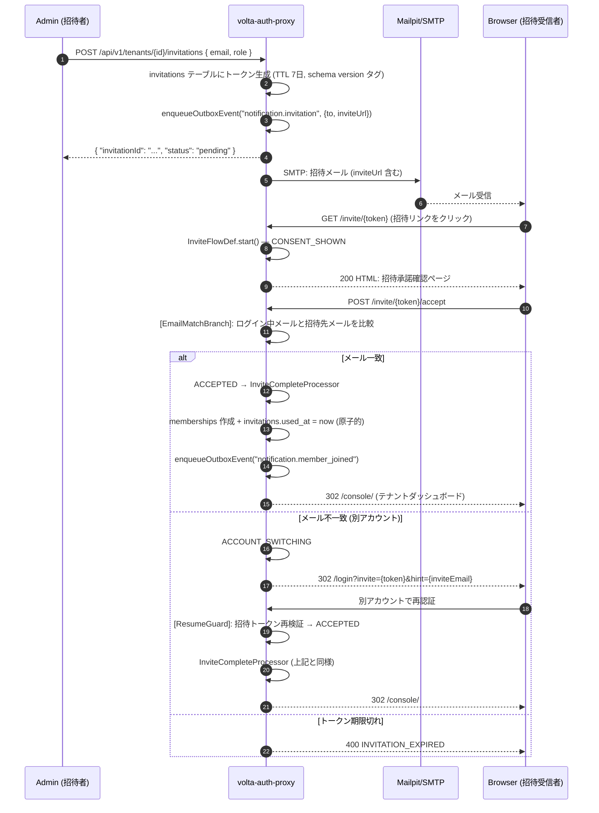
```mermaid
sequenceDiagram
    autonumber
    participant Admin as Admin (招待者)
    participant V as volta-auth-proxy
    participant M as Mailpit/SMTP
    participant B as Browser (招待受信者)

    Admin->>V: POST /api/v1/tenants/{id}/invitations { email, role }
    V->>V: invitations テーブルにトークン生成 (TTL 7日, schema version タグ)
    V->>V: enqueueOutboxEvent("notification.invitation", {to, inviteUrl})
    V-->>Admin: { "invitationId": "...", "status": "pending" }
    V->>M: SMTP: 招待メール (inviteUrl 含む)
    M-->>B: メール受信
    B->>V: GET /invite/{token} (招待リンクをクリック)
    V->>V: InviteFlowDef.start() — CONSENT_SHOWN
    V-->>B: 200 HTML: 招待承諾確認ページ
    B->>V: POST /invite/{token}/accept
    V->>V: [EmailMatchBranch]: ログイン中メールと招待先メールを比較
    alt メール一致
      V->>V: ACCEPTED → InviteCompleteProcessor
      V->>V: memberships 作成 + invitations.used_at = now (原子的)
      V->>V: enqueueOutboxEvent("notification.member_joined")
      V-->>B: 302 /console/ (テナントダッシュボード)
    else メール不一致 (別アカウント)
      V->>V: ACCOUNT_SWITCHING
      V-->>B: 302 /login?invite={token}&hint={inviteEmail}
      B->>V: 別アカウントで再認証
      V->>V: [ResumeGuard]: 招待トークン再検証 → ACCEPTED
      V->>V: InviteCompleteProcessor (上記と同様)
      V-->>B: 302 /console/
    else トークン期限切れ
      V-->>B: 400 INVITATION_EXPIRED
    end
```

### 2.6 Magic Link (パスワードレスメール)

**エンドポイント:** `POST /auth/magic-link/send`, `GET /auth/magic-link/verify`
**手続き型** (tramli フローエンジン非使用)
**有効期限:** 10 分 (デフォルト)
**仕組み:**

```
POST /auth/magic-link/send { email }
  → magic_links テーブルにワンタイムトークン生成
  → Outbox 経由でメール送信 (SMTP / SendGrid)
  → DEV_MODE 時はレスポンスに token を含める

GET /auth/magic-link/verify?token={token}
  → consumeMagicLink() — consumed でなければ OK
  → upsertUser() + resolveTenant() + issueSession()
  → /console/ にリダイレクト
```

### 2.6b Magic Link シーケンス (詳細)

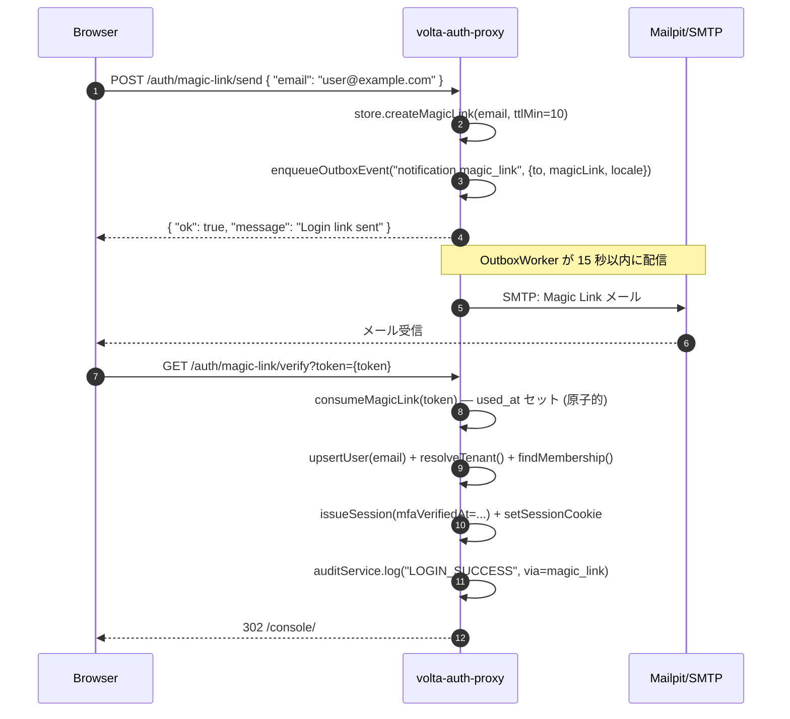
```mermaid
sequenceDiagram
    autonumber
    participant B as Browser
    participant V as volta-auth-proxy
    participant M as Mailpit/SMTP

    B->>V: POST /auth/magic-link/send { "email": "user@example.com" }
    V->>V: store.createMagicLink(email, ttlMin=10)
    V->>V: enqueueOutboxEvent("notification.magic_link", {to, magicLink, locale})
    V-->>B: { "ok": true, "message": "Login link sent" }
    Note over V,M: OutboxWorker が 15 秒以内に配信
    V->>M: SMTP: Magic Link メール
    M-->>B: メール受信
    B->>V: GET /auth/magic-link/verify?token={token}
    V->>V: consumeMagicLink(token) — used_at セット (原子的)
    V->>V: upsertUser(email) + resolveTenant() + findMembership()
    V->>V: issueSession(mfaVerifiedAt=...) + setSessionCookie
    V->>V: auditService.log("LOGIN_SUCCESS", via=magic_link)
    V-->>B: 302 /console/
```

### 2.7 M2M / Service-to-Service (OAuth2 Client Credentials)

**エンドポイント:** `POST /oauth/token`
**grant_type:** `client_credentials` のみ
**クライアント管理:** `m2m_clients` テーブル (`client_id`, `client_secret_hash`, `scopes`, `tenant_id`)

```
POST /oauth/token
  Content-Type: application/x-www-form-urlencoded
  grant_type=client_credentials&client_id=...&client_secret=...&scope=...

Response:
  { "access_token": "...", "token_type": "Bearer",
    "expires_in": 300, "scope": "..." }
```

JWT は `jwtService.issueM2mToken()` で発行。`serviceToken = true` フラグ付き。
`/api/v1/admin/*` エンドポイントには `ADMIN` / `OWNER` スコープが必要。

### 2.8 SCIM 2.0 (プロビジョニング)

`ScimRouter` が `/scim/v2/*` を処理。ユーザー CRUD + グループメンバーシップ同期。
エンタープライズ IdP からの自動プロビジョニング/デプロビジョニングに対応。

### 2.9 セッション発行ロジック (`AuthService.issueSession`)

```java
UUID issueSession(AuthPrincipal principal, String returnTo, String ip, String userAgent)
```

1. `sessionStore.countActiveSessions(userId)` が `MAX_CONCURRENT_SESSIONS(5)` 以上なら最古セッションを無効化
2. `SecurityUtils.newUuid()` で新 session ID
3. `SecurityUtils.randomUrlSafe(32)` で CSRF トークン生成
4. `store.hasActiveMfa(userId)` が `true` なら `mfaVerifiedAt = null`、`false` なら `mfaVerifiedAt = Instant.now()`
5. `sessionStore.createSession(...)` でDBに保存
6. session ID を返す (呼び出し側がクッキーにセット)

**同時セッション上限:** デフォルト 5 (`MAX_CONCURRENT_SESSIONS`)。超過時は最も古いアクティブセッションから削除。

**セッション cookie:**
- 名前: `__volta_session`
- HttpOnly: true
- Secure: `BASE_URL` が `https` で始まる場合
- SameSite: Lax
- Path: /
- Max-Age: `SESSION_TTL_SECONDS` (デフォルト 28800 = 8h)

---

## 3. データ永続化層

### 3.0 概要

PostgreSQL 16 をプライマリストアとして使用。HikariCP 6.3.0 でコネクションプール管理。
セッションは `SESSION_STORE=redis` で Redis に移行可能 (Jedis 5.2.0)。
全スキーマ変更は Flyway マイグレーションで管理。起動時に自動適用。

### 3.1 Flyway マイグレーション概要

23 マイグレーション (V1 〜 V23) が `src/main/resources/db/migration/` に配置。
起動時に Flyway が自動適用。`fail-fast` — テーブル不在は起動失敗。

| バージョン | ファイル | 追加内容 |
|---|---|---|
| V1 | `init.sql` | users, tenants, memberships, sessions, signing_keys, invitations, audit_logs |
| V2 | `oidc_flows.sql` | oidc_flows テーブル (旧実装) |
| V3 | `csrf_token.sql` | sessions.csrf_token |
| V4 | `phase2_phase4_foundations.sql` | m2m_clients, webhook_subscriptions, idp_configs, outbox_events |
| V5 | `phase2_phase4_features.sql` | roles, permissions, user_roles |
| V6 | `outbox_delivery_retry.sql` | outbox retry カラム |
| V7 | `mfa_unique_constraint.sql` | MFA ユニーク制約 |
| V8 | `outbox_claim_lock.sql` | Outbox クレームロック (多重配信防止) |
| V9 | `sessions_mfa_verified.sql` | sessions.mfa_verified_at |
| V10 | `phase2_user_identities_backfill.sql` | user_identities バックフィル |
| V11 | `idp_x509_cert.sql` | idp_configs.x509_cert (SAML 証明書) |
| V12 | `mfa_recovery_codes.sql` | mfa_backup_codes |
| V13 | `multi_provider.sql` | user_identities (複数 IdP per ユーザー) |
| V14 | `tenant_mfa_policy.sql` | tenants.mfa_required, mfa_grace_until |
| V15 | `known_devices.sql` | known_devices テーブル |
| V16 | `user_passkeys.sql` | user_passkeys (WebAuthn) |
| V17 | `magic_links.sql` | magic_links (パスワードレス) |
| V18 | `auth_flows.sql` | auth_flows + auth_flow_transitions (tramli) |
| V19 | `session_state_machine.sql` | sessions.auth_state, version, session_scopes, step_up_log |
| V20 | `users_locale.sql` | users.locale |
| V21 | `conditional_access_and_gdpr.sql` | conditional_access_rules, gdpr_requests |
| V22 | `pagination_indexes.sql` | ページネーション用複合インデックス |
| V23 | `billing_usage.sql` | billing_usage (課金イベント) |

### 3.2 コアテーブル

#### `users`

```sql
id UUID PRIMARY KEY DEFAULT gen_random_uuid()
email VARCHAR(255) NOT NULL UNIQUE
display_name VARCHAR(100)
google_sub VARCHAR(255) UNIQUE          -- V1: Google OIDC sub
locale VARCHAR(10)                      -- V20: i18n
is_active BOOLEAN NOT NULL DEFAULT true
created_at TIMESTAMPTZ
```

V13 (`multi_provider`) で `user_identities` テーブルが追加。複数 IdP の sub を単一ユーザーにバインド。

#### `tenants`

```sql
id UUID PRIMARY KEY
name VARCHAR(100) NOT NULL
slug VARCHAR(50) NOT NULL UNIQUE
email_domain VARCHAR(255)               -- 自動ジョイン用ドメイン
auto_join BOOLEAN NOT NULL DEFAULT false
plan VARCHAR(20) NOT NULL DEFAULT 'FREE'
max_members INT NOT NULL DEFAULT 50
mfa_required BOOLEAN NOT NULL DEFAULT false     -- V14
mfa_grace_until TIMESTAMPTZ                     -- V14
is_active BOOLEAN NOT NULL DEFAULT true
```

`tenant_domains` テーブル: テナントへのカスタムドメインマッピング (verified フラグ付き)。

#### `memberships`

```sql
id UUID PRIMARY KEY
user_id UUID REFERENCES users(id)
tenant_id UUID REFERENCES tenants(id)
role VARCHAR(30) NOT NULL DEFAULT 'MEMBER'
joined_at TIMESTAMPTZ
invited_by UUID REFERENCES users(id)
is_active BOOLEAN NOT NULL DEFAULT true
UNIQUE (user_id, tenant_id)
```

ロール階層: `OWNER > ADMIN > MEMBER > VIEWER`

#### `sessions`

```sql
id UUID PRIMARY KEY
user_id UUID REFERENCES users(id)
tenant_id UUID REFERENCES tenants(id)
auth_state VARCHAR(30) NOT NULL DEFAULT 'FULLY_AUTHENTICATED'   -- V19
mfa_verified_at TIMESTAMPTZ                                      -- V9
version INT NOT NULL DEFAULT 0                                   -- V19 楽観的ロック
last_journey_id UUID                                             -- V19
return_to VARCHAR(2048)
created_at TIMESTAMPTZ
last_active_at TIMESTAMPTZ
expires_at TIMESTAMPTZ
invalidated_at TIMESTAMPTZ
ip_address INET
user_agent TEXT
csrf_token VARCHAR(64)                                           -- V3
```

#### `session_scopes` (V19)

```sql
id UUID PRIMARY KEY
session_id UUID REFERENCES sessions(id) ON DELETE CASCADE
scope VARCHAR(50) NOT NULL
granted_at TIMESTAMPTZ
expires_at TIMESTAMPTZ
granted_by VARCHAR(20)
```

Step-up 認証 (5 分 admin スコープ等) を state ではなく時限エントリとして表現。

#### `auth_flows` (V18)

```sql
id UUID PRIMARY KEY
session_id UUID REFERENCES sessions(id)
flow_type VARCHAR(20) NOT NULL         -- 'oidc', 'mfa', 'passkey', 'invite'
flow_version VARCHAR(10) DEFAULT 'v1'
current_state VARCHAR(30) NOT NULL
context JSONB NOT NULL DEFAULT '{}'    -- FlowData (Sensitive フィールドはredact)
guard_failure_count INT NOT NULL DEFAULT 0
version INT NOT NULL DEFAULT 0
journey_id UUID
expires_at TIMESTAMPTZ NOT NULL        -- 5min (OIDC/MFA/Passkey), 7d (Invite)
completed_at TIMESTAMPTZ
exit_state VARCHAR(20)
```

`auth_flow_transitions`: 全遷移のイミュータブルログ (`from_state`, `to_state`, `trigger`, `context_snapshot`, `error_detail`)。

#### `signing_keys`

```sql
kid VARCHAR(64) PRIMARY KEY
public_key TEXT NOT NULL
private_key TEXT NOT NULL              -- AES-256 暗号化済み (KeyCipher)
status VARCHAR(16) DEFAULT 'active'    -- active / rotated / expired
created_at TIMESTAMPTZ
rotated_at TIMESTAMPTZ
expires_at TIMESTAMPTZ
```

JWKS エンドポイント: `GET /.well-known/jwks.json` (60 秒キャッシュ)

#### その他主要テーブル

| テーブル | マイグレーション | 目的 |
|---|---|---|
| `user_passkeys` | V16 | WebAuthn credential_id + public_key + sign_count |
| `magic_links` | V17 | ワンタイムリンク (email, token, expires_at, used_at) |
| `idp_configs` | V4 | テナントごと OIDC / SAML 設定 |
| `m2m_clients` | V4 | M2M クライアント認証情報 |
| `webhook_subscriptions` | V4 | Webhook 配信先 (endpoint_url, secret, events) |
| `outbox_events` | V4 | Transactional outbox (published_at IS NULL = 未配信) |
| `audit_logs` | V1 | 全操作ログ (event_type, actor_id, tenant_id, detail JSONB) |
| `known_devices` | V15 | デバイス信頼管理 (device_fingerprint, trusted) |
| `mfa_backup_codes` | V12 | リカバリーコード (user_id, code_hash, used_at) |
| `step_up_log` | V19 | Step-up 認証履歴 |
| `billing_usage` | V23 | 課金イベント (tenant_id, event_type, quantity) |

### 3.3 ER 図 (Flyway V1-V23 全テーブル)


```mermaid
erDiagram
    users {
        UUID id PK
        VARCHAR email
        VARCHAR display_name
        VARCHAR google_sub
        VARCHAR locale
        BOOLEAN is_active
        TIMESTAMPTZ created_at
    }
    tenants {
        UUID id PK
        VARCHAR name
        VARCHAR slug
        VARCHAR email_domain
        BOOLEAN auto_join
        VARCHAR plan
        INT max_members
        BOOLEAN mfa_required
        TIMESTAMPTZ mfa_grace_until
        BOOLEAN is_active
    }
    memberships {
        UUID id PK
        UUID user_id FK
        UUID tenant_id FK
        VARCHAR role
        TIMESTAMPTZ joined_at
        UUID invited_by FK
        BOOLEAN is_active
    }
    sessions {
        UUID id PK
        UUID user_id FK
        UUID tenant_id FK
        VARCHAR auth_state
        TIMESTAMPTZ mfa_verified_at
        INT version
        UUID last_journey_id
        VARCHAR return_to
        TIMESTAMPTZ created_at
        TIMESTAMPTZ last_active_at
        TIMESTAMPTZ expires_at
        TIMESTAMPTZ invalidated_at
        INET ip_address
        TEXT user_agent
        VARCHAR csrf_token
    }
    session_scopes {
        UUID id PK
        UUID session_id FK
        VARCHAR scope
        TIMESTAMPTZ granted_at
        TIMESTAMPTZ expires_at
        VARCHAR granted_by
    }
    step_up_log {
        UUID id PK
        UUID session_id FK
        VARCHAR scope
        TIMESTAMPTZ verified_at
    }
    signing_keys {
        VARCHAR kid PK
        TEXT public_key
        TEXT private_key
        VARCHAR status
        TIMESTAMPTZ created_at
        TIMESTAMPTZ rotated_at
        TIMESTAMPTZ expires_at
    }
    invitations {
        UUID id PK
        UUID tenant_id FK
        VARCHAR email
        VARCHAR role
        VARCHAR token
        INT schema_version
        UUID invited_by FK
        TIMESTAMPTZ expires_at
        TIMESTAMPTZ used_at
        TIMESTAMPTZ created_at
    }
    audit_logs {
        UUID id PK
        VARCHAR event_type
        UUID actor_id FK
        UUID tenant_id FK
        VARCHAR target_type
        UUID target_id
        JSONB detail
        TIMESTAMPTZ created_at
    }
    user_identities {
        UUID id PK
        UUID user_id FK
        VARCHAR provider
        VARCHAR provider_sub
        TIMESTAMPTZ created_at
    }
    idp_configs {
        UUID id PK
        UUID tenant_id FK
        VARCHAR provider_type
        VARCHAR issuer
        VARCHAR client_id
        TEXT client_secret
        TEXT metadata_url
        TEXT audience
        TEXT x509_cert
        BOOLEAN is_active
    }
    m2m_clients {
        UUID id PK
        UUID tenant_id FK
        VARCHAR client_id
        VARCHAR client_secret_hash
        TEXT scopes
        BOOLEAN is_active
        TIMESTAMPTZ created_at
    }
    webhook_subscriptions {
        UUID id PK
        UUID tenant_id FK
        TEXT endpoint_url
        TEXT secret
        TEXT events
        BOOLEAN is_active
        TIMESTAMPTZ created_at
    }
    outbox_events {
        UUID id PK
        VARCHAR event_type
        UUID tenant_id FK
        JSONB payload
        TIMESTAMPTZ created_at
        TIMESTAMPTZ published_at
        INT retry_count
        TIMESTAMPTZ claimed_at
        VARCHAR claimed_by
    }
    roles {
        UUID id PK
        UUID tenant_id FK
        VARCHAR name
        TEXT permissions
    }
    permissions {
        UUID id PK
        VARCHAR name
        TEXT description
    }
    user_roles {
        UUID id PK
        UUID user_id FK
        UUID role_id FK
        UUID tenant_id FK
        TIMESTAMPTZ granted_at
    }
    mfa_backup_codes {
        UUID id PK
        UUID user_id FK
        VARCHAR code_hash
        TIMESTAMPTZ used_at
        TIMESTAMPTZ created_at
    }
    known_devices {
        UUID id PK
        UUID user_id FK
        VARCHAR device_fingerprint
        VARCHAR device_name
        BOOLEAN trusted
        TIMESTAMPTZ last_seen_at
        TIMESTAMPTZ created_at
    }
    user_passkeys {
        UUID id PK
        UUID user_id FK
        TEXT credential_id
        TEXT public_key
        BIGINT sign_count
        VARCHAR authenticator_type
        TIMESTAMPTZ created_at
        TIMESTAMPTZ last_used_at
    }
    magic_links {
        UUID id PK
        VARCHAR email
        TEXT token
        TIMESTAMPTZ expires_at
        TIMESTAMPTZ used_at
        TIMESTAMPTZ created_at
    }
    auth_flows {
        UUID id PK
        UUID session_id FK
        VARCHAR flow_type
        VARCHAR flow_version
        VARCHAR current_state
        JSONB context
        INT guard_failure_count
        INT version
        UUID journey_id
        TIMESTAMPTZ expires_at
        TIMESTAMPTZ completed_at
        VARCHAR exit_state
    }
    auth_flow_transitions {
        UUID id PK
        UUID flow_id FK
        VARCHAR from_state
        VARCHAR to_state
        VARCHAR trigger
        JSONB context_snapshot
        TEXT error_detail
        TIMESTAMPTZ transitioned_at
    }
    oidc_flows {
        UUID id PK
        UUID session_id FK
        VARCHAR state
        VARCHAR nonce
        TEXT code_verifier
        TIMESTAMPTZ created_at
    }
    tenant_domains {
        UUID id PK
        UUID tenant_id FK
        VARCHAR domain
        BOOLEAN verified
        TIMESTAMPTZ verified_at
    }
    conditional_access_rules {
        UUID id PK
        UUID tenant_id FK
        VARCHAR rule_type
        JSONB conditions
        VARCHAR action
        BOOLEAN is_active
        TIMESTAMPTZ created_at
    }
    gdpr_requests {
        UUID id PK
        UUID user_id FK
        UUID tenant_id FK
        VARCHAR request_type
        VARCHAR status
        TIMESTAMPTZ requested_at
        TIMESTAMPTZ completed_at
    }
    billing_usage {
        UUID id PK
        UUID tenant_id FK
        VARCHAR event_type
        INT quantity
        TIMESTAMPTZ recorded_at
    }

    users ||--o{ memberships : "has"
    tenants ||--o{ memberships : "has"
    users ||--o{ sessions : "owns"
    tenants ||--o{ sessions : "scopes"
    sessions ||--o{ session_scopes : "has"
    sessions ||--o{ step_up_log : "tracks"
    sessions ||--o{ auth_flows : "drives"
    auth_flows ||--o{ auth_flow_transitions : "logs"
    users ||--o{ user_identities : "has"
    users ||--o{ user_passkeys : "registers"
    users ||--o{ mfa_backup_codes : "stores"
    users ||--o{ known_devices : "trusts"
    users ||--o{ user_roles : "granted"
    roles ||--o{ user_roles : "assigned"
    tenants ||--o{ idp_configs : "configures"
    tenants ||--o{ m2m_clients : "owns"
    tenants ||--o{ webhook_subscriptions : "subscribes"
    tenants ||--o{ outbox_events : "queues"
    tenants ||--o{ invitations : "issues"
    tenants ||--o{ roles : "defines"
    tenants ||--o{ audit_logs : "records"
    tenants ||--o{ tenant_domains : "maps"
    tenants ||--o{ conditional_access_rules : "enforces"
    tenants ||--o{ gdpr_requests : "processes"
    tenants ||--o{ billing_usage : "tracks"
    users ||--o{ gdpr_requests : "requests"
    users ||--o{ audit_logs : "actors"
```

---

## 4. ステートマシン

### 4.0 tramli とは

tramli はこのプロジェクト専用の constrained flow engine。主要概念:

| 概念 | 説明 |
|---|---|
| `FlowDefinition<S>` | ステートマシンの宣言。状態遷移, TTL, Guard retry 上限を含む |
| `FlowState` | 状態を表す enum。`isTerminal()`, `isInitial()` を実装 |
| `StateProcessor` | 状態遷移時に実行される処理。FlowContext を受け取り FlowData を生産 |
| `StateGuard` | 外部入力の検証。条件が満たされた時のみ遷移を許可 |
| `FlowEngine` | FlowDefinition を実行するエンジン。strictMode=true で不正遷移を例外化 |
| `FlowStore` | フロー状態の永続化 (SqlFlowStore → auth_flows テーブル) |
| `FlowData` | フローコンテキストに保存されるデータ型。`@Sensitive` でログ保護 |
| `FlowDefinition.builder()` | 遷移テーブルを宣言的に構築するビルダー |

**tramli strictMode:** `new FlowEngine(flowStore, true)` — 遷移テーブルにない遷移は
`IllegalStateException` を throw。不正遷移が実行時に発生できない。

**8-item validation (PolicyLintPlugin.defaults()):**
1. 初期状態が正確に 1 つ
2. Terminal 状態からの遷移なし
3. 全非初期状態への到達可能性
4. `maxGuardRetries` が正値
5. `initiallyAvailable` データが FlowData として登録済み
6. `externallyProvided` データが FlowData として登録済み
7. TTL が正値
8. Branch に少なくとも 1 つの分岐先

### 4.1 アーキテクチャ: 2 層モデル

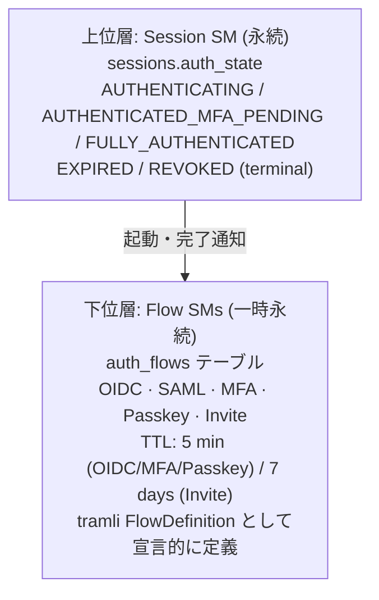
```mermaid
graph TB
    SessionSM["上位層: Session SM (永続)<br/>sessions.auth_state<br/>AUTHENTICATING / AUTHENTICATED_MFA_PENDING / FULLY_AUTHENTICATED<br/>EXPIRED / REVOKED (terminal)"]
    FlowSMs["下位層: Flow SMs (一時永続)<br/>auth_flows テーブル<br/>OIDC · SAML · MFA · Passkey · Invite<br/>TTL: 5 min (OIDC/MFA/Passkey) / 7 days (Invite)<br/>tramli FlowDefinition として宣言的に定義"]

    SessionSM -->|起動・完了通知| FlowSMs
```

### 4.2 Session SM (上位層)

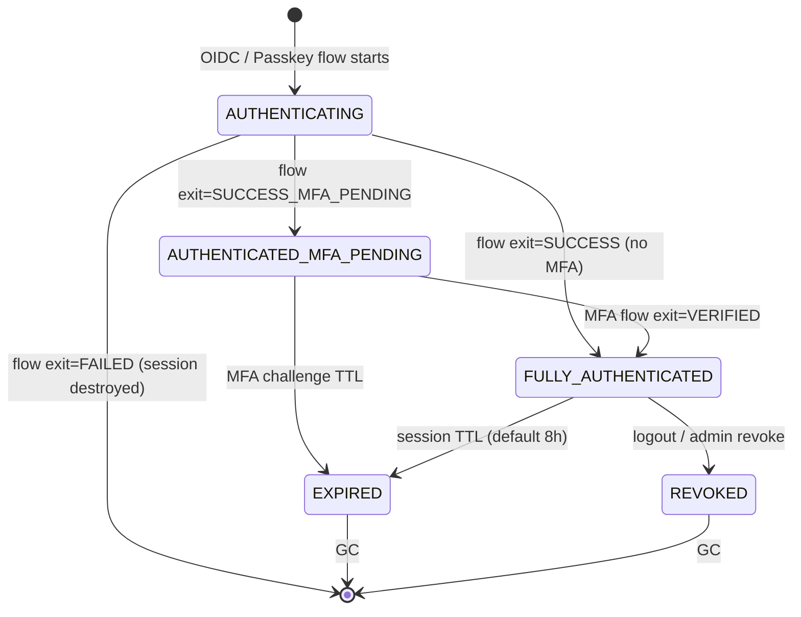
```mermaid
stateDiagram-v2
    [*] --> AUTHENTICATING : OIDC / Passkey flow starts
    AUTHENTICATING --> AUTHENTICATED_MFA_PENDING : flow exit=SUCCESS_MFA_PENDING
    AUTHENTICATING --> FULLY_AUTHENTICATED : flow exit=SUCCESS (no MFA)
    AUTHENTICATING --> [*] : flow exit=FAILED (session destroyed)
    AUTHENTICATED_MFA_PENDING --> FULLY_AUTHENTICATED : MFA flow exit=VERIFIED
    AUTHENTICATED_MFA_PENDING --> EXPIRED : MFA challenge TTL
    FULLY_AUTHENTICATED --> EXPIRED : session TTL (default 8h)
    FULLY_AUTHENTICATED --> REVOKED : logout / admin revoke
    EXPIRED --> [*] : GC
    REVOKED --> [*] : GC
```

| 状態 | 意味 | terminal? |
|---|---|---|
| `AUTHENTICATING` | フロー開始済み、未完了 | — |
| `AUTHENTICATED_MFA_PENDING` | IdP 認証済み、MFA 未検証 | — |
| `FULLY_AUTHENTICATED` | 全認証完了 | — |
| `EXPIRED` | TTL 超過 | yes |
| `REVOKED` | ログアウト / 管理者無効化 | yes |

Step-up 認証は state ではなく `session_scopes` テーブルの時限エントリ。

### 4.2b Session SM と Flow SM の連携

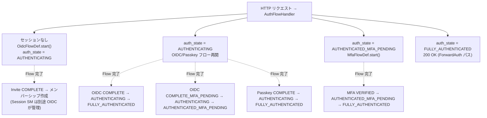
```mermaid
flowchart TD
    REQ["HTTP リクエスト → AuthFlowHandler"]
    NO_SESSION["セッションなし<br/>OidcFlowDef.start()<br/>auth_state = AUTHENTICATING"]
    AUTHING["auth_state = AUTHENTICATING<br/>OIDC/Passkey フロー再開"]
    MFA_PEND["auth_state = AUTHENTICATED_MFA_PENDING<br/>MfaFlowDef.start()"]
    FULL_AUTH["auth_state = FULLY_AUTHENTICATED<br/>200 OK (ForwardAuth パス)"]

    OIDC_COMP["OIDC COMPLETE → AUTHENTICATING → FULLY_AUTHENTICATED"]
    OIDC_MFA["OIDC COMPLETE_MFA_PENDING → AUTHENTICATING → AUTHENTICATED_MFA_PENDING"]
    MFA_VER["MFA VERIFIED → AUTHENTICATED_MFA_PENDING → FULLY_AUTHENTICATED"]
    PK_COMP["Passkey COMPLETE → AUTHENTICATING → FULLY_AUTHENTICATED"]
    INV_COMP["Invite COMPLETE → メンバーシップ作成<br/>(Session SM は別途 OIDC が管理)"]

    REQ --> NO_SESSION
    REQ --> AUTHING
    REQ --> MFA_PEND
    REQ --> FULL_AUTH

    AUTHING -.->|Flow 完了| OIDC_COMP
    AUTHING -.->|Flow 完了| OIDC_MFA
    MFA_PEND -.->|Flow 完了| MFA_VER
    AUTHING -.->|Flow 完了| PK_COMP
    NO_SESSION -.->|Flow 完了| INV_COMP
```

Session SM は HTTP Router が直接遷移させる (SessionStore.updateAuthState)。
Flow SM は tramli FlowEngine が管理 (auth_flows テーブル + optimistic locking)。

### 4.3 OIDC FlowDefinition (tramli)

**クラス:** `OidcFlowDef`, **状態:** `OidcFlowState`

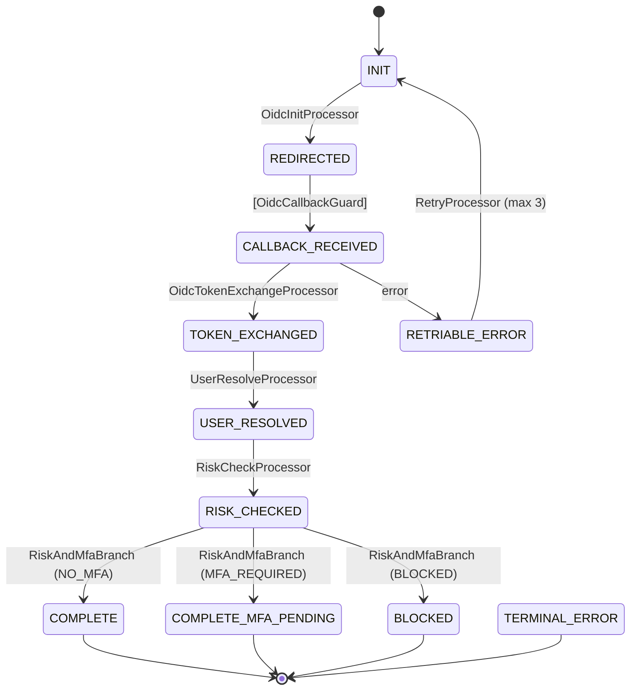
```mermaid
stateDiagram-v2
    [*] --> INIT
    INIT --> REDIRECTED : OidcInitProcessor
    REDIRECTED --> CALLBACK_RECEIVED : [OidcCallbackGuard]
    CALLBACK_RECEIVED --> TOKEN_EXCHANGED : OidcTokenExchangeProcessor
    TOKEN_EXCHANGED --> USER_RESOLVED : UserResolveProcessor
    USER_RESOLVED --> RISK_CHECKED : RiskCheckProcessor
    RISK_CHECKED --> COMPLETE : RiskAndMfaBranch (NO_MFA)
    RISK_CHECKED --> COMPLETE_MFA_PENDING : RiskAndMfaBranch (MFA_REQUIRED)
    RISK_CHECKED --> BLOCKED : RiskAndMfaBranch (BLOCKED)
    CALLBACK_RECEIVED --> RETRIABLE_ERROR : error
    RETRIABLE_ERROR --> INIT : RetryProcessor (max 3)
    COMPLETE --> [*]
    COMPLETE_MFA_PENDING --> [*]
    BLOCKED --> [*]
    TERMINAL_ERROR --> [*]
```

**tramli 設定:**
```java
FlowDefinition.builder("oidc", OidcFlowState.class)
    .ttl(Duration.ofMinutes(5))
    .maxGuardRetries(3)
    .initiallyAvailable(OidcRequest.class)
    .externallyProvided(OidcCallback.class)
```

**Processor / Guard 一覧:**

| Processor/Guard | 入力 (FlowData) | 出力 (FlowData) | 担当 |
|---|---|---|---|
| `OidcInitProcessor` | `OidcRequest` | `OidcRedirect` | PKCE, state, nonce 生成 → IdP redirect URL |
| `OidcCallbackGuard` | query params | gate | state 検証 |
| `OidcTokenExchangeProcessor` | `OidcCallback` | `OidcTokens` | code 交換, PKCE 検証, id_token 検証 |
| `UserResolveProcessor` | `OidcTokens` | `ResolvedUser` | sub → users テーブル upsert |
| `RiskCheckProcessor` | `ResolvedUser` | `RiskResult` | FraudAlertClient + geo-ip |
| `RiskAndMfaBranch` | `ResolvedUser`, `RiskResult` | — | 分岐: NO_MFA / MFA_REQUIRED / BLOCKED |
| `SessionIssueProcessor` | (context) | `IssuedSession` | セッション発行, クッキー設定 |

### 4.4 MFA FlowDefinition (tramli)

**クラス:** `MfaFlowDef`, **状態:** `MfaFlowState`

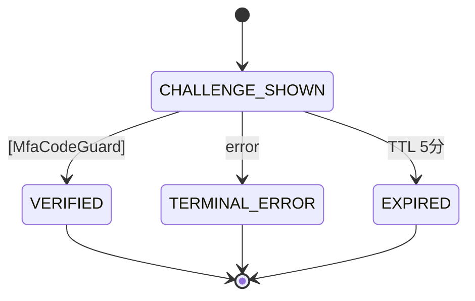
```mermaid
stateDiagram-v2
    [*] --> CHALLENGE_SHOWN
    CHALLENGE_SHOWN --> VERIFIED : [MfaCodeGuard]
    CHALLENGE_SHOWN --> TERMINAL_ERROR : error
    CHALLENGE_SHOWN --> EXPIRED : TTL 5分
    VERIFIED --> [*]
    TERMINAL_ERROR --> [*]
    EXPIRED --> [*]
```

4 状態・最小設計。実際の step-up / ratchet ロジックは上位 Session SM + `session_scopes` に委譲。

`MfaCodeGuard`: TOTP 6 桁検証 (±1 ウィンドウ許容) + リカバリーコードフォールバック。

### 4.5 Passkey FlowDefinition (tramli)

**クラス:** `PasskeyFlowDef`, **状態:** `PasskeyFlowState`

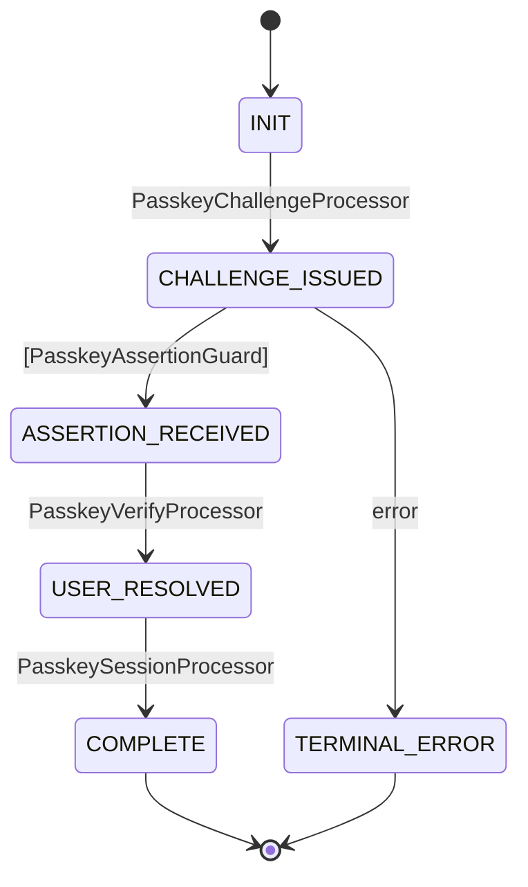
```mermaid
stateDiagram-v2
    [*] --> INIT
    INIT --> CHALLENGE_ISSUED : PasskeyChallengeProcessor
    CHALLENGE_ISSUED --> ASSERTION_RECEIVED : [PasskeyAssertionGuard]
    ASSERTION_RECEIVED --> USER_RESOLVED : PasskeyVerifyProcessor
    USER_RESOLVED --> COMPLETE : PasskeySessionProcessor
    CHALLENGE_ISSUED --> TERMINAL_ERROR : error
    COMPLETE --> [*]
    TERMINAL_ERROR --> [*]
```

`PasskeyVerifyProcessor`: webauthn4j で assertion 検証 + sign_count インクリメント (クローン検出)。

### 4.6 Invite FlowDefinition (tramli)

**クラス:** `InviteFlowDef`, **状態:** `InviteFlowState`
**TTL:** 7 日間 (他フローと異なる)

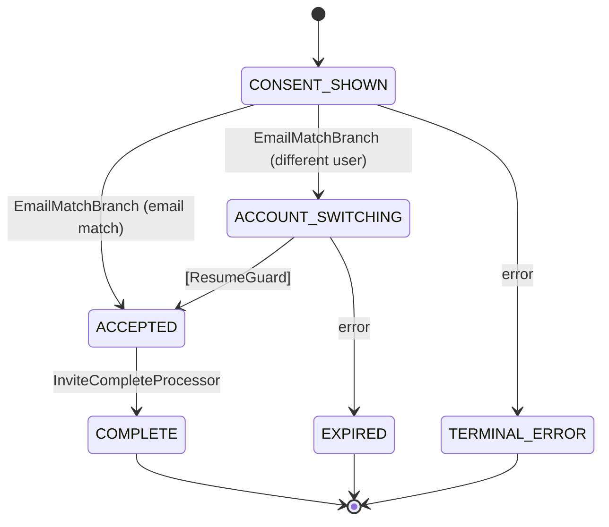
```mermaid
stateDiagram-v2
    [*] --> CONSENT_SHOWN
    CONSENT_SHOWN --> ACCEPTED : EmailMatchBranch (email match)
    CONSENT_SHOWN --> ACCOUNT_SWITCHING : EmailMatchBranch (different user)
    ACCOUNT_SWITCHING --> ACCEPTED : [ResumeGuard]
    ACCEPTED --> COMPLETE : InviteCompleteProcessor
    CONSENT_SHOWN --> TERMINAL_ERROR : error
    ACCOUNT_SWITCHING --> EXPIRED : error
    COMPLETE --> [*]
    TERMINAL_ERROR --> [*]
    EXPIRED --> [*]
```

バージョンタグにより期限切れ招待のリプレイを防止。

### 4.7 SAML フロー (手続き型)

SAML は tramli FlowDefinition を使用せず `AuthRouter` + `SamlService` で手続き的に処理。
理由: SP-initiated POST バインディングは非同期 POST を受ける単純な request-response で、
ステートマシンの遷移保存が価値を持つほど複雑でないため。

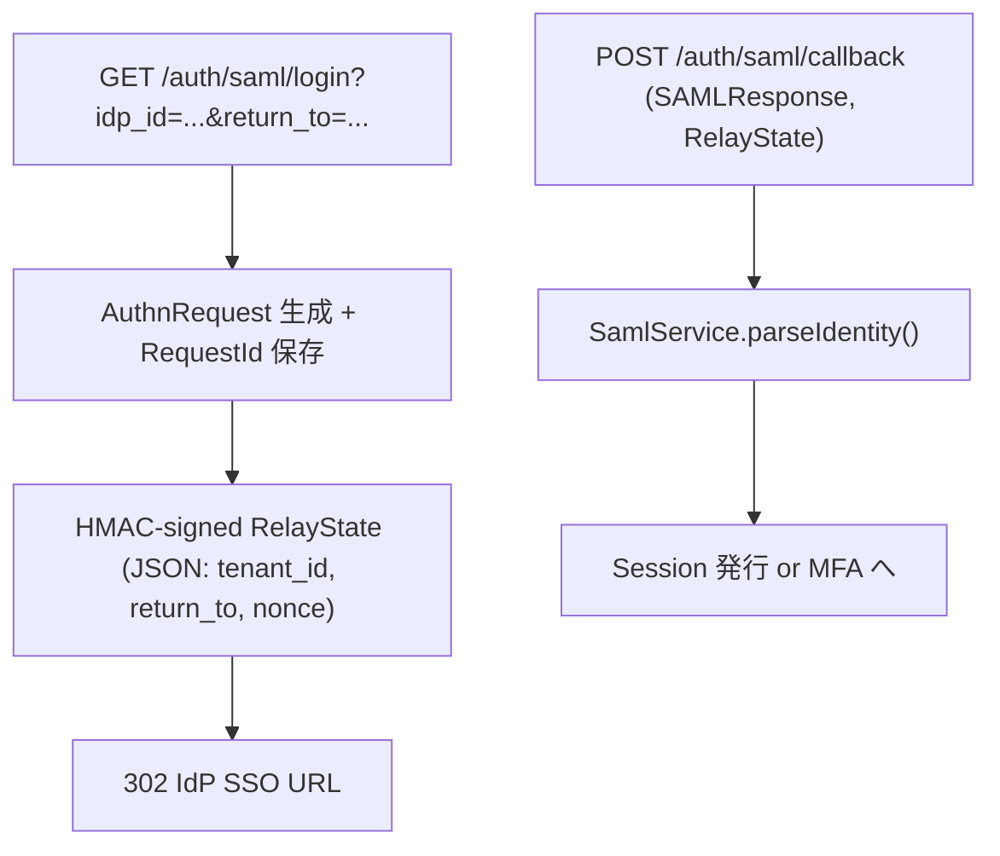
```mermaid
flowchart TD
    SAML_LOGIN["GET /auth/saml/login?idp_id=...&return_to=..."]
    AUTHN2["AuthnRequest 生成 + RequestId 保存"]
    RELAY2["HMAC-signed RelayState (JSON: tenant_id, return_to, nonce)"]
    REDIRECT2["302 IdP SSO URL"]

    SAML_CB2["POST /auth/saml/callback (SAMLResponse, RelayState)"]
    PARSE2["SamlService.parseIdentity()"]
    SESSION2["Session 発行 or MFA へ"]

    SAML_LOGIN --> AUTHN2 --> RELAY2 --> REDIRECT2
    SAML_CB2 --> PARSE2 --> SESSION2
```

### 4.8 Magic Link フロー (手続き型)

tramli 非使用。単純なワンタイムトークン消費パターン。

### 4.8b FlowData と Sensitive リダクション

tramli フローコンテキストは `context JSONB` カラムに保存される。
機密フィールド (`code_verifier`, `access_token`, TOTP シークレット等) には
`@Sensitive` アノテーションを付与:

```java
public record OidcTokens(
    @Sensitive String accessToken,   // ログ・tramli-viz で "***" に置換
    String idToken,
    String email
) implements FlowData {}
```

`SensitiveRedactor` が tramli-viz 送信前と監査ログ記録前にリダクト処理を実施。
`SensitiveRedactorTest` でリダクト動作を検証済み。

### 4.9 tramli エンジン設定

```java
// strictMode = ON (不正遷移で例外)
var flowEngine = new FlowEngine(flowStore, true);

// Plugins:
// - AuditStorePlugin    : 全遷移を audit_log に記録
// - PolicyLintPlugin    : FlowDefinition の静的検証 (8 観点)
// - ObservabilityPlugin : SystemLogger + Redis telemetry (tramli-viz)
pluginRegistry.register(new AuditStorePlugin());
pluginRegistry.register(PolicyLintPlugin.defaults());
```

**tramli 8-item validation (PolicyLintPlugin):**
1. 初期状態が 1 つ存在する
2. Terminal 状態からの遷移が存在しない
3. 全状態への到達可能性
4. Guard retry 上限が設定されている
5. FlowData 型の一貫性
6. TTL が正値
7. 外部提供データが宣言されている
8. Branch が少なくとも 1 つの分岐先を持つ

---

## 5. ビジネスロジック

### 5.1 ForwardAuth 判定ロジック (`AuthFlowHandler.verify`)

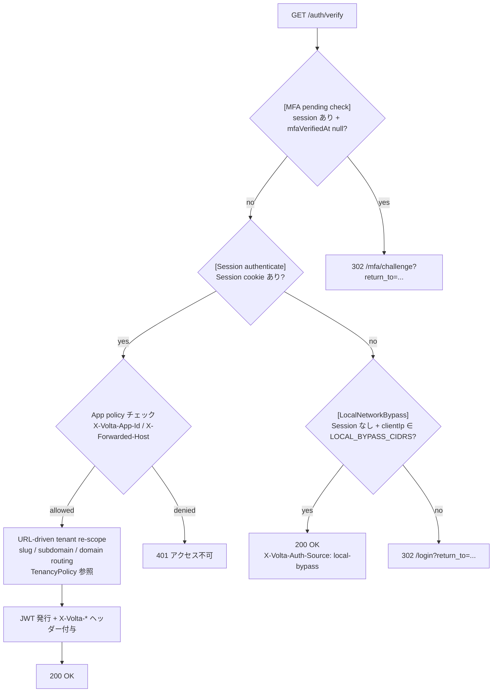
```mermaid
flowchart TD
    REQ["GET /auth/verify"]
    MFA_CHECK{"[MFA pending check]<br/>session あり + mfaVerifiedAt null?"}
    SESSION_CHECK{"[Session authenticate]<br/>Session cookie あり?"}
    LAN_CHECK{"[LocalNetworkBypass]<br/>Session なし + clientIp ∈ LOCAL_BYPASS_CIDRS?"}

    APP_POLICY{"App policy チェック<br/>X-Volta-App-Id / X-Forwarded-Host"}
    TENANT_SCOPE["URL-driven tenant re-scope<br/>slug / subdomain / domain routing<br/>TenancyPolicy 参照"]
    JWT_ISSUE["JWT 発行 + X-Volta-* ヘッダー付与"]

    R_MFA["302 /mfa/challenge?return_to=..."]
    R_401["401 アクセス不可"]
    R_200OK["200 OK"]
    R_200LAN["200 OK<br/>X-Volta-Auth-Source: local-bypass"]
    R_302LOGIN["302 /login?return_to=..."]

    REQ --> MFA_CHECK
    MFA_CHECK -->|yes| R_MFA
    MFA_CHECK -->|no| SESSION_CHECK
    SESSION_CHECK -->|yes| APP_POLICY
    APP_POLICY -->|denied| R_401
    APP_POLICY -->|allowed| TENANT_SCOPE
    TENANT_SCOPE --> JWT_ISSUE
    JWT_ISSUE --> R_200OK
    SESSION_CHECK -->|no| LAN_CHECK
    LAN_CHECK -->|yes| R_200LAN
    LAN_CHECK -->|no| R_302LOGIN
```

**出力ヘッダー (200 OK 時):**

| ヘッダー | 値 |
|---|---|
| `X-Volta-User-Id` | UUID |
| `X-Volta-Email` | メールアドレス |
| `X-Volta-Tenant-Id` | UUID (URL routing で上書きあり) |
| `X-Volta-Tenant-Slug` | テナントスラッグ |
| `X-Volta-Roles` | カンマ区切り (例: `ADMIN,MEMBER`) |
| `X-Volta-Display-Name` | 表示名 |
| `X-Volta-JWT` | 5 分間有効 JWT |
| `X-Volta-Auth-Source` | `local-bypass` (バイパス時のみ) |

### 5.2 clientIp 信頼モデル

`HttpSupport.clientIp(ctx)` の実装:

1. `X-Forwarded-For` ヘッダーの先頭 IP を採用
2. Traefik の `trustedIPs` + `proxyProtocol` 設定で送信元を保証
3. IPv6 はローカルバイパス対象外 (CIDR パーサーが IPv6 を除外)

**重要:** `Secure` cookie フラグは `BASE_URL` のスキームから推論。`X-Forwarded-Proto` は採用しない (TLS termination プロキシによるストリッピング対策、`8e58800`)。

### 5.3 local_bypass (ADR-003)

**環境変数:** `LOCAL_BYPASS_CIDRS` (デフォルト: RFC1918 + Tailscale CGNAT + loopback)

```
192.168.0.0/16, 10.0.0.0/8, 172.16.0.0/12, 100.64.0.0/10, 127.0.0.1/32
```

空文字 (`LOCAL_BYPASS_CIDRS=""`) で完全無効化。

**発火条件:** セッション認証の**後**で評価。セッションが存在する場合は通常認証パスが優先される (`4006ee7` バグ修正)。

```
// 正しい優先順位 (4006ee7 後):
// 1. セッションあり → 通常認証 (MFA チェック、ユーザーヘッダー付与)
// 2. セッションなし + ローカル IP → 200 anonymous
// 3. セッションなし + 外部 IP → /login
```

**ADR-002 との差異:** ADR-002 は「VPN 内だから全バイパス」を却下。ADR-003 は「セッションなし + LAN = 匿名 200」に限定。

### 5.4 mfaVerifiedAt セマンティクス

| イベント | mfaVerifiedAt | auth_state |
|---|---|---|
| OIDC 認証完了 (MFA なし) | `now()` | FULLY_AUTHENTICATED |
| OIDC 認証完了 (MFA 必要) | `null` | AUTHENTICATED_MFA_PENDING |
| MFA フロー VERIFIED | `now()` | FULLY_AUTHENTICATED |
| テナント切り替え (ADR-004) | `null` | AUTHENTICATING |
| セッション期限切れ | (削除) | — |

`mfaVerifiedAt = null` の場合、`/auth/verify` へのリクエストは `/mfa/challenge` にリダイレクトされる。

### 5.4b JWT クレーム構造

`JwtService.issueToken(AuthPrincipal)` で発行される JWT のクレーム:

```json
{
  "iss": "volta-auth",
  "aud": ["volta-apps"],
  "sub": "550e8400-e29b-41d4-a716-446655440000",
  "exp": 1745071200,
  "iat": 1745071000,
  "jti": "random-uuid",
  "volta_v": 1,
  "volta_tid": "tenant-uuid",
  "volta_roles": ["ADMIN"],
  "volta_display": "Alice",
  "volta_tname": "Acme Corp",
  "volta_tslug": "acme"
}
```

**アルゴリズム:** RS256 (RSA-2048)
**有効期間:** `JWT_TTL_SECONDS` (デフォルト 300 秒 = 5 分)
**鍵:** `signing_keys` テーブルの `status='active'` エントリ
**秘密鍵暗号化:** AES-256 (KeyCipher, `JWT_KEY_ENCRYPTION_SECRET`)
**JWKS:** `GET /.well-known/jwks.json` (公開鍵, Cache-Control: max-age=60)

**M2M トークン追加クレーム:**
```json
{
  "volta_client": true,
  "volta_client_id": "my-service",
  "volta_tid": "tenant-uuid",
  "volta_roles": ["api:read", "api:write"]
}
```

**`X-Volta-JWT` ヘッダー:** ForwardAuth 200 レスポンスに含まれ、downstream アプリが Bearer トークンとして使用可能。

### 5.5 テナント解決ロジック

`VoltaConfig.tenancy` の設定に応じて:

| モード | 解決方法 |
|---|---|
| `single` | 唯一のテナント (または shadow_org 自動作成) |
| `multi` + `slug` routing | `/o/{slug}/` パスプレフィックスから抽出 |
| `multi` + `subdomain` | `X-Forwarded-Host` のサブドメインから抽出 |
| `multi` + `domain` | `X-Forwarded-Host` を `tenant_domains` テーブルと照合 |

テナント解決優先度: `session > email_domain > invitation > manual`

URL-driven tenant re-scope: セッションのデフォルトテナントは変更せず、`X-Volta-Tenant-*` ヘッダーのみ上書き。ユーザーが URL テナントのメンバーでない場合は 403。

### 5.6 PolicyEngine

**ロール階層:** `OWNER > ADMIN > MEMBER > VIEWER` (継承あり)

```java
PolicyEngine.defaultPolicy()
// OWNER  : delete_tenant, transfer_ownership, manage_signing_keys, change_tenant_slug + ADMIN 継承
// ADMIN  : invite_members, remove_members, change_member_role, view_audit_logs + MEMBER 継承
// MEMBER : use_apps, view_own_profile, manage_own_sessions, switch_tenant, accept_invitation + VIEWER 継承
// VIEWER : read_only
```

`policy.enforceMinRole(principal, "ADMIN")` — 不足時は `ApiException(403, "ROLE_INSUFFICIENT")` を throw。
M2M サービストークンはロールチェックをバイパス (`serviceToken = true`)。

### 5.6b PolicyEngine — デフォルトポリシー詳細

```
OWNER (inherits ADMIN):
  delete_tenant, transfer_ownership, manage_signing_keys, change_tenant_slug

ADMIN (inherits MEMBER):
  invite_members, remove_members, change_member_role
  view_invitations, create_invitations, cancel_invitations
  change_tenant_name, view_audit_logs

MEMBER (inherits VIEWER):
  use_apps, view_own_profile, update_own_profile
  manage_own_sessions, view_tenant_members, switch_tenant, accept_invitation

VIEWER:
  read_only
```

`PolicyEngine.can("ADMIN", "invite_members")` → true (直接権限)
`PolicyEngine.can("ADMIN", "use_apps")` → true (MEMBER 継承)
`PolicyEngine.can("MEMBER", "delete_tenant")` → false

`policy.enforceMinRole(principal, "ADMIN")` は principal.roles() の中で
`rank(role) <= rank("ADMIN")` を満たすものがあれば通過。

### 5.7 CSRF 保護

**戦略:** Origin ヘッダーベース + フォーム送信時 CSRF トークン

- 許可 Origin: `unlaxer.org`, `*.unlaxer.org`, `localhost` (ハードコード)
- 許可 Origin からのリクエストは CSRF トークン不要 (SameSite=Lax クッキーで保護)
- Origin なし / 不明 Origin のフォーム POST → `sessions.csrf_token` と照合

**CSRF 除外エンドポイント:**
- `/api/v1/billing/stripe/webhook` (Stripe 署名検証)
- `/oauth/token` (client credentials)
- `/auth/saml/callback` (IdP-initiated POST)
- `/auth/mfa/verify`
- `/auth/callback/complete`
- `/auth/passkey/*`
- `/scim/v2/*`

### 5.8 レート制限

`RateLimiter` (Guava RateLimiter ベース、上限 200 req/IP/パス)。
`/healthz`, `/css/*`, `/js/*` は対象外。
超過時: `429 Too Many Requests` + `Retry-After: 60`。

### 5.8b CSRF ミドルウェア実装 (Main.java)

```java
// before-filter 順序:
// 1. CORS ヘッダー (OPTIONS ならば即 204)
// 2. wantsJson 属性セット (Accept: application/json)
// 3. i18n: Messages.resolve(Accept-Language) → ThreadLocal
// 4. RequestId: UUID → ctx.attribute + X-Request-Id ヘッダー
// 5. RateLimiter: clientIp + path → 429 if exceeded
// 6. CSRF check (POSTのみ):
//    - 除外パス: /api/v1/billing/stripe/webhook, /oauth/token,
//               /auth/saml/callback, /auth/mfa/verify, /auth/callback/complete,
//               /auth/passkey/*, /scim/v2/*
//    - 許可 Origin なら免除 (SameSite=Lax で保護)
//    - それ以外: _csrf フォームパラメータ or X-CSRF-Token ヘッダーと
//               sessions.csrf_token を constantTimeEquals で比較
// 7. MFA pending: auth_state = AUTHENTICATED_MFA_PENDING → /mfa/challenge へ
// 8. Tenant MFA required: mfa_required=true かつ MFA 未設定
//    → /settings/security?setup_required=true へ (猶予期間あり)
```

### 5.9 デバイス信頼

`DeviceTrustService` + `known_devices` テーブル。
新規デバイスでのログイン成功時、Outbox 経由で通知メール送信。
ユーザーは `/settings/devices` でデバイス管理。

---

## 6. API / 外部境界

### 6.1 AuthRouter (認証エンドポイント)

| Method | Path | 説明 |
|---|---|---|
| GET | `/auth/verify` | ForwardAuth エンドポイント (Traefik) |
| GET | `/login` | ログインページ / IdP リダイレクト |
| GET | `/callback` | OIDC callback (GET) |
| POST | `/auth/callback/complete` | OIDC callback (POST/JSON) |
| GET | `/mfa/challenge` | MFA チャレンジページ |
| POST | `/auth/mfa/verify` | MFA コード検証 |
| GET | `/auth/saml/login` | SAML SP-initiated |
| POST | `/auth/saml/callback` | SAML ACS (IdP POST) |
| POST | `/auth/magic-link/send` | Magic Link 送信 |
| GET | `/auth/magic-link/verify` | Magic Link 検証 |
| GET | `/auth/logout` | セッション無効化 |
| POST | `/auth/switch-tenant` | テナント切り替え (MFA 再要求) |
| GET/POST | `/auth/passkey/*` | Passkey 登録 / 認証 |
| GET/POST | `/invite/*` | 招待フロー |
| POST | `/oauth/token` | M2M client_credentials |

### 6.2 ApiRouter (`/api/v1/*`)

すべてのエンドポイントは認証必須 (Bearer JWT または Session cookie)。

**ユーザー管理:**

| Method | Path | 権限 |
|---|---|---|
| GET | `/api/v1/users/me` | MEMBER |
| PATCH | `/api/v1/users/me` | MEMBER |
| GET | `/api/v1/users/me/sessions` | MEMBER |
| DELETE | `/api/v1/users/me/sessions/{id}` | MEMBER |
| GET | `/api/v1/users/me/known-devices` | MEMBER |
| DELETE | `/api/v1/users/me/known-devices/{id}` | MEMBER |
| POST | `/api/v1/users/me/gdpr/export` | MEMBER |
| DELETE | `/api/v1/users/me/gdpr/delete` | MEMBER |

**テナント管理:**

| Method | Path | 権限 |
|---|---|---|
| GET | `/api/v1/tenants` | MEMBER |
| PATCH | `/api/v1/tenants/{id}` | ADMIN |
| GET | `/api/v1/tenants/{id}/members` | MEMBER |
| POST | `/api/v1/tenants/{id}/members` | ADMIN |
| PATCH | `/api/v1/tenants/{id}/members/{userId}` | ADMIN |
| DELETE | `/api/v1/tenants/{id}/members/{userId}` | ADMIN |
| GET | `/api/v1/tenants/{id}/invitations` | ADMIN |
| POST | `/api/v1/tenants/{id}/invitations` | ADMIN |

**管理者 API:**

| Method | Path | 権限 |
|---|---|---|
| GET | `/api/v1/admin/users` | ADMIN |
| GET | `/api/v1/admin/audit-logs` | ADMIN |
| POST | `/api/v1/admin/users/{id}/revoke-sessions` | ADMIN |
| GET | `/api/v1/admin/idp-configs` | OWNER |
| POST | `/api/v1/admin/idp-configs` | OWNER |
| DELETE | `/api/v1/admin/idp-configs/{id}` | OWNER |
| GET | `/api/v1/admin/webhooks` | ADMIN |
| POST | `/api/v1/admin/webhooks` | ADMIN |
| GET | `/api/v1/admin/m2m-clients` | OWNER |
| POST | `/api/v1/admin/m2m-clients` | OWNER |

**MFA 設定:**

| Method | Path | 説明 |
|---|---|---|
| POST | `/api/v1/users/me/mfa/totp/enroll` | TOTP QR/secret 取得 |
| POST | `/api/v1/users/me/mfa/totp/activate` | TOTP コード検証 + 有効化 |
| DELETE | `/api/v1/users/me/mfa/totp` | TOTP 無効化 |
| GET | `/api/v1/users/me/mfa/recovery-codes` | リカバリーコード一覧 |
| POST | `/api/v1/users/me/mfa/recovery-codes/regenerate` | リカバリーコード再生成 |

### 6.3 AdminRouter (`/admin/*`)

HTML 管理画面 (jte テンプレート):

| Path | 説明 |
|---|---|
| `GET /admin/members` | テナントメンバー一覧 |
| `GET /admin/invitations` | 招待一覧 |
| `GET /admin/audit-logs` | 監査ログ |
| `GET /admin/sessions` | セッション管理 |
| `GET /admin/idp-configs` | IdP 設定 |

### 6.4 VizRouter (`/viz/*`)

tramli-viz — リアルタイムフロー可視化:

| Path | 説明 |
|---|---|
| `GET /viz/flows` | FlowDefinition グラフ (JSON) |
| `GET /viz/replay/{flowId}` | フロー遷移リプレイ |
| `GET /viz/ws` | WebSocket — フローイベントブリッジ |
| `GET /viz/auth-events` | SSE — LOGIN_SUCCESS / LOGOUT イベント |

Redis pub/sub チャネル:
- `volta:viz:events` — tramli telemetry
- `volta:auth:events` — 認証イベント (AUTH_EVENT_REDIS_CHANNEL)

### 6.5 SCIM 2.0 (`/scim/v2/*`)

| Path | 説明 |
|---|---|
| `GET /scim/v2/Users` | ユーザー一覧 |
| `POST /scim/v2/Users` | ユーザー作成 |
| `GET /scim/v2/Users/{id}` | ユーザー取得 |
| `PUT /scim/v2/Users/{id}` | ユーザー更新 |
| `DELETE /scim/v2/Users/{id}` | ユーザー削除 |
| `GET /scim/v2/Groups` | グループ一覧 |

### 6.6 その他エンドポイント

| Path | 説明 |
|---|---|
| `GET /healthz` | ヘルスチェック `{"status":"ok"}` |
| `GET /.well-known/jwks.json` | JWT 公開鍵 (60s キャッシュ) |
| `GET /console/` | volta-auth-console SPA (埋め込み) |
| `POST /dev/token` | DEV_MODE 専用トークン発行 |
| `GET /select-tenant` | テナント選択ページ |
| `GET /settings/security` | MFA 設定ページ |
| `GET /settings/devices` | デバイス管理ページ |
| `GET /settings/sessions` | セッション管理ページ |

---

## 7. UI

### 7.1 方針

volta-auth-proxy は認証 gateway であり UI フレームワークではない。
ユーザー向け UI は **volta-auth-console** (React SPA、別リポジトリ) が担当。

### 7.2 組み込みテンプレート (jte)

最小限のサーバーサイド HTML テンプレートを `src/main/jte/` に保持:

| テンプレート | 用途 |
|---|---|
| `auth/login.jte` | ログインページ (IdP ボタン一覧) |
| `auth/callback.jte` | OIDC コールバック処理中 |
| `auth/mfa.jte` | MFA コード入力 |
| `admin/members.jte` | メンバー管理 |
| `admin/invitations.jte` | 招待管理 |
| `settings/security.jte` | MFA 設定 |
| `settings/devices.jte` | デバイス管理 |
| `auth/sessions.jte` | セッション管理 |
| `error/error.jte` | エラーページ |

### 7.3 volta-auth-console 連携

SPA は `target/classes/public/console/` にバンドルされ `/console/` で配信。
全 API 呼び出しは `/api/v1/*` 経由で Session cookie + CSRF トークンを使用。
CORS: `unlaxer.org`, `*.unlaxer.org`, `localhost` を許可。

### 7.4 i18n

`Messages` クラスが `Accept-Language` ヘッダーと `users.locale` カラム (V20) に基づいて解決。
`messages_en.properties` / `messages_ja.properties` が `src/main/resources/` に存在。
ThreadLocal で jte テンプレートからアクセス可能。

---

## 8. 設定

### 8.1 volta-config.yaml

`APP_CONFIG_PATH` 環境変数で指定 (デフォルト: `volta-config.yaml`)。
SIGHUP シグナルで IdP リストのホットリロード可能。

```yaml
version: 1

# ── Domain ──
domain:
  base: example.com
  ssl:
    mode: traefik          # traefik | letsencrypt | none

# ── IdP ──
idp:
  - id: google
    client_id: ${GOOGLE_CLIENT_ID}
    client_secret: ${GOOGLE_CLIENT_SECRET}
  - id: github
    client_id: ${GITHUB_CLIENT_ID}
    client_secret: ${GITHUB_CLIENT_SECRET}
  # SAML IdP の場合:
  - id: enterprise-saml
    type: saml
    metadata_url: https://idp.example.com/metadata
    issuer: https://idp.example.com/issuer
    audience: volta-sp-audience

# ── Apps ──
apps:
  - id: wiki
    subdomain: wiki
    upstream: http://wiki:8080
    allowed_roles: [MEMBER, ADMIN, OWNER]
    public_paths:
      - /public/*

# ── Tenancy (Layer 2) ──
tenancy:
  mode: single              # single | multi
  creation_policy: disabled # disabled | auto | admin_only | invite_only
  shadow_org: true
  routing:
    mode: none              # none | slug | subdomain | domain

# ── Defaults ──
defaults:
  session_hours: 8
  jwt_minutes: 5
  max_concurrent_sessions: 5
  invitation_expiry_hours: 72

# ── Traefik 動的設定生成 ──
traefik:
  enabled: true
  output_path: /etc/traefik/dynamic/volta.yaml
  middleware_name: volta-auth
  entrypoints: [websecure]
  tls:
    cert_resolver: letsencrypt

# ── Observability ──
observability:
  audit:
    sink: postgres           # postgres | kafka | elasticsearch
    retention_days: 365
```

`${VAR}` 記法で環境変数参照 (PropStack 解決)。

### 8.2 環境変数 (主要)

| 変数 | デフォルト | 説明 |
|---|---|---|
| `PORT` | 7070 | HTTP ポート |
| `BASE_URL` | `http://localhost:7070` | 公開 URL (Secure cookie 判定に使用) |
| `DB_HOST` | localhost | PostgreSQL ホスト |
| `DB_PORT` | 54329 | PostgreSQL ポート |
| `DB_NAME` | volta_auth | DB 名 |
| `DB_USER` | volta | DB ユーザー |
| `DB_PASSWORD` | volta | DB パスワード |
| `SESSION_STORE` | postgres | `postgres` / `redis` |
| `SESSION_TTL_SECONDS` | 28800 | セッション有効期間 (8h) |
| `REDIS_URL` | `redis://localhost:6379` | Redis URL |
| `JWT_ISSUER` | volta-auth | JWT iss クレーム |
| `JWT_AUDIENCE` | volta-apps | JWT aud クレーム |
| `JWT_TTL_SECONDS` | 300 | JWT 有効期間 (5min) |
| `JWT_KEY_ENCRYPTION_SECRET` | *(dev only)* | 署名鍵 AES 暗号化シークレット |
| `AUTH_FLOW_HMAC_KEY` | *(dev only)* | OIDC state / RelayState HMAC 鍵 |
| `LOCAL_BYPASS_CIDRS` | RFC1918+Tailscale | ローカルバイパス CIDR リスト |
| `DEV_MODE` | false | 開発モード (MOCK IdP 有効化) |
| `WEBAUTHN_RP_ID` | localhost | WebAuthn RP ID |
| `WEBAUTHN_RP_ORIGIN` | `http://localhost:7070` | WebAuthn origin |
| `NOTIFICATION_CHANNEL` | none | `none` / `smtp` / `sendgrid` |
| `SMTP_HOST` | — | SMTP ホスト |
| `AUDIT_SINK` | postgres | `postgres` / `kafka` / `elasticsearch` |
| `SAML_SKIP_SIGNATURE` | false | SAML 署名スキップ (dev 専用) |
| `FRAUD_ALERT_URL` | — | FraudAlert API URL |
| `APP_CONFIG_PATH` | volta-config.yaml | 設定ファイルパス |

### 8.3 IdP 設定

**OIDC IdP (Google, GitHub, Microsoft, Apple, LinkedIn):**
- `GOOGLE_CLIENT_ID`, `GOOGLE_CLIENT_SECRET`
- `GITHUB_CLIENT_ID`, `GITHUB_CLIENT_SECRET`
- `MICROSOFT_CLIENT_ID`, `MICROSOFT_CLIENT_SECRET`, `MICROSOFT_TENANT_ID`
- `APPLE_CLIENT_ID`, `APPLE_CLIENT_SECRET`
- `LINKEDIN_CLIENT_ID`, `LINKEDIN_CLIENT_SECRET`

**SAML IdP:**
`idp_configs` テーブルに `provider_type = 'SAML'` で格納。x.509 証明書は V11 (`idp_x509_cert`)。

**カスタム OIDC IdP:**
`volta-config.yaml` の `idp:` セクションに追加。IdP 削除はエントリ削除のみ (env var 変更不要)。

---

## 9. 依存関係

### 9.1 コア依存

| ライブラリ | バージョン | 役割 |
|---|---|---|
| `tramli` | 3.7.1 | 宣言的フローエンジン |
| `tramli-plugins` | 3.6.1 | AuditStorePlugin, PolicyLintPlugin, ObservabilityPlugin |
| `javalin` | 6.7.0 | HTTP フレームワーク (Jetty 内蔵) |
| `javalin-rendering` | 6.7.0 | jte テンプレート統合 |
| `jte` / `jte-runtime` | 3.2.1 | 型安全 HTML テンプレート |
| `nimbus-jose-jwt` | 10.5 | JWT 発行 / 検証 |
| `jackson-databind` | 2.18.4 | JSON |
| `flyway-core` + `flyway-database-postgresql` | 11.8.2 | DB マイグレーション |
| `HikariCP` | 6.3.0 | コネクションプール |
| `postgresql` | 42.7.7 | JDBC ドライバー |

### 9.2 認証 / 暗号依存

| ライブラリ | バージョン | 役割 |
|---|---|---|
| `webauthn4j-core` | 0.28.4.RELEASE | WebAuthn attestation / assertion 検証 |
| `googleauth` | 1.5.0 | TOTP 生成 / 検証 |
| Java XML DSig API (JDK 内蔵) | — | SAML 署名検証 |
| Java XML (JAXP) | — | SAML XML パース (XXE ハードニング) |

### 9.3 インフラ依存

| ライブラリ | バージョン | 役割 |
|---|---|---|
| `jedis` | 5.2.0 | Redis (セッションストア / tramli-viz / auth events) |
| `kafka-clients` | 3.9.1 | 監査ログ Kafka シンク |
| `jakarta.mail` | 2.0.1 | SMTP メール送信 |
| `snakeyaml` | 2.4 | `volta-config.yaml` パース |
| `propstack` | 0.4.0 | 環境変数 / プロパティ解決 |
| `slf4j-simple` | 2.0.17 | ロギング |

### 9.3b ライブラリ選定理由 (主要)

| ライブラリ | 選定理由 |
|---|---|
| tramli 3.7.1 | 認証フロー専用 constrained engine。XState / Spring SM より軽量かつ型安全 |
| Javalin 6.7.0 | Ktor/Spring MVC より低ボイラープレート。Jetty 内蔵で単一 JAR デプロイ |
| jte 3.2.1 | Thymeleaf/Freemarker より高速 (コンパイル時型チェック)。JVM ネイティブ |
| nimbus-jose-jwt 10.5 | Java JWT ライブラリのデファクトスタンダード。RS256 対応 |
| webauthn4j 0.28.4 | Yubico webauthn-server の後継。attestation / assertion 両対応 |
| HikariCP 6.3.0 | JDBC コネクションプールのデファクト |
| Flyway 11 | 宣言的マイグレーション。ロールバック戦略は forward-only (新マイグレーション追加) |
| googleauth 1.5.0 | RFC 6238 TOTP の軽量実装。Spring 非依存 |

### 9.4 内部エンジニアリング表面

volta-auth-proxy は tramli ワークスペース規約に従い 3 つのエンジニア表面を持つ:

| 表面 | フルネーム | 責務 |
|---|---|---|
| **dxe** | Developer Experience Engineer | ツールチェーン、CI、ビルド、`tramli-viz`、リリースタグ |
| **dge** | Design Generation Engineer | Spec 生成、ADR 起草、ステートマシン設計セッション |
| **dve** | Development/Verification Engineer | プロダクションコード + テスト (services, routers, processors, guards, migrations) |

境界は**読み取り専用**: dge 提案は ADR `Accepted` ステータスを経て dve に入る。
dxe ツールは dve 成果物を消費するが変更しない。

---

## 10. 非機能要件 — SAML セキュリティ

### 10.0 セキュリティ設計の優先度

非機能セキュリティ要件をリスク順に整理:

| 優先度 | 脅威 | 対策 | 実装 |
|---|---|---|---|
| P0 | SAML アサーション偽装 (XSW) | secureValidation + 単一 Signature | SamlService.java:72 |
| P0 | XXE インジェクション | DTD 完全禁止 | SamlService.java:54-61 |
| P0 | セッション固定化 | ログイン成功時に新 session ID 発行 | AuthService.issueSession() |
| P0 | CSRF | Origin ベース + トークン | Main.java before-filter |
| P1 | Open redirect | ReturnToValidator ドメイン許可リスト | ReturnToValidator.java |
| P1 | JWT 秘密鍵漏洩 | AES-256 暗号化 + DB 保存 | KeyCipher + signing_keys |
| P1 | PKCE なし OIDC | S256 必須 | OidcInitProcessor |
| P1 | MFA バイパス (テナント跨ぎ) | switch-tenant で mfaVerifiedAt リセット | ADR-004 |
| P2 | 並列セッション過多 | MAX_CONCURRENT_SESSIONS=5 | AuthService |
| P2 | ブルートフォース MFA | maxGuardRetries=5 + Rate Limit | MfaFlowDef |
| P2 | Passkey クローン | sign_count インクリメント確認 | PasskeyVerifyProcessor |
| P3 | ログへの機密漏洩 | @Sensitive + SensitiveRedactor | FlowData |
| P3 | dev バイパス本番有効化 | DEV_MODE + localhost チェック | SamlService, Main |

### 10.1 SAML XSW/XXE 防御

`SamlService.parseIdentity()` は OWASP / NIST 800-63 推奨に基づく SP 側処理を実装:

| ステップ | 防御 | 実装 |
|---|---|---|
| XML パース — XXE | DTD / エンティティ展開禁止 | `disallow-doctype-decl=true`, `external-general-entities=false`, `external-parameter-entities=false`, `ACCESS_EXTERNAL_DTD=""`, `ACCESS_EXTERNAL_SCHEMA=""`, `FEATURE_SECURE_PROCESSING=true` |
| 署名 — XSW | セキュア検証強制 | `DOMValidateContext.setProperty("org.jcp.xml.dsig.secureValidation", true)` + 単一 `<Signature>` 要素 |
| Issuer | 不一致 → 401 | `idp.issuer()` と比較 |
| Audience | 不一致 → 401 | `idp.audience()` と比較 (デフォルト `volta-sp-audience`) |
| NotOnOrAfter | クロックスキュー ≤ 5 分 | `Instant.parse` on `SubjectConfirmationData/@NotOnOrAfter` |
| RequestId | リプレイ防止 | `expectedRequestId` をフローコンテキスト経由で検証 |
| ACS URL | バインディング混同防止 | `expectedAcsUrl` 比較 |
| RelayState | CSRF + return_to | HMAC 署名 JSON (`encodeRelayState` / `decodeRelayState`) |

### 10.2 テストカバレッジ (17 観点中 5 カバー)

| 攻撃 / 懸念 | 防御 | テスト | ステータス |
|---|---|---|---|
| XXE — DOCTYPE injection | `disallow-doctype-decl=true` | — (パーサーレベルで排除) | implicit |
| XXE — external general entities | `external-general-entities=false` | — | implicit |
| XXE — external parameter entities | `external-parameter-entities=false` | — | implicit |
| XXE — external DTD load | `ACCESS_EXTERNAL_DTD=""` | — | implicit |
| XXE — external schema load | `ACCESS_EXTERNAL_SCHEMA=""` | — | implicit |
| XSW — signature wrapping | `secureValidation=true` + 単一 `<Signature>` | — | partial |
| 署名存在確認 | skipSignature=false 時は必須 | `requiresSignatureWhenSkipDisabled` | **covered** |
| 署名検証 | `XMLSignature.validate()` | — | gap |
| Issuer 不一致 | `idp.issuer()` 比較 | `rejectsIssuerMismatch` | **covered** |
| Audience 不一致 | `idp.audience()` 比較 | — | gap |
| NotOnOrAfter 期限切れ | クロックスキュー検証 | — | gap |
| RequestId リプレイ | `expectedRequestId` 検証 | — | gap |
| ACS URL 不一致 | `expectedAcsUrl` 比較 | — | gap |
| RelayState ラウンドトリップ | HMAC JSON encode/decode | `encodesAndDecodesRelayState` | **covered** |
| MOCK dev バイパス | `DEV_MODE && !isProd` ゲート | `parsesMockIdentityInDevMode` | **covered** |
| ハッピーパス | 完全パース | `parsesSamlXmlIdentity` | **covered** |

**5 / 17 カバー**。XXE は構造的に排除済み (implicit)。残 gap: XSW wrapped-assertion payload, Audience 不一致, NotOnOrAfter 境界, RequestId 不一致, ACS URL 不一致, 署名 positive/negative テスト。

### 10.3 その他セキュリティプロパティ

- **Open redirect:** `ReturnToValidator` がドメイン許可リスト + ワイルドカードサブドメインをチェック
- **Cookie Secure フラグ:** `BASE_URL` スキームから推論 (proxy の `X-Forwarded-Proto` 非使用)
- **SameSite:** Lax (cross-origin cookie 添付防止)
- **FlowData 機密:** `@Sensitive` アノテーション + `SensitiveRedactor` でログ / tramli-viz への漏洩防止
- **PKCE:** S256 必須、`code_verifier` は AES-256 暗号化してフローコンテキストに保存
- **Passkey sign_count:** クローン検出のためインクリメント確認
- **Rate Limiting:** IP + パスベース 200 req/60s

---

## 11. テスト戦略

### 10.4 セキュリティ監査イベント

`AuditService.log(ctx, eventType, actor, targetType, targetId, detail)` で記録:

| イベントタイプ | トリガー |
|---|---|
| `LOGIN_SUCCESS` | OIDC / SAML / Passkey / Magic Link 認証完了 |
| `LOGIN_FAILURE` | 認証失敗 |
| `LOGOUT` | `/auth/logout` |
| `SESSION_REVOKED` | 管理者またはユーザーによるセッション無効化 |
| `MFA_VERIFIED` | MFA 検証成功 |
| `MFA_SETUP` | MFA 初期設定 |
| `MEMBER_INVITED` | 招待作成 |
| `MEMBER_JOINED` | 招待受諾 |
| `MEMBER_REMOVED` | メンバー削除 |
| `ROLE_CHANGED` | ロール変更 |
| `TENANT_CREATED` | テナント作成 |
| `ERROR_*` | API エラー |

`AuditSink` は 3 バックエンドを切り替え可能:
- `postgres` (デフォルト): `audit_logs` テーブル
- `kafka`: `KAFKA_AUDIT_TOPIC` トピック
- `elasticsearch`: `ELASTICSEARCH_URL`

### 11.1 テストスイート一覧

`src/test/java/org/unlaxer/infra/volta/` — ユニット / 統合テスト:

| テストクラス | カバー対象 | テスト数 |
|---|---|---|
| `SamlServiceTest` | SAML パース (issuer, relayState, mock, ハッピーパス) | ~5 |
| `LocalNetworkBypassTest` | CIDR マッチング (RFC1918, Tailscale, loopback) | ~8 |
| `SecurityUtilsTest` | SHA-256, constant-time equals, UUID | ~5 |
| `KeyCipherTest` | AES-256 暗号化 / 復号 | ~4 |
| `ConfigLoaderTest` | volta-config.yaml パース | ~6 |
| `PolicyEngineTest` | ロール継承, enforce, enforceMinRole | ~10 |
| `TenancyPolicyTest` | tenancy モード, ルーティング | ~8 |
| `AppRegistryTest` | アプリ設定解決 | ~5 |
| `RateLimiterTest` | レート制限 | ~4 |
| `HttpSupportTest` | clientIp, wantsJson | ~6 |
| `DeviceNameResolverTest` | UA パース → デバイス名 | ~6 |
| `DeviceRevokeTokenTest` | デバイスリボーク | ~3 |
| `FraudAlertClientTest` | Fraud Alert API クライアント | ~3 |
| `GeoIpResolverTest` | GeoIP 解決 | ~3 |
| `MessagesTest` | i18n メッセージ解決 | ~4 |
| `PaginationTest` | ページネーション計算 | ~5 |
| `PasskeyFlowTest` | Passkey フロー結合テスト | ~5 |

`src/test/java/org/unlaxer/infra/volta/flow/` — フロー / ステートマシンテスト:

| テストクラス | カバー対象 |
|---|---|
| `flow/oidc/OidcFlowDefTest` | OIDC FlowDefinition 遷移 (stub processors) |
| `flow/oidc/RiskAndMfaBranchTest` | リスク評価 + MFA 分岐 |
| `flow/mfa/MfaFlowDefTest` | MFA FlowDefinition 遷移 |
| `flow/passkey/PasskeyFlowDefTest` | Passkey FlowDefinition 遷移 |
| `flow/invite/InviteFlowDefTest` | Invite FlowDefinition 遷移 |
| `flow/OidcStateCodecTest` | OIDC state HMAC エンコード / デコード |
| `flow/ReturnToValidatorTest` | return_to ドメイン検証 |
| `flow/SensitiveRedactorTest` | @Sensitive フィールドのリダクト |
| `flow/FlowDataRegistryTest` | FlowData 型登録 / 解決 |
| `flow/MermaidDumpTest` | FlowDefinition → Mermaid 図出力 |

### 11.2 テストインフラ

**FlowTestHarness:** tramli FlowEngine をインメモリ `SqlFlowStore` モックで実行するテストハーネス。実 DB 不要でフロー遷移を検証。

**StubProcessors:** 各 Processor / Guard の stub 実装。`FlowTestHarness` と組み合わせて full-flow テストを高速実行。

**FlowDefinitions テストファクトリ:**
- `OidcFlowDefinitions.create(stubs)` — stub を注入した OIDC FlowDefinition
- `MfaFlowDefinitions.create(stubs)`
- `PasskeyFlowDefinitions.create(stubs)`
- `InviteFlowDefinitions.create(stubs)`

### 11.3 テストギャップ (SAML)

Section 10.2 参照。5 / 17 観点がカバー済み。
バックログ:
- XSW wrapped-assertion payload テスト
- Audience 不一致ネガティブテスト
- `NotOnOrAfter` クロックスキュー境界テスト
- `InResponseTo` 不一致テスト
- ACS URL 不一致テスト
- 実際のキーペアを使った署名 positive/negative テスト

### 11.3b テストが検証する主要不変条件

1. **CIDR マッチング精度:** `LocalNetworkBypassTest` — 192.168.1.1 は匿名通過、8.8.8.8 は通過しない
2. **OIDC state 改ざん:** `OidcStateCodecTest` — HMAC 署名不一致は例外
3. **Open redirect 防止:** `ReturnToValidatorTest` — 許可ドメイン外は 400
4. **@Sensitive リダクト:** `SensitiveRedactorTest` — accessToken が "***" になる
5. **FlowDefinition 8-item validation:** `MermaidDumpTest` などで全 FlowDef が `pluginRegistry.analyzeAndValidate()` を通過することを確認
6. **MFA 分岐:** `RiskAndMfaBranchTest` — MFA 有効ユーザーは COMPLETE_MFA_PENDING へ
7. **Invite メール不一致:** `InviteFlowDefTest` — ACCOUNT_SWITCHING へ遷移
8. **SAML Issuer 不一致:** `SamlServiceTest.rejectsIssuerMismatch` — 401
9. **CSRF constant-time 比較:** `SecurityUtilsTest` — タイミング攻撃耐性
10. **同時セッション制限:** セッション数が MAX を超えると古いセッションが無効化される

### 11.4 ビルド / CI

```bash
mvn test           # 全テスト実行
mvn package        # fat JAR ビルド (maven-shade-plugin)
```

`target/volta-auth-proxy-0.3.0-SNAPSHOT.jar` — uber JAR。
`target/surefire-reports/` — JUnit レポート。

---

## 12. デプロイ / 運用

### 12.1 Docker

**Dockerfile:** マルチステージビルド (Maven → JDK 21 slim)。
`docker-compose.demo.yml` で Traefik + PostgreSQL + Mailpit + volta + demo アプリを一括起動。

```bash
cp .env.demo.example .env.demo
# GOOGLE_CLIENT_ID / GOOGLE_CLIENT_SECRET を設定
docker compose -f docker-compose.demo.yml --env-file .env.demo up --build
```

- App: `http://localhost`
- Traefik UI: `http://localhost:8080`
- Mailpit: `http://localhost:8025`

### 12.2 Traefik 連携

**ForwardAuth ミドルウェア設定 (docker-compose.demo.yml より):**

```yaml
traefik.http.middlewares.volta-auth.forwardauth.address: http://volta:7070/auth/verify
traefik.http.middlewares.volta-auth.forwardauth.authResponseHeaders: >-
  X-Volta-User-Id, X-Volta-Email, X-Volta-Tenant-Id, X-Volta-Tenant-Slug,
  X-Volta-Roles, X-Volta-Display-Name, X-Volta-JWT, X-Volta-App-Id
traefik.http.middlewares.volta-auth.forwardauth.trustForwardHeader: true
```

**volta 自身のルート (ForwardAuth 適用除外):**

```
PathPrefix(`/login`) || PathPrefix(`/callback`) || PathPrefix(`/auth`) ||
PathPrefix(`/mfa`) || PathPrefix(`/.well-known`) || PathPrefix(`/css`) ||
PathPrefix(`/api`) || PathPrefix(`/oauth`) || PathPrefix(`/scim`)
```

**Traefik 動的設定自動生成:** `traefik.enabled: true` の場合、ConfigLoader が `traefik.output_path` にミドルウェア / ルーター設定を出力。

### 12.3 本番推奨設定

```yaml
# .env.prod
BASE_URL=https://auth.yourdomain.com
LOCAL_BYPASS_CIDRS=                   # 本番では無効化推奨
DEV_MODE=false
SESSION_TTL_SECONDS=28800
JWT_KEY_ENCRYPTION_SECRET=<32 bytes random>
AUTH_FLOW_HMAC_KEY=<32 bytes random>
SESSION_STORE=postgres
AUDIT_SINK=postgres                   # または kafka
```

**本番でやってはいけないこと:**
- `LOCAL_BYPASS_CIDRS` をデフォルトのまま外部公開 → 認証バイパスリスク
- `DEV_MODE=true` → MOCK IdP が有効になる
- `SAML_SKIP_SIGNATURE=true` → SAML 署名検証をスキップ

### 12.4 ヘルスチェック

`GET /healthz` → `{"status":"ok"}` (200)。
Traefik / Kubernetes の liveness / readiness probe として使用。

```yaml
# docker-compose での postgres ヘルスチェック:
healthcheck:
  test: ["CMD-SHELL", "pg_isready -U volta -d volta_auth"]
  interval: 5s
  retries: 10
```

### 12.5 観測性 (Observability)

**Audit Log:**
- `audit_logs` テーブル (Postgres シンク、デフォルト)
- Kafka トピック `volta-audit` (Kafka シンク)
- Elasticsearch (Elasticsearch シンク)
- 全認証イベント: `LOGIN_SUCCESS`, `LOGOUT`, `MFA_VERIFIED`, `SESSION_REVOKED` 等

**tramli-viz:**
- Redis pub/sub でリアルタイムフロー遷移を可視化
- `GET /viz/ws` (WebSocket) でブラウザにストリーミング
- `GET /viz/flows` でフローグラフ取得

**Auth Monitor:**
- `volta:auth:events` Redis チャネルで `LOGIN_SUCCESS` / `LOGOUT` をリアルタイム配信
- SSE: `GET /viz/auth-events`

**ログ:**
`System.Logger` (JDK 9+) + `slf4j-simple`。
ロガー名: `volta`, `volta.auth`, `volta.flow`, `volta.localbypass`, `volta.tenancy`

### 12.6 シャットダウン

JVM シャットダウンフックで以下をクリーンアップ:
1. `VizRouter.close()` (Redis 購読解除)
2. `OutboxWorker.close()` (Outbox ワーカー停止)
3. `AuditSink.close()`
4. Jedis 接続 × 2 クローズ
5. `SessionStore.close()`
6. HikariCP `DataSource.close()`

### 12.6b エラーハンドリング戦略

**例外ハンドラー (Main.java):**

```
ApiException(status, code, message)
  → wantsJson: { "error": { "code": "...", "message": "..." } }
  → HTML:      renderErrorPage (jte テンプレート)

IllegalArgumentException → 400 BAD_REQUEST
Exception (uncaught)     → 500 INTERNAL_ERROR + auditService.log("ERROR_INTERNAL")
```

**エラーコード → ユーザーメッセージ (日本語):**

| コード | メッセージ |
|---|---|
| `AUTHENTICATION_REQUIRED` | ログインが必要です。 |
| `SESSION_EXPIRED` | セッションの有効期限が切れました。 |
| `SESSION_REVOKED` | セッションが無効化されました。 |
| `FORBIDDEN` | この操作を実行する権限がありません。 |
| `TENANT_ACCESS_DENIED` | ワークスペースへのアクセス権がありません。 |
| `TENANT_SUSPENDED` | このワークスペースは一時停止中です。 |
| `ROLE_INSUFFICIENT` | この操作に必要なロールが不足しています。 |
| `INVITATION_EXPIRED` | 招待リンクの有効期限が切れました。 |
| `INVITATION_EXHAUSTED` | この招待リンクは使用済みです。 |
| `RATE_LIMITED` | アクセスが集中しています。しばらく待って再試行してください。 |
| `INTERNAL_ERROR` | システムエラーが発生しました。 |
| `CSRF_INVALID` | CSRF トークンが無効です。 |
| `SAML_INVALID_RESPONSE` | SAML レスポンスが不正です。 |
| `SAML_SIGNATURE_REQUIRED` | SAML 署名が必要です。 |

エラーページはアクションボタンも含む:
- `FORBIDDEN` → "前の画面へ戻る" (`/`)
- `TENANT_ACCESS_DENIED` → "ワークスペースを切り替える" (`/select-tenant`)
- `INVITATION_EXPIRED` → "ログイン" (`/login`)
- それ以外 → "ログイン" (`/login`)

### 12.7 SIGHUP — IdP ホットリロード

```bash
kill -HUP <pid>
# → OidcService.reload() で IdP レジストリを再構築
# → [volta] IdP registry reloaded via SIGHUP ([google, github]) がログ出力
```

Windows では SIGHUP が使えないため例外を無視。

### 12.8 Outbox / Webhook

`OutboxWorker` が `outbox_events` テーブルを 15 秒間隔 (設定可) でポーリング。
クレームロック (`V8__outbox_claim_lock`) で複数インスタンスでの二重配信を防止。
`NotificationService` が SMTP / SendGrid に配信。最大 `WEBHOOK_RETRY_MAX` (デフォルト 3) 回リトライ。

---

---

## Appendix A: ADR 一覧

| ADR | ステータス | タイトル | 要点 |
|---|---|---|---|
| ADR-001 | Rejected | フォーム入力状態の復元を実装しない | 認証基盤の責務外。silent refresh + autosave で解決すべき |
| ADR-002 | Superseded | TRUSTED_NETWORKS による認証バイパスを実装しない | VPN 認証とアプリ認証は別物。X-Forwarded-For 偽装リスク |
| ADR-003 | Accepted | ForwardAuth にローカルネットワークバイパスを導入する | セッションなし + LAN IP = 匿名 200。セッションありは通常認証 |
| ADR-004 | Accepted | テナント切り替え時に MFA 再検証を要求する | mfaVerifiedAt のテナント間コピーを禁止。テナント = セキュリティ境界 |

**ADR-001 教訓:** 「やればできる」と「やるべき」は別。認証基盤に機能を吸収させ始めると Keycloak 化の入り口になる。

**ADR-003 修正 (4006ee7):** 初回実装でバイパスがセッション認証より先に評価されたため、LAN 内ログイン済みユーザーに MFA ループが発生。セッション認証後にバイパス評価を移動して修正。

---

## Appendix B: 既知の制限と TODO

### B.1 SAML テストギャップ (5/17)

Section 10.2 に詳細記載。特に優先度高:
1. **XSW wrapped-assertion payload テスト** — secureValidation 設定済みだが明示的な攻撃ペイロードテストがない
2. **Audience 不一致テスト** — コードには実装済みだが単体テストなし
3. **NotOnOrAfter 境界テスト** — クロックスキュー ±5 分の境界ケース未テスト

### B.2 TenancyPolicy 一部未実装

`tenancy.unimplementedWarnings()` が起動時に警告出力する機能が残る:
- `DOMAIN` ルーティングの完全実装
- カスタムロール (`custom_roles: true`)
- `INVITE_ONLY` 作成ポリシー

### B.3 SAML フロー (tramli 非使用)

SAML は `AuthRouter` + `SamlService` で手続き的に処理。
tramli FlowDefinition への移行は未着手。SAML の遷移は VizRouter で可視化されない。

### B.4 セッションストア Redis

`SESSION_STORE=redis` が設定可能だが、テストカバレッジは postgres のみ。
Redis セッションストアのフェイルオーバー動作は未検証。

---

## Appendix C: VizRouter / tramli-viz

tramli-viz は フローリアルタイム可視化ツール。

**アーキテクチャ:**

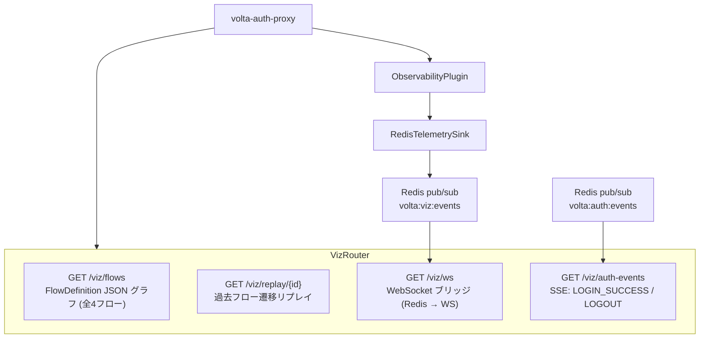
```mermaid
graph TB
    VAP["volta-auth-proxy"]
    OBS["ObservabilityPlugin"]
    RTS["RedisTelemetrySink"]
    REDIS_VIZ["Redis pub/sub<br/>volta:viz:events"]
    REDIS_AUTH["Redis pub/sub<br/>volta:auth:events"]

    subgraph VizRouter["VizRouter"]
        VF["GET /viz/flows<br/>FlowDefinition JSON グラフ (全4フロー)"]
        VR["GET /viz/replay/{id}<br/>過去フロー遷移リプレイ"]
        VW["GET /viz/ws<br/>WebSocket ブリッジ (Redis → WS)"]
        VA["GET /viz/auth-events<br/>SSE: LOGIN_SUCCESS / LOGOUT"]
    end

    VAP --> OBS
    OBS --> RTS
    RTS --> REDIS_VIZ
    REDIS_VIZ --> VW
    REDIS_AUTH --> VA
    VAP --> VizRouter
```

**RedisTelemetrySink:** tramli FlowEngine の遷移イベントをすべて Redis pub/sub にパブリッシュ。
`MermaidDumpTest` でフロー図を Mermaid 記法に自動ダンプ可能。

---

*Aggregated from: `docs/architecture.md`, `docs/auth-flows.md`, `docs/AUTH-STATE-MACHINE-SPEC.md`,
`docs/decisions/001-004`, source inspection of `Main.java`, `AuthFlowHandler.java`,
`AuthRouter.java`, `ApiRouter.java`, `AdminRouter.java`, `AppConfig.java`,
`PolicyEngine.java`, `LocalNetworkBypass.java`, `OidcFlowDef.java`,
`*FlowState.java`, Flyway migrations V1-V23, `pom.xml`, `docker-compose.demo.yml`.*
